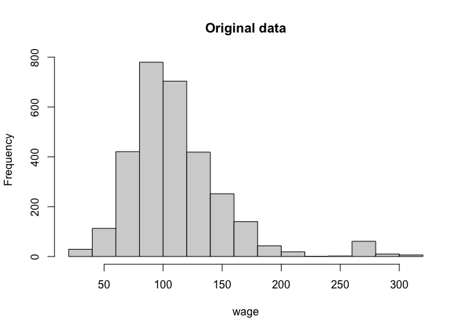

<!-- README.md is generated from README.Rmd. Please edit that file -->

# moped <br> <font size="5"> **R** package for Multivariate Orthogonal Polynomial based Estimation of Density </font>

<!-- badges: start -->
<!-- badges: end -->

**moped** package estimates the multivariate orthogonal polynomial based
density function from sample moments (add reference of Brad’s paper here
and a link). Subsequently, probabilities and density of joint and
marginal distribution can be computed, and resampled values from the
estimated joint and marginal density can be generated.

## Installation

Install the **moped** version from [CRAN](https://github.com/):

``` r
install.packages("moped")
```

Or install the **development** version of moped from
[GitHub](https://github.com/) with:

``` r
# install.packages("devtools")
remotes::install_github("p-osh/moped")
#> Skipping install of 'moped' from a github remote, the SHA1 (fec91c5e) has not changed since last install.
#>   Use `force = TRUE` to force installation
```

## Example

Here we show an example demonstrating the capability of the **moped**
package.

``` r
library(moped)
#> Warning: replacing previous import 'R.utils::tempvar' by 'svMisc::tempvar' when
#> loading 'moped'
library(tidyverse)
library(ISLR)
```

### 1. Data exploration and pre-processing

``` r
# Wage data from ISLR package
Data_full <- ISLR::Wage
# Must be a dataframe - Categorical Data should be factors
Data <- Data_full %>% select(age, education, jobclass, wage)
# Show structure of the dataset
# str(Data)
# Scatter plot matrix of the Data
pairs(Data)
```


#### Converting categorical data to continuous data

``` r
Data_x <- make.cont(Data, catvar = 2:3)

# check the structure of continuous-converted data
# str(Data_x)
# Conversion retrains the original categorical information
all.equal(make.cat(Data_x), Data)
#>  [1] "Attributes: < Names: 2 string mismatches >"                                       
#>  [2] "Attributes: < Length mismatch: comparison on first 2 components >"                
#>  [3] "Attributes: < Component 1: Modes: list, character >"                              
#>  [4] "Attributes: < Component 1: names for target but not for current >"                
#>  [5] "Attributes: < Component 1: Length mismatch: comparison on first 1 components >"   
#>  [6] "Attributes: < Component 1: Component 1: Modes: numeric, character >"              
#>  [7] "Attributes: < Component 1: Component 1: Lengths: 2, 1 >"                          
#>  [8] "Attributes: < Component 1: Component 1: target is numeric, current is character >"
#>  [9] "Attributes: < Component 2: Modes: character, numeric >"                           
#> [10] "Attributes: < Component 2: Lengths: 1, 3000 >"                                    
#> [11] "Attributes: < Component 2: target is character, current is numeric >"
```

#### (optional) Converting categorical with amalgamations

``` r
Data <- Data_full %>% select(age, maritl, race, education, jobclass, wage)

Data_amal <- make.cont(Data, catvar = c("maritl", "race", "education", "jobclass"),
                       amalgams = list(1:2, 3:4))
#> Warning: Column order has been changed.

# revert continuous variable back to categorical
make.cat(Data_amal)
#>                  maritl     race          education       jobclass age
#> 231655 1. Never Married 1. White       1. < HS Grad  1. Industrial  18
#> 86582  1. Never Married 1. White       1. < HS Grad  1. Industrial  24
#> 161300       2. Married 1. White    3. Some College 2. Information  45
#> 155159       2. Married 3. Asian 5. Advanced Degree 2. Information  43
#> 11443       4. Divorced 1. White 5. Advanced Degree 2. Information  50
#> 376662       2. Married 1. White    3. Some College 2. Information  54
#> 450601       2. Married 4. Other    3. Some College 2. Information  44
#> 377954 1. Never Married 3. Asian    3. Some College  1. Industrial  30
#> 228963 1. Never Married 2. Black         2. HS Grad  1. Industrial  41
#> 81404        2. Married 1. White         2. HS Grad 2. Information  52
#> 302778      4. Divorced 1. White 5. Advanced Degree 2. Information  45
#> 305706       2. Married 1. White    3. Some College  1. Industrial  34
#> 8690   1. Never Married 1. White         2. HS Grad  1. Industrial  35
#> 153561       2. Married 1. White         2. HS Grad  1. Industrial  39
#> 449654       2. Married 1. White    4. College Grad 2. Information  54
#> 447660       2. Married 1. White    3. Some College 2. Information  51
#> 160191 1. Never Married 3. Asian    3. Some College  1. Industrial  37
#> 230312       2. Married 1. White         2. HS Grad  1. Industrial  50
#> 301585       2. Married 1. White         2. HS Grad 2. Information  56
#> 153682 1. Never Married 1. White         2. HS Grad  1. Industrial  37
#> 158226       2. Married 3. Asian 5. Advanced Degree 2. Information  38
#> 11141       4. Divorced 1. White 5. Advanced Degree 2. Information  40
#> 448410       2. Married 1. White    3. Some College 2. Information  75
#> 305116       2. Married 1. White         2. HS Grad 2. Information  40
#> 233002 1. Never Married 1. White       1. < HS Grad  1. Industrial  38
#> 8684         2. Married 1. White    4. College Grad 2. Information  49
#> 229379       2. Married 1. White         2. HS Grad 2. Information  43
#> 86064        2. Married 4. Other    4. College Grad 2. Information  34
#> 378472       2. Married 1. White    4. College Grad 2. Information  57
#> 157244 1. Never Married 2. Black         2. HS Grad  1. Industrial  18
#> 82694        2. Married 1. White    3. Some College  1. Industrial  55
#> 7690         2. Married 1. White         2. HS Grad  1. Industrial  51
#> 377879 1. Never Married 1. White       1. < HS Grad  1. Industrial  33
#> 9747   1. Never Married 1. White         2. HS Grad  1. Industrial  34
#> 233301       2. Married 1. White    4. College Grad  1. Industrial  36
#> 157123 1. Never Married 1. White       1. < HS Grad  1. Industrial  56
#> 230823 1. Never Married 1. White       1. < HS Grad  1. Industrial  70
#> 80406  1. Never Married 1. White       1. < HS Grad  1. Industrial  25
#> 228851       2. Married 1. White    4. College Grad 2. Information  32
#> 153810       2. Married 1. White         2. HS Grad 2. Information  27
#> 81383        2. Married 3. Asian 5. Advanced Degree 2. Information  28
#> 303642 1. Never Married 1. White       1. < HS Grad  1. Industrial  27
#> 87492  1. Never Married 1. White         2. HS Grad  1. Industrial  43
#> 8692   1. Never Married 4. Other       1. < HS Grad  1. Industrial  50
#> 86929        2. Married 2. Black    4. College Grad 2. Information  39
#> 380872       2. Married 1. White         2. HS Grad  1. Industrial  52
#> 449480       2. Married 1. White    3. Some College  1. Industrial  35
#> 305136       2. Married 1. White         2. HS Grad  1. Industrial  57
#> 227963 1. Never Married 1. White       1. < HS Grad  1. Industrial  25
#> 232863 1. Never Married 1. White         2. HS Grad  1. Industrial  33
#> 8621         2. Married 1. White         2. HS Grad  1. Industrial  57
#> 379668       2. Married 1. White         2. HS Grad 2. Information  71
#> 84595        2. Married 1. White    3. Some College 2. Information  43
#> 154634 1. Never Married 1. White       1. < HS Grad  1. Industrial  23
#> 450864 1. Never Married 1. White         2. HS Grad  1. Industrial  30
#> 84377  1. Never Married 2. Black         2. HS Grad  1. Industrial  22
#> 234086       2. Married 1. White    4. College Grad  1. Industrial  59
#> 154482 1. Never Married 3. Asian    3. Some College  1. Industrial  28
#> 85916        2. Married 1. White         2. HS Grad 2. Information  61
#> 161065       2. Married 1. White         2. HS Grad 2. Information  34
#> 12003        2. Married 1. White         2. HS Grad 2. Information  43
#> 228071       2. Married 1. White         2. HS Grad 2. Information  54
#> 13479        2. Married 1. White         2. HS Grad  1. Industrial  69
#> 81494        2. Married 1. White         2. HS Grad 2. Information  41
#> 159076       2. Married 1. White    4. College Grad  1. Industrial  48
#> 159207       2. Married 1. White         2. HS Grad 2. Information  49
#> 447501       2. Married 1. White    4. College Grad  1. Industrial  42
#> 153767       2. Married 1. White    4. College Grad 2. Information  37
#> 81071        2. Married 3. Asian 5. Advanced Degree 2. Information  55
#> 376442 1. Never Married 2. Black         2. HS Grad  1. Industrial  21
#> 87299        2. Married 1. White    4. College Grad 2. Information  58
#> 228621 1. Never Married 1. White         2. HS Grad  1. Industrial  31
#> 232494 1. Never Married 1. White         2. HS Grad  1. Industrial  25
#> 228400 1. Never Married 1. White       1. < HS Grad 2. Information  32
#> 451860 1. Never Married 2. Black         2. HS Grad  1. Industrial  40
#> 157058       2. Married 1. White    4. College Grad  1. Industrial  44
#> 159583       2. Married 1. White    3. Some College 2. Information  60
#> 233759 1. Never Married 1. White       1. < HS Grad  1. Industrial  23
#> 159224       2. Married 1. White    3. Some College  1. Industrial  63
#> 374859 1. Never Married 1. White         2. HS Grad  1. Industrial  44
#> 11710        2. Married 3. Asian 5. Advanced Degree 2. Information  47
#> 86298        2. Married 1. White    4. College Grad  1. Industrial  61
#> 453021       2. Married 1. White         2. HS Grad 2. Information  55
#> 161431 1. Never Married 1. White         2. HS Grad  1. Industrial  24
#> 305888       3. Widowed 1. White    4. College Grad  1. Industrial  42
#> 232199       2. Married 1. White         2. HS Grad 2. Information  25
#> 86568       4. Divorced 1. White 5. Advanced Degree 2. Information  34
#> 447500       2. Married 1. White    3. Some College  1. Industrial  53
#> 452506       2. Married 1. White         2. HS Grad 2. Information  53
#> 450908       2. Married 3. Asian 5. Advanced Degree 2. Information  70
#> 82573        2. Married 1. White    4. College Grad  1. Industrial  47
#> 159196       2. Married 1. White    4. College Grad  1. Industrial  46
#> 156110      4. Divorced 1. White 5. Advanced Degree 2. Information  33
#> 14148        2. Married 1. White         2. HS Grad 2. Information  34
#> 232000 1. Never Married 1. White       1. < HS Grad  1. Industrial  22
#> 453486       2. Married 1. White    4. College Grad  1. Industrial  74
#> 156065       2. Married 2. Black    4. College Grad 2. Information  40
#> 229079       2. Married 1. White         2. HS Grad 2. Information  45
#> 450905       2. Married 3. Asian 5. Advanced Degree 2. Information  43
#> 10660        2. Married 3. Asian 5. Advanced Degree 2. Information  33
#> 449456       2. Married 2. Black    4. College Grad 2. Information  62
#> 374660       2. Married 1. White         2. HS Grad 2. Information  37
#> 87463        2. Married 1. White    4. College Grad 2. Information  54
#> 9273         2. Married 1. White    3. Some College  1. Industrial  34
#> 377517 1. Never Married 1. White       1. < HS Grad  1. Industrial  50
#> 231592      4. Divorced 1. White 5. Advanced Degree 2. Information  46
#> 303825       2. Married 1. White    3. Some College 2. Information  41
#> 156310      4. Divorced 2. Black 5. Advanced Degree 2. Information  63
#> 303376       2. Married 1. White         2. HS Grad 2. Information  38
#> 230586       2. Married 1. White    4. College Grad  1. Industrial  35
#> 450109       2. Married 1. White         2. HS Grad 2. Information  29
#> 379991       2. Married 1. White    3. Some College  1. Industrial  66
#> 87291        2. Married 1. White    3. Some College 2. Information  37
#> 228517       2. Married 2. Black    4. College Grad 2. Information  39
#> 160971       2. Married 1. White    4. College Grad 2. Information  42
#> 307464      4. Divorced 1. White 5. Advanced Degree 2. Information  51
#> 449246       2. Married 3. Asian 5. Advanced Degree 2. Information  55
#> 233043       2. Married 1. White    4. College Grad  1. Industrial  51
#> 377184       2. Married 1. White         2. HS Grad  1. Industrial  38
#> 8033         2. Married 1. White    4. College Grad 2. Information  49
#> 233687       2. Married 1. White    3. Some College 2. Information  42
#> 447751     5. Separated 1. White 5. Advanced Degree 2. Information  43
#> 230398       2. Married 1. White    3. Some College  1. Industrial  38
#> 378429       2. Married 3. Asian 5. Advanced Degree 2. Information  59
#> 447412       2. Married 1. White         2. HS Grad 2. Information  57
#> 13924  1. Never Married 1. White         2. HS Grad  1. Industrial  25
#> 87630        2. Married 1. White    4. College Grad  1. Industrial  49
#> 84600        2. Married 1. White         2. HS Grad  1. Industrial  41
#> 451987       2. Married 1. White    3. Some College 2. Information  38
#> 160246       2. Married 1. White    4. College Grad 2. Information  61
#> 307755      4. Divorced 1. White 5. Advanced Degree 2. Information  49
#> 375007      4. Divorced 1. White 5. Advanced Degree 2. Information  52
#> 303430       2. Married 1. White    3. Some College 2. Information  43
#> 379330       2. Married 1. White         2. HS Grad 2. Information  60
#> 8339         2. Married 3. Asian 5. Advanced Degree 2. Information  46
#> 83190  1. Never Married 1. White         2. HS Grad  1. Industrial  21
#> 452580       2. Married 1. White    3. Some College 2. Information  61
#> 302701       2. Married 2. Black    4. College Grad 2. Information  32
#> 83222        2. Married 1. White         2. HS Grad 2. Information  58
#> 159871 1. Never Married 1. White       1. < HS Grad  1. Industrial  35
#> 82108  1. Never Married 2. Black         2. HS Grad  1. Industrial  26
#> 229714 1. Never Married 2. Black         2. HS Grad  1. Industrial  32
#> 159048       2. Married 1. White    4. College Grad 2. Information  37
#> 302868 1. Never Married 3. Asian    3. Some College  1. Industrial  22
#> 10499  1. Never Married 1. White         2. HS Grad  1. Industrial  51
#> 84127       4. Divorced 1. White 5. Advanced Degree 2. Information  44
#> 11661        2. Married 3. Asian 5. Advanced Degree 2. Information  35
#> 86282        2. Married 1. White         2. HS Grad  1. Industrial  60
#> 305327       2. Married 1. White         2. HS Grad 2. Information  40
#> 81655  1. Never Married 1. White         2. HS Grad  1. Industrial  35
#> 303953       2. Married 1. White    3. Some College 2. Information  35
#> 374752       2. Married 1. White    4. College Grad  1. Industrial  47
#> 159109 1. Never Married 1. White         2. HS Grad  1. Industrial  43
#> 159285       2. Married 1. White    4. College Grad  1. Industrial  33
#> 159909      4. Divorced 1. White 5. Advanced Degree 2. Information  60
#> 378138       2. Married 3. Asian 5. Advanced Degree 2. Information  38
#> 9786         2. Married 1. White         2. HS Grad  1. Industrial  53
#> 86191        2. Married 1. White         2. HS Grad 2. Information  55
#> 154759       2. Married 2. Black    4. College Grad 2. Information  57
#> 12122        2. Married 1. White         2. HS Grad  1. Industrial  64
#> 306309       2. Married 1. White         2. HS Grad 2. Information  43
#> 377137       2. Married 2. Black    4. College Grad 2. Information  35
#> 375944       2. Married 1. White    3. Some College  1. Industrial  54
#> 304068       2. Married 1. White    4. College Grad  1. Industrial  45
#> 156557      4. Divorced 3. Asian    4. College Grad 2. Information  58
#> 306779       2. Married 1. White         2. HS Grad 2. Information  48
#> 161021       2. Married 3. Asian 5. Advanced Degree 2. Information  46
#> 85966        2. Married 1. White    4. College Grad  1. Industrial  46
#> 453692       2. Married 1. White    4. College Grad 2. Information  55
#> 233313       2. Married 1. White    4. College Grad 2. Information  51
#> 9681         2. Married 1. White    4. College Grad 2. Information  49
#> 379875 1. Never Married 1. White       1. < HS Grad  1. Industrial  34
#> 305250       2. Married 1. White    4. College Grad 2. Information  53
#> 84642        2. Married 1. White    3. Some College  1. Industrial  40
#> 451306       2. Married 1. White    3. Some College  1. Industrial  50
#> 228212      4. Divorced 1. White 5. Advanced Degree 2. Information  37
#> 157989       2. Married 1. White    4. College Grad 2. Information  39
#> 88028        2. Married 1. White    4. College Grad  1. Industrial  52
#> 155697       2. Married 1. White         2. HS Grad  1. Industrial  50
#> 234523       2. Married 1. White    4. College Grad  1. Industrial  48
#> 233149       2. Married 1. White         2. HS Grad 2. Information  47
#> 13626        2. Married 1. White    4. College Grad  1. Industrial  27
#> 234640       2. Married 1. White    4. College Grad  1. Industrial  39
#> 453255       2. Married 2. Black    4. College Grad 2. Information  44
#> 154195       2. Married 2. Black    4. College Grad 2. Information  37
#> 232628       2. Married 1. White    4. College Grad  1. Industrial  52
#> 85539  1. Never Married 3. Asian    3. Some College  1. Industrial  26
#> 377464       2. Married 3. Asian 5. Advanced Degree 2. Information  39
#> 230582       2. Married 2. Black    4. College Grad 2. Information  25
#> 9573   1. Never Married 1. White       1. < HS Grad 2. Information  31
#> 84164        2. Married 1. White    3. Some College  1. Industrial  58
#> 11880        2. Married 1. White         2. HS Grad 2. Information  30
#> 85545        2. Married 1. White    4. College Grad  1. Industrial  27
#> 153581      4. Divorced 1. White 5. Advanced Degree 2. Information  40
#> 232176       2. Married 1. White    3. Some College 2. Information  55
#> 450900       2. Married 3. Asian 5. Advanced Degree 2. Information  35
#> 377900       2. Married 1. White    4. College Grad  1. Industrial  48
#> 232371 1. Never Married 3. Asian    3. Some College  1. Industrial  29
#> 12056  1. Never Married 1. White       1. < HS Grad 2. Information  25
#> 84397        2. Married 1. White         2. HS Grad 2. Information  40
#> 233497       2. Married 1. White         2. HS Grad  1. Industrial  27
#> 228458       2. Married 1. White    4. College Grad  1. Industrial  44
#> 230993       2. Married 1. White         2. HS Grad 2. Information  49
#> 153269 1. Never Married 1. White       1. < HS Grad 2. Information  22
#> 305585       2. Married 1. White    3. Some College 2. Information  45
#> 302536       2. Married 1. White         2. HS Grad  1. Industrial  33
#> 307024       2. Married 2. Black    4. College Grad 2. Information  63
#> 233435 1. Never Married 2. Black         2. HS Grad  1. Industrial  49
#> 12288  1. Never Married 1. White       1. < HS Grad  1. Industrial  39
#> 303912 1. Never Married 4. Other       1. < HS Grad  1. Industrial  25
#> 14404  1. Never Married 1. White         2. HS Grad  1. Industrial  29
#> 233441       2. Married 1. White         2. HS Grad 2. Information  37
#> 377452       2. Married 1. White    3. Some College  1. Industrial  35
#> 449474       2. Married 1. White    4. College Grad  1. Industrial  46
#> 381113       2. Married 1. White    3. Some College  1. Industrial  58
#> 156406       2. Married 1. White    3. Some College  1. Industrial  39
#> 378714       2. Married 1. White    3. Some College  1. Industrial  41
#> 376309       2. Married 2. Black    4. College Grad 2. Information  29
#> 451901       2. Married 1. White    4. College Grad  1. Industrial  37
#> 450725       2. Married 1. White    4. College Grad  1. Industrial  62
#> 375024 1. Never Married 2. Black         2. HS Grad  1. Industrial  27
#> 159821       2. Married 1. White    4. College Grad  1. Industrial  37
#> 229865     5. Separated 3. Asian    4. College Grad 2. Information  56
#> 83880        2. Married 1. White    3. Some College  1. Industrial  36
#> 9965   1. Never Married 4. Other       1. < HS Grad  1. Industrial  23
#> 157250       2. Married 1. White    4. College Grad 2. Information  46
#> 453371 1. Never Married 1. White       1. < HS Grad  1. Industrial  26
#> 228243       2. Married 1. White         2. HS Grad  1. Industrial  43
#> 307645       2. Married 1. White    4. College Grad 2. Information  36
#> 156420     5. Separated 1. White 5. Advanced Degree 2. Information  54
#> 160039       2. Married 1. White    3. Some College 2. Information  62
#> 233379       2. Married 1. White    4. College Grad  1. Industrial  40
#> 231082       2. Married 1. White         2. HS Grad 2. Information  53
#> 301920       2. Married 1. White    3. Some College 2. Information  48
#> 80687        2. Married 1. White    4. College Grad  1. Industrial  23
#> 450566       2. Married 1. White    3. Some College 2. Information  34
#> 86450        2. Married 1. White    3. Some College  1. Industrial  43
#> 234600       2. Married 1. White         2. HS Grad 2. Information  55
#> 307663 1. Never Married 1. White         2. HS Grad  1. Industrial  59
#> 303900       2. Married 1. White    3. Some College  1. Industrial  60
#> 453852 1. Never Married 1. White       1. < HS Grad 2. Information  49
#> 230477       2. Married 3. Asian 5. Advanced Degree 2. Information  45
#> 227901      4. Divorced 1. White 5. Advanced Degree 2. Information  31
#> 86826  1. Never Married 1. White         2. HS Grad  1. Industrial  34
#> 8653   1. Never Married 1. White       1. < HS Grad 2. Information  26
#> 305209 1. Never Married 1. White       1. < HS Grad  1. Industrial  22
#> 81173        2. Married 1. White    4. College Grad  1. Industrial  40
#> 451854       2. Married 1. White         2. HS Grad 2. Information  41
#> 228591 1. Never Married 2. Black         2. HS Grad  1. Industrial  36
#> 302140       2. Married 1. White         2. HS Grad  1. Industrial  38
#> 153731       2. Married 1. White    3. Some College  1. Industrial  48
#> 228955       2. Married 1. White    3. Some College  1. Industrial  47
#> 9621       5. Separated 1. White 5. Advanced Degree 2. Information  47
#> 305165       2. Married 1. White    3. Some College 2. Information  35
#> 378023       2. Married 3. Asian 5. Advanced Degree 2. Information  49
#> 82989        2. Married 1. White    4. College Grad  1. Industrial  40
#> 82023        3. Widowed 3. Asian    4. College Grad  1. Industrial  32
#> 374706       2. Married 1. White         2. HS Grad 2. Information  57
#> 379611       2. Married 1. White         2. HS Grad  1. Industrial  56
#> 452592       2. Married 1. White    4. College Grad 2. Information  73
#> 305871 1. Never Married 1. White         2. HS Grad  1. Industrial  29
#> 157388       2. Married 3. Asian 5. Advanced Degree 2. Information  49
#> 448936 1. Never Married 1. White         2. HS Grad  1. Industrial  30
#> 377039       2. Married 1. White    3. Some College  1. Industrial  29
#> 82375        2. Married 1. White    3. Some College 2. Information  36
#> 449852       2. Married 1. White         2. HS Grad 2. Information  39
#> 301195       2. Married 1. White    3. Some College 2. Information  48
#> 228628       2. Married 2. Black    4. College Grad 2. Information  45
#> 85756        2. Married 1. White    3. Some College 2. Information  50
#> 160269       2. Married 1. White    4. College Grad 2. Information  42
#> 301711       2. Married 1. White    4. College Grad 2. Information  58
#> 304988       2. Married 1. White    3. Some College  1. Industrial  48
#> 156809       2. Married 1. White    4. College Grad 2. Information  48
#> 14133        2. Married 1. White    3. Some College  1. Industrial  45
#> 306552      4. Divorced 1. White 5. Advanced Degree 2. Information  41
#> 377157 1. Never Married 1. White         2. HS Grad  1. Industrial  27
#> 82901        2. Married 1. White    4. College Grad  1. Industrial  44
#> 159765       2. Married 1. White    3. Some College  1. Industrial  32
#> 229546       2. Married 1. White    4. College Grad 2. Information  46
#> 9730         2. Married 2. Black    4. College Grad 2. Information  52
#> 158570 1. Never Married 1. White       1. < HS Grad  1. Industrial  22
#> 83618        3. Widowed 1. White    4. College Grad  1. Industrial  53
#> 379620       2. Married 1. White    3. Some College  1. Industrial  34
#> 449489       2. Married 1. White         2. HS Grad 2. Information  38
#> 447879       2. Married 1. White    3. Some College 2. Information  42
#> 10076  1. Never Married 2. Black         2. HS Grad  1. Industrial  25
#> 84867  1. Never Married 1. White       1. < HS Grad  1. Industrial  29
#> 14063        2. Married 1. White    4. College Grad 2. Information  28
#> 12822        2. Married 1. White    4. College Grad  1. Industrial  46
#> 302239       2. Married 2. Black    4. College Grad  1. Industrial  55
#> 84949        2. Married 1. White    3. Some College 2. Information  56
#> 11129       4. Divorced 2. Black 5. Advanced Degree 2. Information  41
#> 450963       2. Married 1. White    3. Some College 2. Information  61
#> 154245       2. Married 1. White    3. Some College  1. Industrial  47
#> 231844       2. Married 1. White    3. Some College  1. Industrial  52
#> 87485        2. Married 1. White    4. College Grad  1. Industrial  27
#> 306574 1. Never Married 2. Black         2. HS Grad  1. Industrial  33
#> 154477 1. Never Married 1. White       1. < HS Grad 2. Information  58
#> 13319        2. Married 1. White    3. Some College  1. Industrial  27
#> 452710     5. Separated 2. Black    3. Some College 2. Information  52
#> 156407       2. Married 1. White    4. College Grad  1. Industrial  45
#> 153297 1. Never Married 1. White         2. HS Grad  1. Industrial  22
#> 13996  1. Never Married 1. White       1. < HS Grad  1. Industrial  25
#> 80386  1. Never Married 1. White         2. HS Grad  1. Industrial  25
#> 12586        2. Married 2. Black    4. College Grad  1. Industrial  41
#> 234325     5. Separated 1. White 5. Advanced Degree 2. Information  54
#> 305437       2. Married 1. White    3. Some College  1. Industrial  23
#> 231481 1. Never Married 1. White         2. HS Grad  1. Industrial  36
#> 83198      5. Separated 1. White 5. Advanced Degree 2. Information  31
#> 231026       2. Married 1. White    4. College Grad 2. Information  52
#> 303072       2. Married 2. Black    4. College Grad 2. Information  46
#> 305362       2. Married 1. White    3. Some College 2. Information  45
#> 447780       2. Married 1. White    4. College Grad 2. Information  40
#> 87269  1. Never Married 3. Asian    3. Some College  1. Industrial  33
#> 307318       2. Married 1. White    3. Some College 2. Information  42
#> 302976       2. Married 1. White    3. Some College 2. Information  41
#> 302515 1. Never Married 4. Other       1. < HS Grad  1. Industrial  25
#> 14041       4. Divorced 1. White 5. Advanced Degree 2. Information  24
#> 228348 1. Never Married 1. White         2. HS Grad  1. Industrial  24
#> 381272       2. Married 1. White    4. College Grad 2. Information  51
#> 87402        2. Married 1. White    3. Some College  1. Industrial  41
#> 451721 1. Never Married 1. White       1. < HS Grad 2. Information  42
#> 8318   1. Never Married 1. White         2. HS Grad  1. Industrial  30
#> 447992       2. Married 3. Asian 5. Advanced Degree 2. Information  55
#> 377619 1. Never Married 1. White         2. HS Grad  1. Industrial  23
#> 153764      4. Divorced 1. White 5. Advanced Degree  1. Industrial  60
#> 158574       2. Married 3. Asian 5. Advanced Degree 2. Information  40
#> 374992 1. Never Married 1. White       1. < HS Grad  1. Industrial  41
#> 155488       2. Married 1. White    4. College Grad  1. Industrial  80
#> 8969         2. Married 1. White         2. HS Grad 2. Information  53
#> 86280  1. Never Married 1. White       1. < HS Grad  1. Industrial  40
#> 451302       2. Married 1. White         2. HS Grad  1. Industrial  35
#> 448525       2. Married 1. White    4. College Grad 2. Information  55
#> 381232 1. Never Married 1. White         2. HS Grad  1. Industrial  24
#> 304500       2. Married 1. White    3. Some College  1. Industrial  39
#> 156397       2. Married 1. White         2. HS Grad  1. Industrial  30
#> 9066         2. Married 1. White    4. College Grad 2. Information  68
#> 82172        2. Married 2. Black    4. College Grad 2. Information  54
#> 375305 1. Never Married 1. White       1. < HS Grad  1. Industrial  27
#> 13745        2. Married 1. White    3. Some College 2. Information  34
#> 87094        2. Married 1. White    3. Some College  1. Industrial  53
#> 87118        2. Married 2. Black    4. College Grad  1. Industrial  48
#> 11498        2. Married 1. White         2. HS Grad  1. Industrial  59
#> 87260        2. Married 1. White    4. College Grad  1. Industrial  30
#> 303688       2. Married 1. White    3. Some College  1. Industrial  45
#> 304050       2. Married 4. Other    3. Some College 2. Information  39
#> 378178       2. Married 3. Asian 5. Advanced Degree 2. Information  45
#> 302298       2. Married 1. White    4. College Grad  1. Industrial  43
#> 157594 1. Never Married 2. Black         2. HS Grad  1. Industrial  30
#> 10835        2. Married 1. White    4. College Grad  1. Industrial  57
#> 81344        2. Married 1. White         2. HS Grad  1. Industrial  53
#> 449687       2. Married 1. White    4. College Grad  1. Industrial  42
#> 7980   1. Never Married 1. White       1. < HS Grad  1. Industrial  23
#> 449444       2. Married 1. White    3. Some College 2. Information  58
#> 10723        2. Married 1. White    3. Some College  1. Industrial  43
#> 154638      4. Divorced 1. White 5. Advanced Degree 2. Information  33
#> 85115        2. Married 1. White         2. HS Grad 2. Information  56
#> 232201       2. Married 2. Black    4. College Grad 2. Information  37
#> 452906      4. Divorced 1. White 5. Advanced Degree  1. Industrial  41
#> 301654       2. Married 1. White    3. Some College 2. Information  33
#> 307056 1. Never Married 1. White       1. < HS Grad  1. Industrial  50
#> 161096       2. Married 1. White    4. College Grad 2. Information  43
#> 87060        2. Married 1. White         2. HS Grad 2. Information  53
#> 12303        3. Widowed 1. White    4. College Grad  1. Industrial  37
#> 229331 1. Never Married 2. Black         2. HS Grad  1. Industrial  20
#> 159410 1. Never Married 1. White       1. < HS Grad  1. Industrial  26
#> 154322      4. Divorced 1. White 5. Advanced Degree 2. Information  29
#> 378567       2. Married 1. White         2. HS Grad  1. Industrial  57
#> 450843       2. Married 1. White    4. College Grad  1. Industrial  47
#> 85580        2. Married 1. White         2. HS Grad  1. Industrial  54
#> 303657       2. Married 1. White    3. Some College 2. Information  38
#> 231767 1. Never Married 1. White         2. HS Grad  1. Industrial  23
#> 82755        2. Married 1. White         2. HS Grad 2. Information  31
#> 84630        2. Married 1. White         2. HS Grad 2. Information  43
#> 154919       2. Married 1. White         2. HS Grad  1. Industrial  33
#> 83800        2. Married 1. White    3. Some College 2. Information  48
#> 375159       2. Married 1. White    3. Some College  1. Industrial  33
#> 452406       2. Married 1. White         2. HS Grad 2. Information  52
#> 375122 1. Never Married 2. Black         2. HS Grad  1. Industrial  30
#> 87199        2. Married 1. White    3. Some College  1. Industrial  44
#> 82912        2. Married 1. White    4. College Grad  1. Industrial  38
#> 379794       2. Married 1. White    3. Some College  1. Industrial  51
#> 307692       2. Married 1. White    3. Some College  1. Industrial  47
#> 7744         2. Married 1. White    3. Some College  1. Industrial  28
#> 85617       4. Divorced 1. White 5. Advanced Degree 2. Information  52
#> 82419  1. Never Married 1. White         2. HS Grad  1. Industrial  23
#> 158170       2. Married 1. White    3. Some College  1. Industrial  65
#> 10787  1. Never Married 1. White       1. < HS Grad  1. Industrial  27
#> 86679        2. Married 1. White    3. Some College  1. Industrial  33
#> 379950       2. Married 1. White    4. College Grad 2. Information  49
#> 380366 1. Never Married 1. White       1. < HS Grad  1. Industrial  27
#> 377229      4. Divorced 1. White 5. Advanced Degree 2. Information  48
#> 14381  1. Never Married 1. White       1. < HS Grad  1. Industrial  38
#> 380704       2. Married 1. White    3. Some College 2. Information  58
#> 154336       2. Married 3. Asian 5. Advanced Degree 2. Information  40
#> 303935       2. Married 1. White    3. Some College  1. Industrial  46
#> 449322       2. Married 2. Black    4. College Grad  1. Industrial  53
#> 447585 1. Never Married 2. Black         2. HS Grad  1. Industrial  25
#> 154099       2. Married 1. White    4. College Grad 2. Information  42
#> 83458  1. Never Married 1. White         2. HS Grad  1. Industrial  40
#> 228692       2. Married 1. White         2. HS Grad 2. Information  35
#> 10081      5. Separated 1. White 5. Advanced Degree 2. Information  50
#> 86122        2. Married 1. White    4. College Grad  1. Industrial  34
#> 452287       2. Married 1. White         2. HS Grad 2. Information  48
#> 82373        2. Married 1. White    3. Some College 2. Information  49
#> 448894       2. Married 3. Asian 5. Advanced Degree 2. Information  41
#> 81495        2. Married 3. Asian 5. Advanced Degree 2. Information  37
#> 155436       2. Married 1. White         2. HS Grad 2. Information  58
#> 231274 1. Never Married 2. Black         2. HS Grad  1. Industrial  28
#> 158044       2. Married 1. White         2. HS Grad  1. Industrial  33
#> 153953       2. Married 1. White         2. HS Grad  1. Industrial  50
#> 450724       2. Married 1. White         2. HS Grad 2. Information  38
#> 160958       2. Married 1. White    3. Some College 2. Information  48
#> 376843       2. Married 1. White    3. Some College 2. Information  30
#> 229069       2. Married 1. White    3. Some College 2. Information  49
#> 9667         2. Married 1. White    3. Some College 2. Information  44
#> 450052       2. Married 1. White    3. Some College 2. Information  50
#> 448988       2. Married 3. Asian 5. Advanced Degree 2. Information  58
#> 82603  1. Never Married 1. White       1. < HS Grad  1. Industrial  45
#> 7878         2. Married 1. White    3. Some College  1. Industrial  44
#> 14321       4. Divorced 1. White 5. Advanced Degree 2. Information  35
#> 8396         2. Married 1. White         2. HS Grad  1. Industrial  59
#> 447417       2. Married 1. White         2. HS Grad 2. Information  45
#> 87860        2. Married 1. White    3. Some College 2. Information  51
#> 232031       2. Married 1. White         2. HS Grad 2. Information  61
#> 378256       2. Married 1. White    4. College Grad  1. Industrial  45
#> 155519 1. Never Married 1. White       1. < HS Grad 2. Information  34
#> 304018       2. Married 1. White    3. Some College 2. Information  33
#> 9841         2. Married 1. White         2. HS Grad 2. Information  45
#> 448723 1. Never Married 1. White       1. < HS Grad  1. Industrial  50
#> 233955       2. Married 1. White    3. Some College 2. Information  50
#> 8039         2. Married 1. White    3. Some College 2. Information  39
#> 448678 1. Never Married 1. White         2. HS Grad  1. Industrial  26
#> 306092       2. Married 1. White    3. Some College  1. Industrial  49
#> 153618 1. Never Married 1. White       1. < HS Grad 2. Information  20
#> 157194       2. Married 1. White    3. Some College 2. Information  31
#> 306995       2. Married 1. White    3. Some College  1. Industrial  49
#> 304167 1. Never Married 2. Black         2. HS Grad  1. Industrial  56
#> 12086        2. Married 1. White    4. College Grad  1. Industrial  61
#> 12979      5. Separated 1. White 5. Advanced Degree 2. Information  56
#> 451080       2. Married 1. White         2. HS Grad 2. Information  51
#> 85699        2. Married 1. White    3. Some College  1. Industrial  42
#> 81085        2. Married 1. White         2. HS Grad  1. Industrial  45
#> 228178       2. Married 1. White    3. Some College  1. Industrial  30
#> 12945  1. Never Married 1. White       1. < HS Grad  1. Industrial  48
#> 450263       2. Married 1. White         2. HS Grad 2. Information  33
#> 301266       2. Married 1. White         2. HS Grad 2. Information  50
#> 157405       2. Married 3. Asian 5. Advanced Degree 2. Information  31
#> 161083       2. Married 1. White    4. College Grad 2. Information  48
#> 8459         2. Married 1. White         2. HS Grad 2. Information  35
#> 451331       2. Married 2. Black    4. College Grad 2. Information  47
#> 305396       2. Married 1. White         2. HS Grad 2. Information  45
#> 451170       2. Married 1. White    4. College Grad 2. Information  52
#> 306067       2. Married 1. White         2. HS Grad  1. Industrial  46
#> 303214       2. Married 3. Asian 5. Advanced Degree 2. Information  47
#> 452388       2. Married 1. White    3. Some College 2. Information  49
#> 302942       2. Married 1. White         2. HS Grad 2. Information  36
#> 11666        2. Married 1. White    3. Some College  1. Industrial  51
#> 378911       2. Married 1. White    3. Some College  1. Industrial  46
#> 82114        2. Married 3. Asian 5. Advanced Degree 2. Information  37
#> 7969   1. Never Married 1. White       1. < HS Grad  1. Industrial  23
#> 379907       2. Married 1. White         2. HS Grad 2. Information  43
#> 232187       2. Married 3. Asian 5. Advanced Degree 2. Information  34
#> 379987       2. Married 1. White    3. Some College 2. Information  58
#> 448271 1. Never Married 3. Asian    3. Some College  1. Industrial  44
#> 378868       2. Married 1. White    4. College Grad 2. Information  61
#> 11319       4. Divorced 1. White 5. Advanced Degree 2. Information  40
#> 155212       2. Married 1. White    3. Some College  1. Industrial  37
#> 160678       2. Married 1. White    4. College Grad  1. Industrial  33
#> 86604        2. Married 1. White         2. HS Grad 2. Information  38
#> 227990       2. Married 1. White         2. HS Grad 2. Information  41
#> 8348         2. Married 2. Black    4. College Grad  1. Industrial  30
#> 156680       2. Married 1. White         2. HS Grad 2. Information  51
#> 158692 1. Never Married 1. White       1. < HS Grad  1. Industrial  39
#> 231182       2. Married 2. Black    4. College Grad  1. Industrial  56
#> 306711 1. Never Married 1. White         2. HS Grad  1. Industrial  44
#> 12734       4. Divorced 1. White 5. Advanced Degree 2. Information  51
#> 229031       2. Married 1. White    4. College Grad 2. Information  35
#> 449980 1. Never Married 1. White       1. < HS Grad  1. Industrial  27
#> 160714       2. Married 1. White         2. HS Grad  1. Industrial  47
#> 302861       2. Married 3. Asian 5. Advanced Degree 2. Information  51
#> 230508       2. Married 1. White         2. HS Grad  1. Industrial  41
#> 12537        2. Married 1. White    3. Some College  1. Industrial  63
#> 450603 1. Never Married 1. White       1. < HS Grad  1. Industrial  61
#> 86119        2. Married 1. White    3. Some College  1. Industrial  46
#> 448869 1. Never Married 1. White       1. < HS Grad  1. Industrial  33
#> 451086     5. Separated 1. White 5. Advanced Degree 2. Information  35
#> 154643       2. Married 1. White         2. HS Grad 2. Information  28
#> 304493       2. Married 3. Asian 5. Advanced Degree 2. Information  50
#> 303813       2. Married 1. White    3. Some College  1. Industrial  41
#> 376113       2. Married 1. White    3. Some College  1. Industrial  23
#> 86394        2. Married 1. White         2. HS Grad 2. Information  45
#> 301315       2. Married 1. White    4. College Grad  1. Industrial  63
#> 232504       2. Married 2. Black    4. College Grad  1. Industrial  59
#> 10753        2. Married 1. White    3. Some College 2. Information  30
#> 157040       2. Married 1. White    4. College Grad  1. Industrial  30
#> 305092       2. Married 1. White    3. Some College  1. Industrial  45
#> 12728        2. Married 1. White         2. HS Grad 2. Information  42
#> 447357       2. Married 1. White         2. HS Grad 2. Information  57
#> 159513      4. Divorced 1. White 5. Advanced Degree 2. Information  52
#> 161380       2. Married 1. White    4. College Grad 2. Information  54
#> 14457        2. Married 1. White    3. Some College 2. Information  30
#> 158761       2. Married 1. White    3. Some College  1. Industrial  47
#> 154582 1. Never Married 1. White       1. < HS Grad  1. Industrial  38
#> 158274       2. Married 1. White         2. HS Grad 2. Information  47
#> 378307 1. Never Married 1. White         2. HS Grad  1. Industrial  39
#> 9863         2. Married 1. White    3. Some College 2. Information  50
#> 155729       2. Married 1. White    4. College Grad 2. Information  47
#> 87848        2. Married 1. White    4. College Grad  1. Industrial  45
#> 305240       2. Married 1. White    3. Some College  1. Industrial  44
#> 159441       2. Married 1. White    4. College Grad 2. Information  52
#> 80586        2. Married 1. White    4. College Grad  1. Industrial  42
#> 83515  1. Never Married 1. White       1. < HS Grad  1. Industrial  18
#> 231410       2. Married 1. White         2. HS Grad 2. Information  56
#> 81995        2. Married 3. Asian 5. Advanced Degree 2. Information  50
#> 232366       2. Married 1. White    4. College Grad 2. Information  50
#> 229698 1. Never Married 1. White         2. HS Grad  1. Industrial  53
#> 449667       2. Married 1. White    3. Some College 2. Information  38
#> 81457  1. Never Married 1. White         2. HS Grad  1. Industrial  27
#> 83804        2. Married 1. White         2. HS Grad  1. Industrial  56
#> 154652       2. Married 1. White         2. HS Grad  1. Industrial  50
#> 159717       2. Married 1. White    4. College Grad 2. Information  56
#> 302069       2. Married 1. White    3. Some College 2. Information  50
#> 13267  1. Never Married 1. White       1. < HS Grad  1. Industrial  49
#> 8550   1. Never Married 1. White         2. HS Grad  1. Industrial  42
#> 449709       2. Married 1. White    4. College Grad 2. Information  50
#> 157793       2. Married 1. White         2. HS Grad 2. Information  53
#> 302529       2. Married 1. White    3. Some College  1. Industrial  28
#> 157309       2. Married 1. White    4. College Grad  1. Industrial  45
#> 451256 1. Never Married 1. White         2. HS Grad  1. Industrial  24
#> 159735 1. Never Married 1. White       1. < HS Grad  1. Industrial  25
#> 85268        2. Married 1. White    3. Some College  1. Industrial  38
#> 453542       2. Married 1. White         2. HS Grad 2. Information  47
#> 158301       2. Married 1. White         2. HS Grad 2. Information  38
#> 307764       2. Married 1. White    4. College Grad  1. Industrial  33
#> 231800       2. Married 1. White    4. College Grad 2. Information  39
#> 12439       4. Divorced 1. White 5. Advanced Degree 2. Information  52
#> 7412        4. Divorced 1. White 5. Advanced Degree 2. Information  46
#> 86091        2. Married 1. White         2. HS Grad 2. Information  42
#> 159115       2. Married 1. White         2. HS Grad  1. Industrial  61
#> 10935  1. Never Married 1. White       1. < HS Grad  1. Industrial  32
#> 447841      4. Divorced 2. Black 5. Advanced Degree 2. Information  42
#> 234010       2. Married 1. White    3. Some College  1. Industrial  61
#> 453198       2. Married 1. White         2. HS Grad 2. Information  27
#> 376184       2. Married 1. White    3. Some College 2. Information  45
#> 160130       2. Married 1. White    4. College Grad 2. Information  58
#> 306716 1. Never Married 1. White         2. HS Grad  1. Industrial  25
#> 304809       2. Married 1. White    4. College Grad  1. Industrial  34
#> 11522        2. Married 2. Black    4. College Grad  1. Industrial  44
#> 306077       2. Married 1. White    3. Some College 2. Information  40
#> 301911       2. Married 2. Black    4. College Grad 2. Information  51
#> 155698       2. Married 1. White    4. College Grad  1. Industrial  50
#> 450165       2. Married 1. White    3. Some College  1. Industrial  64
#> 159956       2. Married 1. White    4. College Grad  1. Industrial  54
#> 380945 1. Never Married 1. White         2. HS Grad  1. Industrial  42
#> 301907       2. Married 3. Asian 5. Advanced Degree 2. Information  31
#> 159358 1. Never Married 1. White         2. HS Grad  1. Industrial  25
#> 233565       2. Married 1. White    4. College Grad 2. Information  32
#> 301859       2. Married 1. White         2. HS Grad 2. Information  51
#> 302193       2. Married 2. Black    4. College Grad  1. Industrial  75
#> 161261       2. Married 4. Other    3. Some College 2. Information  28
#> 451254 1. Never Married 1. White         2. HS Grad  1. Industrial  28
#> 305400 1. Never Married 1. White         2. HS Grad  1. Industrial  32
#> 233567       2. Married 1. White    3. Some College 2. Information  53
#> 380078       2. Married 1. White    3. Some College  1. Industrial  36
#> 80581        2. Married 1. White         2. HS Grad  1. Industrial  43
#> 87755        2. Married 1. White    4. College Grad 2. Information  51
#> 13685        2. Married 2. Black    4. College Grad 2. Information  35
#> 83327      5. Separated 1. White 5. Advanced Degree 2. Information  46
#> 159834       2. Married 1. White    3. Some College 2. Information  38
#> 84809        2. Married 3. Asian 5. Advanced Degree 2. Information  43
#> 87700        2. Married 1. White    4. College Grad  1. Industrial  39
#> 305809      4. Divorced 1. White 5. Advanced Degree 2. Information  37
#> 380902      4. Divorced 1. White 5. Advanced Degree 2. Information  59
#> 158812       2. Married 1. White    3. Some College  1. Industrial  33
#> 306821 1. Never Married 1. White       1. < HS Grad  1. Industrial  23
#> 231279 1. Never Married 1. White       1. < HS Grad  1. Industrial  37
#> 12575        2. Married 1. White    3. Some College  1. Industrial  40
#> 232850       2. Married 1. White    4. College Grad  1. Industrial  25
#> 379119 1. Never Married 1. White       1. < HS Grad  1. Industrial  27
#> 81696        2. Married 1. White    3. Some College  1. Industrial  47
#> 378745       2. Married 2. Black    4. College Grad  1. Industrial  52
#> 304502 1. Never Married 1. White         2. HS Grad  1. Industrial  23
#> 80930        2. Married 1. White         2. HS Grad  1. Industrial  33
#> 9157   1. Never Married 3. Asian    3. Some College  1. Industrial  37
#> 377201       2. Married 1. White         2. HS Grad  1. Industrial  34
#> 160496     5. Separated 1. White 5. Advanced Degree 2. Information  51
#> 306557      4. Divorced 1. White 5. Advanced Degree 2. Information  40
#> 302928       2. Married 1. White    3. Some College 2. Information  50
#> 7880         2. Married 1. White    4. College Grad  1. Industrial  64
#> 379439       2. Married 1. White         2. HS Grad  1. Industrial  54
#> 155174       2. Married 2. Black    4. College Grad 2. Information  50
#> 80508        2. Married 1. White    4. College Grad 2. Information  32
#> 81575        2. Married 2. Black    4. College Grad 2. Information  37
#> 231191 1. Never Married 1. White       1. < HS Grad  1. Industrial  19
#> 232830       2. Married 1. White         2. HS Grad  1. Industrial  32
#> 85999        2. Married 1. White    4. College Grad 2. Information  42
#> 450673 1. Never Married 1. White       1. < HS Grad  1. Industrial  26
#> 447485       2. Married 1. White    4. College Grad 2. Information  46
#> 453584 1. Never Married 1. White       1. < HS Grad  1. Industrial  18
#> 8016         2. Married 1. White    4. College Grad  1. Industrial  43
#> 160160       2. Married 1. White    3. Some College 2. Information  62
#> 380311       2. Married 1. White         2. HS Grad  1. Industrial  44
#> 11315        2. Married 1. White    4. College Grad 2. Information  40
#> 232256       2. Married 1. White    4. College Grad  1. Industrial  43
#> 80679  1. Never Married 3. Asian    3. Some College  1. Industrial  32
#> 229791 1. Never Married 2. Black         2. HS Grad  1. Industrial  48
#> 450800       2. Married 1. White    3. Some College  1. Industrial  35
#> 230173       2. Married 1. White         2. HS Grad 2. Information  61
#> 228889       2. Married 1. White    3. Some College 2. Information  47
#> 7978        4. Divorced 1. White 5. Advanced Degree 2. Information  55
#> 374363      4. Divorced 4. Other 5. Advanced Degree 2. Information  28
#> 380398       2. Married 1. White    4. College Grad  1. Industrial  52
#> 452862 1. Never Married 2. Black         2. HS Grad  1. Industrial  27
#> 228899       2. Married 2. Black    4. College Grad 2. Information  22
#> 232593 1. Never Married 1. White         2. HS Grad  1. Industrial  20
#> 231255       2. Married 1. White    4. College Grad  1. Industrial  42
#> 306356       2. Married 1. White    3. Some College 2. Information  29
#> 158824 1. Never Married 1. White       1. < HS Grad  1. Industrial  31
#> 380061      4. Divorced 1. White 5. Advanced Degree 2. Information  59
#> 376529       2. Married 1. White    3. Some College 2. Information  36
#> 304383       2. Married 1. White    4. College Grad  1. Industrial  32
#> 10445  1. Never Married 1. White       1. < HS Grad 2. Information  32
#> 229647 1. Never Married 1. White         2. HS Grad  1. Industrial  25
#> 377052       2. Married 1. White    3. Some College 2. Information  43
#> 380800 1. Never Married 1. White         2. HS Grad  1. Industrial  44
#> 450000       2. Married 1. White         2. HS Grad  1. Industrial  57
#> 233715       2. Married 2. Black    4. College Grad 2. Information  49
#> 304660       2. Married 1. White    4. College Grad  1. Industrial  41
#> 233026       2. Married 1. White         2. HS Grad 2. Information  38
#> 80647        2. Married 1. White         2. HS Grad 2. Information  58
#> 87572        2. Married 3. Asian 5. Advanced Degree 2. Information  59
#> 11809        2. Married 1. White    4. College Grad 2. Information  39
#> 233001       2. Married 1. White    4. College Grad 2. Information  60
#> 305553       2. Married 1. White    3. Some College  1. Industrial  56
#> 379752       2. Married 1. White    3. Some College 2. Information  44
#> 380738       2. Married 2. Black    4. College Grad  1. Industrial  70
#> 447577 1. Never Married 1. White       1. < HS Grad  1. Industrial  27
#> 87038        2. Married 1. White         2. HS Grad 2. Information  47
#> 154076       2. Married 1. White    3. Some College  1. Industrial  41
#> 374391       2. Married 1. White    4. College Grad 2. Information  29
#> 449807       2. Married 1. White    4. College Grad 2. Information  42
#> 307460      4. Divorced 1. White 5. Advanced Degree 2. Information  51
#> 449365       2. Married 1. White    4. College Grad 2. Information  47
#> 378727       2. Married 2. Black    4. College Grad  1. Industrial  48
#> 156087       2. Married 1. White         2. HS Grad  1. Industrial  39
#> 12157  1. Never Married 1. White       1. < HS Grad  1. Industrial  23
#> 301568       2. Married 1. White         2. HS Grad  1. Industrial  31
#> 10832        2. Married 1. White    4. College Grad 2. Information  59
#> 160170 1. Never Married 1. White         2. HS Grad  1. Industrial  19
#> 453712       2. Married 1. White    4. College Grad 2. Information  42
#> 87395        2. Married 3. Asian 5. Advanced Degree 2. Information  35
#> 305387       2. Married 1. White    3. Some College  1. Industrial  38
#> 229944       2. Married 1. White    4. College Grad  1. Industrial  45
#> 380031       2. Married 1. White         2. HS Grad 2. Information  58
#> 231476 1. Never Married 1. White       1. < HS Grad 2. Information  26
#> 154504 1. Never Married 3. Asian    3. Some College  1. Industrial  30
#> 231749     5. Separated 1. White 5. Advanced Degree 2. Information  54
#> 377308       2. Married 1. White    3. Some College 2. Information  38
#> 8330         2. Married 3. Asian 5. Advanced Degree 2. Information  44
#> 154617       2. Married 1. White    4. College Grad  1. Industrial  52
#> 87791       4. Divorced 1. White 5. Advanced Degree 2. Information  73
#> 230102       2. Married 1. White         2. HS Grad 2. Information  65
#> 157248       2. Married 1. White    3. Some College 2. Information  28
#> 447647       2. Married 1. White    3. Some College  1. Industrial  53
#> 231197       2. Married 1. White    3. Some College 2. Information  53
#> 379516       2. Married 1. White         2. HS Grad 2. Information  52
#> 451555 1. Never Married 1. White       1. < HS Grad  1. Industrial  27
#> 158257       2. Married 1. White         2. HS Grad 2. Information  57
#> 81725  1. Never Married 1. White       1. < HS Grad  1. Industrial  32
#> 305274 1. Never Married 1. White       1. < HS Grad  1. Industrial  51
#> 379947       2. Married 1. White    3. Some College  1. Industrial  43
#> 84795        2. Married 1. White    4. College Grad 2. Information  50
#> 83423        2. Married 1. White    4. College Grad  1. Industrial  53
#> 301999       2. Married 3. Asian 5. Advanced Degree 2. Information  54
#> 305108 1. Never Married 1. White       1. < HS Grad  1. Industrial  24
#> 375810       2. Married 1. White    4. College Grad  1. Industrial  40
#> 153403       2. Married 1. White    4. College Grad  1. Industrial  30
#> 154768       2. Married 1. White         2. HS Grad 2. Information  45
#> 302561      4. Divorced 1. White 5. Advanced Degree  1. Industrial  55
#> 153724 1. Never Married 1. White       1. < HS Grad 2. Information  45
#> 84494  1. Never Married 2. Black         2. HS Grad  1. Industrial  44
#> 83214        3. Widowed 1. White    4. College Grad  1. Industrial  37
#> 378589       2. Married 1. White    4. College Grad  1. Industrial  41
#> 307823       2. Married 1. White    4. College Grad 2. Information  44
#> 303202 1. Never Married 1. White         2. HS Grad  1. Industrial  52
#> 452445       2. Married 1. White    3. Some College  1. Industrial  55
#> 159137       2. Married 1. White    3. Some College 2. Information  43
#> 451436 1. Never Married 3. Asian    3. Some College  1. Industrial  27
#> 232410       2. Married 1. White    3. Some College  1. Industrial  43
#> 307670       2. Married 1. White    3. Some College  1. Industrial  46
#> 159052       2. Married 1. White    4. College Grad  1. Industrial  30
#> 155165       2. Married 1. White         2. HS Grad  1. Industrial  43
#> 13246        2. Married 1. White    3. Some College  1. Industrial  48
#> 158241 1. Never Married 2. Black         2. HS Grad  1. Industrial  33
#> 379243 1. Never Married 1. White       1. < HS Grad  1. Industrial  29
#> 9196   1. Never Married 1. White       1. < HS Grad  1. Industrial  24
#> 450568       2. Married 1. White    3. Some College  1. Industrial  52
#> 7781         2. Married 1. White         2. HS Grad 2. Information  50
#> 10997  1. Never Married 1. White       1. < HS Grad 2. Information  24
#> 153426 1. Never Married 1. White       1. < HS Grad  1. Industrial  42
#> 80273        2. Married 1. White    3. Some College 2. Information  53
#> 374547       2. Married 1. White    4. College Grad  1. Industrial  49
#> 85217        2. Married 1. White    4. College Grad 2. Information  46
#> 377128       2. Married 1. White    3. Some College  1. Industrial  40
#> 158403 1. Never Married 3. Asian    3. Some College  1. Industrial  41
#> 228131       2. Married 1. White         2. HS Grad 2. Information  41
#> 452170       2. Married 1. White         2. HS Grad 2. Information  36
#> 154530       2. Married 2. Black    4. College Grad  1. Industrial  34
#> 81780  1. Never Married 1. White         2. HS Grad  1. Industrial  24
#> 378629       2. Married 1. White         2. HS Grad  1. Industrial  44
#> 305370       2. Married 2. Black    4. College Grad 2. Information  33
#> 301646 1. Never Married 1. White       1. < HS Grad  1. Industrial  25
#> 12249        2. Married 1. White    3. Some College 2. Information  40
#> 302635 1. Never Married 3. Asian    3. Some College  1. Industrial  48
#> 8793         2. Married 1. White         2. HS Grad 2. Information  56
#> 12032  1. Never Married 1. White         2. HS Grad  1. Industrial  25
#> 13257        2. Married 1. White    4. College Grad 2. Information  44
#> 156095 1. Never Married 1. White         2. HS Grad  1. Industrial  27
#> 232674       2. Married 1. White    3. Some College 2. Information  58
#> 378952      4. Divorced 2. Black 5. Advanced Degree 2. Information  52
#> 304280 1. Never Married 1. White         2. HS Grad  1. Industrial  60
#> 376160       2. Married 1. White    3. Some College 2. Information  39
#> 86736        2. Married 1. White    3. Some College  1. Industrial  51
#> 305599 1. Never Married 1. White       1. < HS Grad  1. Industrial  31
#> 9903         3. Widowed 1. White    4. College Grad  1. Industrial  45
#> 13558  1. Never Married 1. White       1. < HS Grad 2. Information  43
#> 378086       2. Married 1. White         2. HS Grad 2. Information  45
#> 80963        2. Married 1. White    3. Some College 2. Information  40
#> 376772       2. Married 1. White    4. College Grad 2. Information  46
#> 453319       2. Married 1. White         2. HS Grad 2. Information  51
#> 231608      4. Divorced 1. White 5. Advanced Degree  1. Industrial  47
#> 87803        2. Married 1. White         2. HS Grad 2. Information  52
#> 154604      4. Divorced 1. White 5. Advanced Degree  1. Industrial  31
#> 304641       2. Married 2. Black    4. College Grad 2. Information  40
#> 452853 1. Never Married 1. White         2. HS Grad  1. Industrial  26
#> 85681        2. Married 1. White    4. College Grad 2. Information  49
#> 452452      4. Divorced 1. White 5. Advanced Degree 2. Information  38
#> 8297         2. Married 4. Other    4. College Grad 2. Information  50
#> 233667       2. Married 1. White    4. College Grad 2. Information  63
#> 377125       2. Married 1. White    4. College Grad  1. Industrial  35
#> 380656 1. Never Married 1. White         2. HS Grad  1. Industrial  29
#> 374314       2. Married 1. White    3. Some College  1. Industrial  33
#> 306069       2. Married 1. White         2. HS Grad  1. Industrial  29
#> 306727      4. Divorced 1. White 5. Advanced Degree 2. Information  62
#> 379612       2. Married 1. White    4. College Grad  1. Industrial  45
#> 153785       2. Married 1. White    3. Some College  1. Industrial  56
#> 157154       2. Married 1. White    3. Some College 2. Information  58
#> 306904       2. Married 1. White    3. Some College 2. Information  39
#> 9761         2. Married 1. White    4. College Grad  1. Industrial  49
#> 86702  1. Never Married 1. White         2. HS Grad  1. Industrial  24
#> 158105      4. Divorced 1. White 5. Advanced Degree 2. Information  61
#> 379806       2. Married 1. White    3. Some College  1. Industrial  58
#> 449268       2. Married 3. Asian 5. Advanced Degree 2. Information  47
#> 83615      5. Separated 1. White 5. Advanced Degree 2. Information  41
#> 378890       2. Married 1. White    4. College Grad 2. Information  71
#> 230899       2. Married 1. White    4. College Grad 2. Information  47
#> 9311         2. Married 1. White    4. College Grad  1. Industrial  38
#> 7750   1. Never Married 1. White         2. HS Grad  1. Industrial  31
#> 302750       2. Married 3. Asian 5. Advanced Degree 2. Information  56
#> 231066 1. Never Married 1. White         2. HS Grad  1. Industrial  44
#> 157343       2. Married 1. White    3. Some College 2. Information  33
#> 9952   1. Never Married 1. White       1. < HS Grad 2. Information  36
#> 233281       2. Married 1. White    4. College Grad  1. Industrial  31
#> 86503        2. Married 1. White    3. Some College 2. Information  55
#> 14172        2. Married 1. White         2. HS Grad 2. Information  48
#> 14341        2. Married 1. White    3. Some College  1. Industrial  50
#> 231725       2. Married 1. White    3. Some College 2. Information  42
#> 377627 1. Never Married 1. White       1. < HS Grad  1. Industrial  25
#> 375298       2. Married 1. White    3. Some College 2. Information  55
#> 84172  1. Never Married 1. White         2. HS Grad  1. Industrial  28
#> 154047       2. Married 4. Other    4. College Grad 2. Information  30
#> 375008 1. Never Married 2. Black         2. HS Grad  1. Industrial  46
#> 86259       4. Divorced 1. White 5. Advanced Degree 2. Information  48
#> 230737      4. Divorced 1. White 5. Advanced Degree  1. Industrial  42
#> 378052       2. Married 1. White    4. College Grad  1. Industrial  23
#> 155909       2. Married 1. White         2. HS Grad  1. Industrial  60
#> 375457       2. Married 2. Black    4. College Grad  1. Industrial  34
#> 155588       2. Married 1. White    3. Some College 2. Information  45
#> 306550 1. Never Married 1. White       1. < HS Grad  1. Industrial  28
#> 82560        2. Married 1. White    4. College Grad 2. Information  33
#> 379734       2. Married 1. White    4. College Grad 2. Information  58
#> 376576       2. Married 1. White    3. Some College  1. Industrial  47
#> 158927 1. Never Married 1. White         2. HS Grad  1. Industrial  24
#> 374739       2. Married 1. White    3. Some College  1. Industrial  56
#> 83417        2. Married 1. White    4. College Grad  1. Industrial  56
#> 14351  1. Never Married 4. Other       1. < HS Grad  1. Industrial  23
#> 159265       2. Married 1. White         2. HS Grad  1. Industrial  56
#> 157150       2. Married 1. White    4. College Grad  1. Industrial  45
#> 451548       2. Married 1. White    4. College Grad  1. Industrial  58
#> 302614       2. Married 3. Asian 5. Advanced Degree 2. Information  30
#> 453033       2. Married 1. White    4. College Grad  1. Industrial  46
#> 84994        2. Married 1. White    3. Some College  1. Industrial  48
#> 227948      4. Divorced 1. White 5. Advanced Degree  1. Industrial  50
#> 380920 1. Never Married 1. White         2. HS Grad  1. Industrial  43
#> 231461       2. Married 1. White    4. College Grad  1. Industrial  37
#> 160102      4. Divorced 1. White 5. Advanced Degree 2. Information  49
#> 449353       2. Married 3. Asian 5. Advanced Degree 2. Information  31
#> 448411       2. Married 3. Asian 5. Advanced Degree 2. Information  54
#> 306810       2. Married 1. White         2. HS Grad  1. Industrial  52
#> 155681       2. Married 1. White         2. HS Grad 2. Information  70
#> 10055        2. Married 1. White    4. College Grad 2. Information  30
#> 233682       2. Married 1. White         2. HS Grad 2. Information  44
#> 157882       2. Married 3. Asian 5. Advanced Degree 2. Information  34
#> 302173       2. Married 1. White    3. Some College 2. Information  38
#> 231216     5. Separated 1. White 5. Advanced Degree 2. Information  28
#> 9850         2. Married 1. White    3. Some College 2. Information  38
#> 161403       2. Married 1. White         2. HS Grad 2. Information  39
#> 377645 1. Never Married 1. White         2. HS Grad  1. Industrial  52
#> 84260  1. Never Married 1. White       1. < HS Grad 2. Information  34
#> 155985       2. Married 1. White    3. Some College  1. Industrial  33
#> 306353       2. Married 1. White    4. College Grad  1. Industrial  45
#> 228023       2. Married 1. White    3. Some College  1. Industrial  58
#> 156832       2. Married 1. White    4. College Grad  1. Industrial  38
#> 304488       2. Married 1. White    3. Some College 2. Information  63
#> 305737       2. Married 1. White    3. Some College 2. Information  38
#> 303148       2. Married 1. White    3. Some College 2. Information  31
#> 302080       2. Married 1. White    3. Some College 2. Information  53
#> 447857 1. Never Married 2. Black         2. HS Grad  1. Industrial  21
#> 233741       2. Married 1. White    3. Some College 2. Information  38
#> 85657  1. Never Married 1. White       1. < HS Grad  1. Industrial  18
#> 379124 1. Never Married 1. White         2. HS Grad  1. Industrial  28
#> 157694 1. Never Married 1. White       1. < HS Grad 2. Information  33
#> 83479        2. Married 1. White    4. College Grad  1. Industrial  32
#> 450888 1. Never Married 1. White       1. < HS Grad  1. Industrial  29
#> 14252        2. Married 1. White    4. College Grad 2. Information  28
#> 14421        2. Married 1. White         2. HS Grad  1. Industrial  42
#> 301908       3. Widowed 1. White    4. College Grad  1. Industrial  28
#> 452061       2. Married 1. White         2. HS Grad 2. Information  36
#> 304906       2. Married 1. White    3. Some College  1. Industrial  47
#> 302424       2. Married 1. White    4. College Grad 2. Information  53
#> 159404       2. Married 1. White         2. HS Grad 2. Information  48
#> 231750       2. Married 1. White         2. HS Grad 2. Information  36
#> 305745       2. Married 1. White    4. College Grad  1. Industrial  55
#> 376178       2. Married 1. White    3. Some College  1. Industrial  37
#> 450343       2. Married 1. White    4. College Grad  1. Industrial  68
#> 160548       2. Married 4. Other    3. Some College 2. Information  65
#> 302678 1. Never Married 1. White         2. HS Grad  1. Industrial  37
#> 302085       2. Married 1. White    3. Some College  1. Industrial  33
#> 159635 1. Never Married 1. White         2. HS Grad  1. Industrial  19
#> 81174        2. Married 1. White    3. Some College 2. Information  50
#> 82948  1. Never Married 1. White         2. HS Grad  1. Industrial  22
#> 82251        2. Married 1. White    3. Some College 2. Information  40
#> 379828       2. Married 1. White    4. College Grad 2. Information  45
#> 450063       2. Married 1. White    3. Some College 2. Information  36
#> 9535         2. Married 3. Asian 5. Advanced Degree 2. Information  37
#> 154111 1. Never Married 1. White         2. HS Grad  1. Industrial  24
#> 305404       2. Married 2. Black    4. College Grad 2. Information  66
#> 85550        2. Married 3. Asian 5. Advanced Degree 2. Information  35
#> 447980 1. Never Married 1. White         2. HS Grad  1. Industrial  33
#> 14481        2. Married 1. White    3. Some College  1. Industrial  44
#> 85819  1. Never Married 1. White         2. HS Grad  1. Industrial  48
#> 450651       2. Married 1. White    3. Some College 2. Information  47
#> 82222        2. Married 1. White    3. Some College  1. Industrial  41
#> 12508        2. Married 1. White         2. HS Grad 2. Information  55
#> 377741      4. Divorced 2. Black 5. Advanced Degree 2. Information  74
#> 302139 1. Never Married 1. White         2. HS Grad  1. Industrial  33
#> 153833       2. Married 1. White    3. Some College  1. Industrial  62
#> 85624       4. Divorced 1. White 5. Advanced Degree 2. Information  56
#> 230790 1. Never Married 1. White         2. HS Grad  1. Industrial  29
#> 449764 1. Never Married 2. Black         2. HS Grad  1. Industrial  56
#> 449202       2. Married 2. Black    4. College Grad 2. Information  47
#> 13741        2. Married 1. White    3. Some College  1. Industrial  45
#> 302523       2. Married 1. White         2. HS Grad 2. Information  44
#> 81623  1. Never Married 1. White         2. HS Grad  1. Industrial  25
#> 13718       4. Divorced 2. Black 5. Advanced Degree 2. Information  45
#> 10378        2. Married 1. White    3. Some College  1. Industrial  40
#> 161366       2. Married 1. White    3. Some College 2. Information  56
#> 9215         2. Married 3. Asian 5. Advanced Degree 2. Information  56
#> 157493       2. Married 3. Asian 5. Advanced Degree 2. Information  47
#> 302363       2. Married 1. White    3. Some College  1. Industrial  39
#> 11991        2. Married 1. White         2. HS Grad 2. Information  38
#> 449684       2. Married 1. White         2. HS Grad  1. Industrial  48
#> 11238        2. Married 2. Black    4. College Grad 2. Information  44
#> 159751       2. Married 1. White         2. HS Grad 2. Information  42
#> 452407       2. Married 1. White    4. College Grad  1. Industrial  55
#> 233537 1. Never Married 1. White       1. < HS Grad  1. Industrial  61
#> 229847       2. Married 1. White         2. HS Grad  1. Industrial  39
#> 9864         2. Married 2. Black    4. College Grad  1. Industrial  30
#> 447299      4. Divorced 1. White 5. Advanced Degree 2. Information  49
#> 231895       2. Married 1. White    3. Some College  1. Industrial  33
#> 230128       2. Married 1. White         2. HS Grad 2. Information  31
#> 12999  1. Never Married 3. Asian    3. Some College  1. Industrial  35
#> 160782       2. Married 1. White    3. Some College  1. Industrial  55
#> 379257       2. Married 1. White    3. Some College 2. Information  36
#> 161228       2. Married 1. White    3. Some College  1. Industrial  37
#> 232829       2. Married 1. White    4. College Grad 2. Information  33
#> 234092       2. Married 1. White    3. Some College 2. Information  48
#> 84421        2. Married 3. Asian 5. Advanced Degree 2. Information  47
#> 157953       2. Married 1. White    4. College Grad  1. Industrial  60
#> 86497  1. Never Married 1. White         2. HS Grad  1. Industrial  28
#> 7737         2. Married 1. White    4. College Grad  1. Industrial  28
#> 13471        2. Married 1. White    3. Some College  1. Industrial  48
#> 448820       2. Married 1. White         2. HS Grad  1. Industrial  29
#> 85643  1. Never Married 1. White       1. < HS Grad  1. Industrial  40
#> 453480 1. Never Married 1. White       1. < HS Grad 2. Information  32
#> 85241       4. Divorced 1. White 5. Advanced Degree 2. Information  33
#> 156206      4. Divorced 1. White 5. Advanced Degree 2. Information  40
#> 84713        2. Married 1. White    3. Some College  1. Industrial  42
#> 155666       2. Married 1. White    3. Some College  1. Industrial  36
#> 83567        2. Married 2. Black    4. College Grad  1. Industrial  39
#> 449541       2. Married 1. White         2. HS Grad 2. Information  44
#> 448368       2. Married 1. White    3. Some College 2. Information  43
#> 377037       2. Married 1. White         2. HS Grad 2. Information  44
#> 231115       2. Married 3. Asian 5. Advanced Degree 2. Information  29
#> 305375       2. Married 2. Black    4. College Grad 2. Information  49
#> 303226       2. Married 2. Black    4. College Grad 2. Information  47
#> 85015        2. Married 3. Asian 5. Advanced Degree 2. Information  46
#> 228219      4. Divorced 1. White 5. Advanced Degree  1. Industrial  41
#> 379558       2. Married 1. White    3. Some College 2. Information  52
#> 160043      4. Divorced 1. White 5. Advanced Degree 2. Information  43
#> 82149        2. Married 1. White    3. Some College 2. Information  38
#> 156798       2. Married 1. White    4. College Grad 2. Information  42
#> 9029         2. Married 2. Black    4. College Grad 2. Information  56
#> 157633       2. Married 1. White    3. Some College  1. Industrial  39
#> 9820         2. Married 2. Black    4. College Grad  1. Industrial  29
#> 448635       2. Married 1. White    3. Some College  1. Industrial  33
#> 81776        2. Married 1. White    4. College Grad  1. Industrial  33
#> 86230        2. Married 1. White    3. Some College  1. Industrial  41
#> 84040  1. Never Married 2. Black         2. HS Grad  1. Industrial  44
#> 11619        2. Married 1. White    4. College Grad  1. Industrial  45
#> 87714        2. Married 1. White         2. HS Grad  1. Industrial  58
#> 14549        2. Married 1. White         2. HS Grad 2. Information  29
#> 83620       4. Divorced 1. White 5. Advanced Degree 2. Information  42
#> 378744       2. Married 1. White    4. College Grad  1. Industrial  68
#> 10047        2. Married 1. White         2. HS Grad 2. Information  47
#> 11784        2. Married 2. Black    4. College Grad  1. Industrial  30
#> 12453        2. Married 1. White    4. College Grad  1. Industrial  39
#> 378962       2. Married 1. White    4. College Grad 2. Information  42
#> 230457       2. Married 1. White    4. College Grad  1. Industrial  49
#> 447527 1. Never Married 1. White       1. < HS Grad  1. Industrial  36
#> 154701       2. Married 3. Asian 5. Advanced Degree 2. Information  44
#> 453719       2. Married 1. White    3. Some College 2. Information  54
#> 153784       2. Married 1. White    4. College Grad  1. Industrial  42
#> 160819       2. Married 1. White    3. Some College  1. Industrial  39
#> 380247       2. Married 3. Asian 5. Advanced Degree 2. Information  30
#> 81823  1. Never Married 2. Black         2. HS Grad  1. Industrial  33
#> 155141       2. Married 1. White    3. Some College 2. Information  28
#> 156716       2. Married 1. White    4. College Grad 2. Information  38
#> 7546         2. Married 4. Other    3. Some College 2. Information  30
#> 374359 1. Never Married 1. White       1. < HS Grad  1. Industrial  25
#> 301939       2. Married 2. Black    4. College Grad  1. Industrial  52
#> 306511       2. Married 1. White    3. Some College 2. Information  26
#> 452755       2. Married 1. White    4. College Grad 2. Information  54
#> 8667         2. Married 1. White         2. HS Grad 2. Information  62
#> 450499       2. Married 3. Asian 5. Advanced Degree 2. Information  57
#> 156050       2. Married 1. White    3. Some College 2. Information  32
#> 160046       2. Married 1. White         2. HS Grad  1. Industrial  60
#> 87749        2. Married 1. White    4. College Grad 2. Information  40
#> 8363         2. Married 1. White         2. HS Grad 2. Information  49
#> 234293       2. Married 1. White         2. HS Grad  1. Industrial  54
#> 448089 1. Never Married 1. White       1. < HS Grad  1. Industrial  48
#> 453187 1. Never Married 1. White       1. < HS Grad  1. Industrial  35
#> 447835      4. Divorced 1. White 5. Advanced Degree 2. Information  46
#> 307486       2. Married 1. White         2. HS Grad  1. Industrial  42
#> 82464        2. Married 1. White    3. Some College  1. Industrial  58
#> 155315 1. Never Married 1. White       1. < HS Grad  1. Industrial  30
#> 380158 1. Never Married 1. White         2. HS Grad  1. Industrial  27
#> 375387       2. Married 1. White    4. College Grad  1. Industrial  55
#> 85776        2. Married 1. White    3. Some College 2. Information  50
#> 229893      4. Divorced 1. White 5. Advanced Degree 2. Information  55
#> 229973       2. Married 1. White    4. College Grad  1. Industrial  40
#> 13960        2. Married 1. White    4. College Grad  1. Industrial  32
#> 234361       2. Married 1. White    4. College Grad 2. Information  27
#> 301929       2. Married 1. White    4. College Grad  1. Industrial  49
#> 306789       2. Married 1. White    3. Some College 2. Information  50
#> 230376       2. Married 1. White         2. HS Grad  1. Industrial  50
#> 380304       2. Married 1. White         2. HS Grad 2. Information  44
#> 306501       2. Married 3. Asian 5. Advanced Degree 2. Information  57
#> 376743       2. Married 2. Black    4. College Grad 2. Information  72
#> 230371 1. Never Married 1. White       1. < HS Grad  1. Industrial  23
#> 304137 1. Never Married 1. White         2. HS Grad  1. Industrial  31
#> 374823       2. Married 1. White         2. HS Grad 2. Information  36
#> 451590       2. Married 2. Black    4. College Grad 2. Information  63
#> 227916       2. Married 1. White    4. College Grad  1. Industrial  48
#> 7993         2. Married 1. White         2. HS Grad 2. Information  46
#> 159388       2. Married 1. White    4. College Grad  1. Industrial  55
#> 304858       2. Married 1. White         2. HS Grad  1. Industrial  44
#> 230749       2. Married 1. White    4. College Grad  1. Industrial  44
#> 86325        2. Married 4. Other    4. College Grad 2. Information  32
#> 154901       2. Married 1. White         2. HS Grad  1. Industrial  60
#> 81954        2. Married 1. White         2. HS Grad  1. Industrial  42
#> 451332       2. Married 2. Black    4. College Grad  1. Industrial  48
#> 379839       2. Married 1. White         2. HS Grad  1. Industrial  36
#> 449978       2. Married 1. White    4. College Grad  1. Industrial  31
#> 233080       2. Married 1. White    3. Some College  1. Industrial  54
#> 307530       2. Married 1. White    4. College Grad 2. Information  29
#> 161327      4. Divorced 1. White 5. Advanced Degree 2. Information  46
#> 158949      4. Divorced 1. White 5. Advanced Degree 2. Information  35
#> 448811       2. Married 1. White         2. HS Grad 2. Information  50
#> 11623        2. Married 1. White    4. College Grad 2. Information  25
#> 10265  1. Never Married 1. White       1. < HS Grad  1. Industrial  33
#> 379315       2. Married 1. White    3. Some College 2. Information  34
#> 230661       2. Married 2. Black    4. College Grad  1. Industrial  51
#> 81295        2. Married 1. White    4. College Grad 2. Information  33
#> 305243       2. Married 1. White    3. Some College  1. Industrial  59
#> 228627     5. Separated 2. Black    3. Some College 2. Information  62
#> 13060      5. Separated 1. White 5. Advanced Degree 2. Information  28
#> 375312       2. Married 1. White    3. Some College 2. Information  40
#> 156535       2. Married 1. White    3. Some College 2. Information  52
#> 304223       2. Married 1. White    3. Some College  1. Industrial  29
#> 307620       2. Married 1. White         2. HS Grad  1. Industrial  34
#> 85969  1. Never Married 1. White         2. HS Grad  1. Industrial  25
#> 13360        2. Married 1. White    4. College Grad 2. Information  66
#> 11113        2. Married 1. White         2. HS Grad 2. Information  43
#> 305667       2. Married 2. Black    4. College Grad 2. Information  45
#> 234017       2. Married 1. White    3. Some College 2. Information  35
#> 12837        2. Married 1. White    4. College Grad  1. Industrial  43
#> 302321       2. Married 1. White    3. Some College  1. Industrial  49
#> 81373  1. Never Married 2. Black         2. HS Grad  1. Industrial  60
#> 160726       2. Married 1. White    4. College Grad  1. Industrial  46
#> 452148       2. Married 1. White    4. College Grad  1. Industrial  55
#> 229256       2. Married 1. White         2. HS Grad  1. Industrial  32
#> 306650       2. Married 1. White         2. HS Grad 2. Information  53
#> 452276       2. Married 1. White    3. Some College  1. Industrial  57
#> 302510       2. Married 1. White         2. HS Grad 2. Information  51
#> 81228        2. Married 1. White    3. Some College  1. Industrial  59
#> 228440       2. Married 1. White    3. Some College  1. Industrial  45
#> 228053 1. Never Married 1. White       1. < HS Grad  1. Industrial  56
#> 10471        2. Married 1. White         2. HS Grad 2. Information  30
#> 231759 1. Never Married 1. White       1. < HS Grad 2. Information  21
#> 155837       2. Married 1. White    4. College Grad  1. Industrial  60
#> 302024       2. Married 1. White    3. Some College  1. Industrial  60
#> 301193      4. Divorced 1. White 5. Advanced Degree 2. Information  48
#> 158905      4. Divorced 1. White 5. Advanced Degree 2. Information  39
#> 453630 1. Never Married 1. White       1. < HS Grad  1. Industrial  32
#> 303454       2. Married 2. Black    4. College Grad 2. Information  51
#> 228501       2. Married 1. White    3. Some College 2. Information  47
#> 304450       2. Married 1. White         2. HS Grad 2. Information  44
#> 378489       2. Married 1. White    3. Some College  1. Industrial  46
#> 86991  1. Never Married 1. White         2. HS Grad  1. Industrial  28
#> 153315 1. Never Married 1. White         2. HS Grad  1. Industrial  24
#> 231642       2. Married 1. White    3. Some College 2. Information  37
#> 234448       2. Married 1. White    4. College Grad 2. Information  31
#> 80744        2. Married 1. White    3. Some College 2. Information  72
#> 374333       2. Married 1. White         2. HS Grad  1. Industrial  50
#> 304748       2. Married 1. White    3. Some College 2. Information  36
#> 232443 1. Never Married 2. Black         2. HS Grad  1. Industrial  27
#> 451096       2. Married 1. White    4. College Grad  1. Industrial  27
#> 82862        2. Married 1. White         2. HS Grad 2. Information  41
#> 380709 1. Never Married 1. White       1. < HS Grad  1. Industrial  20
#> 376073       2. Married 2. Black    4. College Grad  1. Industrial  49
#> 301216 1. Never Married 1. White         2. HS Grad  1. Industrial  25
#> 233939       2. Married 3. Asian 5. Advanced Degree 2. Information  41
#> 451070 1. Never Married 1. White         2. HS Grad  1. Industrial  53
#> 449595       2. Married 1. White         2. HS Grad 2. Information  45
#> 158200       2. Married 1. White         2. HS Grad 2. Information  32
#> 9638         2. Married 1. White    4. College Grad  1. Industrial  47
#> 157436       2. Married 1. White    4. College Grad 2. Information  26
#> 452319       2. Married 2. Black    4. College Grad 2. Information  31
#> 302474       2. Married 3. Asian 5. Advanced Degree 2. Information  32
#> 230090      4. Divorced 1. White 5. Advanced Degree 2. Information  50
#> 306734       2. Married 1. White         2. HS Grad 2. Information  46
#> 234336       2. Married 1. White         2. HS Grad 2. Information  47
#> 8827         2. Married 1. White    3. Some College  1. Industrial  55
#> 8301         2. Married 1. White    4. College Grad 2. Information  49
#> 85748        2. Married 1. White         2. HS Grad 2. Information  25
#> 376569       2. Married 1. White    4. College Grad  1. Industrial  60
#> 378593       2. Married 1. White         2. HS Grad 2. Information  62
#> 158180     5. Separated 2. Black    3. Some College 2. Information  63
#> 82969  1. Never Married 1. White         2. HS Grad  1. Industrial  31
#> 228806       2. Married 1. White    3. Some College 2. Information  29
#> 380329       2. Married 1. White    4. College Grad 2. Information  51
#> 304795       2. Married 3. Asian 5. Advanced Degree 2. Information  28
#> 14455  1. Never Married 1. White         2. HS Grad  1. Industrial  36
#> 304663 1. Never Married 1. White       1. < HS Grad  1. Industrial  28
#> 87070        2. Married 1. White         2. HS Grad 2. Information  38
#> 380220       2. Married 1. White    4. College Grad  1. Industrial  35
#> 12400       4. Divorced 1. White 5. Advanced Degree 2. Information  46
#> 303868       2. Married 1. White    4. College Grad  1. Industrial  37
#> 7845        4. Divorced 2. Black 5. Advanced Degree 2. Information  41
#> 234319       2. Married 2. Black    4. College Grad  1. Industrial  59
#> 233042       2. Married 1. White         2. HS Grad 2. Information  51
#> 233381 1. Never Married 2. Black         2. HS Grad  1. Industrial  26
#> 157856       2. Married 2. Black    4. College Grad  1. Industrial  34
#> 82387        2. Married 1. White    3. Some College 2. Information  32
#> 301852 1. Never Married 1. White       1. < HS Grad 2. Information  23
#> 82525        2. Married 1. White         2. HS Grad 2. Information  50
#> 449130 1. Never Married 1. White         2. HS Grad  1. Industrial  25
#> 84343        2. Married 1. White    4. College Grad  1. Industrial  43
#> 452636       2. Married 2. Black    4. College Grad  1. Industrial  36
#> 233211       2. Married 1. White    4. College Grad  1. Industrial  50
#> 233851     5. Separated 2. Black    3. Some College 2. Information  34
#> 12233  1. Never Married 1. White         2. HS Grad  1. Industrial  34
#> 12501        2. Married 3. Asian 5. Advanced Degree 2. Information  55
#> 153789       2. Married 2. Black    4. College Grad 2. Information  39
#> 87826        2. Married 1. White    4. College Grad  1. Industrial  40
#> 8875         2. Married 1. White         2. HS Grad  1. Industrial  32
#> 229950       2. Married 1. White    4. College Grad 2. Information  63
#> 85730  1. Never Married 1. White       1. < HS Grad  1. Industrial  38
#> 377504       2. Married 3. Asian 5. Advanced Degree 2. Information  67
#> 13650        2. Married 1. White    3. Some College  1. Industrial  39
#> 155246       2. Married 3. Asian 5. Advanced Degree 2. Information  31
#> 227999 1. Never Married 1. White       1. < HS Grad  1. Industrial  41
#> 157775       2. Married 1. White    4. College Grad 2. Information  47
#> 453565       2. Married 1. White         2. HS Grad 2. Information  61
#> 8927         2. Married 1. White    3. Some College 2. Information  61
#> 380898       2. Married 4. Other    4. College Grad 2. Information  21
#> 85375  1. Never Married 1. White       1. < HS Grad  1. Industrial  22
#> 153469       2. Married 1. White         2. HS Grad 2. Information  53
#> 83341        2. Married 1. White         2. HS Grad  1. Industrial  47
#> 8279         2. Married 1. White    4. College Grad  1. Industrial  36
#> 307337 1. Never Married 1. White         2. HS Grad  1. Industrial  36
#> 13148        2. Married 1. White    3. Some College 2. Information  42
#> 84841       4. Divorced 1. White 5. Advanced Degree  1. Industrial  54
#> 85515        2. Married 1. White         2. HS Grad 2. Information  27
#> 86629        2. Married 1. White    4. College Grad  1. Industrial  36
#> 231027 1. Never Married 1. White       1. < HS Grad  1. Industrial  35
#> 157246       2. Married 1. White    3. Some College  1. Industrial  60
#> 13588      5. Separated 1. White 5. Advanced Degree 2. Information  42
#> 376203       2. Married 2. Black    4. College Grad  1. Industrial  41
#> 83057  1. Never Married 2. Black         2. HS Grad  1. Industrial  35
#> 230814 1. Never Married 2. Black         2. HS Grad  1. Industrial  34
#> 305515 1. Never Married 1. White       1. < HS Grad  1. Industrial  22
#> 307267       2. Married 1. White         2. HS Grad  1. Industrial  47
#> 88046        2. Married 1. White    3. Some College 2. Information  59
#> 302698 1. Never Married 1. White         2. HS Grad  1. Industrial  29
#> 232536 1. Never Married 1. White         2. HS Grad  1. Industrial  32
#> 158406       2. Married 1. White    3. Some College  1. Industrial  49
#> 452654 1. Never Married 1. White         2. HS Grad  1. Industrial  30
#> 155330 1. Never Married 3. Asian    3. Some College  1. Industrial  33
#> 307313       2. Married 1. White         2. HS Grad 2. Information  51
#> 159448       2. Married 1. White         2. HS Grad  1. Industrial  37
#> 155833       2. Married 1. White    4. College Grad 2. Information  46
#> 307280       2. Married 1. White         2. HS Grad 2. Information  63
#> 7401         2. Married 1. White    4. College Grad 2. Information  41
#> 11845        2. Married 1. White         2. HS Grad 2. Information  40
#> 307683       2. Married 1. White    3. Some College  1. Industrial  46
#> 8589        4. Divorced 1. White 5. Advanced Degree 2. Information  45
#> 375802 1. Never Married 1. White       1. < HS Grad  1. Industrial  48
#> 305144       2. Married 1. White         2. HS Grad  1. Industrial  28
#> 453214      4. Divorced 2. Black 5. Advanced Degree 2. Information  65
#> 8360   1. Never Married 1. White         2. HS Grad  1. Industrial  50
#> 377324       2. Married 1. White    4. College Grad 2. Information  53
#> 302793       2. Married 3. Asian 5. Advanced Degree 2. Information  48
#> 154537       2. Married 1. White    3. Some College 2. Information  30
#> 232060       2. Married 1. White    4. College Grad 2. Information  37
#> 83048        2. Married 1. White    3. Some College 2. Information  51
#> 376922       2. Married 1. White    3. Some College 2. Information  55
#> 87672        2. Married 1. White    3. Some College  1. Industrial  35
#> 234303       2. Married 1. White         2. HS Grad 2. Information  33
#> 374328      4. Divorced 1. White 5. Advanced Degree 2. Information  41
#> 158629       2. Married 1. White         2. HS Grad  1. Industrial  34
#> 231349       2. Married 1. White         2. HS Grad 2. Information  33
#> 377297 1. Never Married 1. White       1. < HS Grad  1. Industrial  49
#> 230086       2. Married 1. White    3. Some College  1. Industrial  62
#> 81256  1. Never Married 2. Black         2. HS Grad  1. Industrial  31
#> 306063      4. Divorced 1. White 5. Advanced Degree 2. Information  43
#> 378700       2. Married 2. Black    4. College Grad  1. Industrial  43
#> 86261  1. Never Married 1. White         2. HS Grad  1. Industrial  43
#> 450507       2. Married 1. White    4. College Grad  1. Industrial  48
#> 159849       2. Married 1. White    4. College Grad  1. Industrial  48
#> 301682       2. Married 1. White    4. College Grad 2. Information  50
#> 448787 1. Never Married 3. Asian    3. Some College  1. Industrial  29
#> 82646        2. Married 1. White    3. Some College  1. Industrial  52
#> 81754  1. Never Married 1. White       1. < HS Grad  1. Industrial  46
#> 14268  1. Never Married 1. White       1. < HS Grad  1. Industrial  40
#> 85704        2. Married 1. White    4. College Grad 2. Information  43
#> 233733       2. Married 1. White    3. Some College 2. Information  54
#> 229393 1. Never Married 1. White       1. < HS Grad  1. Industrial  38
#> 83536        2. Married 1. White    3. Some College  1. Industrial  32
#> 375861 1. Never Married 3. Asian    3. Some College  1. Industrial  28
#> 14368  1. Never Married 1. White         2. HS Grad  1. Industrial  33
#> 85295        2. Married 1. White    4. College Grad 2. Information  44
#> 231204       2. Married 1. White    3. Some College  1. Industrial  41
#> 13498  1. Never Married 1. White         2. HS Grad  1. Industrial  31
#> 302692      4. Divorced 1. White 5. Advanced Degree 2. Information  48
#> 307635       2. Married 2. Black    4. College Grad  1. Industrial  50
#> 83924        2. Married 1. White         2. HS Grad 2. Information  47
#> 80239        2. Married 2. Black    4. College Grad  1. Industrial  31
#> 379220       2. Married 1. White    4. College Grad  1. Industrial  40
#> 453870      4. Divorced 1. White 5. Advanced Degree 2. Information  54
#> 85521  1. Never Married 2. Black         2. HS Grad  1. Industrial  24
#> 9738         2. Married 1. White         2. HS Grad 2. Information  34
#> 157529       2. Married 1. White         2. HS Grad  1. Industrial  65
#> 307581       2. Married 1. White    3. Some College 2. Information  28
#> 380007     5. Separated 1. White 5. Advanced Degree 2. Information  30
#> 453715       2. Married 1. White         2. HS Grad  1. Industrial  45
#> 381016     5. Separated 1. White 5. Advanced Degree 2. Information  35
#> 8356         2. Married 4. Other    4. College Grad 2. Information  46
#> 156461       2. Married 1. White    4. College Grad  1. Industrial  47
#> 380325       2. Married 1. White    4. College Grad 2. Information  71
#> 156598       2. Married 1. White    4. College Grad  1. Industrial  39
#> 450872 1. Never Married 1. White         2. HS Grad  1. Industrial  41
#> 305335       2. Married 1. White         2. HS Grad  1. Industrial  33
#> 449727      4. Divorced 1. White 5. Advanced Degree  1. Industrial  76
#> 452029 1. Never Married 1. White       1. < HS Grad  1. Industrial  20
#> 232822       2. Married 1. White    4. College Grad  1. Industrial  34
#> 158958 1. Never Married 1. White       1. < HS Grad 2. Information  26
#> 233370       2. Married 1. White    3. Some College 2. Information  51
#> 161344       2. Married 1. White    3. Some College  1. Industrial  25
#> 233394       2. Married 1. White         2. HS Grad  1. Industrial  62
#> 233584       2. Married 1. White         2. HS Grad 2. Information  37
#> 448801 1. Never Married 2. Black         2. HS Grad  1. Industrial  37
#> 302882       2. Married 1. White         2. HS Grad  1. Industrial  32
#> 306349       2. Married 1. White    4. College Grad  1. Industrial  55
#> 452162       2. Married 1. White         2. HS Grad  1. Industrial  36
#> 231483       2. Married 1. White    3. Some College  1. Industrial  39
#> 82643        2. Married 1. White    3. Some College 2. Information  46
#> 305066       2. Married 1. White    4. College Grad  1. Industrial  48
#> 11473       4. Divorced 1. White 5. Advanced Degree 2. Information  34
#> 86233        2. Married 1. White    3. Some College  1. Industrial  39
#> 12787        2. Married 1. White    3. Some College  1. Industrial  50
#> 233174       2. Married 1. White         2. HS Grad  1. Industrial  54
#> 303344       2. Married 1. White    4. College Grad 2. Information  60
#> 307057 1. Never Married 1. White       1. < HS Grad  1. Industrial  48
#> 301337       2. Married 1. White         2. HS Grad 2. Information  47
#> 81731  1. Never Married 1. White         2. HS Grad  1. Industrial  20
#> 157918       2. Married 1. White    3. Some College 2. Information  60
#> 160058 1. Never Married 1. White         2. HS Grad  1. Industrial  37
#> 159843       2. Married 1. White         2. HS Grad 2. Information  46
#> 157233       2. Married 1. White    3. Some College 2. Information  54
#> 231489       2. Married 1. White    3. Some College  1. Industrial  51
#> 452313 1. Never Married 2. Black         2. HS Grad  1. Industrial  32
#> 233665       2. Married 1. White         2. HS Grad  1. Industrial  35
#> 157818       2. Married 1. White         2. HS Grad  1. Industrial  46
#> 376459       2. Married 2. Black    4. College Grad 2. Information  38
#> 13375        2. Married 2. Black    4. College Grad  1. Industrial  62
#> 154265       2. Married 1. White         2. HS Grad  1. Industrial  47
#> 156078       2. Married 3. Asian 5. Advanced Degree 2. Information  28
#> 303231       2. Married 1. White         2. HS Grad  1. Industrial  61
#> 159873 1. Never Married 1. White         2. HS Grad  1. Industrial  26
#> 228330       2. Married 1. White    4. College Grad  1. Industrial  49
#> 451634       2. Married 1. White    3. Some College  1. Industrial  28
#> 159186       2. Married 1. White    3. Some College 2. Information  61
#> 160564       2. Married 1. White         2. HS Grad 2. Information  42
#> 447672       2. Married 1. White    3. Some College 2. Information  31
#> 452613       2. Married 1. White    4. College Grad 2. Information  50
#> 12504        2. Married 1. White    3. Some College  1. Industrial  44
#> 302206       2. Married 2. Black    4. College Grad 2. Information  46
#> 234624       2. Married 1. White    3. Some College  1. Industrial  54
#> 159256      4. Divorced 1. White 5. Advanced Degree 2. Information  40
#> 14460        2. Married 1. White         2. HS Grad 2. Information  38
#> 233287       2. Married 1. White         2. HS Grad  1. Industrial  43
#> 452861 1. Never Married 2. Black         2. HS Grad  1. Industrial  43
#> 88065        2. Married 1. White         2. HS Grad 2. Information  30
#> 7550         2. Married 1. White         2. HS Grad  1. Industrial  58
#> 302313       2. Married 3. Asian 5. Advanced Degree 2. Information  60
#> 82600        2. Married 1. White    4. College Grad 2. Information  45
#> 380306       2. Married 1. White         2. HS Grad  1. Industrial  47
#> 13488        2. Married 1. White    3. Some College 2. Information  47
#> 153493      4. Divorced 1. White 5. Advanced Degree 2. Information  59
#> 227880       2. Married 1. White    3. Some College  1. Industrial  36
#> 378323 1. Never Married 1. White       1. < HS Grad  1. Industrial  39
#> 81976        2. Married 3. Asian 5. Advanced Degree 2. Information  40
#> 155452       2. Married 1. White    3. Some College 2. Information  42
#> 450962 1. Never Married 1. White       1. < HS Grad 2. Information  29
#> 11853        2. Married 1. White         2. HS Grad 2. Information  38
#> 156191       2. Married 2. Black    4. College Grad  1. Industrial  58
#> 87661  1. Never Married 1. White       1. < HS Grad  1. Industrial  18
#> 82514        2. Married 1. White    3. Some College  1. Industrial  35
#> 378030       2. Married 3. Asian 5. Advanced Degree 2. Information  30
#> 157381       2. Married 1. White    4. College Grad 2. Information  48
#> 86485        2. Married 1. White         2. HS Grad  1. Industrial  27
#> 10930        2. Married 1. White    4. College Grad  1. Industrial  40
#> 307771       2. Married 1. White         2. HS Grad 2. Information  34
#> 85202        2. Married 1. White         2. HS Grad 2. Information  54
#> 233889 1. Never Married 2. Black         2. HS Grad  1. Industrial  20
#> 7496         2. Married 1. White    4. College Grad  1. Industrial  50
#> 453337       2. Married 1. White    3. Some College  1. Industrial  42
#> 376076       2. Married 2. Black    4. College Grad  1. Industrial  45
#> 160307       2. Married 1. White         2. HS Grad 2. Information  59
#> 161341       2. Married 1. White    3. Some College 2. Information  44
#> 11390       4. Divorced 1. White 5. Advanced Degree 2. Information  67
#> 301389 1. Never Married 2. Black         2. HS Grad  1. Industrial  26
#> 304303       2. Married 1. White         2. HS Grad  1. Industrial  40
#> 87441        2. Married 1. White    3. Some College  1. Industrial  42
#> 12175  1. Never Married 1. White         2. HS Grad  1. Industrial  22
#> 12033        2. Married 1. White         2. HS Grad  1. Industrial  43
#> 82301  1. Never Married 1. White       1. < HS Grad 2. Information  34
#> 83227       4. Divorced 2. Black 5. Advanced Degree 2. Information  44
#> 153765       2. Married 1. White    4. College Grad 2. Information  53
#> 158059       2. Married 1. White    4. College Grad 2. Information  54
#> 375572       2. Married 1. White         2. HS Grad  1. Industrial  55
#> 448806 1. Never Married 3. Asian    3. Some College  1. Industrial  30
#> 82280        2. Married 1. White         2. HS Grad  1. Industrial  48
#> 153375       2. Married 1. White    4. College Grad  1. Industrial  48
#> 380151       2. Married 3. Asian 5. Advanced Degree 2. Information  30
#> 230950      4. Divorced 1. White 5. Advanced Degree 2. Information  38
#> 14546        2. Married 1. White    3. Some College 2. Information  25
#> 450602       3. Widowed 2. Black 5. Advanced Degree 2. Information  59
#> 81692        2. Married 1. White         2. HS Grad  1. Industrial  38
#> 158659       2. Married 1. White         2. HS Grad 2. Information  40
#> 306889       2. Married 1. White         2. HS Grad 2. Information  36
#> 379968       2. Married 1. White    3. Some College 2. Information  60
#> 10750        2. Married 3. Asian 5. Advanced Degree 2. Information  40
#> 155530       2. Married 1. White    4. College Grad  1. Industrial  28
#> 86633        2. Married 3. Asian 5. Advanced Degree 2. Information  34
#> 378686       2. Married 1. White         2. HS Grad 2. Information  39
#> 10144        2. Married 1. White    3. Some College 2. Information  26
#> 87286  1. Never Married 1. White         2. HS Grad  1. Industrial  28
#> 87895  1. Never Married 1. White         2. HS Grad  1. Industrial  27
#> 375523       2. Married 1. White    4. College Grad  1. Industrial  34
#> 451283       2. Married 2. Black    4. College Grad  1. Industrial  38
#> 14519        2. Married 1. White    4. College Grad 2. Information  51
#> 380780      4. Divorced 1. White 5. Advanced Degree 2. Information  58
#> 86239        2. Married 1. White         2. HS Grad 2. Information  42
#> 10984  1. Never Married 2. Black         2. HS Grad  1. Industrial  32
#> 231862       2. Married 1. White         2. HS Grad 2. Information  27
#> 449495 1. Never Married 1. White         2. HS Grad  1. Industrial  51
#> 448715       2. Married 2. Black    4. College Grad  1. Industrial  50
#> 448977 1. Never Married 3. Asian    3. Some College  1. Industrial  25
#> 234530       2. Married 2. Black    4. College Grad 2. Information  60
#> 86190        2. Married 1. White    4. College Grad 2. Information  62
#> 230114       2. Married 1. White         2. HS Grad  1. Industrial  53
#> 447347       2. Married 1. White         2. HS Grad 2. Information  39
#> 155626 1. Never Married 1. White       1. < HS Grad  1. Industrial  23
#> 376579       2. Married 1. White    4. College Grad 2. Information  47
#> 451819 1. Never Married 1. White       1. < HS Grad  1. Industrial  32
#> 155900       2. Married 1. White         2. HS Grad  1. Industrial  57
#> 8505         2. Married 2. Black    4. College Grad  1. Industrial  40
#> 234613       2. Married 1. White    4. College Grad 2. Information  57
#> 11832        2. Married 3. Asian 5. Advanced Degree 2. Information  31
#> 11081  1. Never Married 1. White       1. < HS Grad 2. Information  28
#> 301246       2. Married 1. White    4. College Grad 2. Information  58
#> 375987       2. Married 1. White    3. Some College 2. Information  47
#> 156259       2. Married 1. White         2. HS Grad  1. Industrial  41
#> 85655        2. Married 1. White         2. HS Grad  1. Industrial  53
#> 448836       2. Married 1. White         2. HS Grad 2. Information  27
#> 153902 1. Never Married 2. Black         2. HS Grad  1. Industrial  19
#> 305415       2. Married 1. White    3. Some College  1. Industrial  47
#> 9743       5. Separated 1. White 5. Advanced Degree 2. Information  44
#> 230054 1. Never Married 1. White       1. < HS Grad  1. Industrial  32
#> 12519  1. Never Married 1. White       1. < HS Grad  1. Industrial  23
#> 227962       2. Married 1. White    4. College Grad  1. Industrial  31
#> 83739        2. Married 1. White         2. HS Grad  1. Industrial  42
#> 157490       2. Married 1. White         2. HS Grad  1. Industrial  50
#> 82456        2. Married 1. White    3. Some College 2. Information  52
#> 159012 1. Never Married 1. White         2. HS Grad  1. Industrial  20
#> 88116       4. Divorced 1. White 5. Advanced Degree 2. Information  33
#> 376549 1. Never Married 1. White       1. < HS Grad  1. Industrial  26
#> 87170        2. Married 3. Asian 5. Advanced Degree 2. Information  40
#> 11435  1. Never Married 1. White         2. HS Grad  1. Industrial  29
#> 85129  1. Never Married 1. White       1. < HS Grad  1. Industrial  35
#> 448698 1. Never Married 1. White       1. < HS Grad  1. Industrial  34
#> 154709       2. Married 1. White         2. HS Grad 2. Information  37
#> 379618       2. Married 1. White         2. HS Grad 2. Information  37
#> 161267 1. Never Married 1. White       1. < HS Grad 2. Information  22
#> 380753       2. Married 2. Black    4. College Grad 2. Information  39
#> 153467       2. Married 3. Asian 5. Advanced Degree 2. Information  42
#> 231484       2. Married 1. White    3. Some College  1. Industrial  44
#> 379211      4. Divorced 1. White 5. Advanced Degree 2. Information  45
#> 156236       2. Married 1. White    3. Some College  1. Industrial  42
#> 450978      4. Divorced 1. White 5. Advanced Degree 2. Information  52
#> 84773       4. Divorced 1. White 5. Advanced Degree 2. Information  27
#> 449829       2. Married 1. White    4. College Grad 2. Information  46
#> 305946       2. Married 1. White         2. HS Grad 2. Information  59
#> 12507        2. Married 1. White    4. College Grad  1. Industrial  52
#> 154311 1. Never Married 1. White         2. HS Grad  1. Industrial  19
#> 154975       2. Married 1. White    4. College Grad 2. Information  64
#> 307420       2. Married 1. White         2. HS Grad 2. Information  38
#> 228741     5. Separated 2. Black    3. Some College 2. Information  45
#> 376605       2. Married 1. White    4. College Grad  1. Industrial  53
#> 304583       2. Married 1. White         2. HS Grad 2. Information  28
#> 159573       2. Married 1. White    4. College Grad  1. Industrial  39
#> 375743       2. Married 1. White    3. Some College  1. Industrial  52
#> 449387       2. Married 1. White         2. HS Grad 2. Information  41
#> 83565        2. Married 1. White    3. Some College  1. Industrial  44
#> 7664         2. Married 1. White    4. College Grad  1. Industrial  48
#> 157200       2. Married 1. White         2. HS Grad 2. Information  47
#> 230665 1. Never Married 1. White         2. HS Grad  1. Industrial  31
#> 12813        2. Married 1. White    4. College Grad  1. Industrial  28
#> 302409       2. Married 1. White         2. HS Grad  1. Industrial  45
#> 83416        3. Widowed 1. White    4. College Grad  1. Industrial  56
#> 83964        2. Married 1. White    3. Some College  1. Industrial  47
#> 13483        2. Married 1. White    3. Some College 2. Information  41
#> 232794       2. Married 1. White         2. HS Grad 2. Information  49
#> 447864 1. Never Married 1. White       1. < HS Grad  1. Industrial  28
#> 452049 1. Never Married 1. White       1. < HS Grad 2. Information  19
#> 87163        2. Married 1. White    4. College Grad 2. Information  48
#> 157204       2. Married 1. White    3. Some College 2. Information  47
#> 80604        2. Married 1. White    3. Some College 2. Information  57
#> 161272       2. Married 1. White    3. Some College 2. Information  39
#> 87121  1. Never Married 2. Black         2. HS Grad  1. Industrial  45
#> 231993       2. Married 1. White    4. College Grad 2. Information  52
#> 377133       2. Married 1. White    3. Some College 2. Information  51
#> 449641       2. Married 1. White    4. College Grad  1. Industrial  46
#> 156429      4. Divorced 1. White 5. Advanced Degree 2. Information  45
#> 12311        2. Married 1. White    3. Some College  1. Industrial  40
#> 379397       2. Married 1. White         2. HS Grad  1. Industrial  48
#> 84236        2. Married 1. White         2. HS Grad  1. Industrial  47
#> 451645       2. Married 1. White    3. Some College  1. Industrial  45
#> 8988         2. Married 2. Black    4. College Grad  1. Industrial  49
#> 307325      4. Divorced 1. White 5. Advanced Degree 2. Information  57
#> 11919        2. Married 1. White    3. Some College  1. Industrial  77
#> 11403        2. Married 3. Asian 5. Advanced Degree 2. Information  48
#> 88019        2. Married 1. White    3. Some College 2. Information  56
#> 306940       2. Married 1. White    3. Some College 2. Information  39
#> 155528 1. Never Married 1. White       1. < HS Grad  1. Industrial  44
#> 301789       2. Married 2. Black    4. College Grad  1. Industrial  49
#> 378048       2. Married 3. Asian 5. Advanced Degree 2. Information  58
#> 8841         2. Married 1. White         2. HS Grad  1. Industrial  46
#> 85602        2. Married 1. White    3. Some College 2. Information  39
#> 304529       2. Married 1. White    3. Some College  1. Industrial  26
#> 157296       2. Married 1. White         2. HS Grad  1. Industrial  61
#> 155829      4. Divorced 1. White 5. Advanced Degree 2. Information  62
#> 379034       2. Married 3. Asian 5. Advanced Degree 2. Information  47
#> 153627       2. Married 1. White    3. Some College 2. Information  40
#> 229223       2. Married 1. White    3. Some College  1. Industrial  35
#> 380392       2. Married 1. White    3. Some College  1. Industrial  61
#> 158726       2. Married 1. White    3. Some College  1. Industrial  38
#> 377495 1. Never Married 1. White       1. < HS Grad  1. Industrial  18
#> 230878       2. Married 1. White         2. HS Grad  1. Industrial  45
#> 453110       2. Married 2. Black    4. College Grad 2. Information  27
#> 85888  1. Never Married 1. White       1. < HS Grad 2. Information  22
#> 376196       2. Married 4. Other    3. Some College 2. Information  29
#> 228775       2. Married 1. White    3. Some College 2. Information  50
#> 153559 1. Never Married 1. White       1. < HS Grad  1. Industrial  25
#> 304567       2. Married 1. White         2. HS Grad 2. Information  35
#> 83140        2. Married 1. White    4. College Grad 2. Information  41
#> 450085       2. Married 1. White         2. HS Grad 2. Information  38
#> 378923       2. Married 1. White    4. College Grad 2. Information  49
#> 87254        2. Married 1. White    4. College Grad 2. Information  36
#> 9513   1. Never Married 2. Black         2. HS Grad  1. Industrial  66
#> 156960 1. Never Married 1. White         2. HS Grad  1. Industrial  23
#> 80462        2. Married 1. White         2. HS Grad 2. Information  28
#> 304074       2. Married 1. White         2. HS Grad  1. Industrial  42
#> 306048 1. Never Married 1. White       1. < HS Grad  1. Industrial  20
#> 448446       2. Married 1. White    4. College Grad  1. Industrial  37
#> 448106       2. Married 1. White    4. College Grad  1. Industrial  58
#> 86335        2. Married 1. White         2. HS Grad 2. Information  45
#> 230002       2. Married 1. White    4. College Grad 2. Information  64
#> 447211       2. Married 1. White         2. HS Grad  1. Industrial  45
#> 305589      4. Divorced 1. White 5. Advanced Degree  1. Industrial  52
#> 8755         2. Married 1. White    4. College Grad  1. Industrial  42
#> 13308        2. Married 1. White    3. Some College  1. Industrial  32
#> 448287     5. Separated 1. White 5. Advanced Degree 2. Information  40
#> 10187        2. Married 1. White         2. HS Grad  1. Industrial  55
#> 80524        2. Married 1. White    4. College Grad  1. Industrial  46
#> 377969     5. Separated 1. White 5. Advanced Degree 2. Information  55
#> 153484 1. Never Married 1. White       1. < HS Grad 2. Information  53
#> 11876        2. Married 3. Asian 5. Advanced Degree 2. Information  33
#> 229679       2. Married 1. White         2. HS Grad 2. Information  45
#> 229435       2. Married 1. White    3. Some College 2. Information  54
#> 80558        2. Married 1. White    3. Some College  1. Industrial  32
#> 11650        2. Married 1. White    4. College Grad  1. Industrial  42
#> 82081        2. Married 1. White         2. HS Grad  1. Industrial  35
#> 82799        2. Married 1. White    4. College Grad 2. Information  54
#> 155256       2. Married 1. White    4. College Grad  1. Industrial  38
#> 80446  1. Never Married 1. White         2. HS Grad  1. Industrial  31
#> 159200       2. Married 1. White    4. College Grad 2. Information  41
#> 8197         2. Married 1. White         2. HS Grad 2. Information  45
#> 153388       2. Married 1. White    4. College Grad 2. Information  49
#> 88113        2. Married 1. White    4. College Grad  1. Industrial  50
#> 155513 1. Never Married 1. White         2. HS Grad  1. Industrial  40
#> 158884       2. Married 2. Black    4. College Grad  1. Industrial  29
#> 230315 1. Never Married 1. White       1. < HS Grad  1. Industrial  25
#> 86782        2. Married 1. White         2. HS Grad 2. Information  32
#> 306149       2. Married 1. White    4. College Grad  1. Industrial  51
#> 380883       2. Married 1. White    3. Some College  1. Industrial  29
#> 7639         2. Married 1. White    3. Some College 2. Information  32
#> 381143       2. Married 1. White         2. HS Grad 2. Information  42
#> 9181         2. Married 1. White    4. College Grad 2. Information  59
#> 158451       2. Married 1. White    4. College Grad  1. Industrial  31
#> 229117       2. Married 1. White    4. College Grad 2. Information  29
#> 233600 1. Never Married 1. White       1. < HS Grad 2. Information  52
#> 231346       2. Married 1. White         2. HS Grad  1. Industrial  35
#> 379646 1. Never Married 1. White       1. < HS Grad  1. Industrial  28
#> 228164       2. Married 1. White         2. HS Grad 2. Information  50
#> 85693       4. Divorced 1. White 5. Advanced Degree 2. Information  49
#> 452344       2. Married 1. White    4. College Grad  1. Industrial  39
#> 160400 1. Never Married 4. Other       1. < HS Grad  1. Industrial  26
#> 160533 1. Never Married 2. Black         2. HS Grad  1. Industrial  31
#> 307204 1. Never Married 1. White         2. HS Grad  1. Industrial  50
#> 450078       2. Married 1. White    3. Some College  1. Industrial  62
#> 84607        2. Married 1. White    3. Some College 2. Information  35
#> 10989  1. Never Married 2. Black         2. HS Grad  1. Industrial  22
#> 155859 1. Never Married 1. White       1. < HS Grad  1. Industrial  55
#> 234391       2. Married 1. White    3. Some College 2. Information  63
#> 81772       4. Divorced 1. White 5. Advanced Degree 2. Information  63
#> 377896       2. Married 1. White    4. College Grad  1. Industrial  39
#> 153951       2. Married 1. White    4. College Grad  1. Industrial  28
#> 231716       2. Married 1. White    3. Some College  1. Industrial  43
#> 229399       2. Married 2. Black    4. College Grad  1. Industrial  58
#> 302102       2. Married 1. White    3. Some College  1. Industrial  38
#> 81714        2. Married 2. Black    4. College Grad 2. Information  49
#> 155433       2. Married 1. White    4. College Grad 2. Information  62
#> 87168        2. Married 1. White    3. Some College 2. Information  36
#> 85320       4. Divorced 1. White 5. Advanced Degree 2. Information  54
#> 7420         2. Married 1. White    3. Some College  1. Industrial  26
#> 451424       2. Married 3. Asian 5. Advanced Degree 2. Information  46
#> 229703      4. Divorced 1. White 5. Advanced Degree  1. Industrial  58
#> 14417  1. Never Married 1. White         2. HS Grad  1. Industrial  22
#> 9241         2. Married 1. White         2. HS Grad 2. Information  58
#> 377591       2. Married 1. White    4. College Grad 2. Information  63
#> 302226       2. Married 2. Black    4. College Grad 2. Information  67
#> 376645       2. Married 1. White    3. Some College  1. Industrial  44
#> 157321       2. Married 1. White    3. Some College 2. Information  51
#> 154342       2. Married 1. White         2. HS Grad 2. Information  46
#> 301885       2. Married 1. White    4. College Grad 2. Information  43
#> 84599        2. Married 1. White    4. College Grad  1. Industrial  40
#> 374558 1. Never Married 1. White       1. < HS Grad  1. Industrial  31
#> 301209       2. Married 1. White    3. Some College 2. Information  41
#> 378837 1. Never Married 2. Black         2. HS Grad  1. Industrial  21
#> 374851       2. Married 1. White    3. Some College 2. Information  51
#> 153917     5. Separated 2. Black    3. Some College 2. Information  43
#> 86617        2. Married 1. White    4. College Grad 2. Information  34
#> 374294       2. Married 1. White         2. HS Grad 2. Information  45
#> 375787       2. Married 3. Asian 5. Advanced Degree 2. Information  35
#> 83031        2. Married 1. White    4. College Grad  1. Industrial  33
#> 155234       2. Married 2. Black    4. College Grad  1. Industrial  46
#> 156931 1. Never Married 2. Black         2. HS Grad  1. Industrial  38
#> 84305  1. Never Married 2. Black         2. HS Grad  1. Industrial  44
#> 233131 1. Never Married 1. White       1. < HS Grad  1. Industrial  50
#> 451873       2. Married 1. White    4. College Grad 2. Information  55
#> 452428       2. Married 1. White         2. HS Grad 2. Information  49
#> 232403       2. Married 2. Black    4. College Grad  1. Industrial  47
#> 158091       2. Married 4. Other    3. Some College 2. Information  40
#> 159901 1. Never Married 1. White       1. < HS Grad  1. Industrial  21
#> 374894       2. Married 2. Black    4. College Grad  1. Industrial  60
#> 376018 1. Never Married 1. White       1. < HS Grad  1. Industrial  56
#> 85534        2. Married 1. White    3. Some College  1. Industrial  61
#> 378978       2. Married 1. White    4. College Grad  1. Industrial  44
#> 305552      4. Divorced 1. White 5. Advanced Degree 2. Information  43
#> 12671        2. Married 1. White    4. College Grad  1. Industrial  29
#> 157620       2. Married 1. White    4. College Grad 2. Information  38
#> 156543 1. Never Married 1. White       1. < HS Grad  1. Industrial  26
#> 234246 1. Never Married 4. Other       1. < HS Grad  1. Industrial  28
#> 157606 1. Never Married 1. White         2. HS Grad  1. Industrial  38
#> 230929      4. Divorced 1. White 5. Advanced Degree 2. Information  45
#> 87063        2. Married 1. White         2. HS Grad 2. Information  39
#> 157575       2. Married 1. White    4. College Grad  1. Industrial  33
#> 8274         2. Married 1. White    3. Some College 2. Information  44
#> 229913       2. Married 1. White    3. Some College  1. Industrial  48
#> 301692       2. Married 1. White    4. College Grad 2. Information  45
#> 304818       2. Married 1. White    4. College Grad 2. Information  56
#> 448786 1. Never Married 1. White       1. < HS Grad  1. Industrial  40
#> 229605       2. Married 2. Black    4. College Grad  1. Industrial  71
#> 231509       2. Married 1. White         2. HS Grad  1. Industrial  30
#> 80950        2. Married 1. White    4. College Grad 2. Information  45
#> 87704        2. Married 1. White    3. Some College  1. Industrial  41
#> 158664       2. Married 4. Other    4. College Grad 2. Information  40
#> 81095        2. Married 1. White         2. HS Grad  1. Industrial  59
#> 302918       2. Married 3. Asian 5. Advanced Degree 2. Information  46
#> 161349 1. Never Married 1. White       1. < HS Grad 2. Information  38
#> 306415       2. Married 1. White    3. Some College  1. Industrial  26
#> 10603        2. Married 2. Black    4. College Grad 2. Information  53
#> 86007       4. Divorced 1. White 5. Advanced Degree 2. Information  46
#> 306146       2. Married 1. White    4. College Grad  1. Industrial  42
#> 234661 1. Never Married 2. Black         2. HS Grad  1. Industrial  28
#> 84287  1. Never Married 1. White         2. HS Grad  1. Industrial  30
#> 377509       2. Married 3. Asian 5. Advanced Degree 2. Information  34
#> 377763       2. Married 1. White         2. HS Grad 2. Information  46
#> 306688 1. Never Married 1. White       1. < HS Grad  1. Industrial  22
#> 302888 1. Never Married 1. White         2. HS Grad  1. Industrial  37
#> 377799       2. Married 1. White         2. HS Grad  1. Industrial  27
#> 381003       2. Married 1. White    3. Some College  1. Industrial  52
#> 380799       2. Married 1. White    4. College Grad  1. Industrial  43
#> 83368        2. Married 1. White    4. College Grad 2. Information  52
#> 11548  1. Never Married 2. Black         2. HS Grad  1. Industrial  54
#> 304155       2. Married 1. White         2. HS Grad  1. Industrial  47
#> 9144   1. Never Married 2. Black         2. HS Grad  1. Industrial  21
#> 11624        2. Married 1. White    4. College Grad  1. Industrial  42
#> 153897       2. Married 1. White         2. HS Grad  1. Industrial  72
#> 157384       2. Married 3. Asian 5. Advanced Degree 2. Information  38
#> 453498       2. Married 1. White         2. HS Grad  1. Industrial  53
#> 229614     5. Separated 1. White 5. Advanced Degree 2. Information  35
#> 380993       2. Married 1. White    4. College Grad  1. Industrial  60
#> 159758       2. Married 1. White    4. College Grad 2. Information  39
#> 10899       4. Divorced 2. Black 5. Advanced Degree 2. Information  45
#> 374347       2. Married 1. White    3. Some College  1. Industrial  61
#> 374986      4. Divorced 1. White 5. Advanced Degree 2. Information  64
#> 81794        2. Married 3. Asian 5. Advanced Degree 2. Information  39
#> 303090       2. Married 2. Black    4. College Grad  1. Industrial  46
#> 375451 1. Never Married 2. Black         2. HS Grad  1. Industrial  25
#> 154262       2. Married 1. White         2. HS Grad 2. Information  80
#> 379725      4. Divorced 1. White 5. Advanced Degree 2. Information  51
#> 88050        2. Married 1. White    4. College Grad 2. Information  58
#> 451349       2. Married 1. White    3. Some College  1. Industrial  52
#> 84848        2. Married 1. White         2. HS Grad 2. Information  45
#> 306255 1. Never Married 1. White       1. < HS Grad  1. Industrial  41
#> 82384        2. Married 1. White    3. Some College  1. Industrial  42
#> 378696 1. Never Married 1. White       1. < HS Grad 2. Information  31
#> 85794       4. Divorced 1. White 5. Advanced Degree 2. Information  49
#> 450118      4. Divorced 1. White 5. Advanced Degree 2. Information  47
#> 9457         2. Married 1. White         2. HS Grad 2. Information  39
#> 230105       2. Married 1. White    3. Some College  1. Industrial  53
#> 153266       2. Married 1. White         2. HS Grad  1. Industrial  37
#> 157526       2. Married 1. White         2. HS Grad  1. Industrial  52
#> 234243       2. Married 1. White         2. HS Grad 2. Information  41
#> 231448       2. Married 3. Asian 5. Advanced Degree 2. Information  39
#> 449095       2. Married 1. White    3. Some College 2. Information  63
#> 303172 1. Never Married 1. White       1. < HS Grad 2. Information  23
#> 81506        2. Married 2. Black    4. College Grad 2. Information  62
#> 80235        2. Married 1. White    3. Some College  1. Industrial  43
#> 87943  1. Never Married 2. Black         2. HS Grad  1. Industrial  29
#> 83985        2. Married 3. Asian 5. Advanced Degree 2. Information  43
#> 375234       2. Married 2. Black    4. College Grad  1. Industrial  34
#> 156633       2. Married 3. Asian 5. Advanced Degree 2. Information  38
#> 14384  1. Never Married 1. White         2. HS Grad  1. Industrial  25
#> 8450         2. Married 2. Black    4. College Grad  1. Industrial  64
#> 160165       2. Married 1. White         2. HS Grad  1. Industrial  49
#> 451015       2. Married 1. White         2. HS Grad 2. Information  46
#> 232095       2. Married 1. White    4. College Grad 2. Information  30
#> 154723 1. Never Married 1. White       1. < HS Grad  1. Industrial  33
#> 304780       2. Married 1. White         2. HS Grad  1. Industrial  29
#> 377397       2. Married 1. White         2. HS Grad  1. Industrial  32
#> 303182       2. Married 1. White    4. College Grad 2. Information  54
#> 11131  1. Never Married 2. Black         2. HS Grad  1. Industrial  40
#> 7535   1. Never Married 1. White       1. < HS Grad  1. Industrial  24
#> 375336     5. Separated 1. White 5. Advanced Degree 2. Information  30
#> 451744       2. Married 1. White         2. HS Grad 2. Information  49
#> 232578       2. Married 4. Other    3. Some College 2. Information  47
#> 374914 1. Never Married 2. Black         2. HS Grad  1. Industrial  25
#> 307821       2. Married 1. White    4. College Grad 2. Information  44
#> 305822      4. Divorced 1. White 5. Advanced Degree 2. Information  41
#> 7495       5. Separated 1. White 5. Advanced Degree 2. Information  54
#> 449798       2. Married 1. White         2. HS Grad 2. Information  59
#> 159599 1. Never Married 1. White         2. HS Grad  1. Industrial  25
#> 448887       2. Married 2. Black    4. College Grad 2. Information  63
#> 453745 1. Never Married 1. White       1. < HS Grad  1. Industrial  49
#> 375738     5. Separated 2. Black    3. Some College 2. Information  35
#> 229672 1. Never Married 3. Asian    3. Some College  1. Industrial  24
#> 161522       2. Married 1. White    4. College Grad  1. Industrial  66
#> 378510       2. Married 4. Other    3. Some College 2. Information  57
#> 160189       2. Married 1. White    3. Some College  1. Industrial  47
#> 230629       2. Married 1. White    3. Some College  1. Industrial  44
#> 233946       2. Married 1. White    3. Some College 2. Information  56
#> 86943        2. Married 1. White    4. College Grad 2. Information  34
#> 230497       2. Married 1. White    4. College Grad 2. Information  23
#> 377005       2. Married 1. White    3. Some College 2. Information  30
#> 80350        2. Married 1. White         2. HS Grad 2. Information  38
#> 81917        2. Married 2. Black    4. College Grad 2. Information  43
#> 301556      4. Divorced 1. White 5. Advanced Degree 2. Information  58
#> 8888         2. Married 1. White         2. HS Grad  1. Industrial  36
#> 307676 1. Never Married 1. White         2. HS Grad  1. Industrial  48
#> 7381         2. Married 1. White    3. Some College  1. Industrial  35
#> 233790 1. Never Married 1. White         2. HS Grad  1. Industrial  22
#> 303636       2. Married 1. White    4. College Grad  1. Industrial  50
#> 81716        2. Married 1. White    4. College Grad 2. Information  58
#> 158585 1. Never Married 1. White         2. HS Grad  1. Industrial  20
#> 307816       2. Married 1. White    3. Some College 2. Information  44
#> 154833       2. Married 3. Asian 5. Advanced Degree 2. Information  50
#> 450754       2. Married 1. White    4. College Grad 2. Information  55
#> 157064 1. Never Married 1. White         2. HS Grad  1. Industrial  39
#> 377858 1. Never Married 1. White       1. < HS Grad  1. Industrial  32
#> 380391       2. Married 1. White         2. HS Grad 2. Information  50
#> 452617       2. Married 1. White    3. Some College 2. Information  24
#> 452685       2. Married 1. White         2. HS Grad 2. Information  53
#> 154958       2. Married 1. White         2. HS Grad  1. Industrial  35
#> 161421 1. Never Married 1. White       1. < HS Grad  1. Industrial  25
#> 229694 1. Never Married 3. Asian    3. Some College  1. Industrial  24
#> 7822       5. Separated 1. White 5. Advanced Degree 2. Information  57
#> 12679        2. Married 1. White         2. HS Grad  1. Industrial  43
#> 447486       2. Married 1. White    4. College Grad  1. Industrial  33
#> 13835        2. Married 1. White    4. College Grad 2. Information  40
#> 379762 1. Never Married 1. White       1. < HS Grad  1. Industrial  39
#> 81141        2. Married 1. White         2. HS Grad 2. Information  32
#> 7699        4. Divorced 1. White 5. Advanced Degree 2. Information  48
#> 85842        2. Married 1. White    4. College Grad 2. Information  29
#> 12364       4. Divorced 1. White 5. Advanced Degree 2. Information  35
#> 84080        2. Married 1. White         2. HS Grad 2. Information  41
#> 451706       2. Married 1. White         2. HS Grad  1. Industrial  52
#> 14152        2. Married 1. White    3. Some College 2. Information  50
#> 85144        2. Married 3. Asian 5. Advanced Degree 2. Information  35
#> 302797       2. Married 1. White    4. College Grad 2. Information  27
#> 81223        2. Married 1. White         2. HS Grad  1. Industrial  57
#> 88062        2. Married 1. White         2. HS Grad  1. Industrial  48
#> 452864      4. Divorced 2. Black 5. Advanced Degree 2. Information  41
#> 12144        2. Married 1. White         2. HS Grad 2. Information  59
#> 160944       2. Married 1. White    4. College Grad 2. Information  55
#> 8105        4. Divorced 1. White 5. Advanced Degree 2. Information  54
#> 154672       2. Married 1. White    4. College Grad  1. Industrial  34
#> 453271 1. Never Married 1. White       1. < HS Grad  1. Industrial  43
#> 155921      4. Divorced 2. Black 5. Advanced Degree 2. Information  43
#> 154732       3. Widowed 1. White    4. College Grad  1. Industrial  62
#> 233690 1. Never Married 1. White         2. HS Grad  1. Industrial  45
#> 86143        2. Married 1. White    3. Some College 2. Information  40
#> 156740       2. Married 1. White         2. HS Grad  1. Industrial  33
#> 12718        2. Married 1. White    3. Some College  1. Industrial  45
#> 449744 1. Never Married 1. White         2. HS Grad  1. Industrial  21
#> 448117       2. Married 3. Asian 5. Advanced Degree 2. Information  54
#> 154750       2. Married 1. White         2. HS Grad  1. Industrial  43
#> 83654        2. Married 1. White    3. Some College  1. Industrial  54
#> 81277        2. Married 1. White    4. College Grad 2. Information  35
#> 379686 1. Never Married 1. White       1. < HS Grad  1. Industrial  23
#> 227939       3. Widowed 1. White    4. College Grad  1. Industrial  61
#> 80897       4. Divorced 1. White 5. Advanced Degree 2. Information  51
#> 231662       2. Married 1. White    3. Some College 2. Information  43
#> 154839 1. Never Married 1. White       1. < HS Grad  1. Industrial  20
#> 305114       2. Married 4. Other    3. Some College 2. Information  51
#> 450873       2. Married 1. White    3. Some College 2. Information  65
#> 447174       2. Married 1. White    4. College Grad 2. Information  37
#> 377920 1. Never Married 1. White         2. HS Grad  1. Industrial  24
#> 161041       2. Married 1. White         2. HS Grad 2. Information  36
#> 14541        2. Married 1. White    3. Some College  1. Industrial  45
#> 376938       2. Married 1. White         2. HS Grad  1. Industrial  33
#> 447645      4. Divorced 1. White 5. Advanced Degree 2. Information  36
#> 80720        2. Married 1. White    4. College Grad 2. Information  32
#> 447722       2. Married 1. White    3. Some College 2. Information  45
#> 155179       2. Married 1. White         2. HS Grad 2. Information  51
#> 8907         2. Married 1. White    4. College Grad 2. Information  33
#> 160862      4. Divorced 1. White 5. Advanced Degree 2. Information  47
#> 155453       2. Married 1. White    3. Some College 2. Information  37
#> 378199       2. Married 1. White    4. College Grad  1. Industrial  41
#> 12156  1. Never Married 1. White       1. < HS Grad  1. Industrial  23
#> 447458       2. Married 1. White    3. Some College  1. Industrial  57
#> 232327       2. Married 1. White    4. College Grad 2. Information  61
#> 301930      4. Divorced 1. White 5. Advanced Degree 2. Information  47
#> 158517       2. Married 3. Asian 5. Advanced Degree 2. Information  29
#> 12579        2. Married 1. White         2. HS Grad  1. Industrial  37
#> 13995        2. Married 1. White    3. Some College  1. Industrial  57
#> 82195  1. Never Married 1. White         2. HS Grad  1. Industrial  39
#> 306499       2. Married 1. White    4. College Grad 2. Information  59
#> 302319       2. Married 1. White    3. Some College  1. Industrial  31
#> 447816 1. Never Married 1. White       1. < HS Grad  1. Industrial  26
#> 449074       2. Married 1. White    4. College Grad 2. Information  51
#> 229524       2. Married 1. White    3. Some College  1. Industrial  38
#> 232133       2. Married 1. White    4. College Grad  1. Industrial  51
#> 85388        2. Married 1. White    3. Some College 2. Information  50
#> 13298        2. Married 1. White         2. HS Grad 2. Information  32
#> 307289       2. Married 1. White         2. HS Grad  1. Industrial  38
#> 7589         2. Married 1. White         2. HS Grad  1. Industrial  49
#> 9082   1. Never Married 1. White       1. < HS Grad  1. Industrial  40
#> 305036       2. Married 3. Asian 5. Advanced Degree 2. Information  60
#> 302117 1. Never Married 1. White       1. < HS Grad 2. Information  30
#> 160497       2. Married 1. White         2. HS Grad 2. Information  41
#> 450224 1. Never Married 1. White       1. < HS Grad  1. Industrial  32
#> 449975 1. Never Married 1. White         2. HS Grad  1. Industrial  26
#> 80475        2. Married 1. White         2. HS Grad  1. Industrial  41
#> 378718       2. Married 1. White    3. Some College 2. Information  53
#> 13370        2. Married 1. White         2. HS Grad 2. Information  35
#> 380165       2. Married 1. White    4. College Grad  1. Industrial  50
#> 86118        2. Married 1. White         2. HS Grad  1. Industrial  43
#> 159505     5. Separated 1. White 5. Advanced Degree 2. Information  50
#> 450919 1. Never Married 2. Black         2. HS Grad  1. Industrial  19
#> 80496        2. Married 1. White    3. Some College 2. Information  42
#> 302736       2. Married 3. Asian 5. Advanced Degree 2. Information  53
#> 81910  1. Never Married 2. Black         2. HS Grad  1. Industrial  22
#> 159140       2. Married 1. White    3. Some College 2. Information  49
#> 8846   1. Never Married 1. White         2. HS Grad  1. Industrial  33
#> 7415   1. Never Married 1. White       1. < HS Grad  1. Industrial  31
#> 80565        2. Married 1. White    4. College Grad 2. Information  43
#> 452789       2. Married 1. White         2. HS Grad  1. Industrial  57
#> 13535        2. Married 1. White    3. Some College  1. Industrial  40
#> 156743       2. Married 1. White         2. HS Grad  1. Industrial  48
#> 87391        2. Married 1. White    3. Some College  1. Industrial  46
#> 450392       2. Married 1. White         2. HS Grad  1. Industrial  58
#> 155733       2. Married 1. White         2. HS Grad 2. Information  50
#> 12600        2. Married 1. White    3. Some College  1. Industrial  38
#> 80237  1. Never Married 1. White         2. HS Grad  1. Industrial  33
#> 306346       2. Married 1. White    3. Some College  1. Industrial  52
#> 81445        2. Married 1. White         2. HS Grad 2. Information  48
#> 231389       2. Married 1. White    4. College Grad  1. Industrial  53
#> 378598 1. Never Married 1. White         2. HS Grad  1. Industrial  37
#> 306310       2. Married 1. White    4. College Grad  1. Industrial  43
#> 380028       2. Married 1. White    3. Some College 2. Information  54
#> 86072        2. Married 1. White    3. Some College  1. Industrial  41
#> 11321        2. Married 1. White    3. Some College 2. Information  57
#> 307301       2. Married 1. White    3. Some College 2. Information  54
#> 447298      4. Divorced 1. White 5. Advanced Degree 2. Information  25
#> 161253     5. Separated 1. White 5. Advanced Degree 2. Information  35
#> 377359       2. Married 1. White    4. College Grad  1. Industrial  29
#> 453728       2. Married 1. White    3. Some College  1. Industrial  36
#> 14042        2. Married 1. White    3. Some College 2. Information  43
#> 304908       2. Married 1. White    3. Some College 2. Information  41
#> 160028       2. Married 1. White    4. College Grad 2. Information  52
#> 13005        2. Married 1. White    3. Some College  1. Industrial  48
#> 158124       2. Married 2. Black    4. College Grad 2. Information  51
#> 86567        2. Married 1. White    3. Some College  1. Industrial  55
#> 82851        2. Married 1. White    3. Some College 2. Information  37
#> 305392 1. Never Married 1. White       1. < HS Grad  1. Industrial  48
#> 153650       2. Married 1. White    4. College Grad 2. Information  42
#> 304093       2. Married 1. White    3. Some College  1. Industrial  43
#> 233121       2. Married 1. White         2. HS Grad  1. Industrial  32
#> 230850 1. Never Married 1. White       1. < HS Grad  1. Industrial  33
#> 157822       2. Married 1. White         2. HS Grad  1. Industrial  48
#> 451294 1. Never Married 2. Black         2. HS Grad  1. Industrial  20
#> 14543        2. Married 1. White    3. Some College 2. Information  43
#> 159847      4. Divorced 2. Black 5. Advanced Degree 2. Information  58
#> 83903        2. Married 1. White         2. HS Grad 2. Information  38
#> 378535 1. Never Married 1. White         2. HS Grad  1. Industrial  23
#> 453171      4. Divorced 1. White 5. Advanced Degree 2. Information  54
#> 301347       2. Married 1. White    4. College Grad  1. Industrial  66
#> 453420       2. Married 1. White    3. Some College  1. Industrial  47
#> 155699       2. Married 1. White    3. Some College 2. Information  35
#> 380739       2. Married 1. White    3. Some College  1. Industrial  39
#> 9766   1. Never Married 2. Black         2. HS Grad  1. Industrial  35
#> 234383       2. Married 1. White    3. Some College 2. Information  40
#> 232723       2. Married 3. Asian 5. Advanced Degree 2. Information  41
#> 81234        2. Married 1. White         2. HS Grad  1. Industrial  40
#> 229581       2. Married 2. Black    4. College Grad  1. Industrial  50
#> 87788        2. Married 1. White         2. HS Grad  1. Industrial  35
#> 452608       2. Married 1. White    3. Some College 2. Information  43
#> 8652   1. Never Married 1. White       1. < HS Grad  1. Industrial  26
#> 451324 1. Never Married 1. White       1. < HS Grad  1. Industrial  23
#> 160285       2. Married 1. White    3. Some College 2. Information  61
#> 84767  1. Never Married 1. White       1. < HS Grad  1. Industrial  24
#> 229001       2. Married 2. Black    4. College Grad  1. Industrial  66
#> 230839       3. Widowed 1. White    4. College Grad  1. Industrial  50
#> 11453  1. Never Married 1. White       1. < HS Grad  1. Industrial  22
#> 87015        2. Married 2. Black    4. College Grad 2. Information  62
#> 157453       2. Married 1. White         2. HS Grad 2. Information  55
#> 87789        2. Married 1. White    4. College Grad  1. Industrial  41
#> 10827        2. Married 1. White    4. College Grad  1. Industrial  54
#> 450748       2. Married 3. Asian 5. Advanced Degree 2. Information  29
#> 83883        2. Married 2. Black    4. College Grad  1. Industrial  39
#> 230302      4. Divorced 1. White 5. Advanced Degree 2. Information  71
#> 160949 1. Never Married 1. White       1. < HS Grad  1. Industrial  22
#> 302490       2. Married 1. White    4. College Grad  1. Industrial  48
#> 452615       2. Married 1. White         2. HS Grad 2. Information  35
#> 156728       2. Married 1. White    4. College Grad 2. Information  46
#> 158466       2. Married 1. White         2. HS Grad  1. Industrial  51
#> 8344         2. Married 1. White    3. Some College 2. Information  55
#> 7436         2. Married 1. White    4. College Grad  1. Industrial  36
#> 374803       2. Married 1. White    3. Some College 2. Information  57
#> 12491        2. Married 1. White         2. HS Grad 2. Information  21
#> 232762       2. Married 1. White    4. College Grad 2. Information  60
#> 230998 1. Never Married 2. Black         2. HS Grad  1. Industrial  41
#> 84524        2. Married 1. White         2. HS Grad 2. Information  56
#> 13464  1. Never Married 1. White       1. < HS Grad  1. Industrial  32
#> 159550       2. Married 1. White    4. College Grad 2. Information  32
#> 234248      4. Divorced 1. White 5. Advanced Degree 2. Information  36
#> 234357 1. Never Married 1. White         2. HS Grad  1. Industrial  28
#> 451267       2. Married 1. White    4. College Grad 2. Information  60
#> 155944       2. Married 1. White    4. College Grad  1. Industrial  41
#> 228029       2. Married 1. White    3. Some College  1. Industrial  55
#> 159068       2. Married 2. Black    4. College Grad  1. Industrial  36
#> 228443 1. Never Married 2. Black         2. HS Grad  1. Industrial  46
#> 376883       2. Married 1. White         2. HS Grad 2. Information  62
#> 233097       2. Married 1. White    4. College Grad  1. Industrial  44
#> 228418       2. Married 1. White    4. College Grad 2. Information  36
#> 80966        2. Married 1. White    3. Some College  1. Industrial  41
#> 229478 1. Never Married 1. White       1. < HS Grad 2. Information  22
#> 374483       2. Married 1. White    4. College Grad 2. Information  51
#> 381181       2. Married 1. White    4. College Grad  1. Industrial  57
#> 12955        2. Married 1. White    4. College Grad  1. Industrial  55
#> 161502       2. Married 1. White    4. College Grad  1. Industrial  36
#> 380218       2. Married 1. White    4. College Grad  1. Industrial  43
#> 156036       2. Married 1. White    4. College Grad  1. Industrial  38
#> 229899 1. Never Married 1. White       1. < HS Grad  1. Industrial  27
#> 305122       2. Married 1. White    3. Some College  1. Industrial  32
#> 450849 1. Never Married 1. White         2. HS Grad  1. Industrial  44
#> 376406       2. Married 3. Asian 5. Advanced Degree 2. Information  56
#> 303218       2. Married 2. Black    4. College Grad 2. Information  38
#> 156645       2. Married 1. White    4. College Grad  1. Industrial  36
#> 14338  1. Never Married 1. White       1. < HS Grad 2. Information  28
#> 14140        2. Married 1. White    3. Some College 2. Information  39
#> 380621 1. Never Married 2. Black         2. HS Grad  1. Industrial  42
#> 447629       2. Married 1. White    3. Some College  1. Industrial  51
#> 86490        2. Married 2. Black    4. College Grad 2. Information  55
#> 302168 1. Never Married 1. White         2. HS Grad  1. Industrial  39
#> 158551       2. Married 1. White    4. College Grad 2. Information  42
#> 233702       2. Married 2. Black    4. College Grad 2. Information  33
#> 378925 1. Never Married 1. White       1. < HS Grad  1. Industrial  23
#> 160680       2. Married 1. White    4. College Grad  1. Industrial  40
#> 158298       2. Married 1. White         2. HS Grad 2. Information  40
#> 450290       2. Married 3. Asian 5. Advanced Degree 2. Information  51
#> 305059       2. Married 3. Asian 5. Advanced Degree 2. Information  76
#> 301937      4. Divorced 1. White 5. Advanced Degree 2. Information  57
#> 160924     5. Separated 1. White 5. Advanced Degree 2. Information  27
#> 12963  1. Never Married 2. Black         2. HS Grad  1. Industrial  26
#> 10344        2. Married 1. White    4. College Grad  1. Industrial  25
#> 8757         2. Married 1. White    3. Some College  1. Industrial  27
#> 82071  1. Never Married 1. White       1. < HS Grad  1. Industrial  33
#> 155631      4. Divorced 1. White 5. Advanced Degree  1. Industrial  51
#> 9139   1. Never Married 1. White       1. < HS Grad  1. Industrial  22
#> 10933        2. Married 1. White    3. Some College  1. Industrial  47
#> 449746 1. Never Married 1. White         2. HS Grad  1. Industrial  34
#> 379247      4. Divorced 1. White 5. Advanced Degree 2. Information  47
#> 13497  1. Never Married 1. White       1. < HS Grad  1. Industrial  31
#> 14109        2. Married 1. White         2. HS Grad 2. Information  46
#> 234415       2. Married 1. White    3. Some College 2. Information  47
#> 234376       2. Married 1. White         2. HS Grad 2. Information  49
#> 155250       2. Married 2. Black    4. College Grad  1. Industrial  40
#> 85134        2. Married 1. White    4. College Grad 2. Information  51
#> 381020       2. Married 1. White         2. HS Grad 2. Information  31
#> 159971       2. Married 1. White    4. College Grad 2. Information  58
#> 9591         2. Married 2. Black    4. College Grad 2. Information  48
#> 83666       4. Divorced 2. Black 5. Advanced Degree 2. Information  54
#> 301931 1. Never Married 1. White         2. HS Grad  1. Industrial  56
#> 307750       2. Married 1. White         2. HS Grad 2. Information  61
#> 453302       2. Married 3. Asian 5. Advanced Degree 2. Information  32
#> 307225       2. Married 1. White    4. College Grad  1. Industrial  60
#> 230293       2. Married 1. White    3. Some College 2. Information  42
#> 154660 1. Never Married 3. Asian    3. Some College  1. Industrial  22
#> 156739       2. Married 1. White    4. College Grad 2. Information  46
#> 8789         2. Married 1. White    4. College Grad 2. Information  53
#> 375928      4. Divorced 1. White 5. Advanced Degree 2. Information  43
#> 447995 1. Never Married 1. White         2. HS Grad  1. Industrial  32
#> 447215       2. Married 1. White    4. College Grad 2. Information  30
#> 448598 1. Never Married 2. Black         2. HS Grad  1. Industrial  50
#> 229234       2. Married 1. White    4. College Grad  1. Industrial  40
#> 447888       2. Married 1. White    3. Some College  1. Industrial  55
#> 82715        2. Married 1. White         2. HS Grad 2. Information  42
#> 82946  1. Never Married 1. White         2. HS Grad  1. Industrial  35
#> 80449        2. Married 1. White    3. Some College  1. Industrial  33
#> 86044        2. Married 1. White         2. HS Grad 2. Information  33
#> 157202       2. Married 1. White    3. Some College  1. Industrial  38
#> 450096       2. Married 1. White         2. HS Grad  1. Industrial  41
#> 448535       2. Married 1. White    4. College Grad  1. Industrial  42
#> 450450       2. Married 1. White         2. HS Grad  1. Industrial  58
#> 451844       2. Married 1. White    3. Some College 2. Information  45
#> 451460 1. Never Married 1. White         2. HS Grad  1. Industrial  47
#> 11973        2. Married 1. White    3. Some College 2. Information  30
#> 452739       2. Married 1. White    4. College Grad 2. Information  34
#> 230033       2. Married 1. White    3. Some College 2. Information  43
#> 377968     5. Separated 1. White 5. Advanced Degree 2. Information  58
#> 447810       2. Married 2. Black    4. College Grad 2. Information  44
#> 9620         2. Married 1. White    3. Some College  1. Industrial  28
#> 83273        2. Married 1. White    4. College Grad 2. Information  46
#> 381222       2. Married 1. White    3. Some College  1. Industrial  36
#> 301976       2. Married 2. Black    4. College Grad  1. Industrial  37
#> 381289       2. Married 1. White    4. College Grad 2. Information  47
#> 307040      4. Divorced 1. White 5. Advanced Degree 2. Information  56
#> 450227       2. Married 1. White    3. Some College  1. Industrial  38
#> 302539 1. Never Married 2. Black         2. HS Grad  1. Industrial  41
#> 86544        2. Married 1. White    4. College Grad 2. Information  62
#> 86015        2. Married 1. White    3. Some College  1. Industrial  40
#> 84882        2. Married 3. Asian 5. Advanced Degree 2. Information  44
#> 301497       2. Married 1. White    4. College Grad  1. Industrial  56
#> 378528       2. Married 2. Black    4. College Grad  1. Industrial  51
#> 7539         2. Married 1. White         2. HS Grad  1. Industrial  41
#> 14035        2. Married 1. White    3. Some College 2. Information  52
#> 379720       2. Married 1. White    3. Some College  1. Industrial  27
#> 87842        2. Married 1. White         2. HS Grad  1. Industrial  52
#> 12496       4. Divorced 1. White 5. Advanced Degree 2. Information  51
#> 453550       2. Married 1. White    3. Some College  1. Industrial  51
#> 12905  1. Never Married 1. White         2. HS Grad  1. Industrial  28
#> 307423 1. Never Married 1. White         2. HS Grad  1. Industrial  49
#> 302880       2. Married 1. White    4. College Grad  1. Industrial  61
#> 229722       2. Married 1. White    3. Some College 2. Information  39
#> 13420  1. Never Married 1. White         2. HS Grad  1. Industrial  23
#> 305048       2. Married 1. White    4. College Grad  1. Industrial  53
#> 81872  1. Never Married 3. Asian    3. Some College  1. Industrial  55
#> 11889  1. Never Married 2. Black         2. HS Grad  1. Industrial  48
#> 301313       2. Married 1. White         2. HS Grad  1. Industrial  50
#> 448972 1. Never Married 1. White         2. HS Grad  1. Industrial  31
#> 304644       2. Married 1. White    4. College Grad  1. Industrial  53
#> 380216       2. Married 1. White    4. College Grad 2. Information  49
#> 154881 1. Never Married 1. White       1. < HS Grad  1. Industrial  49
#> 85010        2. Married 1. White    3. Some College  1. Industrial  43
#> 303653 1. Never Married 1. White         2. HS Grad  1. Industrial  20
#> 374554      4. Divorced 1. White 5. Advanced Degree  1. Industrial  46
#> 7830         2. Married 1. White    4. College Grad 2. Information  48
#> 14307  1. Never Married 1. White       1. < HS Grad  1. Industrial  19
#> 83763       4. Divorced 1. White 5. Advanced Degree 2. Information  56
#> 161310       2. Married 1. White    3. Some College 2. Information  44
#> 450610 1. Never Married 1. White         2. HS Grad  1. Industrial  23
#> 8736   1. Never Married 1. White         2. HS Grad  1. Industrial  42
#> 379881       2. Married 1. White    4. College Grad  1. Industrial  32
#> 161031 1. Never Married 1. White       1. < HS Grad 2. Information  32
#> 156574       2. Married 1. White    3. Some College 2. Information  43
#> 380839 1. Never Married 2. Black         2. HS Grad  1. Industrial  57
#> 380501       2. Married 2. Black    4. College Grad 2. Information  26
#> 449794      4. Divorced 1. White 5. Advanced Degree 2. Information  67
#> 81288        2. Married 1. White    3. Some College  1. Industrial  31
#> 231420      4. Divorced 1. White 5. Advanced Degree 2. Information  49
#> 10519  1. Never Married 1. White       1. < HS Grad  1. Industrial  29
#> 381177       2. Married 1. White    3. Some College 2. Information  41
#> 229249       2. Married 1. White    4. College Grad  1. Industrial  35
#> 453598       2. Married 1. White         2. HS Grad  1. Industrial  39
#> 82185      5. Separated 2. Black    3. Some College 2. Information  33
#> 453746       2. Married 1. White    3. Some College  1. Industrial  53
#> 448132       2. Married 3. Asian 5. Advanced Degree 2. Information  43
#> 86463        2. Married 1. White         2. HS Grad  1. Industrial  36
#> 84715        2. Married 1. White    3. Some College  1. Industrial  38
#> 155547       2. Married 1. White    3. Some College 2. Information  58
#> 83136        2. Married 1. White    4. College Grad  1. Industrial  45
#> 8414   1. Never Married 2. Black         2. HS Grad  1. Industrial  34
#> 304459       2. Married 1. White    3. Some College  1. Industrial  30
#> 378108 1. Never Married 1. White         2. HS Grad  1. Industrial  21
#> 155401       2. Married 1. White         2. HS Grad 2. Information  39
#> 228504 1. Never Married 2. Black         2. HS Grad  1. Industrial  28
#> 376032       2. Married 1. White         2. HS Grad  1. Industrial  54
#> 305001 1. Never Married 1. White       1. < HS Grad  1. Industrial  24
#> 10568        2. Married 1. White    3. Some College 2. Information  57
#> 158869     5. Separated 2. Black    3. Some College 2. Information  48
#> 82571        2. Married 1. White    3. Some College 2. Information  31
#> 233856 1. Never Married 1. White       1. < HS Grad  1. Industrial  47
#> 85706        2. Married 1. White         2. HS Grad 2. Information  44
#> 87534  1. Never Married 1. White       1. < HS Grad  1. Industrial  30
#> 158028 1. Never Married 1. White         2. HS Grad  1. Industrial  41
#> 376894 1. Never Married 1. White       1. < HS Grad  1. Industrial  26
#> 450739 1. Never Married 3. Asian    3. Some College  1. Industrial  32
#> 453840       2. Married 1. White         2. HS Grad  1. Industrial  39
#> 85005        2. Married 2. Black    4. College Grad  1. Industrial  42
#> 12029  1. Never Married 1. White       1. < HS Grad  1. Industrial  24
#> 233756      4. Divorced 1. White 5. Advanced Degree 2. Information  44
#> 228877 1. Never Married 3. Asian    3. Some College  1. Industrial  30
#> 233966       2. Married 1. White    4. College Grad  1. Industrial  58
#> 376565 1. Never Married 1. White       1. < HS Grad  1. Industrial  33
#> 375596       2. Married 1. White    3. Some College  1. Industrial  56
#> 7603         2. Married 1. White    3. Some College  1. Industrial  28
#> 376986       2. Married 3. Asian 5. Advanced Degree 2. Information  41
#> 448055       2. Married 1. White    3. Some College  1. Industrial  22
#> 81116       4. Divorced 1. White 5. Advanced Degree 2. Information  37
#> 228861 1. Never Married 1. White       1. < HS Grad  1. Industrial  18
#> 87034  1. Never Married 1. White       1. < HS Grad  1. Industrial  37
#> 305311       2. Married 1. White         2. HS Grad 2. Information  43
#> 378766       2. Married 2. Black    4. College Grad  1. Industrial  49
#> 13578        2. Married 1. White    3. Some College  1. Industrial  36
#> 302454       2. Married 2. Black    4. College Grad 2. Information  47
#> 160354       2. Married 1. White         2. HS Grad 2. Information  52
#> 452525       2. Married 1. White         2. HS Grad 2. Information  34
#> 83954        2. Married 1. White    4. College Grad  1. Industrial  62
#> 302858       2. Married 1. White    3. Some College  1. Industrial  44
#> 11897        2. Married 1. White    3. Some College  1. Industrial  48
#> 305534       2. Married 1. White         2. HS Grad 2. Information  51
#> 448547 1. Never Married 1. White         2. HS Grad  1. Industrial  35
#> 154312       2. Married 1. White         2. HS Grad 2. Information  42
#> 13095  1. Never Married 1. White       1. < HS Grad  1. Industrial  34
#> 155937       2. Married 3. Asian 5. Advanced Degree 2. Information  50
#> 233677      4. Divorced 1. White 5. Advanced Degree 2. Information  50
#> 82261        2. Married 1. White    4. College Grad  1. Industrial  55
#> 450761       2. Married 1. White    3. Some College 2. Information  56
#> 11935        2. Married 1. White    4. College Grad 2. Information  50
#> 449193       2. Married 1. White         2. HS Grad 2. Information  44
#> 13380        2. Married 1. White    3. Some College  1. Industrial  30
#> 13510        2. Married 1. White    4. College Grad 2. Information  34
#> 303955      4. Divorced 1. White 5. Advanced Degree 2. Information  50
#> 82964        2. Married 1. White         2. HS Grad  1. Industrial  51
#> 155032       2. Married 2. Black    4. College Grad  1. Industrial  53
#> 81944  1. Never Married 2. Black         2. HS Grad  1. Industrial  40
#> 228060       2. Married 1. White    3. Some College 2. Information  34
#> 228305       2. Married 1. White    4. College Grad 2. Information  36
#> 8471         2. Married 1. White    3. Some College  1. Industrial  44
#> 375955       2. Married 3. Asian 5. Advanced Degree 2. Information  54
#> 378357       2. Married 1. White    3. Some College  1. Industrial  36
#> 228453       2. Married 1. White    4. College Grad  1. Industrial  62
#> 375260 1. Never Married 1. White         2. HS Grad  1. Industrial  33
#> 84747  1. Never Married 1. White       1. < HS Grad  1. Industrial  44
#> 9001   1. Never Married 1. White       1. < HS Grad 2. Information  80
#> 13523        2. Married 1. White    4. College Grad 2. Information  45
#> 377490      4. Divorced 1. White 5. Advanced Degree 2. Information  58
#> 85233        2. Married 1. White    3. Some College 2. Information  51
#> 8658         2. Married 1. White    4. College Grad 2. Information  60
#> 302756       2. Married 1. White         2. HS Grad 2. Information  33
#> 228793 1. Never Married 1. White         2. HS Grad  1. Industrial  28
#> 85808        2. Married 1. White         2. HS Grad 2. Information  37
#> 229152       2. Married 1. White    3. Some College 2. Information  56
#> 449705       2. Married 1. White    4. College Grad 2. Information  59
#> 85799        2. Married 1. White    3. Some College  1. Industrial  56
#> 155865       2. Married 1. White         2. HS Grad 2. Information  34
#> 85689  1. Never Married 1. White         2. HS Grad  1. Industrial  37
#> 450894       2. Married 1. White         2. HS Grad 2. Information  36
#> 378221       2. Married 1. White    3. Some College  1. Industrial  45
#> 230406       2. Married 1. White    4. College Grad 2. Information  36
#> 376602 1. Never Married 1. White       1. < HS Grad  1. Industrial  23
#> 156489       2. Married 1. White         2. HS Grad 2. Information  56
#> 7568         2. Married 1. White         2. HS Grad 2. Information  33
#> 453257       2. Married 3. Asian 5. Advanced Degree 2. Information  48
#> 376581 1. Never Married 1. White       1. < HS Grad  1. Industrial  28
#> 379989       2. Married 1. White    3. Some College  1. Industrial  37
#> 234332       2. Married 1. White    4. College Grad 2. Information  56
#> 11046  1. Never Married 1. White       1. < HS Grad  1. Industrial  22
#> 303385       2. Married 1. White    4. College Grad 2. Information  60
#> 450697 1. Never Married 1. White       1. < HS Grad  1. Industrial  30
#> 156124       2. Married 1. White    3. Some College  1. Industrial  50
#> 161043       2. Married 1. White    4. College Grad  1. Industrial  38
#> 449651       2. Married 1. White    3. Some College  1. Industrial  55
#> 233230       2. Married 1. White    4. College Grad  1. Industrial  26
#> 231523       2. Married 1. White         2. HS Grad 2. Information  39
#> 154395       2. Married 1. White    4. College Grad  1. Industrial  42
#> 304408       2. Married 2. Black    4. College Grad 2. Information  71
#> 380248       2. Married 1. White    4. College Grad 2. Information  33
#> 83466  1. Never Married 1. White       1. < HS Grad 2. Information  49
#> 13091        2. Married 1. White         2. HS Grad  1. Industrial  45
#> 84078        2. Married 1. White    4. College Grad  1. Industrial  41
#> 14266       4. Divorced 1. White 5. Advanced Degree 2. Information  59
#> 82469        2. Married 1. White    3. Some College  1. Industrial  33
#> 450648 1. Never Married 4. Other       1. < HS Grad  1. Industrial  47
#> 230082       2. Married 1. White    4. College Grad 2. Information  34
#> 302568       2. Married 2. Black    4. College Grad 2. Information  23
#> 452618       2. Married 1. White    4. College Grad 2. Information  32
#> 449703       2. Married 1. White         2. HS Grad 2. Information  30
#> 228508       2. Married 2. Black    4. College Grad 2. Information  54
#> 453301       2. Married 1. White    4. College Grad  1. Industrial  46
#> 8172         2. Married 1. White         2. HS Grad  1. Industrial  52
#> 380101       2. Married 1. White         2. HS Grad 2. Information  50
#> 306319       2. Married 1. White         2. HS Grad 2. Information  57
#> 10780        2. Married 1. White         2. HS Grad 2. Information  46
#> 8168   1. Never Married 1. White       1. < HS Grad  1. Industrial  30
#> 234147 1. Never Married 1. White       1. < HS Grad  1. Industrial  32
#> 379279       2. Married 1. White    3. Some College  1. Industrial  53
#> 13027        2. Married 1. White    3. Some College 2. Information  48
#> 159780       2. Married 1. White    3. Some College 2. Information  31
#> 153749       2. Married 1. White         2. HS Grad 2. Information  50
#> 87231        2. Married 1. White    4. College Grad  1. Industrial  41
#> 381130       2. Married 1. White    4. College Grad  1. Industrial  47
#> 83569        2. Married 1. White    4. College Grad 2. Information  37
#> 82380  1. Never Married 1. White       1. < HS Grad  1. Industrial  24
#> 87411        2. Married 1. White    4. College Grad  1. Industrial  53
#> 80378       4. Divorced 1. White 5. Advanced Degree  1. Industrial  39
#> 306390       2. Married 1. White    3. Some College  1. Industrial  47
#> 233582       2. Married 1. White         2. HS Grad 2. Information  36
#> 230156       2. Married 1. White    4. College Grad 2. Information  34
#> 80860        2. Married 1. White         2. HS Grad 2. Information  45
#> 157459       2. Married 1. White    3. Some College 2. Information  60
#> 228496       2. Married 1. White         2. HS Grad  1. Industrial  43
#> 453835 1. Never Married 1. White         2. HS Grad  1. Industrial  20
#> 376688 1. Never Married 1. White       1. < HS Grad  1. Industrial  27
#> 84683       4. Divorced 1. White 5. Advanced Degree 2. Information  35
#> 380971       2. Married 1. White    3. Some College 2. Information  50
#> 448578       2. Married 4. Other    4. College Grad 2. Information  56
#> 376787 1. Never Married 1. White         2. HS Grad  1. Industrial  19
#> 231118       2. Married 1. White    3. Some College  1. Industrial  35
#> 7373   1. Never Married 1. White       1. < HS Grad  1. Industrial  23
#> 156889       3. Widowed 4. Other         2. HS Grad  1. Industrial  45
#> 80853       4. Divorced 1. White 5. Advanced Degree 2. Information  54
#> 379750 1. Never Married 1. White       1. < HS Grad  1. Industrial  43
#> 377519       2. Married 1. White    3. Some College  1. Industrial  42
#> 11199        2. Married 1. White    3. Some College  1. Industrial  51
#> 306981 1. Never Married 1. White       1. < HS Grad  1. Industrial  49
#> 232149       2. Married 1. White    3. Some College  1. Industrial  48
#> 13294       4. Divorced 1. White 5. Advanced Degree 2. Information  50
#> 229612       2. Married 1. White    4. College Grad 2. Information  37
#> 12617        2. Married 1. White    3. Some College 2. Information  38
#> 451199       2. Married 1. White    4. College Grad 2. Information  58
#> 7609         2. Married 1. White    4. College Grad 2. Information  41
#> 231686       2. Married 1. White    3. Some College 2. Information  51
#> 234389       2. Married 1. White         2. HS Grad 2. Information  51
#> 229901       2. Married 1. White    4. College Grad 2. Information  44
#> 153622       2. Married 1. White    4. College Grad  1. Industrial  43
#> 86931        2. Married 1. White    4. College Grad 2. Information  34
#> 9860         2. Married 1. White         2. HS Grad 2. Information  43
#> 82359        2. Married 1. White    3. Some College  1. Industrial  59
#> 83774       4. Divorced 1. White 5. Advanced Degree 2. Information  61
#> 379289       2. Married 1. White    4. College Grad 2. Information  40
#> 451529       2. Married 1. White    4. College Grad  1. Industrial  49
#> 157319       2. Married 1. White    3. Some College 2. Information  55
#> 10740        2. Married 1. White    3. Some College  1. Industrial  54
#> 83212        2. Married 1. White    3. Some College 2. Information  41
#> 234447       2. Married 1. White    3. Some College 2. Information  29
#> 448296       2. Married 2. Black    4. College Grad  1. Industrial  66
#> 229238       2. Married 1. White         2. HS Grad  1. Industrial  61
#> 156703      4. Divorced 1. White 5. Advanced Degree 2. Information  34
#> 303382 1. Never Married 1. White       1. < HS Grad  1. Industrial  41
#> 83663       4. Divorced 2. Black 5. Advanced Degree 2. Information  48
#> 13264  1. Never Married 1. White       1. < HS Grad  1. Industrial  26
#> 228067      4. Divorced 1. White 5. Advanced Degree 2. Information  54
#> 379994       2. Married 1. White         2. HS Grad 2. Information  44
#> 374633      4. Divorced 1. White 5. Advanced Degree 2. Information  60
#> 380994       2. Married 1. White    4. College Grad  1. Industrial  57
#> 452521       2. Married 1. White    3. Some College  1. Industrial  53
#> 301537      4. Divorced 1. White 5. Advanced Degree 2. Information  54
#> 452259       2. Married 1. White    3. Some College  1. Industrial  37
#> 380756       2. Married 1. White    4. College Grad 2. Information  62
#> 156099       2. Married 1. White    4. College Grad 2. Information  40
#> 379666       2. Married 1. White    3. Some College  1. Industrial  39
#> 13066  1. Never Married 2. Black         2. HS Grad  1. Industrial  55
#> 233531       2. Married 1. White    3. Some College  1. Industrial  57
#> 159976       2. Married 1. White    4. College Grad 2. Information  45
#> 155361       2. Married 1. White         2. HS Grad 2. Information  41
#> 301559 1. Never Married 1. White         2. HS Grad  1. Industrial  28
#> 159911       2. Married 1. White    4. College Grad  1. Industrial  58
#> 378511 1. Never Married 2. Black         2. HS Grad  1. Industrial  47
#> 303173 1. Never Married 1. White       1. < HS Grad 2. Information  60
#> 155313 1. Never Married 3. Asian    3. Some College  1. Industrial  26
#> 231958       2. Married 1. White    3. Some College 2. Information  52
#> 375616       2. Married 1. White    4. College Grad 2. Information  31
#> 307319       2. Married 3. Asian 5. Advanced Degree 2. Information  63
#> 12456        2. Married 1. White         2. HS Grad 2. Information  42
#> 448765 1. Never Married 1. White         2. HS Grad  1. Industrial  30
#> 301777       2. Married 1. White         2. HS Grad  1. Industrial  52
#> 11762        2. Married 1. White         2. HS Grad  1. Industrial  38
#> 379995       2. Married 1. White    4. College Grad 2. Information  29
#> 302475       2. Married 1. White         2. HS Grad  1. Industrial  42
#> 303761       2. Married 1. White    3. Some College 2. Information  57
#> 7976         2. Married 2. Black    4. College Grad 2. Information  46
#> 157964 1. Never Married 1. White         2. HS Grad  1. Industrial  21
#> 9336        4. Divorced 1. White 5. Advanced Degree 2. Information  34
#> 379954 1. Never Married 1. White         2. HS Grad  1. Industrial  39
#> 230714 1. Never Married 1. White       1. < HS Grad  1. Industrial  26
#> 83126       4. Divorced 1. White 5. Advanced Degree  1. Industrial  42
#> 82701        2. Married 1. White    3. Some College 2. Information  48
#> 452203       2. Married 1. White         2. HS Grad 2. Information  54
#> 154263       2. Married 1. White    4. College Grad  1. Industrial  80
#> 230644       2. Married 1. White         2. HS Grad 2. Information  37
#> 304966 1. Never Married 4. Other       1. < HS Grad  1. Industrial  31
#> 156987     5. Separated 1. White 5. Advanced Degree 2. Information  41
#> 88084        2. Married 1. White    4. College Grad 2. Information  37
#> 160389 1. Never Married 1. White       1. < HS Grad  1. Industrial  43
#> 81881        2. Married 1. White    3. Some College 2. Information  54
#> 83677        2. Married 1. White    4. College Grad 2. Information  39
#> 80890        2. Married 1. White    3. Some College  1. Industrial  45
#> 306629 1. Never Married 1. White       1. < HS Grad  1. Industrial  21
#> 12188        2. Married 2. Black    4. College Grad  1. Industrial  59
#> 301793 1. Never Married 3. Asian    3. Some College  1. Industrial  29
#> 447716       2. Married 1. White         2. HS Grad 2. Information  29
#> 10043  1. Never Married 2. Black         2. HS Grad  1. Industrial  33
#> 156286       2. Married 1. White    3. Some College  1. Industrial  45
#> 376933      4. Divorced 1. White 5. Advanced Degree 2. Information  53
#> 160815       2. Married 1. White    3. Some College  1. Industrial  63
#> 84588        2. Married 1. White         2. HS Grad  1. Industrial  56
#> 156257 1. Never Married 1. White         2. HS Grad  1. Industrial  21
#> 306463       3. Widowed 3. Asian    4. College Grad  1. Industrial  39
#> 304367       2. Married 1. White    4. College Grad 2. Information  30
#> 156055       2. Married 1. White    4. College Grad  1. Industrial  42
#> 84965       4. Divorced 1. White 5. Advanced Degree 2. Information  40
#> 86137        2. Married 1. White    4. College Grad  1. Industrial  47
#> 7434         2. Married 1. White         2. HS Grad 2. Information  43
#> 13145       4. Divorced 1. White 5. Advanced Degree 2. Information  42
#> 376834       2. Married 1. White    3. Some College  1. Industrial  50
#> 80861        2. Married 1. White         2. HS Grad 2. Information  39
#> 307009       2. Married 1. White         2. HS Grad 2. Information  50
#> 9407         3. Widowed 2. Black 5. Advanced Degree 2. Information  60
#> 448011 1. Never Married 1. White         2. HS Grad  1. Industrial  57
#> 301160       2. Married 1. White         2. HS Grad 2. Information  38
#> 87472        2. Married 1. White    3. Some College  1. Industrial  49
#> 86258       4. Divorced 1. White 5. Advanced Degree 2. Information  51
#> 86622        2. Married 1. White         2. HS Grad 2. Information  33
#> 234539 1. Never Married 1. White         2. HS Grad  1. Industrial  59
#> 233141       2. Married 1. White         2. HS Grad 2. Information  41
#> 160720       2. Married 1. White    3. Some College  1. Industrial  33
#> 380833 1. Never Married 1. White         2. HS Grad  1. Industrial  28
#> 447332 1. Never Married 1. White         2. HS Grad  1. Industrial  49
#> 13074      5. Separated 1. White 5. Advanced Degree 2. Information  51
#> 377769 1. Never Married 1. White       1. < HS Grad 2. Information  36
#> 159957 1. Never Married 1. White       1. < HS Grad  1. Industrial  26
#> 14047  1. Never Married 1. White       1. < HS Grad  1. Industrial  22
#> 229085       2. Married 2. Black    4. College Grad  1. Industrial  47
#> 156367       2. Married 1. White    3. Some College  1. Industrial  59
#> 86170        2. Married 1. White    4. College Grad  1. Industrial  41
#> 231625 1. Never Married 1. White         2. HS Grad  1. Industrial  32
#> 376206       2. Married 1. White    4. College Grad 2. Information  45
#> 374441       2. Married 1. White    3. Some College 2. Information  39
#> 229681       2. Married 1. White    4. College Grad  1. Industrial  64
#> 84975        2. Married 3. Asian 5. Advanced Degree 2. Information  36
#> 80338        2. Married 1. White    3. Some College 2. Information  61
#> 158704       2. Married 1. White    4. College Grad  1. Industrial  34
#> 86260        2. Married 1. White    4. College Grad 2. Information  52
#> 377704       2. Married 1. White    4. College Grad 2. Information  33
#> 450907       2. Married 3. Asian 5. Advanced Degree 2. Information  36
#> 8898         2. Married 1. White         2. HS Grad  1. Industrial  34
#> 86506  1. Never Married 1. White       1. < HS Grad  1. Industrial  39
#> 81695        3. Widowed 2. Black 5. Advanced Degree 2. Information  59
#> 452011       2. Married 1. White    3. Some College  1. Industrial  49
#> 233422       2. Married 1. White    3. Some College 2. Information  40
#> 232655       2. Married 1. White         2. HS Grad  1. Industrial  49
#> 161451       2. Married 1. White         2. HS Grad  1. Industrial  25
#> 450319       2. Married 3. Asian 5. Advanced Degree 2. Information  59
#> 305903       2. Married 1. White    4. College Grad 2. Information  39
#> 12064        2. Married 1. White    4. College Grad 2. Information  40
#> 448531       2. Married 1. White         2. HS Grad 2. Information  51
#> 450203 1. Never Married 1. White       1. < HS Grad  1. Industrial  63
#> 302905       2. Married 1. White         2. HS Grad  1. Industrial  53
#> 377539 1. Never Married 1. White         2. HS Grad  1. Industrial  25
#> 306049      4. Divorced 1. White 5. Advanced Degree 2. Information  53
#> 234286       2. Married 1. White    4. College Grad  1. Industrial  23
#> 82123  1. Never Married 3. Asian    3. Some College  1. Industrial  36
#> 13073  1. Never Married 1. White       1. < HS Grad  1. Industrial  19
#> 12975        2. Married 1. White    4. College Grad 2. Information  47
#> 9152   1. Never Married 1. White       1. < HS Grad  1. Industrial  43
#> 85858        2. Married 1. White         2. HS Grad 2. Information  40
#> 449352       2. Married 1. White         2. HS Grad  1. Industrial  38
#> 156000       2. Married 1. White    3. Some College 2. Information  63
#> 374878 1. Never Married 1. White       1. < HS Grad  1. Industrial  45
#> 374341       2. Married 1. White    3. Some College 2. Information  32
#> 453736       2. Married 1. White    4. College Grad  1. Industrial  37
#> 83544       4. Divorced 1. White 5. Advanced Degree 2. Information  37
#> 374646       2. Married 1. White         2. HS Grad 2. Information  41
#> 14363  1. Never Married 1. White       1. < HS Grad  1. Industrial  45
#> 380303 1. Never Married 1. White       1. < HS Grad 2. Information  22
#> 11668        2. Married 3. Asian 5. Advanced Degree 2. Information  58
#> 156595       2. Married 1. White    4. College Grad 2. Information  44
#> 303371       2. Married 1. White    3. Some College  1. Industrial  39
#> 12558        2. Married 1. White    3. Some College 2. Information  40
#> 154495 1. Never Married 3. Asian    3. Some College  1. Industrial  33
#> 232910       2. Married 1. White    3. Some College 2. Information  35
#> 448457       2. Married 3. Asian 5. Advanced Degree 2. Information  63
#> 156591       2. Married 1. White    4. College Grad  1. Industrial  45
#> 374845       2. Married 1. White    3. Some College  1. Industrial  31
#> 154639 1. Never Married 1. White       1. < HS Grad  1. Industrial  41
#> 376657       2. Married 1. White         2. HS Grad 2. Information  66
#> 453155 1. Never Married 2. Black         2. HS Grad  1. Industrial  45
#> 302655 1. Never Married 1. White       1. < HS Grad  1. Industrial  47
#> 234441       2. Married 1. White    4. College Grad 2. Information  35
#> 10756        2. Married 1. White    3. Some College 2. Information  52
#> 157788       2. Married 1. White         2. HS Grad 2. Information  62
#> 159478       2. Married 1. White    4. College Grad 2. Information  47
#> 82408        2. Married 1. White    4. College Grad  1. Industrial  40
#> 231687       2. Married 1. White    4. College Grad  1. Industrial  41
#> 451735       2. Married 1. White    3. Some College  1. Industrial  48
#> 14361        2. Married 1. White    4. College Grad 2. Information  55
#> 447846       2. Married 1. White         2. HS Grad  1. Industrial  64
#> 87736        2. Married 1. White    3. Some College  1. Industrial  29
#> 159033       2. Married 1. White    3. Some College  1. Industrial  49
#> 452456       2. Married 1. White    3. Some College  1. Industrial  32
#> 229915       2. Married 3. Asian 5. Advanced Degree 2. Information  41
#> 85977        2. Married 1. White    3. Some College 2. Information  58
#> 158370       2. Married 1. White    4. College Grad 2. Information  41
#> 306799 1. Never Married 1. White       1. < HS Grad  1. Industrial  34
#> 86857        2. Married 1. White         2. HS Grad 2. Information  43
#> 154144 1. Never Married 2. Black         2. HS Grad  1. Industrial  23
#> 155861 1. Never Married 1. White       1. < HS Grad  1. Industrial  40
#> 302734       2. Married 1. White    4. College Grad  1. Industrial  46
#> 87460        2. Married 1. White    3. Some College 2. Information  35
#> 301952 1. Never Married 1. White       1. < HS Grad  1. Industrial  42
#> 452190     5. Separated 1. White 5. Advanced Degree 2. Information  47
#> 302487       2. Married 1. White         2. HS Grad  1. Industrial  45
#> 375314 1. Never Married 1. White       1. < HS Grad  1. Industrial  34
#> 80513        2. Married 1. White         2. HS Grad 2. Information  57
#> 8245   1. Never Married 1. White         2. HS Grad  1. Industrial  32
#> 450802      4. Divorced 1. White 5. Advanced Degree  1. Industrial  55
#> 380599 1. Never Married 1. White       1. < HS Grad  1. Industrial  22
#> 8760         2. Married 1. White    4. College Grad  1. Industrial  51
#> 228870 1. Never Married 1. White         2. HS Grad  1. Industrial  26
#> 86333  1. Never Married 1. White       1. < HS Grad  1. Industrial  27
#> 82672        2. Married 1. White         2. HS Grad  1. Industrial  34
#> 303408       2. Married 1. White    3. Some College  1. Industrial  48
#> 379215       2. Married 1. White    3. Some College 2. Information  23
#> 153433       2. Married 1. White    4. College Grad 2. Information  41
#> 452035      4. Divorced 1. White 5. Advanced Degree 2. Information  49
#> 12738        2. Married 1. White         2. HS Grad  1. Industrial  47
#> 10025       4. Divorced 2. Black 5. Advanced Degree 2. Information  35
#> 302428       2. Married 1. White    3. Some College 2. Information  50
#> 230517       2. Married 1. White    3. Some College 2. Information  55
#> 451939       2. Married 1. White         2. HS Grad  1. Industrial  69
#> 83710        2. Married 1. White    4. College Grad  1. Industrial  45
#> 11155        2. Married 1. White    4. College Grad  1. Industrial  40
#> 10801  1. Never Married 1. White       1. < HS Grad  1. Industrial  47
#> 377849 1. Never Married 1. White       1. < HS Grad 2. Information  22
#> 155762      4. Divorced 1. White 5. Advanced Degree 2. Information  42
#> 380873       2. Married 1. White    3. Some College  1. Industrial  47
#> 11350        2. Married 2. Black    4. College Grad  1. Industrial  48
#> 449916 1. Never Married 1. White       1. < HS Grad  1. Industrial  28
#> 11955  1. Never Married 1. White       1. < HS Grad  1. Industrial  49
#> 452076      4. Divorced 1. White 5. Advanced Degree 2. Information  51
#> 158386       2. Married 1. White    3. Some College 2. Information  58
#> 8307   1. Never Married 2. Black         2. HS Grad  1. Industrial  32
#> 452919       2. Married 1. White    4. College Grad  1. Industrial  55
#> 304571       2. Married 1. White         2. HS Grad  1. Industrial  49
#> 84662        2. Married 1. White    4. College Grad  1. Industrial  46
#> 157527       2. Married 1. White    4. College Grad 2. Information  44
#> 155753       2. Married 1. White    3. Some College 2. Information  25
#> 85476       4. Divorced 2. Black 5. Advanced Degree 2. Information  73
#> 86888  1. Never Married 1. White       1. < HS Grad  1. Industrial  18
#> 11885        2. Married 2. Black    4. College Grad  1. Industrial  52
#> 379300       2. Married 3. Asian 5. Advanced Degree 2. Information  28
#> 84104        2. Married 1. White    4. College Grad 2. Information  51
#> 451062       2. Married 1. White         2. HS Grad  1. Industrial  44
#> 379529       2. Married 1. White         2. HS Grad  1. Industrial  44
#> 155117       2. Married 3. Asian 5. Advanced Degree 2. Information  29
#> 234168       2. Married 3. Asian 5. Advanced Degree 2. Information  48
#> 228808       2. Married 1. White    4. College Grad 2. Information  62
#> 85191        2. Married 1. White    3. Some College  1. Industrial  40
#> 159708 1. Never Married 1. White       1. < HS Grad  1. Industrial  24
#> 155806       2. Married 1. White         2. HS Grad  1. Industrial  48
#> 378375       2. Married 1. White    4. College Grad 2. Information  54
#> 155162       2. Married 2. Black    4. College Grad  1. Industrial  69
#> 230689       2. Married 1. White         2. HS Grad  1. Industrial  48
#> 158165       2. Married 1. White    3. Some College  1. Industrial  73
#> 448727       2. Married 2. Black    4. College Grad  1. Industrial  30
#> 154715 1. Never Married 3. Asian    3. Some College  1. Industrial  41
#> 449784       2. Married 1. White    4. College Grad  1. Industrial  48
#> 82382        2. Married 1. White    4. College Grad  1. Industrial  63
#> 159218       2. Married 1. White    3. Some College  1. Industrial  29
#> 81077        2. Married 1. White    3. Some College 2. Information  40
#> 303201       2. Married 1. White    3. Some College 2. Information  52
#> 375099     5. Separated 1. White 5. Advanced Degree 2. Information  54
#> 452764       2. Married 1. White    3. Some College  1. Industrial  33
#> 84935        2. Married 1. White         2. HS Grad 2. Information  42
#> 302956       2. Married 2. Black    4. College Grad 2. Information  31
#> 231714       2. Married 1. White    4. College Grad 2. Information  46
#> 377432       2. Married 1. White         2. HS Grad 2. Information  44
#> 450157     5. Separated 1. White 5. Advanced Degree 2. Information  45
#> 155744       2. Married 1. White         2. HS Grad 2. Information  40
#> 12978  1. Never Married 1. White       1. < HS Grad  1. Industrial  31
#> 228951 1. Never Married 1. White         2. HS Grad  1. Industrial  19
#> 156037       2. Married 1. White         2. HS Grad 2. Information  43
#> 302728       2. Married 1. White         2. HS Grad  1. Industrial  56
#> 233642       2. Married 1. White    3. Some College  1. Industrial  55
#> 228903       2. Married 1. White         2. HS Grad  1. Industrial  59
#> 449895      4. Divorced 1. White 5. Advanced Degree 2. Information  49
#> 451041       2. Married 1. White    4. College Grad  1. Industrial  42
#> 376582 1. Never Married 1. White         2. HS Grad  1. Industrial  27
#> 160144 1. Never Married 1. White         2. HS Grad  1. Industrial  34
#> 379821       2. Married 1. White    4. College Grad 2. Information  47
#> 161269       2. Married 1. White    4. College Grad  1. Industrial  35
#> 87217        2. Married 2. Black    4. College Grad  1. Industrial  33
#> 160293       2. Married 1. White    4. College Grad 2. Information  35
#> 86674        2. Married 1. White    4. College Grad  1. Industrial  40
#> 87761        2. Married 1. White         2. HS Grad 2. Information  53
#> 303104       2. Married 2. Black    4. College Grad 2. Information  47
#> 229277 1. Never Married 1. White         2. HS Grad  1. Industrial  45
#> 452824       2. Married 1. White    3. Some College  1. Industrial  34
#> 232086       2. Married 1. White         2. HS Grad 2. Information  25
#> 233767       2. Married 1. White    4. College Grad  1. Industrial  56
#> 12838        2. Married 1. White         2. HS Grad  1. Industrial  54
#> 159042       2. Married 1. White    3. Some College  1. Industrial  41
#> 375741       2. Married 1. White    4. College Grad 2. Information  46
#> 85607        2. Married 1. White         2. HS Grad 2. Information  44
#> 86744       4. Divorced 1. White 5. Advanced Degree 2. Information  44
#> 11797        2. Married 1. White    4. College Grad 2. Information  46
#> 452631       2. Married 1. White    3. Some College  1. Industrial  38
#> 374872       2. Married 1. White    3. Some College 2. Information  36
#> 448646 1. Never Married 3. Asian    3. Some College  1. Industrial  27
#> 379131       2. Married 1. White         2. HS Grad 2. Information  33
#> 231134       2. Married 2. Black    4. College Grad 2. Information  56
#> 9431         2. Married 1. White    4. College Grad  1. Industrial  52
#> 379883 1. Never Married 1. White         2. HS Grad  1. Industrial  33
#> 376403       2. Married 3. Asian 5. Advanced Degree 2. Information  32
#> 376258      4. Divorced 1. White 5. Advanced Degree 2. Information  39
#> 14511  1. Never Married 1. White         2. HS Grad  1. Industrial  22
#> 449447       2. Married 1. White         2. HS Grad 2. Information  53
#> 231149       2. Married 1. White         2. HS Grad  1. Industrial  36
#> 13208        2. Married 1. White         2. HS Grad  1. Industrial  37
#> 376577       2. Married 1. White    4. College Grad 2. Information  40
#> 9330         2. Married 2. Black    4. College Grad  1. Industrial  51
#> 380510       2. Married 1. White    4. College Grad  1. Industrial  40
#> 234379       2. Married 1. White    3. Some College  1. Industrial  56
#> 449359       2. Married 1. White    4. College Grad 2. Information  50
#> 449768       2. Married 1. White    3. Some College 2. Information  49
#> 304596       2. Married 1. White    3. Some College  1. Industrial  32
#> 83073  1. Never Married 1. White         2. HS Grad  1. Industrial  21
#> 80331        2. Married 1. White    4. College Grad 2. Information  48
#> 307248       2. Married 1. White         2. HS Grad 2. Information  48
#> 87597        2. Married 1. White         2. HS Grad 2. Information  32
#> 161439 1. Never Married 1. White       1. < HS Grad  1. Industrial  30
#> 234656       2. Married 1. White         2. HS Grad 2. Information  30
#> 153663       2. Married 1. White    4. College Grad  1. Industrial  33
#> 11542        2. Married 3. Asian 5. Advanced Degree 2. Information  56
#> 81869       4. Divorced 2. Black 5. Advanced Degree 2. Information  46
#> 156792       2. Married 1. White    4. College Grad 2. Information  49
#> 376283 1. Never Married 1. White         2. HS Grad  1. Industrial  24
#> 452245 1. Never Married 1. White       1. < HS Grad  1. Industrial  48
#> 231515      4. Divorced 1. White 5. Advanced Degree 2. Information  37
#> 306859       2. Married 1. White    3. Some College  1. Industrial  53
#> 82001        2. Married 2. Black    4. College Grad  1. Industrial  56
#> 375236       2. Married 2. Black    4. College Grad  1. Industrial  34
#> 86010        2. Married 1. White         2. HS Grad 2. Information  56
#> 230943       2. Married 1. White         2. HS Grad  1. Industrial  48
#> 228764       2. Married 2. Black    4. College Grad 2. Information  47
#> 156896       2. Married 1. White    4. College Grad 2. Information  52
#> 453724       2. Married 1. White    3. Some College  1. Industrial  40
#> 379194       2. Married 1. White    3. Some College  1. Industrial  25
#> 452457       2. Married 1. White    4. College Grad 2. Information  35
#> 232552 1. Never Married 2. Black         2. HS Grad  1. Industrial  40
#> 450777 1. Never Married 1. White         2. HS Grad  1. Industrial  22
#> 158588      4. Divorced 1. White 5. Advanced Degree 2. Information  50
#> 377411     5. Separated 1. White 5. Advanced Degree 2. Information  48
#> 302723 1. Never Married 3. Asian    3. Some College  1. Industrial  40
#> 153400       2. Married 1. White    4. College Grad  1. Industrial  45
#> 86089        2. Married 1. White    4. College Grad 2. Information  30
#> 160883       2. Married 1. White    3. Some College 2. Information  46
#> 379090       2. Married 1. White    3. Some College  1. Industrial  34
#> 302129       2. Married 1. White    4. College Grad  1. Industrial  32
#> 86755        2. Married 1. White         2. HS Grad 2. Information  53
#> 377441 1. Never Married 1. White       1. < HS Grad  1. Industrial  32
#> 87396        2. Married 2. Black    4. College Grad  1. Industrial  39
#> 307386       2. Married 1. White         2. HS Grad 2. Information  51
#> 84169        2. Married 1. White    4. College Grad 2. Information  40
#> 449775       2. Married 1. White         2. HS Grad 2. Information  66
#> 228357       2. Married 1. White    3. Some College  1. Industrial  40
#> 449987       2. Married 1. White         2. HS Grad  1. Industrial  52
#> 303856       2. Married 1. White    3. Some College  1. Industrial  36
#> 304921 1. Never Married 1. White       1. < HS Grad  1. Industrial  32
#> 374988       2. Married 1. White         2. HS Grad  1. Industrial  45
#> 229150       2. Married 1. White    3. Some College  1. Industrial  37
#> 84663        2. Married 3. Asian 5. Advanced Degree 2. Information  47
#> 379349       2. Married 1. White    3. Some College  1. Industrial  49
#> 157534       2. Married 1. White         2. HS Grad  1. Industrial  53
#> 305469      4. Divorced 2. Black 5. Advanced Degree 2. Information  66
#> 231089       2. Married 1. White    4. College Grad  1. Industrial  33
#> 82956       4. Divorced 1. White 5. Advanced Degree 2. Information  58
#> 379819       2. Married 1. White    3. Some College 2. Information  41
#> 449534       2. Married 3. Asian 5. Advanced Degree 2. Information  54
#> 448935 1. Never Married 1. White         2. HS Grad  1. Industrial  26
#> 375717 1. Never Married 4. Other       1. < HS Grad  1. Industrial  24
#> 304731       2. Married 1. White    4. College Grad  1. Industrial  62
#> 10772        2. Married 1. White    3. Some College 2. Information  63
#> 14158  1. Never Married 3. Asian    3. Some College  1. Industrial  26
#> 85775        2. Married 1. White    3. Some College 2. Information  45
#> 161082       2. Married 1. White    4. College Grad  1. Industrial  23
#> 377328       2. Married 1. White         2. HS Grad 2. Information  31
#> 155957       2. Married 1. White    3. Some College  1. Industrial  44
#> 154985 1. Never Married 1. White       1. < HS Grad  1. Industrial  43
#> 87716        2. Married 1. White    3. Some College  1. Industrial  48
#> 374629       2. Married 1. White    3. Some College 2. Information  48
#> 232517       2. Married 1. White         2. HS Grad 2. Information  55
#> 84219        2. Married 3. Asian 5. Advanced Degree 2. Information  45
#> 380749       2. Married 1. White    3. Some College 2. Information  48
#> 453653       2. Married 1. White    4. College Grad 2. Information  63
#> 81828        2. Married 2. Black    4. College Grad 2. Information  57
#> 377546       2. Married 3. Asian 5. Advanced Degree 2. Information  69
#> 451614 1. Never Married 1. White         2. HS Grad  1. Industrial  31
#> 160598       2. Married 1. White    3. Some College  1. Industrial  38
#> 7816       5. Separated 1. White 5. Advanced Degree 2. Information  43
#> 157421 1. Never Married 1. White         2. HS Grad  1. Industrial  19
#> 9691         2. Married 1. White    4. College Grad  1. Industrial  44
#> 304770       2. Married 3. Asian 5. Advanced Degree 2. Information  31
#> 81122  1. Never Married 4. Other       1. < HS Grad  1. Industrial  49
#> 233881       2. Married 1. White    4. College Grad  1. Industrial  29
#> 377413       2. Married 4. Other    4. College Grad 2. Information  26
#> 303918       2. Married 1. White    4. College Grad 2. Information  37
#> 229437 1. Never Married 1. White       1. < HS Grad  1. Industrial  30
#> 447724       2. Married 1. White    4. College Grad 2. Information  35
#> 85017        2. Married 1. White    3. Some College  1. Industrial  40
#> 9109        4. Divorced 4. Other 5. Advanced Degree 2. Information  44
#> 84346        2. Married 1. White    4. College Grad 2. Information  65
#> 301863       2. Married 2. Black    4. College Grad 2. Information  54
#> 452767       2. Married 1. White         2. HS Grad 2. Information  56
#> 380912       2. Married 1. White    4. College Grad  1. Industrial  48
#> 450623      4. Divorced 1. White 5. Advanced Degree 2. Information  37
#> 7899         2. Married 1. White    4. College Grad  1. Industrial  30
#> 13782        2. Married 1. White         2. HS Grad 2. Information  46
#> 452871       2. Married 1. White         2. HS Grad  1. Industrial  37
#> 13456       4. Divorced 2. Black 5. Advanced Degree 2. Information  58
#> 306022       2. Married 1. White    4. College Grad 2. Information  52
#> 232102       2. Married 1. White    3. Some College  1. Industrial  45
#> 375105       2. Married 1. White         2. HS Grad  1. Industrial  33
#> 81175        2. Married 1. White    3. Some College 2. Information  51
#> 375985       2. Married 1. White         2. HS Grad 2. Information  50
#> 233063       2. Married 1. White    3. Some College  1. Industrial  42
#> 85647  1. Never Married 1. White         2. HS Grad  1. Industrial  46
#> 11736        2. Married 1. White    4. College Grad 2. Information  43
#> 153843       2. Married 1. White    3. Some College 2. Information  47
#> 10673        2. Married 1. White    3. Some College  1. Industrial  47
#> 84898        2. Married 1. White    3. Some College  1. Industrial  44
#> 375389       2. Married 3. Asian 5. Advanced Degree 2. Information  36
#> 374477       2. Married 1. White    3. Some College 2. Information  39
#> 160912       2. Married 1. White    3. Some College  1. Industrial  29
#> 13605        2. Married 1. White    3. Some College 2. Information  40
#> 305951 1. Never Married 1. White         2. HS Grad  1. Industrial  20
#> 84566        2. Married 1. White    4. College Grad  1. Industrial  32
#> 160765       2. Married 1. White         2. HS Grad  1. Industrial  36
#> 449036 1. Never Married 2. Black         2. HS Grad  1. Industrial  31
#> 13295        2. Married 3. Asian 5. Advanced Degree 2. Information  28
#> 7863        4. Divorced 4. Other 5. Advanced Degree 2. Information  41
#> 87877        2. Married 1. White    3. Some College  1. Industrial  54
#> 86166        2. Married 1. White    3. Some College  1. Industrial  42
#> 160895 1. Never Married 1. White       1. < HS Grad  1. Industrial  19
#> 450033       2. Married 1. White    3. Some College 2. Information  59
#> 156104 1. Never Married 1. White         2. HS Grad  1. Industrial  64
#> 160718       2. Married 1. White         2. HS Grad 2. Information  31
#> 81086  1. Never Married 1. White       1. < HS Grad  1. Industrial  37
#> 87767        2. Married 1. White         2. HS Grad  1. Industrial  30
#> 13125  1. Never Married 1. White       1. < HS Grad  1. Industrial  24
#> 231653       2. Married 1. White    4. College Grad  1. Industrial  26
#> 85304        2. Married 1. White    4. College Grad  1. Industrial  44
#> 375038       2. Married 1. White    3. Some College  1. Industrial  39
#> 9595         2. Married 1. White    3. Some College  1. Industrial  48
#> 87553  1. Never Married 2. Black         2. HS Grad  1. Industrial  53
#> 81392        2. Married 3. Asian 5. Advanced Degree 2. Information  42
#> 451374       2. Married 1. White    4. College Grad  1. Industrial  44
#> 158047 1. Never Married 1. White         2. HS Grad  1. Industrial  25
#> 81515        2. Married 1. White         2. HS Grad  1. Industrial  46
#> 153519       2. Married 1. White    3. Some College  1. Industrial  52
#> 380550       2. Married 1. White    3. Some College  1. Industrial  33
#> 304366       2. Married 2. Black    4. College Grad 2. Information  30
#> 304377 1. Never Married 1. White       1. < HS Grad  1. Industrial  38
#> 9064   1. Never Married 1. White       1. < HS Grad  1. Industrial  29
#> 378073       2. Married 3. Asian 5. Advanced Degree 2. Information  57
#> 158940       2. Married 1. White    4. College Grad  1. Industrial  50
#> 380022 1. Never Married 1. White         2. HS Grad  1. Industrial  23
#> 227841      4. Divorced 1. White 5. Advanced Degree 2. Information  46
#> 12002        2. Married 1. White    4. College Grad  1. Industrial  61
#> 304602       2. Married 1. White    3. Some College 2. Information  70
#> 450489       2. Married 1. White    4. College Grad  1. Industrial  59
#> 158881       2. Married 2. Black    4. College Grad  1. Industrial  57
#> 154684 1. Never Married 1. White       1. < HS Grad  1. Industrial  25
#> 9521         2. Married 1. White    3. Some College  1. Industrial  48
#> 451147       2. Married 3. Asian 5. Advanced Degree 2. Information  52
#> 448799     5. Separated 1. White 5. Advanced Degree 2. Information  44
#> 86446        2. Married 1. White    4. College Grad 2. Information  40
#> 378317       2. Married 1. White    3. Some College  1. Industrial  43
#> 7499         2. Married 1. White    3. Some College  1. Industrial  51
#> 154659       2. Married 3. Asian 5. Advanced Degree 2. Information  43
#> 159096       2. Married 1. White    3. Some College 2. Information  42
#> 379777       2. Married 1. White         2. HS Grad 2. Information  28
#> 161093       2. Married 1. White         2. HS Grad 2. Information  54
#> 8398         2. Married 1. White         2. HS Grad 2. Information  34
#> 86001        2. Married 1. White    3. Some College  1. Industrial  50
#> 9947         2. Married 1. White         2. HS Grad  1. Industrial  36
#> 13597        2. Married 1. White         2. HS Grad 2. Information  36
#> 8402         3. Widowed 1. White    4. College Grad  1. Industrial  71
#> 229336 1. Never Married 3. Asian    3. Some College  1. Industrial  31
#> 9471         2. Married 1. White         2. HS Grad  1. Industrial  43
#> 307463 1. Never Married 1. White         2. HS Grad  1. Industrial  20
#> 303301 1. Never Married 1. White       1. < HS Grad  1. Industrial  23
#> 307758      4. Divorced 1. White 5. Advanced Degree 2. Information  42
#> 8704         2. Married 1. White         2. HS Grad 2. Information  41
#> 450579       2. Married 1. White         2. HS Grad 2. Information  27
#> 377548       2. Married 1. White    4. College Grad 2. Information  29
#> 379802      4. Divorced 1. White 5. Advanced Degree 2. Information  41
#> 155828       2. Married 2. Black    4. College Grad  1. Industrial  41
#> 160072 1. Never Married 1. White         2. HS Grad  1. Industrial  22
#> 158458       2. Married 1. White         2. HS Grad 2. Information  39
#> 380862       2. Married 1. White         2. HS Grad  1. Industrial  50
#> 229278 1. Never Married 1. White         2. HS Grad  1. Industrial  49
#> 158416       2. Married 1. White    3. Some College 2. Information  42
#> 374326       2. Married 2. Black    4. College Grad 2. Information  38
#> 84906        2. Married 1. White         2. HS Grad 2. Information  55
#> 10154  1. Never Married 1. White         2. HS Grad  1. Industrial  47
#> 304890       2. Married 4. Other    3. Some College 2. Information  52
#> 448330      4. Divorced 1. White 5. Advanced Degree 2. Information  56
#> 302440       2. Married 1. White    4. College Grad  1. Industrial  30
#> 8594         2. Married 1. White         2. HS Grad 2. Information  56
#> 160473       2. Married 1. White    3. Some College  1. Industrial  46
#> 452589       2. Married 1. White    3. Some College  1. Industrial  43
#> 154916       2. Married 1. White         2. HS Grad  1. Industrial  35
#> 453566       2. Married 1. White    3. Some College 2. Information  58
#> 453173       2. Married 1. White         2. HS Grad 2. Information  69
#> 231286      4. Divorced 1. White 5. Advanced Degree 2. Information  68
#> 83337        2. Married 1. White         2. HS Grad  1. Industrial  52
#> 8625   1. Never Married 2. Black         2. HS Grad  1. Industrial  46
#> 304249 1. Never Married 1. White       1. < HS Grad  1. Industrial  39
#> 452699       2. Married 1. White    3. Some College  1. Industrial  66
#> 13542        2. Married 1. White    4. College Grad  1. Industrial  30
#> 233331      4. Divorced 1. White 5. Advanced Degree 2. Information  30
#> 12638        2. Married 1. White    3. Some College  1. Industrial  43
#> 376869       2. Married 1. White    3. Some College 2. Information  49
#> 11100        2. Married 1. White         2. HS Grad 2. Information  54
#> 379372      4. Divorced 1. White 5. Advanced Degree 2. Information  48
#> 376009     5. Separated 2. Black    3. Some College 2. Information  37
#> 304338       2. Married 1. White         2. HS Grad 2. Information  46
#> 304116       2. Married 1. White         2. HS Grad 2. Information  53
#> 452574 1. Never Married 1. White         2. HS Grad  1. Industrial  31
#> 230268 1. Never Married 1. White       1. < HS Grad  1. Industrial  18
#> 159545       2. Married 1. White         2. HS Grad 2. Information  49
#> 229535       2. Married 1. White         2. HS Grad  1. Industrial  39
#> 161425       2. Married 1. White         2. HS Grad 2. Information  40
#> 376778       2. Married 1. White         2. HS Grad  1. Industrial  37
#> 232700       2. Married 1. White         2. HS Grad  1. Industrial  24
#> 306371       2. Married 1. White         2. HS Grad 2. Information  35
#> 304010 1. Never Married 1. White         2. HS Grad  1. Industrial  27
#> 154423 1. Never Married 3. Asian    3. Some College  1. Industrial  44
#> 377710       2. Married 1. White    3. Some College  1. Industrial  46
#> 8072         2. Married 1. White         2. HS Grad 2. Information  40
#> 306740       2. Married 1. White    4. College Grad  1. Industrial  39
#> 374463 1. Never Married 1. White       1. < HS Grad 2. Information  42
#> 155676       2. Married 1. White    3. Some College  1. Industrial  37
#> 378483       2. Married 1. White    3. Some College 2. Information  58
#> 11655        2. Married 3. Asian 5. Advanced Degree 2. Information  40
#> 159926       2. Married 1. White    3. Some College  1. Industrial  27
#> 161488       2. Married 1. White    3. Some College 2. Information  31
#> 380370       2. Married 1. White         2. HS Grad  1. Industrial  44
#> 154590      4. Divorced 1. White 5. Advanced Degree 2. Information  38
#> 86392        2. Married 1. White    3. Some College 2. Information  34
#> 12146        2. Married 1. White         2. HS Grad  1. Industrial  41
#> 301904 1. Never Married 1. White       1. < HS Grad  1. Industrial  20
#> 375850 1. Never Married 1. White         2. HS Grad  1. Industrial  28
#> 449254       2. Married 1. White    3. Some College 2. Information  55
#> 378197       2. Married 1. White    4. College Grad 2. Information  38
#> 12275  1. Never Married 2. Black         2. HS Grad  1. Industrial  33
#> 447285 1. Never Married 1. White       1. < HS Grad  1. Industrial  43
#> 229216       2. Married 3. Asian 5. Advanced Degree 2. Information  50
#> 379593       2. Married 1. White         2. HS Grad 2. Information  55
#> 10380  1. Never Married 2. Black         2. HS Grad  1. Industrial  24
#> 378289       2. Married 1. White         2. HS Grad 2. Information  41
#> 453516      4. Divorced 1. White 5. Advanced Degree 2. Information  37
#> 8978         2. Married 1. White    3. Some College 2. Information  42
#> 87747  1. Never Married 1. White       1. < HS Grad  1. Industrial  25
#> 13594        2. Married 1. White    3. Some College 2. Information  45
#> 448361       2. Married 1. White    4. College Grad 2. Information  40
#> 82431        2. Married 1. White    3. Some College 2. Information  43
#> 227968       2. Married 1. White    3. Some College  1. Industrial  50
#> 154580 1. Never Married 1. White       1. < HS Grad  1. Industrial  42
#> 155201       2. Married 1. White    3. Some College 2. Information  38
#> 228062      4. Divorced 1. White 5. Advanced Degree 2. Information  44
#> 301131 1. Never Married 1. White         2. HS Grad  1. Industrial  19
#> 81508  1. Never Married 1. White       1. < HS Grad  1. Industrial  44
#> 160105 1. Never Married 1. White       1. < HS Grad  1. Industrial  26
#> 10455        2. Married 1. White    4. College Grad  1. Industrial  54
#> 230783       2. Married 1. White    4. College Grad 2. Information  32
#> 380368       2. Married 1. White         2. HS Grad  1. Industrial  49
#> 8521         2. Married 1. White         2. HS Grad 2. Information  35
#> 302231       2. Married 1. White    4. College Grad  1. Industrial  34
#> 154400 1. Never Married 1. White         2. HS Grad  1. Industrial  23
#> 376389       2. Married 3. Asian 5. Advanced Degree 2. Information  60
#> 231469       2. Married 1. White    3. Some College 2. Information  54
#> 155163       2. Married 2. Black    4. College Grad 2. Information  31
#> 229213       2. Married 1. White    3. Some College  1. Industrial  47
#> 161447      4. Divorced 1. White 5. Advanced Degree 2. Information  48
#> 11017        2. Married 1. White    4. College Grad  1. Industrial  48
#> 81252        2. Married 1. White    3. Some College  1. Industrial  35
#> 227917       2. Married 1. White    4. College Grad 2. Information  55
#> 82223        2. Married 1. White    3. Some College 2. Information  35
#> 450449       2. Married 3. Asian 5. Advanced Degree 2. Information  37
#> 155027 1. Never Married 2. Black         2. HS Grad  1. Industrial  27
#> 301716       2. Married 1. White    3. Some College 2. Information  64
#> 160957      4. Divorced 1. White 5. Advanced Degree 2. Information  52
#> 307162     5. Separated 2. Black    3. Some College 2. Information  47
#> 153288 1. Never Married 1. White       1. < HS Grad  1. Industrial  26
#> 10549        2. Married 1. White         2. HS Grad  1. Industrial  41
#> 448079 1. Never Married 1. White         2. HS Grad  1. Industrial  22
#> 85787        2. Married 1. White    3. Some College  1. Industrial  76
#> 232991       2. Married 1. White    3. Some College 2. Information  46
#> 232011       2. Married 2. Black    4. College Grad  1. Industrial  39
#> 234060       2. Married 1. White    3. Some College 2. Information  39
#> 83770  1. Never Married 1. White       1. < HS Grad  1. Industrial  23
#> 228316       2. Married 1. White    4. College Grad  1. Industrial  49
#> 451479       2. Married 1. White         2. HS Grad  1. Industrial  44
#> 233965 1. Never Married 1. White       1. < HS Grad  1. Industrial  20
#> 8562         2. Married 1. White    3. Some College 2. Information  43
#> 231536       2. Married 1. White         2. HS Grad 2. Information  42
#> 451622       2. Married 1. White    4. College Grad  1. Industrial  46
#> 451993 1. Never Married 1. White         2. HS Grad  1. Industrial  33
#> 159704       2. Married 1. White         2. HS Grad  1. Industrial  62
#> 228435       2. Married 1. White         2. HS Grad  1. Industrial  38
#> 11386        2. Married 1. White         2. HS Grad 2. Information  43
#> 10964       4. Divorced 1. White 5. Advanced Degree 2. Information  46
#> 227859 1. Never Married 1. White       1. < HS Grad 2. Information  18
#> 449407       2. Married 1. White         2. HS Grad 2. Information  63
#> 233646 1. Never Married 2. Black         2. HS Grad  1. Industrial  43
#> 450142       2. Married 1. White    3. Some College 2. Information  44
#> 375066 1. Never Married 2. Black         2. HS Grad  1. Industrial  53
#> 377927 1. Never Married 1. White       1. < HS Grad  1. Industrial  58
#> 154494 1. Never Married 1. White         2. HS Grad  1. Industrial  23
#> 80376        2. Married 1. White    4. College Grad 2. Information  50
#> 81068  1. Never Married 1. White       1. < HS Grad 2. Information  35
#> 233828       2. Married 1. White    3. Some College 2. Information  38
#> 85640        2. Married 1. White    4. College Grad 2. Information  36
#> 10274        2. Married 1. White    3. Some College  1. Industrial  32
#> 153933       2. Married 1. White         2. HS Grad  1. Industrial  56
#> 10377        2. Married 1. White    3. Some College  1. Industrial  41
#> 87797  1. Never Married 1. White       1. < HS Grad  1. Industrial  40
#> 84394  1. Never Married 1. White         2. HS Grad  1. Industrial  26
#> 232457       2. Married 1. White    4. College Grad 2. Information  26
#> 377675      4. Divorced 1. White 5. Advanced Degree 2. Information  47
#> 304688 1. Never Married 2. Black         2. HS Grad  1. Industrial  25
#> 233833       2. Married 2. Black    4. College Grad 2. Information  58
#> 374782       2. Married 1. White    4. College Grad  1. Industrial  57
#> 154678 1. Never Married 1. White         2. HS Grad  1. Industrial  30
#> 303392       2. Married 1. White    3. Some College 2. Information  44
#> 453674       2. Married 1. White         2. HS Grad  1. Industrial  29
#> 302464       2. Married 1. White         2. HS Grad 2. Information  51
#> 230110       2. Married 1. White         2. HS Grad 2. Information  37
#> 86348        2. Married 3. Asian 5. Advanced Degree 2. Information  67
#> 449111       2. Married 1. White    4. College Grad  1. Industrial  34
#> 156748       2. Married 1. White         2. HS Grad  1. Industrial  50
#> 8312         2. Married 1. White         2. HS Grad 2. Information  38
#> 378918       2. Married 1. White    4. College Grad 2. Information  55
#> 154871 1. Never Married 1. White       1. < HS Grad  1. Industrial  27
#> 302382       2. Married 1. White    3. Some College  1. Industrial  39
#> 305523       2. Married 1. White    3. Some College 2. Information  54
#> 377010      4. Divorced 1. White 5. Advanced Degree 2. Information  55
#> 157367       2. Married 2. Black    4. College Grad  1. Industrial  49
#> 154310       2. Married 1. White    3. Some College 2. Information  42
#> 8265         2. Married 1. White    3. Some College 2. Information  39
#> 154479 1. Never Married 1. White         2. HS Grad  1. Industrial  32
#> 14202        2. Married 1. White         2. HS Grad 2. Information  39
#> 161025       2. Married 1. White         2. HS Grad 2. Information  50
#> 85939        2. Married 1. White    3. Some College  1. Industrial  47
#> 158022 1. Never Married 1. White         2. HS Grad  1. Industrial  40
#> 229664 1. Never Married 1. White         2. HS Grad  1. Industrial  51
#> 448419       2. Married 3. Asian 5. Advanced Degree 2. Information  28
#> 301493      4. Divorced 1. White 5. Advanced Degree 2. Information  53
#> 9698         2. Married 1. White    3. Some College  1. Industrial  54
#> 451173       2. Married 1. White         2. HS Grad 2. Information  51
#> 377766       2. Married 1. White         2. HS Grad 2. Information  33
#> 379628       2. Married 1. White    4. College Grad  1. Industrial  55
#> 158239       2. Married 1. White    4. College Grad  1. Industrial  44
#> 450366       2. Married 1. White    4. College Grad  1. Industrial  30
#> 10192        2. Married 3. Asian 5. Advanced Degree 2. Information  40
#> 303306       2. Married 1. White    3. Some College  1. Industrial  26
#> 230907       2. Married 3. Asian 5. Advanced Degree 2. Information  49
#> 87177        2. Married 1. White    3. Some College  1. Industrial  43
#> 85563  1. Never Married 2. Black         2. HS Grad  1. Industrial  43
#> 378239       2. Married 1. White    3. Some College 2. Information  44
#> 232251 1. Never Married 1. White       1. < HS Grad  1. Industrial  32
#> 448807       2. Married 3. Asian 5. Advanced Degree 2. Information  34
#> 451298       2. Married 3. Asian 5. Advanced Degree 2. Information  36
#> 234574       2. Married 1. White         2. HS Grad  1. Industrial  51
#> 303467       2. Married 1. White         2. HS Grad 2. Information  42
#> 160372       2. Married 1. White    3. Some College  1. Industrial  60
#> 80668        2. Married 1. White    4. College Grad 2. Information  36
#> 230140       2. Married 1. White    4. College Grad 2. Information  47
#> 87724        2. Married 1. White    3. Some College 2. Information  60
#> 159738 1. Never Married 1. White       1. < HS Grad 2. Information  22
#> 13820  1. Never Married 2. Black         2. HS Grad  1. Industrial  41
#> 159737      4. Divorced 1. White 5. Advanced Degree 2. Information  56
#> 158555       2. Married 1. White         2. HS Grad 2. Information  44
#> 8911         2. Married 1. White    3. Some College  1. Industrial  49
#> 230355       2. Married 1. White    4. College Grad 2. Information  45
#> 155813 1. Never Married 1. White       1. < HS Grad  1. Industrial  25
#> 304171       2. Married 1. White         2. HS Grad 2. Information  52
#> 154382       2. Married 1. White         2. HS Grad 2. Information  30
#> 447429       2. Married 1. White         2. HS Grad 2. Information  29
#> 307480       2. Married 1. White    4. College Grad  1. Industrial  23
#> 301212      4. Divorced 1. White 5. Advanced Degree 2. Information  48
#> 450515       2. Married 1. White    4. College Grad 2. Information  44
#> 160071       2. Married 1. White    4. College Grad  1. Industrial  62
#> 231742       2. Married 1. White    3. Some College  1. Industrial  33
#> 379911       2. Married 1. White    3. Some College 2. Information  51
#> 231151       2. Married 1. White    3. Some College  1. Industrial  36
#> 7548         2. Married 1. White         2. HS Grad  1. Industrial  23
#> 157269      4. Divorced 1. White 5. Advanced Degree 2. Information  51
#> 378112       2. Married 1. White         2. HS Grad 2. Information  47
#> 158610 1. Never Married 1. White       1. < HS Grad  1. Industrial  34
#> 87409        2. Married 1. White         2. HS Grad 2. Information  34
#> 451122       2. Married 1. White    3. Some College 2. Information  43
#> 227949     5. Separated 1. White 5. Advanced Degree 2. Information  43
#> 451359 1. Never Married 1. White       1. < HS Grad  1. Industrial  40
#> 13067        2. Married 1. White    3. Some College 2. Information  59
#> 374802       2. Married 1. White         2. HS Grad  1. Industrial  53
#> 86228        2. Married 1. White         2. HS Grad  1. Industrial  32
#> 379346       2. Married 1. White    4. College Grad  1. Industrial  48
#> 376228 1. Never Married 1. White       1. < HS Grad  1. Industrial  37
#> 228763 1. Never Married 2. Black         2. HS Grad  1. Industrial  20
#> 85100        2. Married 1. White    3. Some College  1. Industrial  32
#> 87786  1. Never Married 1. White       1. < HS Grad  1. Industrial  40
#> 87346        2. Married 1. White         2. HS Grad  1. Industrial  48
#> 10641        2. Married 1. White    3. Some College  1. Industrial  43
#> 451408       2. Married 3. Asian 5. Advanced Degree 2. Information  56
#> 159969       2. Married 1. White    3. Some College  1. Industrial  55
#> 376315 1. Never Married 1. White       1. < HS Grad  1. Industrial  38
#> 233368       2. Married 1. White    3. Some College 2. Information  52
#> 155264       2. Married 1. White    4. College Grad 2. Information  40
#> 7747         2. Married 1. White    3. Some College 2. Information  29
#> 302426       2. Married 1. White    4. College Grad  1. Industrial  45
#> 157328       2. Married 3. Asian 5. Advanced Degree 2. Information  39
#> 9454         2. Married 1. White    4. College Grad 2. Information  50
#> 160476       2. Married 1. White    3. Some College 2. Information  50
#> 84722        2. Married 3. Asian 5. Advanced Degree 2. Information  57
#> 160518       2. Married 1. White    4. College Grad  1. Industrial  30
#> 12284       4. Divorced 2. Black 5. Advanced Degree 2. Information  56
#> 375528       2. Married 3. Asian 5. Advanced Degree 2. Information  43
#> 83300        2. Married 1. White         2. HS Grad  1. Industrial  43
#> 9974         2. Married 2. Black    4. College Grad 2. Information  67
#> 11998        2. Married 1. White         2. HS Grad 2. Information  50
#> 11771        2. Married 1. White    3. Some College 2. Information  49
#> 85840        2. Married 1. White    3. Some College 2. Information  50
#> 83877        2. Married 2. Black    4. College Grad  1. Industrial  59
#> 305966       2. Married 1. White    4. College Grad 2. Information  51
#> 7951         2. Married 1. White         2. HS Grad  1. Industrial  39
#> 451372       2. Married 2. Black    4. College Grad 2. Information  54
#> 83243        2. Married 1. White    3. Some College 2. Information  55
#> 10311        2. Married 1. White         2. HS Grad 2. Information  45
#> 159643       2. Married 1. White         2. HS Grad  1. Industrial  54
#> 378452 1. Never Married 1. White       1. < HS Grad 2. Information  23
#> 153846       3. Widowed 2. Black 5. Advanced Degree 2. Information  74
#> 13108        2. Married 1. White    3. Some College 2. Information  52
#> 11905  1. Never Married 1. White         2. HS Grad  1. Industrial  25
#> 375715 1. Never Married 1. White       1. < HS Grad  1. Industrial  45
#> 82621        2. Married 1. White         2. HS Grad  1. Industrial  37
#> 12425        2. Married 1. White    3. Some College 2. Information  55
#> 82295  1. Never Married 1. White         2. HS Grad  1. Industrial  25
#> 379133       2. Married 1. White    3. Some College  1. Industrial  66
#> 305527 1. Never Married 2. Black         2. HS Grad  1. Industrial  47
#> 13255        2. Married 2. Black    4. College Grad 2. Information  36
#> 86181        2. Married 1. White    3. Some College 2. Information  63
#> 157316       2. Married 1. White         2. HS Grad  1. Industrial  44
#> 450927       2. Married 1. White         2. HS Grad 2. Information  37
#> 229450 1. Never Married 1. White         2. HS Grad  1. Industrial  32
#> 85047        2. Married 1. White         2. HS Grad  1. Industrial  43
#> 447600       2. Married 1. White    4. College Grad  1. Industrial  37
#> 450428 1. Never Married 1. White         2. HS Grad  1. Industrial  26
#> 85993        2. Married 1. White    3. Some College  1. Industrial  39
#> 378229       2. Married 1. White    3. Some College  1. Industrial  45
#> 449815 1. Never Married 2. Black         2. HS Grad  1. Industrial  40
#> 229998       2. Married 1. White         2. HS Grad 2. Information  51
#> 448218       2. Married 2. Black    4. College Grad  1. Industrial  52
#> 306163       2. Married 1. White    3. Some College  1. Industrial  43
#> 11664        2. Married 1. White    4. College Grad  1. Industrial  52
#> 8194   1. Never Married 1. White       1. < HS Grad  1. Industrial  50
#> 14196        2. Married 1. White    3. Some College 2. Information  54
#> 88022        2. Married 1. White    3. Some College 2. Information  28
#> 160061       2. Married 1. White    4. College Grad  1. Industrial  28
#> 7840   1. Never Married 3. Asian    3. Some College  1. Industrial  26
#> 450384      4. Divorced 1. White 5. Advanced Degree 2. Information  45
#> 160299      4. Divorced 1. White 5. Advanced Degree 2. Information  34
#> 233831       2. Married 2. Black    4. College Grad  1. Industrial  73
#> 449264 1. Never Married 1. White         2. HS Grad  1. Industrial  31
#> 12477  1. Never Married 1. White         2. HS Grad  1. Industrial  29
#> 375640       2. Married 1. White         2. HS Grad 2. Information  40
#> 161055       2. Married 1. White    3. Some College  1. Industrial  38
#> 82687        2. Married 1. White    3. Some College  1. Industrial  42
#> 301552       2. Married 1. White    3. Some College  1. Industrial  50
#> 375238       2. Married 1. White    3. Some College 2. Information  51
#> 453137     5. Separated 1. White 5. Advanced Degree 2. Information  40
#> 379538 1. Never Married 1. White         2. HS Grad  1. Industrial  25
#> 451582      4. Divorced 1. White 5. Advanced Degree 2. Information  47
#> 447462       2. Married 1. White    3. Some College 2. Information  27
#> 158645      4. Divorced 1. White 5. Advanced Degree 2. Information  53
#> 87154        2. Married 2. Black    4. College Grad  1. Industrial  67
#> 378986       2. Married 3. Asian 5. Advanced Degree 2. Information  40
#> 160715       2. Married 2. Black    4. College Grad 2. Information  44
#> 81037  1. Never Married 1. White         2. HS Grad  1. Industrial  33
#> 82804  1. Never Married 1. White         2. HS Grad  1. Industrial  29
#> 154694 1. Never Married 1. White       1. < HS Grad 2. Information  32
#> 452218 1. Never Married 1. White       1. < HS Grad  1. Industrial  27
#> 157720       2. Married 1. White         2. HS Grad  1. Industrial  40
#> 374624      4. Divorced 1. White 5. Advanced Degree 2. Information  36
#> 153643 1. Never Married 2. Black         2. HS Grad  1. Industrial  48
#> 86198        2. Married 1. White    4. College Grad  1. Industrial  56
#> 84791        2. Married 1. White         2. HS Grad 2. Information  24
#> 232289       2. Married 3. Asian 5. Advanced Degree 2. Information  53
#> 374507       2. Married 1. White         2. HS Grad  1. Industrial  34
#> 305083       2. Married 1. White    4. College Grad  1. Industrial  61
#> 87712        2. Married 1. White         2. HS Grad 2. Information  38
#> 306948       3. Widowed 1. White    4. College Grad  1. Industrial  55
#> 13141        2. Married 1. White         2. HS Grad  1. Industrial  70
#> 155887 1. Never Married 1. White         2. HS Grad  1. Industrial  24
#> 228654     5. Separated 1. White 5. Advanced Degree 2. Information  22
#> 304515      4. Divorced 2. Black 5. Advanced Degree 2. Information  38
#> 83807        2. Married 1. White    3. Some College 2. Information  29
#> 229996       2. Married 1. White    3. Some College 2. Information  30
#> 301419       2. Married 1. White    4. College Grad 2. Information  38
#> 306410     5. Separated 1. White 5. Advanced Degree 2. Information  49
#> 452996       2. Married 1. White         2. HS Grad 2. Information  71
#> 14126        2. Married 1. White    3. Some College  1. Industrial  32
#> 158400       2. Married 3. Asian 5. Advanced Degree 2. Information  40
#> 87273        2. Married 1. White         2. HS Grad 2. Information  32
#> 231271 1. Never Married 1. White         2. HS Grad  1. Industrial  33
#> 155621       2. Married 1. White         2. HS Grad 2. Information  40
#> 11861  1. Never Married 2. Black         2. HS Grad  1. Industrial  25
#> 154008     5. Separated 2. Black    3. Some College 2. Information  36
#> 161216       2. Married 1. White    4. College Grad  1. Industrial  46
#> 447422       2. Married 1. White    4. College Grad  1. Industrial  59
#> 156545 1. Never Married 1. White         2. HS Grad  1. Industrial  49
#> 13641        2. Married 1. White    3. Some College  1. Industrial  41
#> 304636       2. Married 3. Asian 5. Advanced Degree 2. Information  42
#> 452513       2. Married 2. Black    4. College Grad 2. Information  59
#> 81809  1. Never Married 1. White         2. HS Grad  1. Industrial  27
#> 231777       2. Married 1. White         2. HS Grad 2. Information  30
#> 9019         2. Married 2. Black    4. College Grad 2. Information  54
#> 9487   1. Never Married 1. White         2. HS Grad  1. Industrial  31
#> 304371       2. Married 1. White    3. Some College 2. Information  34
#> 305970       2. Married 1. White         2. HS Grad  1. Industrial  47
#> 155402       2. Married 1. White    3. Some College  1. Industrial  40
#> 307501 1. Never Married 1. White         2. HS Grad  1. Industrial  29
#> 155886       2. Married 1. White         2. HS Grad 2. Information  58
#> 229104       2. Married 1. White         2. HS Grad  1. Industrial  41
#> 87711        2. Married 1. White    4. College Grad  1. Industrial  56
#> 374720       2. Married 1. White         2. HS Grad  1. Industrial  52
#> 156049       2. Married 1. White         2. HS Grad 2. Information  53
#> 159113      4. Divorced 1. White 5. Advanced Degree 2. Information  37
#> 449072 1. Never Married 2. Black         2. HS Grad  1. Industrial  30
#> 87306        2. Married 1. White         2. HS Grad 2. Information  35
#> 229074       2. Married 1. White         2. HS Grad 2. Information  40
#> 302202       2. Married 3. Asian 5. Advanced Degree 2. Information  54
#> 303505 1. Never Married 3. Asian    3. Some College  1. Industrial  22
#> 11180        2. Married 1. White    3. Some College  1. Industrial  37
#> 9111         2. Married 1. White    3. Some College  1. Industrial  39
#> 447235       2. Married 1. White    3. Some College  1. Industrial  62
#> 304337       2. Married 1. White         2. HS Grad  1. Industrial  47
#> 159650       2. Married 1. White    4. College Grad  1. Industrial  51
#> 234513      4. Divorced 1. White 5. Advanced Degree 2. Information  47
#> 159500 1. Never Married 1. White       1. < HS Grad  1. Industrial  28
#> 12446        2. Married 1. White    3. Some College  1. Industrial  65
#> 9781         2. Married 1. White    3. Some College  1. Industrial  42
#> 305890       2. Married 1. White    3. Some College 2. Information  58
#> 306575       2. Married 1. White         2. HS Grad  1. Industrial  32
#> 153588       2. Married 1. White         2. HS Grad 2. Information  34
#> 306484       2. Married 1. White    3. Some College 2. Information  49
#> 377256       2. Married 1. White         2. HS Grad  1. Industrial  39
#> 379428       2. Married 1. White    3. Some College 2. Information  44
#> 450934 1. Never Married 1. White       1. < HS Grad  1. Industrial  38
#> 377314       2. Married 1. White    4. College Grad  1. Industrial  48
#> 234185       2. Married 1. White    4. College Grad  1. Industrial  47
#> 448466       2. Married 4. Other    3. Some College 2. Information  40
#> 12792      5. Separated 1. White 5. Advanced Degree 2. Information  27
#> 80262        2. Married 1. White    4. College Grad 2. Information  42
#> 82810       4. Divorced 1. White 5. Advanced Degree 2. Information  30
#> 301634       2. Married 1. White         2. HS Grad  1. Industrial  31
#> 306030       2. Married 1. White    3. Some College  1. Industrial  29
#> 231565      4. Divorced 1. White 5. Advanced Degree  1. Industrial  53
#> 451279       2. Married 1. White    3. Some College  1. Industrial  37
#> 307401       2. Married 1. White    3. Some College  1. Industrial  48
#> 453377      4. Divorced 1. White 5. Advanced Degree 2. Information  56
#> 159201       2. Married 1. White    4. College Grad 2. Information  44
#> 84893        2. Married 1. White         2. HS Grad 2. Information  63
#> 161391       2. Married 1. White         2. HS Grad 2. Information  25
#> 161397       2. Married 1. White         2. HS Grad 2. Information  31
#> 161416       2. Married 1. White         2. HS Grad 2. Information  51
#> 306010 1. Never Married 1. White       1. < HS Grad  1. Industrial  25
#> 306687       2. Married 1. White         2. HS Grad  1. Industrial  50
#> 232349       2. Married 1. White         2. HS Grad 2. Information  34
#> 83445  1. Never Married 1. White       1. < HS Grad  1. Industrial  20
#> 303155 1. Never Married 1. White       1. < HS Grad 2. Information  30
#> 450065       2. Married 1. White    3. Some College  1. Industrial  40
#> 231998       2. Married 1. White    4. College Grad  1. Industrial  34
#> 80918        2. Married 1. White         2. HS Grad 2. Information  57
#> 304411       2. Married 2. Black    4. College Grad  1. Industrial  42
#> 155790 1. Never Married 1. White       1. < HS Grad  1. Industrial  30
#> 159561 1. Never Married 1. White         2. HS Grad  1. Industrial  37
#> 377472       2. Married 2. Black    4. College Grad  1. Industrial  50
#> 450455 1. Never Married 1. White       1. < HS Grad  1. Industrial  26
#> 304184       2. Married 3. Asian 5. Advanced Degree 2. Information  59
#> 154351 1. Never Married 4. Other       1. < HS Grad  1. Industrial  29
#> 447182 1. Never Married 1. White       1. < HS Grad  1. Industrial  22
#> 13962        2. Married 1. White    4. College Grad 2. Information  54
#> 154728       2. Married 2. Black    4. College Grad  1. Industrial  46
#> 380298       2. Married 1. White         2. HS Grad  1. Industrial  51
#> 230171 1. Never Married 1. White         2. HS Grad  1. Industrial  35
#> 307415       2. Married 1. White    4. College Grad 2. Information  49
#> 161305       2. Married 1. White    3. Some College 2. Information  53
#> 451605       2. Married 1. White    4. College Grad  1. Industrial  61
#> 301838       2. Married 2. Black    4. College Grad  1. Industrial  40
#> 154752       2. Married 1. White    4. College Grad 2. Information  52
#> 8804         2. Married 1. White    4. College Grad  1. Industrial  40
#> 158531       2. Married 1. White         2. HS Grad 2. Information  56
#> 379706       2. Married 1. White    3. Some College 2. Information  39
#> 306214       2. Married 1. White    3. Some College  1. Industrial  30
#> 158084       2. Married 1. White    3. Some College  1. Industrial  58
#> 305029       2. Married 3. Asian 5. Advanced Degree 2. Information  33
#> 307412       2. Married 1. White    3. Some College  1. Industrial  51
#> 377739 1. Never Married 1. White       1. < HS Grad  1. Industrial  32
#> 451296       2. Married 2. Black    4. College Grad  1. Industrial  50
#> 157053 1. Never Married 2. Black         2. HS Grad  1. Industrial  26
#> 303357       2. Married 1. White         2. HS Grad 2. Information  35
#> 233408       2. Married 1. White    3. Some College  1. Industrial  31
#> 449482       2. Married 1. White    4. College Grad 2. Information  31
#> 376816       2. Married 1. White    3. Some College  1. Industrial  44
#> 302281       2. Married 1. White         2. HS Grad  1. Industrial  30
#> 10033        2. Married 2. Black    4. College Grad  1. Industrial  27
#> 14375  1. Never Married 1. White         2. HS Grad  1. Industrial  27
#> 453557     5. Separated 1. White 5. Advanced Degree 2. Information  55
#>             wage
#> 231655  75.04315
#> 86582   70.47602
#> 161300 130.98218
#> 155159 154.68529
#> 11443   75.04315
#> 376662 127.11574
#> 450601 169.52854
#> 377954 111.72085
#> 228963 118.88436
#> 81404  128.68049
#> 302778 117.14682
#> 305706  81.28325
#> 8690    89.49248
#> 153561 134.70538
#> 449654 134.70538
#> 447660  90.48191
#> 160191  82.67964
#> 230312 212.84235
#> 301585 129.15669
#> 153682  98.59934
#> 158226 200.54326
#> 11141   50.40666
#> 448410  85.38394
#> 305116 160.64248
#> 233002  94.07271
#> 8684   277.60142
#> 229379  84.04596
#> 86064   65.11085
#> 378472 116.26532
#> 157244  70.47602
#> 82694  195.67631
#> 7690   101.40205
#> 377879  81.28325
#> 9747   111.72085
#> 233301  89.88005
#> 157123  87.98103
#> 230823  87.98103
#> 80406  103.90247
#> 228851 105.92781
#> 153810  66.22941
#> 81383   34.60742
#> 303642 109.83399
#> 87492   45.28217
#> 8692    73.77574
#> 86929   81.28325
#> 380872 154.68529
#> 449480 267.90109
#> 305136 176.98965
#> 227963  66.22941
#> 232863 116.26532
#> 8621   200.54326
#> 379668 101.82435
#> 84595  272.29478
#> 154634  35.03342
#> 450864 114.47571
#> 84377   81.28325
#> 234086 200.54326
#> 154482 148.41316
#> 85916   99.68946
#> 161065 111.72085
#> 12003  152.83880
#> 228071 117.14682
#> 13479   77.73760
#> 81494   87.98103
#> 159076 125.52550
#> 159207 123.33610
#> 447501 158.29462
#> 153767 200.54326
#> 81071   99.68946
#> 376442  70.47602
#> 87299   94.07271
#> 228621  81.28325
#> 232494  81.28325
#> 228400 100.76427
#> 451860  94.07271
#> 157058  99.68946
#> 159583 268.26629
#> 233759  81.28325
#> 159224 113.56709
#> 374859  87.98103
#> 11710  128.68049
#> 86298  106.72398
#> 453021  66.04469
#> 161431  51.52196
#> 305888  85.38394
#> 232199  76.89360
#> 86568   90.48191
#> 447500  68.07643
#> 452506 130.98218
#> 450908 127.90123
#> 82573  131.22459
#> 159196  99.68946
#> 156110  76.89360
#> 14148  107.90392
#> 232000  81.28325
#> 453486  99.68946
#> 156065  98.59934
#> 229079 200.54326
#> 450905 156.50351
#> 10660  144.94436
#> 449456 118.88436
#> 374660 121.43031
#> 87463  111.72085
#> 9273    68.74809
#> 377517 114.47571
#> 231592  95.23071
#> 303825  87.98103
#> 156310  64.27440
#> 303376 128.68049
#> 230586 114.47571
#> 450109 112.64890
#> 379991  81.28325
#> 87291   75.89548
#> 228517 112.13692
#> 160971  85.38394
#> 307464  94.07271
#> 449246 114.47571
#> 233043 176.98965
#> 377184 276.77841
#> 8033   101.82435
#> 233687  91.69923
#> 447751  86.69515
#> 230398 162.94646
#> 378429 139.21379
#> 447412  95.23071
#> 13924   66.96164
#> 87630  131.19432
#> 84600   90.48191
#> 451987 114.47571
#> 160246  79.12808
#> 307755 104.59174
#> 375007 132.48782
#> 303430 141.77517
#> 379330 123.08970
#> 8339   134.70538
#> 83190   55.76739
#> 452580 106.92181
#> 302701 118.88436
#> 83222   87.98103
#> 159871  88.92961
#> 82108   81.28325
#> 229714  94.07271
#> 159048 106.92181
#> 302868  59.09706
#> 10499   65.11085
#> 84127  120.58944
#> 11661  157.70053
#> 86282  129.45364
#> 305327 176.98965
#> 81655   59.09706
#> 303953  94.07271
#> 374752 134.70538
#> 159109  81.28325
#> 159285  81.28325
#> 159909 153.45752
#> 378138 136.87637
#> 9786    75.04315
#> 86191  130.22083
#> 154759 104.92151
#> 12122   49.55534
#> 306309 123.90857
#> 377137 123.08970
#> 375944  78.15516
#> 304068  73.77574
#> 156557 138.29913
#> 306779 127.11574
#> 161021  68.74809
#> 85966   84.39111
#> 453692  85.38394
#> 233313 128.68049
#> 9681    70.47602
#> 379875  76.89360
#> 305250 148.41316
#> 84642  148.41316
#> 451306 175.96088
#> 228212  98.59934
#> 157989 145.14360
#> 88028   99.68946
#> 155697 141.08887
#> 234523 123.08970
#> 233149 129.45364
#> 13626  111.72085
#> 234640 103.90247
#> 453255 118.88436
#> 154195 151.59148
#> 232628 101.82435
#> 85539   99.68946
#> 377464  99.68946
#> 230582  99.68946
#> 9573    94.07271
#> 84164  152.21681
#> 11880  104.92151
#> 85545   65.11085
#> 153581  95.23071
#> 232176 173.87949
#> 450900 193.41107
#> 377900 114.47571
#> 232371 160.64248
#> 12056   89.49248
#> 84397  120.58944
#> 233497  73.77574
#> 228458 127.11574
#> 230993 118.88436
#> 153269  34.60742
#> 305585 114.47571
#> 302536  85.38394
#> 307024 318.34243
#> 233435 141.77517
#> 12288  130.98218
#> 303912  73.77574
#> 14404  130.98218
#> 233441  75.04315
#> 377452 154.99026
#> 449474 104.92151
#> 381113  73.11831
#> 156406 123.08970
#> 378714 157.70053
#> 376309  81.28325
#> 451901 107.25606
#> 450725  78.98167
#> 375024  73.77574
#> 159821  94.07271
#> 229865  99.68946
#> 83880  176.98965
#> 9965    73.77574
#> 157250  99.68946
#> 453371  94.07271
#> 228243  95.23071
#> 307645 127.11574
#> 156420  99.68946
#> 160039  95.68881
#> 233379 109.83399
#> 231082 118.88436
#> 301920 176.98965
#> 80687   61.18753
#> 450566  81.28325
#> 86450  256.40065
#> 234600  81.28325
#> 307663  81.28325
#> 303900  55.76739
#> 453852  75.35568
#> 230477 130.98218
#> 227901  43.73511
#> 86826  114.47571
#> 8653   114.47571
#> 305209  81.28325
#> 81173   68.57217
#> 451854 109.83399
#> 228591  97.49329
#> 302140  62.39835
#> 153731  97.49329
#> 228955 134.70538
#> 9621    61.18753
#> 305165 118.88436
#> 378023  65.11085
#> 82989  109.83399
#> 82023  104.92151
#> 374706  73.77574
#> 379611 141.77517
#> 452592  90.48191
#> 305871  73.77574
#> 157388 134.70538
#> 448936 109.83399
#> 377039  91.69923
#> 82375   95.23071
#> 449852 156.50351
#> 301195 104.92151
#> 228628  99.68946
#> 85756   54.59815
#> 160269  32.36641
#> 301711 118.88436
#> 304988 109.83399
#> 156809 109.83399
#> 14133  118.88436
#> 306552 110.78265
#> 377157  93.55727
#> 82901  109.83399
#> 159765 118.88436
#> 229546 118.88436
#> 9730    52.15617
#> 158570  43.73511
#> 83618  117.14682
#> 379620 118.88436
#> 449489 148.41316
#> 447879 101.82435
#> 10076   94.07271
#> 84867   86.69515
#> 14063  141.77517
#> 12822   66.96164
#> 302239 118.88436
#> 84949  105.76764
#> 11129  118.88436
#> 450963 176.98965
#> 154245  65.11085
#> 231844  85.38394
#> 87485   72.15046
#> 306574  89.24288
#> 154477  65.11085
#> 13319  145.80516
#> 452710  87.98103
#> 156407  41.09980
#> 153297  68.39565
#> 13996   81.28325
#> 80386   73.77574
#> 12586  130.98218
#> 234325 148.41316
#> 305437  81.22675
#> 231481  63.18886
#> 83198   94.07271
#> 231026  92.65813
#> 303072  76.89360
#> 305362 118.88436
#> 447780  79.85490
#> 87269   86.69515
#> 307318 133.97150
#> 302976 125.52550
#> 302515  92.89584
#> 14041   72.15046
#> 228348 118.88436
#> 381272  70.47602
#> 87402  127.11574
#> 451721 114.47571
#> 8318    87.98103
#> 447992  54.59815
#> 377619  84.04596
#> 153764  85.38394
#> 158574 141.77517
#> 374992 110.78265
#> 155488  79.85490
#> 8969    97.49329
#> 86280  171.76513
#> 451302 137.48125
#> 448525  75.35568
#> 381232  73.77574
#> 304500 148.41316
#> 156397  95.23071
#> 9066    87.98103
#> 82172  109.83399
#> 375305  81.28325
#> 13745  118.88436
#> 87094  127.11574
#> 87118   85.38394
#> 11498   81.28325
#> 87260  118.88436
#> 303688 163.51586
#> 304050 104.92151
#> 378178  99.68946
#> 302298 281.74597
#> 157594 138.29913
#> 10835  176.98965
#> 81344  136.87637
#> 449687 186.87668
#> 7980    90.48191
#> 449444  85.38394
#> 10723  145.14360
#> 154638 120.58944
#> 85115  101.82435
#> 232201 108.87453
#> 452906  38.60591
#> 301654  92.89584
#> 307056 126.32388
#> 161096 191.57368
#> 87060  155.90051
#> 12303   87.98103
#> 229331  59.09706
#> 159410  73.77574
#> 154322  90.48191
#> 378567 118.88436
#> 450843 151.59148
#> 85580  272.29478
#> 303657  97.49329
#> 231767  68.11199
#> 82755  127.11574
#> 84630  272.29478
#> 154919 111.72085
#> 83800  127.11574
#> 375159  87.98103
#> 452406 114.47571
#> 375122  69.79153
#> 87199   94.07271
#> 82912  127.27335
#> 379794 160.64248
#> 307692 171.76513
#> 7744   141.77517
#> 85617  115.37504
#> 82419   72.15046
#> 158170  73.77574
#> 10787  127.11574
#> 86679   20.93438
#> 379950  79.85490
#> 380366 102.87025
#> 377229 115.37504
#> 14381   97.49329
#> 380704 104.92151
#> 154336 115.37504
#> 303935  93.48669
#> 449322 123.08970
#> 447585 118.88436
#> 154099  96.37065
#> 83458   84.04596
#> 228692 127.11574
#> 10081   95.23071
#> 86122   81.28325
#> 452287 102.87025
#> 82373  111.72085
#> 448894  94.07271
#> 81495  127.11574
#> 155436 104.92151
#> 231274  68.11199
#> 158044 128.68049
#> 153953 143.92736
#> 450724 103.90247
#> 160958  91.69923
#> 376843  95.23071
#> 229069 138.29913
#> 9667   118.55678
#> 450052  94.07271
#> 448988 114.47571
#> 82603  150.01329
#> 7878    97.49329
#> 14321   90.48191
#> 8396    81.28325
#> 447417 130.98218
#> 87860  150.96278
#> 232031 130.98218
#> 378256 145.14360
#> 155519  90.48191
#> 304018 113.56709
#> 9841    87.98103
#> 448723 157.70053
#> 233955 109.83399
#> 8039    84.04596
#> 448678 160.64364
#> 306092  47.90557
#> 153618  59.09706
#> 157194  81.28325
#> 306995  87.98103
#> 304167  87.98103
#> 12086  143.80856
#> 12979  110.78265
#> 451080 118.88436
#> 85699  120.58944
#> 81085  272.29478
#> 228178 105.37589
#> 12945   69.01088
#> 450263  87.98103
#> 301266  89.24288
#> 157405 171.76513
#> 161083 133.23235
#> 8459   200.54326
#> 451331  92.89584
#> 305396 148.41316
#> 451170 119.74256
#> 306067  82.67964
#> 303214 105.92781
#> 452388 267.90109
#> 302942 104.92151
#> 11666  127.11574
#> 378911 157.70053
#> 82114  148.41316
#> 7969    65.11085
#> 379907 104.92151
#> 232187  78.39247
#> 379987 139.21379
#> 448271 112.64890
#> 378868  79.85490
#> 11319   65.11085
#> 155212 111.72085
#> 160678 104.92151
#> 86604  176.98965
#> 227990  99.68946
#> 8348   104.92151
#> 156680  70.81504
#> 158692  94.07271
#> 231182 127.11574
#> 306711  97.49329
#> 12734  109.83399
#> 229031  75.19963
#> 449980  65.11085
#> 160714 146.46284
#> 302861  81.28325
#> 230508 127.11574
#> 12537   73.77574
#> 450603  65.11085
#> 86119   99.68946
#> 448869  79.85490
#> 451086  73.77574
#> 154643  87.98103
#> 304493 118.88436
#> 303813 284.52474
#> 376113 118.88436
#> 86394  106.92181
#> 301315 100.01349
#> 232504 108.87453
#> 10753  114.47571
#> 157040 115.37504
#> 305092 130.98218
#> 12728   79.85490
#> 447357 106.92181
#> 159513  22.96240
#> 161380 115.18246
#> 14457  103.90247
#> 158761 184.46946
#> 154582 314.32934
#> 158274  99.68946
#> 378307 128.68049
#> 9863    87.98103
#> 155729  54.59815
#> 87848   99.68946
#> 305240 118.88436
#> 159441  92.16112
#> 80586  127.11574
#> 83515   41.70499
#> 231410 109.83399
#> 81995   82.67964
#> 232366 277.79948
#> 229698  99.68946
#> 449667 176.98965
#> 81457   84.04596
#> 83804  163.51586
#> 154652  81.28325
#> 159717 130.98218
#> 302069 127.11574
#> 13267   72.15046
#> 8550   104.92151
#> 449709 186.87668
#> 157793 176.98965
#> 302529 139.70307
#> 157309  73.77574
#> 451256  66.22941
#> 159735  81.28325
#> 85268  104.92151
#> 453542 109.83399
#> 158301 154.68529
#> 307764 106.92181
#> 231800 277.79948
#> 12439   87.98103
#> 7412    90.48191
#> 86091  106.92181
#> 159115  56.90554
#> 10935   81.28325
#> 447841 107.90392
#> 234010 196.12527
#> 453198  91.69923
#> 376184 200.54326
#> 160130  32.36641
#> 306716 104.92151
#> 304809 100.76427
#> 11522   85.38394
#> 306077  82.67964
#> 301911  97.49329
#> 155698 121.01083
#> 450165 133.97150
#> 159956 148.41316
#> 380945 104.92151
#> 301907  81.28325
#> 159358  90.48191
#> 233565 106.92181
#> 301859 114.47571
#> 302193  53.39535
#> 161261  87.98103
#> 451254  66.22941
#> 305400  96.37065
#> 233567 272.40323
#> 380078  97.15828
#> 80581  200.54326
#> 87755  123.08970
#> 13685   99.68946
#> 83327   94.07271
#> 159834  81.28325
#> 84809  154.68529
#> 87700  109.83399
#> 305809 123.08970
#> 380902  73.77574
#> 158812 107.90392
#> 306821  73.77574
#> 231279  87.98103
#> 12575   27.14058
#> 232850  94.07271
#> 379119 102.45356
#> 81696  272.29478
#> 378745  94.07271
#> 304502  81.28325
#> 80930   87.98103
#> 9157   109.83399
#> 377201  80.43021
#> 160496 148.41316
#> 306557 148.41316
#> 302928  81.28325
#> 7880   118.88436
#> 379439  80.48744
#> 155174  91.69923
#> 80508  109.35563
#> 81575  104.92151
#> 231191  65.11085
#> 232830  76.89360
#> 85999   99.68946
#> 450673  99.68946
#> 447485 157.70053
#> 453584  49.55534
#> 8016    90.48191
#> 160160 111.72085
#> 380311 148.41316
#> 11315  133.23235
#> 232256 134.70538
#> 80679  118.88436
#> 229791  87.98103
#> 450800 109.83399
#> 230173 130.98218
#> 228889  89.24288
#> 7978   102.87025
#> 374363  76.89360
#> 380398 149.69504
#> 452862 102.87025
#> 228899  90.48191
#> 232593  69.92913
#> 231255 106.92181
#> 306356  87.98103
#> 158824 109.83399
#> 380061 151.59148
#> 376529 148.41316
#> 304383  66.96164
#> 10445  103.90247
#> 229647  99.68946
#> 377052 134.70538
#> 380800  43.73511
#> 450000 116.70715
#> 233715 141.77517
#> 304660 144.47809
#> 233026 134.70538
#> 80647  118.88436
#> 87572  189.24416
#> 11809  160.64248
#> 233001  96.03166
#> 305553 111.06519
#> 379752 148.41316
#> 380738  99.68946
#> 447577  81.28325
#> 87038  118.88436
#> 154076 127.11574
#> 374391 104.92151
#> 449807 112.64890
#> 307460 281.74597
#> 449365 114.47752
#> 378727 111.72085
#> 156087 134.70538
#> 12157   75.35568
#> 301568 119.74085
#> 10832  118.88436
#> 160170  27.14058
#> 453712 182.02062
#> 87395   65.11085
#> 305387 141.77517
#> 229944 114.47571
#> 380031 135.59806
#> 231476 117.14682
#> 154504  99.68946
#> 231749 277.79948
#> 377308  94.07271
#> 8330    94.07271
#> 154617  96.37065
#> 87791   75.35568
#> 230102 104.92151
#> 157248  95.23071
#> 447647  54.59815
#> 231197  89.24288
#> 379516 145.14360
#> 451555  96.86670
#> 158257 130.98218
#> 81725   84.04596
#> 305274 148.15505
#> 379947  49.55534
#> 84795  141.77517
#> 83423  115.37504
#> 301999  65.11085
#> 305108  85.38394
#> 375810 101.82435
#> 153403  95.23071
#> 154768  99.68946
#> 302561 147.11669
#> 153724 140.39820
#> 84494  109.83399
#> 83214  127.11574
#> 378589 115.37504
#> 307823  59.09706
#> 303202  76.89360
#> 452445 141.77517
#> 159137  70.90959
#> 451436 200.54326
#> 232410  97.49329
#> 307670  99.68946
#> 159052 186.87668
#> 155165  81.28325
#> 13246  160.64248
#> 158241  63.96669
#> 379243  87.98103
#> 9196    73.77574
#> 450568 145.14360
#> 7781   141.77517
#> 10997   76.89360
#> 153426 123.90857
#> 80273  118.88436
#> 374547 279.19750
#> 85217   54.59815
#> 377128 154.68529
#> 158403 180.03020
#> 228131 118.88436
#> 452170  87.98103
#> 154530  91.69923
#> 81780   59.09706
#> 378629 123.90857
#> 305370 109.83399
#> 301646  94.07271
#> 12249  117.14682
#> 302635  65.11085
#> 8793    97.49329
#> 12032  118.01975
#> 13257  141.77517
#> 156095 116.17670
#> 232674  75.35568
#> 378952  95.23071
#> 304280 111.72085
#> 376160 103.90247
#> 86736  147.11669
#> 305599  87.98103
#> 9903   118.88436
#> 13558  100.76427
#> 378086 120.58944
#> 80963  193.86688
#> 376772 118.88436
#> 453319 267.90109
#> 231608 174.40288
#> 87803  133.97150
#> 154604 154.68529
#> 304641 154.68529
#> 452853 118.88436
#> 85681   95.23071
#> 452452 109.83399
#> 8297   111.72085
#> 233667 134.70538
#> 377125  85.90104
#> 380656 118.88436
#> 374314  87.98103
#> 306069  92.89584
#> 306727 109.83399
#> 379612 124.72045
#> 153785 127.90123
#> 157154  97.49329
#> 306904 198.35029
#> 9761    92.89584
#> 86702   94.07271
#> 158105 148.41316
#> 379806  79.85490
#> 449268 118.88436
#> 83615   87.98103
#> 378890  94.07271
#> 230899 150.07048
#> 9311   176.98965
#> 7750    73.77574
#> 302750 125.12382
#> 231066 277.79948
#> 157343 107.90392
#> 9952    60.73978
#> 233281  92.03632
#> 86503  109.83399
#> 14172   66.96164
#> 14341  114.47571
#> 231725 170.69513
#> 377627 130.98218
#> 375298 127.11574
#> 84172  117.14682
#> 154047 123.08970
#> 375008 120.58944
#> 86259  130.98218
#> 230737  81.28325
#> 378052  36.67370
#> 155909 104.92151
#> 375457  74.41296
#> 155588 129.06782
#> 306550  84.10001
#> 82560  185.91866
#> 379734 105.92781
#> 376576 163.51586
#> 158927  63.18886
#> 374739 134.70538
#> 83417  120.92670
#> 14351   94.07271
#> 159265 132.48782
#> 157150 133.23235
#> 451548 145.14360
#> 302614 118.88436
#> 453033 150.33065
#> 84994  278.96447
#> 227948  98.26923
#> 380920  99.68946
#> 231461  94.07271
#> 160102 176.98965
#> 449353 166.32494
#> 448411  94.07271
#> 306810 139.70307
#> 155681  78.39247
#> 10055  141.77586
#> 233682 116.26532
#> 157882 148.41316
#> 302173  87.98103
#> 231216  90.48191
#> 9850   141.77517
#> 161403  63.09272
#> 377645  65.11085
#> 84260  151.59148
#> 155985 123.08970
#> 306353 118.88436
#> 228023  79.85490
#> 156832 104.00496
#> 304488  55.53610
#> 305737  99.68946
#> 303148  99.68946
#> 302080 193.45261
#> 447857 102.87025
#> 233741 164.64699
#> 85657   69.61904
#> 379124  99.68946
#> 157694 114.47571
#> 83479   99.68946
#> 450888  95.23071
#> 14252   82.67964
#> 14421  116.94308
#> 301908  54.59815
#> 452061 138.29913
#> 304906 130.98218
#> 302424 281.74597
#> 159404 163.51586
#> 231750 179.21486
#> 305745 126.32388
#> 376178  70.47602
#> 450343 118.01975
#> 160548  71.31964
#> 302678 114.47571
#> 302085 138.29913
#> 159635  54.59815
#> 81174   94.07271
#> 82948   80.43021
#> 82251   89.24288
#> 379828 117.14682
#> 450063 127.11574
#> 9535    81.28325
#> 154111  52.40706
#> 305404  99.68946
#> 85550   63.18886
#> 447980 196.12527
#> 14481  101.82435
#> 85819  107.90392
#> 450651  51.23965
#> 82222   99.68946
#> 12508   63.18886
#> 377741 148.41316
#> 302139  99.68946
#> 153833 130.98218
#> 85624  101.82435
#> 230790  99.68946
#> 449764  79.85490
#> 449202 160.64248
#> 13741  134.70538
#> 302523 160.64248
#> 81623   91.69923
#> 13718   75.35568
#> 10378  136.15771
#> 161366 134.70538
#> 9215    81.98532
#> 157493 176.98965
#> 302363 118.88608
#> 11991  121.26275
#> 449684  94.07271
#> 11238   99.68946
#> 159751 123.90857
#> 452407 118.88436
#> 233537  82.67964
#> 229847  81.28325
#> 9864   104.92151
#> 447299  99.68946
#> 231895 136.15771
#> 230128  81.28325
#> 12999   68.50869
#> 160782  81.28325
#> 379257 114.47571
#> 161228 118.01975
#> 232829  99.68946
#> 234092 118.88436
#> 84421  118.88436
#> 157953 123.08970
#> 86497  109.83399
#> 7737   102.87025
#> 13471  163.51586
#> 448820 117.14682
#> 85643   92.30006
#> 453480 100.01349
#> 85241   55.06973
#> 156206 101.82435
#> 84713  148.41316
#> 155666 115.37504
#> 83567   73.77574
#> 449541 267.90109
#> 448368 129.45364
#> 377037  96.37065
#> 231115  87.98103
#> 305375 104.92151
#> 303226 130.98218
#> 85015  190.54768
#> 228219 118.01975
#> 379558  79.85490
#> 160043  72.47932
#> 82149  148.41316
#> 156798  74.44464
#> 9029   118.88436
#> 157633 128.68049
#> 9820    87.98103
#> 448635 267.90109
#> 81776  104.92151
#> 86230   92.89584
#> 84040   70.47602
#> 11619  200.54326
#> 87714  102.87025
#> 14549  102.87025
#> 83620   65.11085
#> 378744 109.83399
#> 10047  127.11574
#> 11784   94.07271
#> 12453   67.86252
#> 378962 125.52550
#> 230457 165.20877
#> 447527  81.28325
#> 154701 112.64890
#> 453719  76.89360
#> 153784  75.04315
#> 160819 128.68049
#> 380247  59.09706
#> 81823   63.77339
#> 155141  84.04596
#> 156716  93.93718
#> 7546    82.67964
#> 374359 118.88436
#> 301939  81.28325
#> 306511  66.96164
#> 452755 166.32494
#> 8667    99.68946
#> 450499 141.77517
#> 156050 143.13494
#> 160046  35.03342
#> 87749  109.83399
#> 8363   111.01441
#> 234293 132.48782
#> 448089 148.41316
#> 453187  73.77574
#> 447835 143.69971
#> 307486  99.68946
#> 82464  272.29478
#> 155315 200.54326
#> 380158  85.38659
#> 375387 109.83399
#> 85776   61.05242
#> 229893 118.88436
#> 229973 145.80516
#> 13960  112.64890
#> 234361 106.92181
#> 301929 106.92181
#> 306789 127.11574
#> 230376  87.98103
#> 380304 144.47809
#> 306501 160.40970
#> 376743  87.98103
#> 230371  65.11085
#> 304137 176.98965
#> 374823  54.59815
#> 451590 109.83399
#> 227916  81.69842
#> 7993   114.47571
#> 159388 142.63447
#> 304858 160.64248
#> 230749  94.07271
#> 86325   54.59815
#> 154901  73.77574
#> 81954  160.64248
#> 451332 148.41316
#> 379839  87.98231
#> 449978 101.82435
#> 233080 111.72085
#> 307530 106.92181
#> 161327 126.32388
#> 158949 109.83399
#> 448811  92.89584
#> 11623   54.59815
#> 10265   96.37065
#> 379315 114.47571
#> 230661  94.07271
#> 81295   95.23071
#> 305243 139.00341
#> 228627  81.28325
#> 13060   94.07271
#> 375312  87.98103
#> 156535 138.29913
#> 304223  89.49248
#> 307620  92.89584
#> 85969   54.59815
#> 13360   94.07271
#> 11113   68.74809
#> 305667  92.89584
#> 234017 114.47571
#> 12837  109.83399
#> 302321 109.83399
#> 81373   77.04520
#> 160726  94.07271
#> 452148 101.82435
#> 229256 118.88436
#> 306650 133.23235
#> 452276 157.10350
#> 302510 281.74597
#> 81228  182.02062
#> 228440 119.09923
#> 228053  71.68674
#> 10471   85.38394
#> 231759  72.15046
#> 155837 138.29913
#> 302024 101.82435
#> 301193 109.83399
#> 158905  87.98103
#> 453630 115.37504
#> 303454 191.57368
#> 228501  86.69515
#> 304450  75.85224
#> 378489 166.32494
#> 86991   56.90554
#> 153315  99.68946
#> 231642  92.89584
#> 234448  99.68946
#> 80744   92.89584
#> 374333 101.82435
#> 304748 145.14360
#> 232443  76.89360
#> 451096  90.48191
#> 82862  127.11574
#> 380709  82.67964
#> 376073  99.68946
#> 301216  64.15923
#> 233939  89.49248
#> 451070  87.98103
#> 449595 127.11574
#> 158200  66.96164
#> 9638   148.41316
#> 157436 123.08970
#> 452319 133.23235
#> 302474 118.88436
#> 230090 120.16612
#> 306734 115.37504
#> 234336 112.64890
#> 8827   118.88436
#> 8301   148.41316
#> 85748   61.18753
#> 376569  95.68881
#> 378593  89.24288
#> 158180 127.90123
#> 82969  128.68049
#> 228806 109.83399
#> 380329 114.47571
#> 304795  76.12970
#> 14455  123.08970
#> 304663  99.68946
#> 87070  102.87025
#> 380220  96.37065
#> 12400  117.14682
#> 303868  90.48191
#> 7845   104.92151
#> 234319  73.77574
#> 233042 107.90392
#> 233381  99.68946
#> 157856  60.15412
#> 82387  123.08970
#> 301852  81.28325
#> 82525  143.13494
#> 449130  69.09818
#> 84343   78.98167
#> 452636 128.68049
#> 233211  54.59815
#> 233851 134.70538
#> 12233  104.92151
#> 12501  277.60142
#> 153789  78.21458
#> 87826   82.67964
#> 8875   117.14682
#> 229950 118.88436
#> 85730  109.83399
#> 377504  59.09706
#> 13650  116.26532
#> 155246  61.18753
#> 227999 114.47571
#> 157775  78.39247
#> 453565 122.26367
#> 8927   148.41316
#> 380898  54.59815
#> 85375   66.04469
#> 153469 126.95789
#> 83341   81.28325
#> 8279   127.90123
#> 307337  87.98103
#> 13148  123.08970
#> 84841  104.92151
#> 85515   87.98103
#> 86629  131.73780
#> 231027  73.77574
#> 157246 104.92151
#> 13588   91.60262
#> 376203 123.08970
#> 83057  131.65270
#> 230814 309.57177
#> 305515  70.66105
#> 307267  84.85204
#> 88046  102.87025
#> 302698 103.90247
#> 232536  94.07271
#> 158406 128.68049
#> 452654 106.32686
#> 155330  99.25529
#> 307313 133.23235
#> 159448  78.39247
#> 155833 130.98218
#> 307280 109.83399
#> 7401    96.37065
#> 11845  109.83399
#> 307683 281.74597
#> 8589    94.07271
#> 375802 200.54326
#> 305144  87.98103
#> 453214  87.98103
#> 8360    97.49329
#> 377324 107.90392
#> 302793  95.68881
#> 154537 109.83399
#> 232060  87.38745
#> 83048   88.83157
#> 376922 166.32494
#> 87672   94.69570
#> 234303 122.26367
#> 374328 132.48782
#> 158629  96.37065
#> 231349  89.24288
#> 377297  81.28325
#> 230086  73.77574
#> 81256  109.83399
#> 306063 100.09966
#> 378700 134.26568
#> 86261   91.69923
#> 450507 109.54730
#> 159849  70.47602
#> 301682 144.20474
#> 448787  99.68946
#> 82646   94.07271
#> 81754   87.98103
#> 14268   94.07271
#> 85704   81.28325
#> 233733 115.37504
#> 229393 107.90392
#> 83536  101.40205
#> 375861 144.47942
#> 14368  145.14360
#> 85295  163.51586
#> 231204  81.28325
#> 13498   40.40567
#> 302692  97.49329
#> 307635 117.14682
#> 83924  118.88436
#> 80239   84.04596
#> 379220  88.81647
#> 453870  86.69515
#> 85521   75.35568
#> 9738    98.59934
#> 157529  87.98103
#> 307581 109.64297
#> 380007  79.85490
#> 453715 166.32494
#> 381016 139.00341
#> 8356   145.14360
#> 156461  85.38394
#> 380325  99.69163
#> 156598 130.98218
#> 450872  68.74809
#> 305335 139.70307
#> 449727 176.98965
#> 452029  76.89360
#> 232822 134.70538
#> 158958  99.68946
#> 233370 148.41316
#> 161344  79.85490
#> 233394 128.68049
#> 233584 180.77995
#> 448801  94.07271
#> 302882  89.49248
#> 306349 130.22083
#> 452162  77.49768
#> 231483 148.41316
#> 82643  185.28332
#> 305066 128.68049
#> 11473  147.11669
#> 86233  106.92181
#> 12787  115.37504
#> 233174  91.69923
#> 303344 148.41316
#> 307057 111.72085
#> 301337 126.32388
#> 81731   65.11085
#> 157918 107.90392
#> 160058  54.59815
#> 159843 134.70538
#> 157233  72.47932
#> 231489 130.98218
#> 452313  91.69923
#> 233665 154.68529
#> 157818 114.47571
#> 376459  87.98103
#> 13375   80.57320
#> 154265  94.07271
#> 156078 141.77517
#> 303231 145.14360
#> 159873  94.07271
#> 228330 127.11574
#> 451634 113.56709
#> 159186 101.59554
#> 160564 134.70538
#> 447672 127.11574
#> 452613  87.98103
#> 12504   78.39247
#> 302206 318.34243
#> 234624  82.67964
#> 159256  97.49329
#> 14460   87.85355
#> 233287 184.16714
#> 452861 109.83399
#> 88065   95.23071
#> 7550    59.09706
#> 302313 118.88436
#> 82600  130.98218
#> 380306 134.70538
#> 13488   87.98103
#> 153493  67.36898
#> 227880  83.32134
#> 378323 118.88436
#> 81976  105.92781
#> 155452  85.38394
#> 450962  73.77574
#> 11853  139.00341
#> 156191 123.08970
#> 87661   55.99743
#> 82514  141.77517
#> 378030 154.07300
#> 157381 118.88436
#> 86485  114.47571
#> 10930  120.92670
#> 307771  97.49329
#> 85202  141.77517
#> 233889  75.04315
#> 7496    89.49248
#> 453337 198.35029
#> 376076  65.26144
#> 160307 107.90392
#> 161341  81.28325
#> 11390   76.89360
#> 301389  76.89360
#> 304303 140.39820
#> 87441  104.92151
#> 12175   81.28325
#> 12033  140.39820
#> 82301   79.85490
#> 83227   79.85490
#> 153765 268.26629
#> 158059 124.72045
#> 375572 148.41316
#> 448806 118.88436
#> 82280  176.98965
#> 153375 109.83399
#> 380151 127.11574
#> 230950 110.78265
#> 14546   91.69923
#> 450602 104.92151
#> 81692  272.29478
#> 158659 268.26629
#> 306889 163.51586
#> 379968 104.92151
#> 10750  123.08970
#> 155530 118.88436
#> 86633  148.41316
#> 378686 175.44355
#> 10144   96.37065
#> 87286   96.93409
#> 87895   99.68946
#> 375523  99.68946
#> 451283 311.93457
#> 14519  109.83399
#> 380780  87.98103
#> 86239  138.29913
#> 10984   47.93367
#> 231862 104.92151
#> 449495  99.68946
#> 448715 133.23235
#> 448977 115.37504
#> 234530 120.92670
#> 86190  148.41316
#> 230114 120.58944
#> 447347 144.47809
#> 155626  90.48191
#> 376579 148.41316
#> 451819 123.08970
#> 155900 268.26629
#> 8505    78.39247
#> 234613 107.90392
#> 11832  148.41316
#> 11081   89.24288
#> 301246 130.98218
#> 375987  87.98103
#> 156259  70.47602
#> 85655  108.68131
#> 448836  80.57320
#> 153902  65.11085
#> 305415  65.11085
#> 9743   118.88436
#> 230054  73.77574
#> 12519   54.59815
#> 227962  66.22941
#> 83739  272.29478
#> 157490 134.70538
#> 82456   46.76327
#> 159012  76.89360
#> 88116   81.28325
#> 376549  99.68946
#> 87170  166.32494
#> 11435   94.07271
#> 85129  114.47571
#> 448698  87.98103
#> 154709 118.88436
#> 379618 161.91495
#> 161267  73.77574
#> 380753  99.68946
#> 153467 103.90247
#> 231484 108.87453
#> 379211 107.90392
#> 156236 141.77517
#> 450978 160.64248
#> 84773  112.18612
#> 449829 169.07354
#> 305946  96.37065
#> 12507   81.28325
#> 154311  54.59815
#> 154975 107.90392
#> 307420 136.87637
#> 228741  65.11085
#> 376605 179.52809
#> 304583  66.22941
#> 159573 104.92151
#> 375743 176.98965
#> 449387 114.47571
#> 83565   76.89360
#> 7664    94.07271
#> 157200 127.11574
#> 230665  94.07271
#> 12813  103.90247
#> 302409  99.68946
#> 83416   87.98103
#> 83964  136.15771
#> 13483   94.07271
#> 232794  87.98103
#> 447864  97.49329
#> 452049  43.73511
#> 87163  117.14682
#> 157204 127.11574
#> 80604  272.29478
#> 161272 109.83399
#> 87121   66.96164
#> 231993 127.90123
#> 377133 118.88436
#> 449641  74.43830
#> 156429 143.13494
#> 12311   87.98103
#> 379397 128.68049
#> 84236  121.43031
#> 451645  98.59934
#> 8988   117.14682
#> 307325 109.83399
#> 11919   99.68946
#> 11403  160.64248
#> 88019  118.88436
#> 306940 163.51586
#> 155528 110.78265
#> 301789  87.98103
#> 378048  54.59815
#> 8841   127.03685
#> 85602  123.08970
#> 304529  73.77574
#> 157296  99.68946
#> 155829  94.07271
#> 379034  87.98103
#> 153627 118.88436
#> 229223  65.11085
#> 380392 141.77517
#> 158726 134.70538
#> 377495  76.89360
#> 230878 101.40205
#> 453110  99.68946
#> 85888   95.23071
#> 376196  73.77574
#> 228775 123.08970
#> 153559  99.68946
#> 304567 118.88436
#> 83140  127.11574
#> 450085 145.14360
#> 378923 118.88436
#> 87254  128.68049
#> 9513    92.89584
#> 156960  68.74809
#> 80462   99.68946
#> 304074 109.83399
#> 306048  43.73511
#> 448446 189.24416
#> 448106  32.36641
#> 86335  154.68529
#> 230002 114.47571
#> 447211 148.41316
#> 305589 101.82435
#> 8755   123.08970
#> 13308  118.88436
#> 448287  75.04315
#> 10187  160.64248
#> 80524  104.92151
#> 377969  81.28325
#> 153484  99.68946
#> 11876  104.92151
#> 229679  95.23071
#> 229435  99.68946
#> 80558   84.04596
#> 11650  176.98965
#> 82081  118.88436
#> 82799   94.07271
#> 155256  94.07271
#> 80446  101.82435
#> 159200  85.38394
#> 8197   142.45717
#> 153388 118.88436
#> 88113   95.23071
#> 155513 111.72085
#> 158884  59.62865
#> 230315  99.68946
#> 86782   99.68946
#> 306149  86.69515
#> 380883  93.04401
#> 7639   134.70538
#> 381143 145.14360
#> 9181   148.41316
#> 158451  87.98103
#> 229117 108.39064
#> 233600  73.77574
#> 231346  73.77574
#> 379646 106.36965
#> 228164  78.39247
#> 85693   72.56123
#> 452344  73.77735
#> 160400  38.22358
#> 160533  99.68946
#> 307204  50.41192
#> 450078 170.46017
#> 84607  123.08970
#> 10989   73.77574
#> 155859 110.78265
#> 234391 125.52550
#> 81772   75.04315
#> 377896  95.23071
#> 153951 118.88436
#> 231716 127.11574
#> 229399  70.47602
#> 302102 166.32494
#> 81714  139.15633
#> 155433  25.29101
#> 87168   81.44683
#> 85320   87.98103
#> 7420   116.44232
#> 451424 166.32494
#> 229703 149.69504
#> 14417   73.77574
#> 9241   277.60142
#> 377591 136.87637
#> 302226 129.45364
#> 376645 111.72085
#> 157321 178.70066
#> 154342  49.55534
#> 301885  82.67964
#> 84599   73.77574
#> 374558  92.89584
#> 301209 114.47571
#> 378837  84.04596
#> 374851  76.89360
#> 153917  79.85490
#> 86617  130.98218
#> 374294 148.41316
#> 375787  65.11085
#> 83031  134.70538
#> 155234  94.07271
#> 156931  94.07271
#> 84305   90.48191
#> 233131 111.72178
#> 451873 107.90392
#> 452428 191.57368
#> 232403 145.14360
#> 158091 138.63917
#> 159901  53.63872
#> 374894  93.05349
#> 376018  81.28325
#> 85534  128.68049
#> 378978 136.15771
#> 305552 160.64248
#> 12671  109.83399
#> 157620 148.41316
#> 156543 108.39064
#> 234246  67.14308
#> 157606 118.01975
#> 230929 109.83399
#> 87063   47.33891
#> 157575  62.91365
#> 8274    70.47602
#> 229913  99.68946
#> 301692  92.79135
#> 304818  99.69163
#> 448786 114.47571
#> 229605  89.24288
#> 231509 118.88436
#> 80950  148.41316
#> 87704   90.48191
#> 158664 118.88436
#> 81095   89.16783
#> 302918  73.77574
#> 161349  70.47602
#> 306415  93.48669
#> 10603   70.47602
#> 86007   99.68946
#> 306146  98.59934
#> 234661  54.59815
#> 84287   86.69515
#> 377509 118.88436
#> 377763 160.64248
#> 306688  59.09706
#> 302888  92.72953
#> 377799  63.18886
#> 381003 114.47571
#> 380799  65.11085
#> 83368  148.41316
#> 11548  109.48984
#> 304155  99.68946
#> 9144   105.92781
#> 11624  134.70538
#> 153897 189.24416
#> 157384 104.92151
#> 453498  82.67964
#> 229614  81.28325
#> 380993  76.89360
#> 159758  85.38394
#> 10899   73.77574
#> 374347 106.60802
#> 374986  95.23071
#> 81794   70.47602
#> 303090 105.92781
#> 375451  56.45386
#> 154262  94.07271
#> 379725 105.92781
#> 88050   75.04315
#> 451349 118.88436
#> 84848  138.29913
#> 306255  99.68946
#> 82384   95.23071
#> 378696  94.07271
#> 85794  123.08970
#> 450118  90.48191
#> 9457    87.98103
#> 230105 109.83399
#> 153266  85.38394
#> 157526 191.57368
#> 234243 101.82435
#> 231448 148.41316
#> 449095 171.76513
#> 303172  73.45443
#> 81506   87.98103
#> 80235  272.29478
#> 87943  102.87025
#> 83985  160.64248
#> 375234 123.08970
#> 156633  91.69923
#> 14384   85.38394
#> 8450   109.83399
#> 160165 114.47571
#> 451015  84.31577
#> 232095 114.47571
#> 154723  57.35259
#> 304780 104.92151
#> 377397 125.52550
#> 303182 108.87453
#> 11131   65.11085
#> 7535   109.83399
#> 375336  70.81504
#> 451744 145.14360
#> 232578 101.82435
#> 374914  84.04596
#> 307821 134.70538
#> 305822  97.49329
#> 7495   154.68529
#> 449798 200.54326
#> 159599  59.73422
#> 448887  91.69923
#> 453745 109.83399
#> 375738 114.47571
#> 229672  66.22941
#> 161522  92.89584
#> 378510  94.07271
#> 160189 118.88436
#> 230629 132.48782
#> 233946 127.11574
#> 86943   99.68946
#> 230497  40.40567
#> 377005 138.29913
#> 80350  102.87025
#> 81917   79.85490
#> 301556 111.72085
#> 8888    62.19868
#> 307676  70.47602
#> 7381    86.04280
#> 233790  99.68946
#> 303636 113.56709
#> 81716  100.76427
#> 158585  61.18753
#> 307816 113.61275
#> 154833 134.70538
#> 450754 104.92353
#> 157064 109.83399
#> 377858 276.77841
#> 380391 148.41316
#> 452617 148.41316
#> 452685 109.83399
#> 154958  81.28325
#> 161421  79.85490
#> 229694 109.83399
#> 7822   148.41316
#> 12679   65.11085
#> 447486  88.29870
#> 13835   91.69923
#> 379762  73.77574
#> 81141   70.47602
#> 7699   128.68049
#> 85842   94.07271
#> 12364   98.59934
#> 84080  133.23235
#> 451706 134.70538
#> 14152   91.69923
#> 85144  160.63550
#> 302797  99.68946
#> 81223  114.47571
#> 88062   97.49329
#> 452864  98.04835
#> 12144  104.92151
#> 160944 109.83399
#> 8105   133.23235
#> 154672 118.88436
#> 453271  73.77574
#> 155921 104.92151
#> 154732  62.03030
#> 233690  97.49329
#> 86143  145.80516
#> 156740  82.67964
#> 12718  148.41316
#> 449744  49.55534
#> 448117  73.77574
#> 154750  73.77574
#> 83654  127.11574
#> 81277  109.83399
#> 379686  61.59458
#> 227939 111.44047
#> 80897  138.29913
#> 231662 127.11574
#> 154839  75.35568
#> 305114 139.00341
#> 450873 118.88436
#> 447174 109.83399
#> 377920  66.23310
#> 161041  73.29308
#> 14541  130.98218
#> 376938 276.77841
#> 447645  86.91033
#> 80720  109.83399
#> 447722 118.88436
#> 155179 104.92151
#> 8907   136.87637
#> 160862  84.04596
#> 155453 196.12527
#> 378199 121.43031
#> 12156   96.39780
#> 447458 128.68049
#> 232327 148.41316
#> 301930  85.38394
#> 158517  87.98103
#> 12579   99.68946
#> 13995  148.41316
#> 82195   81.28325
#> 306499 145.80516
#> 302319 149.05590
#> 447816  97.49329
#> 449074 118.01975
#> 229524  99.68946
#> 232133 118.88436
#> 85388   79.85490
#> 13298  118.88436
#> 307289 160.64248
#> 7589   176.98965
#> 9082    73.77574
#> 305036 154.68529
#> 302117 101.82435
#> 160497 130.98218
#> 450224 114.47571
#> 449975 105.92781
#> 80475   81.28325
#> 378718 134.70538
#> 13370   97.49329
#> 380165 109.83399
#> 86118  171.76513
#> 159505  67.82679
#> 450919  73.77574
#> 80496   91.69923
#> 302736  66.96164
#> 81910   95.23071
#> 159140  98.59934
#> 8846   109.83399
#> 7415    81.28325
#> 80565   90.48191
#> 452789 109.83399
#> 13535  148.41316
#> 156743  84.52947
#> 87391  101.82435
#> 450392 104.92151
#> 155733 104.92151
#> 12600   99.68946
#> 80237  101.40205
#> 306346 149.05590
#> 81445   73.77574
#> 231389 160.64248
#> 378598 118.88436
#> 306310 119.40520
#> 380028 107.90392
#> 86072  154.86837
#> 11321   75.35568
#> 307301 118.53950
#> 447298  76.89360
#> 161253  62.19868
#> 377359 182.02062
#> 453728 267.90109
#> 14042  141.77517
#> 304908 186.87668
#> 160028  72.15046
#> 13005   49.55534
#> 158124  81.28325
#> 86567  118.88436
#> 82851   97.49329
#> 305392 111.72085
#> 153650 101.82435
#> 304093 127.11574
#> 233121  87.98103
#> 230850  84.04596
#> 157822  78.39247
#> 451294  46.36650
#> 14543  132.86077
#> 159847  61.59458
#> 83903   99.68946
#> 378535  66.22941
#> 453171 108.87453
#> 301347  99.68946
#> 453420 152.83880
#> 155699  76.89360
#> 380739 143.13494
#> 9766   125.20429
#> 234383  75.61070
#> 232723 109.83399
#> 81234  176.98965
#> 229581  59.09706
#> 87788   99.68946
#> 452608  95.23071
#> 8652   104.92151
#> 451324  49.55534
#> 160285 130.98218
#> 84767   43.73511
#> 229001 118.88436
#> 230839 109.83399
#> 11453   75.04315
#> 87015   91.69923
#> 157453 105.92781
#> 87789   73.77574
#> 10827  170.15683
#> 450748 138.29913
#> 83883  101.82435
#> 230302  87.98103
#> 160949  78.39247
#> 302490 123.08970
#> 452615 116.26532
#> 156728  90.48191
#> 158466 109.83399
#> 8344   104.92151
#> 7436   118.88436
#> 374803  94.07271
#> 12491  141.77517
#> 232762 128.68049
#> 230998  73.77574
#> 84524  139.35381
#> 13464   94.07271
#> 159550  73.77574
#> 234248 107.90392
#> 234357  64.54207
#> 451267 138.29913
#> 155944  89.24288
#> 228029  99.68946
#> 159068 109.83399
#> 228443  90.48191
#> 376883  89.49248
#> 233097 102.76628
#> 228418 118.88436
#> 80966  148.41316
#> 229478 114.47571
#> 374483 129.98363
#> 381181 110.78265
#> 12955  114.47571
#> 161502 148.41316
#> 380218 276.77841
#> 156036  23.95294
#> 229899 103.90247
#> 305122 118.88436
#> 450849  71.68674
#> 376406 276.77841
#> 303218 141.77517
#> 156645  99.68946
#> 14338  108.87453
#> 14140   79.85490
#> 380621  78.98461
#> 447629  82.67964
#> 86490   89.49248
#> 302168 130.98218
#> 158551 109.70605
#> 233702 117.14682
#> 378925  73.77574
#> 160680  81.28325
#> 158298  80.85820
#> 450290 107.90392
#> 305059  76.89360
#> 301937  87.98103
#> 160924  95.23071
#> 12963   84.04596
#> 10344   99.68946
#> 8757   101.40205
#> 82071   87.98103
#> 155631  87.98103
#> 9139    94.07271
#> 10933  128.19964
#> 449746 136.51766
#> 379247 107.90392
#> 13497  123.08970
#> 14109   91.69923
#> 234415  78.39247
#> 234376 154.68529
#> 155250 136.15771
#> 85134   81.28325
#> 381020  76.28328
#> 159971 109.83399
#> 9591    87.78844
#> 83666  127.11574
#> 301931 154.07300
#> 307750 109.83399
#> 453302 138.29913
#> 307225 164.64699
#> 230293 138.29913
#> 154660  44.97829
#> 156739 106.72398
#> 8789   114.47571
#> 375928  73.77574
#> 447995  75.35568
#> 447215 141.77517
#> 448598 109.83399
#> 229234 277.79948
#> 447888  79.85490
#> 82715  166.32494
#> 82946   75.35568
#> 80449  100.08674
#> 86044  102.87025
#> 157202 118.71209
#> 450096 117.14682
#> 448535 123.50002
#> 450450 148.41316
#> 451844  76.89360
#> 451460 109.83399
#> 11973  105.92781
#> 452739 160.64248
#> 230033 149.69504
#> 377968  99.68946
#> 447810 104.92353
#> 9620    61.18753
#> 83273  105.92781
#> 381222 107.90392
#> 301976  70.81504
#> 381289 160.64248
#> 307040  99.68946
#> 450227 111.72085
#> 302539  75.35568
#> 86544   94.07271
#> 86015   87.98103
#> 84882  123.08970
#> 301497  99.68946
#> 378528  76.89360
#> 7539    86.69515
#> 14035  176.98965
#> 379720 100.76427
#> 87842  114.47571
#> 12496   67.17929
#> 453550  79.85490
#> 12905   90.48191
#> 307423  57.97094
#> 302880 114.47571
#> 229722  99.68946
#> 13420   89.49248
#> 305048 151.80510
#> 81872   87.98103
#> 11889   87.98103
#> 301313 104.92151
#> 448972  65.11085
#> 304644 128.68049
#> 380216 154.68529
#> 154881 130.98218
#> 85010  120.58944
#> 303653  81.28325
#> 374554 110.17293
#> 7830   152.21681
#> 14307   70.47602
#> 83763   85.38394
#> 161310 101.82435
#> 450610  85.38394
#> 8736   101.82435
#> 379881 118.88436
#> 161031  73.77574
#> 156574  73.77574
#> 380839 138.61099
#> 380501 109.83399
#> 449794 151.59148
#> 81288  176.98965
#> 231420 103.90247
#> 10519  128.68049
#> 381177 108.87453
#> 229249  87.98103
#> 453598  95.23071
#> 82185   98.59934
#> 453746 141.77517
#> 448132 123.08970
#> 86463   94.65402
#> 84715  148.41316
#> 155547 104.92151
#> 83136  123.08970
#> 8414    94.59610
#> 304459 127.11574
#> 378108  29.37698
#> 155401 129.45364
#> 228504 109.83399
#> 376032  99.68946
#> 305001  90.48191
#> 10568   70.81504
#> 158869  95.23071
#> 82571  109.83399
#> 233856 182.02062
#> 85706  160.64248
#> 87534   70.47602
#> 158028 130.98218
#> 376894 105.92781
#> 450739 109.83399
#> 453840  97.47101
#> 85005  111.72085
#> 12029  172.21727
#> 233756 129.45364
#> 228877 127.11574
#> 233966 134.70538
#> 376565  94.07271
#> 375596  94.07271
#> 7603    96.93409
#> 376986 276.77841
#> 448055  32.36641
#> 81116   84.45025
#> 228861  65.11085
#> 87034   84.71839
#> 305311 167.70658
#> 378766  94.07271
#> 13578  134.70538
#> 302454  81.28325
#> 160354 134.70538
#> 452525 114.47571
#> 83954  130.98218
#> 302858 104.92151
#> 11897  152.21681
#> 305534 124.72045
#> 448547 148.41316
#> 154312  89.24288
#> 13095   82.67964
#> 155937  94.07271
#> 233677 153.45752
#> 82261   46.76327
#> 450761 129.45364
#> 11935  130.98218
#> 449193  94.07271
#> 13380   99.68946
#> 13510  128.68049
#> 303955  73.77574
#> 82964  110.78265
#> 155032  99.68946
#> 81944   91.69923
#> 228060  82.67964
#> 228305 118.88436
#> 8471   148.41316
#> 375955  95.23071
#> 378357 163.51586
#> 228453 279.50178
#> 375260 114.47571
#> 84747  102.87025
#> 9001    87.98103
#> 13523   87.98103
#> 377490  70.47602
#> 85233  101.82435
#> 8658   277.60142
#> 302756  87.98103
#> 228793 104.92151
#> 85808  127.11574
#> 229152  99.68946
#> 449705 171.76513
#> 85799   75.04315
#> 155865  72.15046
#> 85689   34.60742
#> 450894  94.07271
#> 378221 176.98965
#> 230406 140.39820
#> 376602  27.14058
#> 156489 127.11574
#> 7568   114.47571
#> 453257 127.11574
#> 376581  82.67964
#> 379989 101.82435
#> 234332  86.69515
#> 11046   63.18886
#> 303385 114.92652
#> 450697  81.28325
#> 156124 101.82435
#> 161043 101.82435
#> 449651 103.18133
#> 233230 113.56709
#> 231523 148.41316
#> 154395 148.41316
#> 304408 105.69145
#> 380248 128.68049
#> 83466   51.75144
#> 13091   81.28325
#> 84078  158.29462
#> 14266   54.12121
#> 82469  127.11574
#> 450648  71.68674
#> 230082 145.14360
#> 302568  94.07271
#> 452618 127.90123
#> 449703 102.87025
#> 228508  89.49248
#> 453301 104.92151
#> 8172   137.59014
#> 380101 176.98965
#> 306319  97.49329
#> 10780  100.76427
#> 8168    81.28325
#> 234147  56.90554
#> 379279 105.92781
#> 13027  138.29913
#> 159780 108.87453
#> 153749  76.89360
#> 87231  109.83399
#> 381130  94.07271
#> 83569   75.35568
#> 82380   74.57116
#> 87411   81.28325
#> 80378   95.23071
#> 306390 145.14360
#> 233582 140.39820
#> 230156 148.41316
#> 80860   99.68946
#> 157459  59.09706
#> 228496 118.88436
#> 453835  64.35102
#> 376688 133.23235
#> 84683   59.09706
#> 380971 104.92151
#> 448578  60.15412
#> 376787  30.92375
#> 231118 109.83399
#> 7373    65.11085
#> 156889  94.07271
#> 80853   65.11085
#> 379750  87.98103
#> 377519 176.98965
#> 11199  189.24416
#> 306981  79.85490
#> 232149 111.18546
#> 13294  118.88436
#> 229612  81.28325
#> 12617  186.87668
#> 451199 154.68529
#> 7609   124.72045
#> 231686 277.79948
#> 234389  99.59199
#> 229901  87.98103
#> 153622 114.47571
#> 86931  145.14360
#> 9860   138.29913
#> 82359  256.40065
#> 83774  113.56709
#> 379289 118.01975
#> 451529 104.92151
#> 157319 130.98218
#> 10740  123.08970
#> 83212  109.83399
#> 234447 109.83399
#> 448296 138.29913
#> 229238 107.43397
#> 156703 105.92781
#> 303382 121.43031
#> 83663   85.38394
#> 13264   91.69923
#> 228067  90.48191
#> 379994 104.92151
#> 374633 147.11669
#> 380994  81.28325
#> 452521 107.90392
#> 301537 118.88436
#> 452259 104.92151
#> 380756 127.11574
#> 156099  87.98103
#> 379666 111.72085
#> 13066   81.28325
#> 233531 123.08970
#> 159976 176.98965
#> 155361  82.67964
#> 301559 102.76628
#> 159911 120.58944
#> 378511 141.77517
#> 303173 106.92181
#> 155313 268.26629
#> 231958 109.83399
#> 375616  99.68946
#> 307319 200.54326
#> 12456  109.83399
#> 448765 125.52550
#> 301777 114.47571
#> 11762  160.64248
#> 379995  99.68946
#> 302475 160.64248
#> 303761 125.52550
#> 7976   133.23235
#> 157964  75.04315
#> 9336   109.83399
#> 379954  63.18886
#> 230714  95.23071
#> 83126  111.72085
#> 82701   78.39247
#> 452203  99.68946
#> 154263  82.67964
#> 230644  78.39247
#> 304966  81.28325
#> 156987  70.81504
#> 88084  148.41316
#> 160389 130.60223
#> 81881  200.54326
#> 83677  148.41316
#> 80890   87.98103
#> 306629  96.14407
#> 12188  104.92151
#> 301793  62.23868
#> 447716 137.59014
#> 10043   87.98103
#> 156286 155.90051
#> 376933 176.98965
#> 160815 123.08970
#> 84588  138.29913
#> 156257  63.18886
#> 306463  73.77574
#> 304367 182.02062
#> 156055 116.26532
#> 84965   94.07271
#> 86137  148.41316
#> 7434    20.08554
#> 13145  111.72085
#> 376834 148.41316
#> 80861   81.28325
#> 307009  70.47602
#> 9407    92.89584
#> 448011  87.98103
#> 301160  89.49248
#> 87472  102.87025
#> 86258   73.77574
#> 86622   66.22941
#> 234539 117.14682
#> 233141 101.82435
#> 160720 116.26532
#> 380833 126.32388
#> 447332  82.74175
#> 13074  112.64890
#> 377769 118.88436
#> 159957  87.98103
#> 14047   54.02997
#> 229085 117.14682
#> 156367 118.88436
#> 86170  127.90123
#> 231625  87.98103
#> 376206 109.83399
#> 374441  68.74809
#> 229681  95.23071
#> 84975  134.70538
#> 80338   81.28325
#> 158704  68.74809
#> 86260  134.70538
#> 377704  81.28325
#> 450907 150.69518
#> 8898    94.07271
#> 86506   75.35568
#> 81695  141.77517
#> 452011 175.93300
#> 233422 198.35029
#> 232655  94.07271
#> 161451  81.28325
#> 450319  81.28325
#> 305903  76.43645
#> 12064   94.07271
#> 448531 104.92151
#> 450203 110.78265
#> 302905  92.89584
#> 377539  99.68946
#> 306049  85.38394
#> 234286  75.35568
#> 82123   72.15046
#> 13073   31.41100
#> 12975   92.89584
#> 9152   103.90247
#> 85858  111.72085
#> 449352 180.77995
#> 156000 109.83399
#> 374878  36.67370
#> 374341  73.77574
#> 453736  98.59934
#> 83544   57.46365
#> 374646 118.88436
#> 14363   82.67964
#> 380303  81.28325
#> 11668  227.45893
#> 156595  91.69923
#> 303371 116.26532
#> 12558  141.77517
#> 154495  81.28325
#> 232910  91.09322
#> 448457 114.47571
#> 156591 160.64248
#> 374845  99.68946
#> 154639  92.89584
#> 376657 276.77841
#> 453155  82.67964
#> 302655  99.68946
#> 234441 124.72045
#> 10756  100.76427
#> 157788 169.80034
#> 159478  82.67964
#> 82408  136.87637
#> 231687 277.79948
#> 451735 118.88436
#> 14361  118.88436
#> 447846 114.47571
#> 87736   61.18753
#> 159033 118.88436
#> 452456 133.23235
#> 229915  82.67964
#> 85977  148.41316
#> 158370 148.41316
#> 306799  96.93409
#> 86857  154.68529
#> 154144  87.98103
#> 155861 102.87025
#> 302734 281.74597
#> 87460  106.92181
#> 301952 148.41445
#> 452190 111.72085
#> 302487 148.41316
#> 375314 108.87453
#> 80513  104.92151
#> 8245    86.17379
#> 450802 102.87025
#> 380599  76.28328
#> 8760   124.72045
#> 228870  66.96164
#> 86333   54.59815
#> 82672  166.32494
#> 303408  91.70164
#> 379215  78.34656
#> 153433 111.72085
#> 452035 151.59148
#> 12738  120.58944
#> 10025  117.14682
#> 302428  81.98532
#> 230517 137.59014
#> 451939  40.40567
#> 83710  154.68529
#> 11155  154.68529
#> 10801  143.32532
#> 377849  78.39247
#> 155762  85.38394
#> 380873 159.47418
#> 11350   66.22941
#> 449916 111.72085
#> 11955   90.72708
#> 452076 128.68049
#> 158386 148.41316
#> 8307   114.47571
#> 452919  87.98103
#> 304571  94.07271
#> 84662   87.98103
#> 157527 182.02062
#> 155753  87.98103
#> 85476   92.89584
#> 86888   72.15046
#> 11885  122.26367
#> 379300  72.15046
#> 84104   82.67964
#> 451062 176.98965
#> 379529 141.77517
#> 155117  95.23071
#> 234168 141.77517
#> 228808 101.82435
#> 85191  131.73780
#> 159708  66.32519
#> 155806 118.88436
#> 378375 163.51586
#> 155162 114.47571
#> 230689 123.08970
#> 158165  40.19437
#> 448727  70.51342
#> 154715  73.77574
#> 449784 100.87946
#> 82382   84.04596
#> 159218  85.38394
#> 81077  141.77517
#> 303201  91.09322
#> 375099 114.47571
#> 452764 267.90109
#> 84935  160.64248
#> 302956  94.07271
#> 231714 139.67587
#> 377432 125.12382
#> 450157 113.56709
#> 155744 182.02062
#> 12978  102.87025
#> 228951  76.89360
#> 156037 109.83399
#> 302728 142.45717
#> 233642 101.82435
#> 228903 118.88436
#> 449895 102.87025
#> 451041 128.68049
#> 376582  61.18753
#> 160144  81.28608
#> 379821 276.77841
#> 161269 268.26629
#> 87217  104.92151
#> 160293 144.47809
#> 86674  118.88436
#> 87761   94.07271
#> 303104  73.77574
#> 229277 196.12527
#> 452824 169.07354
#> 232086  69.61904
#> 233767 124.72045
#> 12838  115.51809
#> 159042  89.24288
#> 375741 276.77841
#> 85607  170.69513
#> 86744   99.68946
#> 11797  148.41316
#> 452631 114.47571
#> 374872 128.68049
#> 448646  99.68946
#> 379131 128.68049
#> 231134 140.39820
#> 9431   111.72085
#> 379883 125.52550
#> 376403  94.07271
#> 376258 118.88436
#> 14511   72.15046
#> 449447 104.92151
#> 231149 277.79948
#> 13208   73.77574
#> 376577 130.98218
#> 9330    78.21458
#> 380510  90.48191
#> 234379 117.14682
#> 449359  99.68946
#> 449768 166.32494
#> 304596  81.28325
#> 83073   84.04596
#> 80331  114.47571
#> 307248  73.77574
#> 87597  115.10620
#> 161439  53.02755
#> 234656 118.88436
#> 153663  79.85490
#> 11542   56.45386
#> 81869   90.48191
#> 156792 104.92151
#> 376283  87.98103
#> 452245 147.11669
#> 231515 109.83399
#> 306859 118.88436
#> 82001  141.77517
#> 375236 108.87453
#> 86010  104.92151
#> 230943 109.83399
#> 228764  27.14058
#> 156896  70.47602
#> 453724 166.87938
#> 379194 127.11574
#> 452457 117.14682
#> 232552 103.90247
#> 450777  34.60742
#> 158588 100.01349
#> 377411  64.86897
#> 302723 109.83399
#> 153400 127.11574
#> 86089  114.47571
#> 160883 117.14682
#> 379090 134.70538
#> 302129  65.11085
#> 86755  143.13494
#> 377441  76.89360
#> 87396   99.68946
#> 307386  94.07271
#> 84169   75.35568
#> 449775 127.11574
#> 228357 166.32494
#> 449987 133.23235
#> 303856 125.52550
#> 304921  89.49248
#> 374988  84.04596
#> 229150 169.07354
#> 84663  160.64248
#> 379349 144.17061
#> 157534  73.77574
#> 305469  70.47602
#> 231089  73.77574
#> 82956   94.07271
#> 379819  83.19132
#> 449534 134.70538
#> 448935  86.69515
#> 375717  70.47602
#> 304731 130.98218
#> 10772  136.30400
#> 14158  114.02258
#> 85775  106.12758
#> 161082  87.98103
#> 377328 116.26532
#> 155957 143.13494
#> 154985  54.59815
#> 87716   48.18565
#> 374629 123.08970
#> 232517 117.58434
#> 84219  272.29478
#> 380749 145.14360
#> 453653 118.88436
#> 81828   97.49329
#> 377546 148.41316
#> 451614 127.11574
#> 160598 268.26629
#> 7816   109.83399
#> 157421  51.90370
#> 9691   114.47571
#> 304770 134.70538
#> 81122   87.98103
#> 233881  95.23071
#> 377413  76.89360
#> 303918 116.26532
#> 229437  81.28325
#> 447724 131.62180
#> 85017  117.14682
#> 9109    68.74809
#> 84346  125.52550
#> 301863 101.82435
#> 452767 140.39820
#> 380912 107.90392
#> 450623  58.01478
#> 7899    99.68946
#> 13782   85.38394
#> 452871 131.73780
#> 13456   81.28325
#> 306022  86.69515
#> 232102 157.70053
#> 375105  65.11462
#> 81175   90.48191
#> 375985  46.76327
#> 233063  85.38394
#> 85647  139.70307
#> 11736  148.41316
#> 153843  81.28325
#> 10673  118.88436
#> 84898   71.15196
#> 375389  65.11085
#> 374477  65.11085
#> 160912 125.52550
#> 13605  123.08970
#> 305951  70.81504
#> 84566  112.64890
#> 160765  86.69515
#> 449036  82.67964
#> 13295  130.98218
#> 7863   117.14682
#> 87877  176.98965
#> 86166  118.88436
#> 160895  68.74809
#> 450033 267.90109
#> 156104  99.68946
#> 160718  92.65813
#> 81086  109.83399
#> 87767   87.98103
#> 13125  118.88436
#> 231653  75.04315
#> 85304  114.47571
#> 375038 276.77841
#> 9595   277.60142
#> 87553   80.57320
#> 81392  114.47571
#> 451374 166.32494
#> 158047  85.38394
#> 81515   43.73511
#> 153519 101.82435
#> 380550  87.98103
#> 304366 121.43031
#> 304377 109.83399
#> 9064    79.85490
#> 378073 127.11574
#> 158940 115.28552
#> 380022  98.60154
#> 227841 144.47809
#> 12002  136.15771
#> 304602 100.76427
#> 450489  76.89360
#> 158881  90.48191
#> 154684  86.69515
#> 9521   123.90857
#> 451147  65.11085
#> 448799 131.73780
#> 86446   66.96164
#> 378317 196.12527
#> 7499   166.32494
#> 154659  65.11085
#> 159096 120.58944
#> 379777 101.82435
#> 161093 148.41316
#> 8398   159.05203
#> 86001  109.83399
#> 9947   140.05120
#> 13597  132.35248
#> 8402   118.88436
#> 229336  97.49329
#> 9471   134.70538
#> 307463  72.15046
#> 303301  87.98103
#> 307758  49.55534
#> 8704   149.05590
#> 450579 122.26367
#> 377548 101.82435
#> 379802  99.68946
#> 155828 104.92151
#> 160072  81.28325
#> 158458  73.77574
#> 380862  82.67964
#> 229278 148.41316
#> 158416 118.88436
#> 374326 129.45364
#> 84906  134.70538
#> 10154   79.85490
#> 304890  68.11199
#> 448330  40.40567
#> 302440 131.73780
#> 8594   134.70538
#> 160473 114.47571
#> 452589 126.32388
#> 154916 116.70715
#> 453566 109.83399
#> 453173  81.22675
#> 231286  87.98103
#> 83337  127.11574
#> 8625   104.92151
#> 304249 107.90392
#> 452699 109.83399
#> 13542  117.14682
#> 233331 107.90392
#> 12638   72.15046
#> 376869 160.64248
#> 11100  148.41316
#> 379372 143.13494
#> 376009  97.49329
#> 304338 141.77517
#> 304116 148.41316
#> 452574 109.83399
#> 230268  59.09706
#> 159545 152.52822
#> 229535  81.28325
#> 161425  43.73511
#> 376778  96.37065
#> 232700 101.82435
#> 306371 130.98218
#> 304010  82.67964
#> 154423 130.98218
#> 377710  89.24288
#> 8072    85.11853
#> 306740 166.32494
#> 374463 100.76427
#> 155676  99.68946
#> 378483 123.08970
#> 11655  163.51586
#> 159926  85.38394
#> 161488  75.35568
#> 380370  65.11085
#> 154590  92.65813
#> 86392  137.59014
#> 12146  134.85153
#> 301904  72.47932
#> 375850 178.53305
#> 449254  98.59934
#> 378197 115.37504
#> 12275   73.77574
#> 447285  36.67370
#> 229216 123.08970
#> 379593  87.98103
#> 10380   73.93572
#> 378289 176.98965
#> 453516 118.88436
#> 8978   134.70538
#> 87747   90.48191
#> 13594  148.41316
#> 448361  81.28325
#> 82431  130.98218
#> 227968 176.98965
#> 154580  82.67964
#> 155201 131.73780
#> 228062  82.67964
#> 301131  41.44121
#> 81508  117.14682
#> 160105  73.77574
#> 10455   86.69515
#> 230783  99.68946
#> 380368 141.77517
#> 8521    70.81504
#> 302231  72.15046
#> 154400  54.59815
#> 376389 127.11574
#> 231469  73.77574
#> 155163 139.70307
#> 229213 160.64248
#> 161447  23.95294
#> 11017  115.37504
#> 81252  114.47571
#> 227917 127.11574
#> 82223  137.59014
#> 450449 176.98965
#> 155027  23.27470
#> 301716  90.48191
#> 160957  73.77574
#> 307162  82.67964
#> 153288  56.90554
#> 10549  128.68049
#> 448079  75.04315
#> 85787   73.77574
#> 232991 108.06583
#> 232011 123.08970
#> 234060 277.79948
#> 83770   73.77574
#> 228316 123.90857
#> 451479  87.98103
#> 233965  70.47602
#> 8562   277.60142
#> 231536 148.41316
#> 451622 114.47571
#> 451993  99.68946
#> 159704 268.26629
#> 228435 130.98218
#> 11386  109.83399
#> 10964  277.60142
#> 227859  73.77574
#> 449407 267.90109
#> 233646 119.74085
#> 450142 141.77517
#> 375066 128.25266
#> 377927  90.48191
#> 154494  76.89360
#> 80376  127.11574
#> 81068  118.88436
#> 233828 200.54326
#> 85640   87.98103
#> 10274  148.41316
#> 153933 268.26629
#> 10377   87.98103
#> 87797   99.68946
#> 84394   82.67964
#> 232457 130.98218
#> 377675 108.87453
#> 304688  54.59815
#> 233833 309.57177
#> 374782  82.68240
#> 154678  59.62865
#> 303392 166.32494
#> 453674  79.85490
#> 302464 118.88436
#> 230110  92.89584
#> 86348  160.64248
#> 449111  70.47602
#> 156748 120.58944
#> 8312   160.64248
#> 378918 171.76513
#> 154871 120.58944
#> 302382 134.70538
#> 305523 148.41316
#> 377010 129.45364
#> 157367 134.70538
#> 154310  56.90554
#> 8265    87.98103
#> 154479  68.11199
#> 14202  128.68049
#> 161025 134.70538
#> 85939   94.07271
#> 158022  87.98103
#> 229664 118.88436
#> 448419  68.74809
#> 301493  94.07271
#> 9698   118.88436
#> 451173  91.69923
#> 377766 134.70538
#> 379628 127.11574
#> 158239 100.76427
#> 450366 105.92781
#> 10192   87.98103
#> 303306  99.68946
#> 230907 112.64890
#> 87177  163.51586
#> 85563   82.67964
#> 378239  79.85490
#> 232251  49.55534
#> 448807 152.83880
#> 451298 148.41316
#> 234574 101.40205
#> 303467  95.68881
#> 160372 118.88436
#> 80668   76.89360
#> 230140 118.88436
#> 87724  138.29913
#> 159738  54.59815
#> 13820   65.11085
#> 159737 109.83399
#> 158555  73.77574
#> 8911   105.92781
#> 230355 116.26532
#> 155813  94.07271
#> 304171 118.88436
#> 154382 148.41316
#> 447429 104.92151
#> 307480  79.85490
#> 301212 108.87453
#> 450515 109.83399
#> 160071 127.11574
#> 231742 151.59148
#> 379911 105.92781
#> 231151 200.54326
#> 7548    59.09706
#> 157269  68.74809
#> 378112 176.98965
#> 158610 103.90247
#> 87409   82.67964
#> 451122 200.54326
#> 227949 101.82435
#> 451359 163.51586
#> 13067  104.92151
#> 374802 109.83399
#> 86228  104.92151
#> 379346 107.90392
#> 376228 182.02062
#> 228763  75.04315
#> 85100   61.18753
#> 87786   85.38394
#> 87346  123.82373
#> 10641  176.98965
#> 451408 118.88436
#> 159969 268.26629
#> 376315  89.49248
#> 233368  92.89584
#> 155264 127.11574
#> 7747   115.37504
#> 302426 130.98369
#> 157328  68.74809
#> 9454   182.02062
#> 160476 143.80856
#> 84722  134.70538
#> 160518  63.18886
#> 12284   75.35568
#> 375528 176.99068
#> 83300  104.92151
#> 9974   123.08970
#> 11998  111.72085
#> 11771  111.72085
#> 85840   87.98103
#> 83877  144.21076
#> 305966 117.14682
#> 7951    78.39247
#> 451372  99.68946
#> 83243  123.08970
#> 10311  127.11574
#> 159643 139.00341
#> 378452 127.11574
#> 153846  70.47602
#> 13108  109.83399
#> 11905   70.81504
#> 375715  70.47602
#> 82621  176.98965
#> 12425  113.56709
#> 82295   82.67964
#> 379133 148.41316
#> 305527 161.22250
#> 13255  127.11574
#> 86181  134.70538
#> 157316 160.64248
#> 450927 267.90109
#> 229450 104.92151
#> 85047  134.70538
#> 447600 123.08970
#> 450428  66.96164
#> 85993   91.69923
#> 378229 160.64248
#> 449815 136.87637
#> 229998 153.45752
#> 448218  61.18753
#> 306163  65.11085
#> 11664  114.47571
#> 8194   182.02062
#> 14196  114.47571
#> 88022   97.49329
#> 160061 136.87637
#> 7840    97.49329
#> 450384  81.28325
#> 160299  73.77574
#> 233831 118.88436
#> 449264 113.56709
#> 12477   90.48191
#> 375640 160.64248
#> 161055 179.52809
#> 82687  147.76678
#> 301552  87.98103
#> 375238  59.03285
#> 453137 107.31606
#> 379538  49.55534
#> 451582 144.47809
#> 447462  81.28325
#> 158645  81.63527
#> 87154   87.98103
#> 378986 130.98218
#> 160715  87.98103
#> 81037   81.28325
#> 82804   89.24288
#> 154694 114.11339
#> 452218 104.92151
#> 157720 112.64890
#> 374624  56.90554
#> 153643  87.98103
#> 86198  118.88436
#> 84791  127.11574
#> 232289 134.70538
#> 374507 107.90392
#> 305083 281.74597
#> 87712   48.18565
#> 306948 127.11574
#> 13141   50.35400
#> 155887  81.28325
#> 228654  75.04315
#> 304515 104.92151
#> 83807   79.85490
#> 229996 130.98218
#> 301419 171.76513
#> 306410  97.49329
#> 452996  98.59934
#> 14126   84.04596
#> 158400 299.26298
#> 87273   70.81504
#> 231271  82.67964
#> 155621  73.77574
#> 11861   77.49768
#> 154008  91.69923
#> 161216 141.77517
#> 447422  93.72167
#> 156545 143.13494
#> 13641   91.69923
#> 304636 130.98218
#> 452513  87.98103
#> 81809   76.48844
#> 231777  71.68674
#> 9019    87.98103
#> 9487    80.57320
#> 304371 163.51586
#> 305970 107.90392
#> 155402 133.23235
#> 307501  73.77574
#> 155886  87.98103
#> 229104 119.01335
#> 87711  102.12700
#> 374720 136.87637
#> 156049 118.88436
#> 159113  65.11085
#> 449072  94.07271
#> 87306  138.29913
#> 229074 118.88436
#> 302202  79.85490
#> 303505  63.18886
#> 11180  134.70538
#> 9111   295.99125
#> 447235 109.83399
#> 304337 104.92151
#> 159650 148.41316
#> 234513  99.68946
#> 159500 118.88436
#> 12446   95.68881
#> 9781   114.47571
#> 305890 104.92151
#> 306575 101.82435
#> 153588 146.46284
#> 306484  79.85490
#> 377256 145.14360
#> 379428  76.40585
#> 450934  84.04596
#> 377314 115.37504
#> 234185 105.92781
#> 448466  72.15046
#> 12792   79.85490
#> 80262  103.90247
#> 82810   88.99238
#> 301634  99.68946
#> 306030 112.64890
#> 231565 138.29913
#> 451279  68.74809
#> 307401 109.31532
#> 453377 148.41316
#> 159201  99.68946
#> 84893  118.01975
#> 161391  65.11085
#> 161397  94.07271
#> 161416  98.59934
#> 306010  87.98103
#> 306687  99.68946
#> 232349 108.87453
#> 83445   82.67964
#> 303155  89.49248
#> 450065  97.49329
#> 231998  56.90554
#> 80918   65.11085
#> 304411  89.49248
#> 155790  84.04596
#> 159561  94.07271
#> 377472  85.38394
#> 450455  78.39247
#> 304184 160.40970
#> 154351 132.86077
#> 447182  87.98103
#> 13962  158.17366
#> 154728 118.88436
#> 380298 101.40205
#> 230171  59.09706
#> 307415  85.38394
#> 161305  87.98103
#> 451605 160.64248
#> 301838  70.47602
#> 154752  47.74778
#> 8804   130.98218
#> 158531  85.38394
#> 379706  99.68946
#> 306214  93.87868
#> 158084 130.98218
#> 305029 167.98113
#> 307412 126.08506
#> 377739 148.41316
#> 451296 132.48782
#> 157053 118.88436
#> 303357 109.83399
#> 233408 102.87025
#> 449482 133.38061
#> 376816 154.68529
#> 302281  99.68946
#> 10033   66.22941
#> 14375   87.98103
#> 453557  90.48191
```

### 2. Fitting data to estimate the multivariate density function

``` r
# define bounds of Data
bounds <- data.frame(
  age  = c(18,80),
  education = c(0,1),
  jobclass = c(0,1),
  wage = c(0,350)
)

# fitting the data
Fit <- moped(Data_x,
             K=10, 
             Distrib = rep("Uniform", 7),
             bounds = bounds, 
             variance = T,
             recurrence = F,
             opt.mpo = T)
#> Progress:   0%  Progress:   0%  Progress:   0%  Progress:   0%  Progress:   0%  Progress:   0%  Progress:   0%  Progress:   0%  Progress:   0%  Progress:   0%  Progress:   0%  Progress:   0%  Progress:   0%  Progress:   0%  Progress:   0%  Progress:   1%  Progress:   1%  Progress:   1%  Progress:   1%  Progress:   1%  Progress:   1%  Progress:   1%  Progress:   1%  Progress:   1%  Progress:   1%  Progress:   1%  Progress:   1%  Progress:   1%  Progress:   1%  Progress:   1%  Progress:   1%  Progress:   1%  Progress:   1%  Progress:   1%  Progress:   1%  Progress:   1%  Progress:   1%  Progress:   1%  Progress:   1%  Progress:   1%  Progress:   1%  Progress:   1%  Progress:   1%  Progress:   1%  Progress:   2%  Progress:   2%  Progress:   2%  Progress:   2%  Progress:   2%  Progress:   2%  Progress:   2%  Progress:   2%  Progress:   2%  Progress:   2%  Progress:   2%  Progress:   2%  Progress:   2%  Progress:   2%  Progress:   2%  Progress:   2%  Progress:   2%  Progress:   2%  Progress:   2%  Progress:   2%  Progress:   2%  Progress:   2%  Progress:   2%  Progress:   2%  Progress:   2%  Progress:   2%  Progress:   2%  Progress:   2%  Progress:   2%  Progress:   2%  Progress:   2%  Progress:   3%  Progress:   3%  Progress:   3%  Progress:   3%  Progress:   3%  Progress:   3%  Progress:   3%  Progress:   3%  Progress:   3%  Progress:   3%  Progress:   3%  Progress:   3%  Progress:   3%  Progress:   3%  Progress:   3%  Progress:   3%  Progress:   3%  Progress:   3%  Progress:   3%  Progress:   3%  Progress:   3%  Progress:   3%  Progress:   3%  Progress:   3%  Progress:   3%  Progress:   3%  Progress:   3%  Progress:   3%  Progress:   3%  Progress:   4%  Progress:   4%  Progress:   4%  Progress:   4%  Progress:   4%  Progress:   4%  Progress:   4%  Progress:   4%  Progress:   4%  Progress:   4%  Progress:   4%  Progress:   4%  Progress:   4%  Progress:   4%  Progress:   4%  Progress:   4%  Progress:   4%  Progress:   4%  Progress:   4%  Progress:   4%  Progress:   4%  Progress:   4%  Progress:   4%  Progress:   4%  Progress:   4%  Progress:   4%  Progress:   4%  Progress:   4%  Progress:   4%  Progress:   4%  Progress:   4%  Progress:   5%  Progress:   5%  Progress:   5%  Progress:   5%  Progress:   5%  Progress:   5%  Progress:   5%  Progress:   5%  Progress:   5%  Progress:   5%  Progress:   5%  Progress:   5%  Progress:   5%  Progress:   5%  Progress:   5%  Progress:   5%  Progress:   5%  Progress:   5%  Progress:   5%  Progress:   5%  Progress:   5%  Progress:   5%  Progress:   5%  Progress:   5%  Progress:   5%  Progress:   5%  Progress:   5%  Progress:   5%  Progress:   5%  Progress:   6%  Progress:   6%  Progress:   6%  Progress:   6%  Progress:   6%  Progress:   6%  Progress:   6%  Progress:   6%  Progress:   6%  Progress:   6%  Progress:   6%  Progress:   6%  Progress:   6%  Progress:   6%  Progress:   6%  Progress:   6%  Progress:   6%  Progress:   6%  Progress:   6%  Progress:   6%  Progress:   6%  Progress:   6%  Progress:   6%  Progress:   6%  Progress:   6%  Progress:   6%  Progress:   6%  Progress:   6%  Progress:   6%  Progress:   6%  Progress:   6%  Progress:   7%  Progress:   7%  Progress:   7%  Progress:   7%  Progress:   7%  Progress:   7%  Progress:   7%  Progress:   7%  Progress:   7%  Progress:   7%  Progress:   7%  Progress:   7%  Progress:   7%  Progress:   7%  Progress:   7%  Progress:   7%  Progress:   7%  Progress:   7%  Progress:   7%  Progress:   7%  Progress:   7%  Progress:   7%  Progress:   7%  Progress:   7%  Progress:   7%  Progress:   7%  Progress:   7%  Progress:   7%  Progress:   7%  Progress:   8%  Progress:   8%  Progress:   8%  Progress:   8%  Progress:   8%  Progress:   8%  Progress:   8%  Progress:   8%  Progress:   8%  Progress:   8%  Progress:   8%  Progress:   8%  Progress:   8%  Progress:   8%  Progress:   8%  Progress:   8%  Progress:   8%  Progress:   8%  Progress:   8%  Progress:   8%  Progress:   8%  Progress:   8%  Progress:   8%  Progress:   8%  Progress:   8%  Progress:   8%  Progress:   8%  Progress:   8%  Progress:   8%  Progress:   8%  Progress:   8%  Progress:   9%  Progress:   9%  Progress:   9%  Progress:   9%  Progress:   9%  Progress:   9%  Progress:   9%  Progress:   9%  Progress:   9%  Progress:   9%  Progress:   9%  Progress:   9%  Progress:   9%  Progress:   9%  Progress:   9%  Progress:   9%  Progress:   9%  Progress:   9%  Progress:   9%  Progress:   9%  Progress:   9%  Progress:   9%  Progress:   9%  Progress:   9%  Progress:   9%  Progress:   9%  Progress:   9%  Progress:   9%  Progress:   9%  Progress:  10%  Progress:  10%  Progress:  10%  Progress:  10%  Progress:  10%  Progress:  10%  Progress:  10%  Progress:  10%  Progress:  10%  Progress:  10%  Progress:  10%  Progress:  10%  Progress:  10%  Progress:  10%  Progress:  10%  Progress:  10%  Progress:  10%  Progress:  10%  Progress:  10%  Progress:  10%  Progress:  10%  Progress:  10%  Progress:  10%  Progress:  10%  Progress:  10%  Progress:  10%  Progress:  10%  Progress:  10%  Progress:  10%  Progress:  10%  Progress:  10%  Progress:  11%  Progress:  11%  Progress:  11%  Progress:  11%  Progress:  11%  Progress:  11%  Progress:  11%  Progress:  11%  Progress:  11%  Progress:  11%  Progress:  11%  Progress:  11%  Progress:  11%  Progress:  11%  Progress:  11%  Progress:  11%  Progress:  11%  Progress:  11%  Progress:  11%  Progress:  11%  Progress:  11%  Progress:  11%  Progress:  11%  Progress:  11%  Progress:  11%  Progress:  11%  Progress:  11%  Progress:  11%  Progress:  11%  Progress:  12%  Progress:  12%  Progress:  12%  Progress:  12%  Progress:  12%  Progress:  12%  Progress:  12%  Progress:  12%  Progress:  12%  Progress:  12%  Progress:  12%  Progress:  12%  Progress:  12%  Progress:  12%  Progress:  12%  Progress:  12%  Progress:  12%  Progress:  12%  Progress:  12%  Progress:  12%  Progress:  12%  Progress:  12%  Progress:  12%  Progress:  12%  Progress:  12%  Progress:  12%  Progress:  12%  Progress:  12%  Progress:  12%  Progress:  12%  Progress:  12%  Progress:  13%  Progress:  13%  Progress:  13%  Progress:  13%  Progress:  13%  Progress:  13%  Progress:  13%  Progress:  13%  Progress:  13%  Progress:  13%  Progress:  13%  Progress:  13%  Progress:  13%  Progress:  13%  Progress:  13%  Progress:  13%  Progress:  13%  Progress:  13%  Progress:  13%  Progress:  13%  Progress:  13%  Progress:  13%  Progress:  13%  Progress:  13%  Progress:  13%  Progress:  13%  Progress:  13%  Progress:  13%  Progress:  13%  Progress:  14%  Progress:  14%  Progress:  14%  Progress:  14%  Progress:  14%  Progress:  14%  Progress:  14%  Progress:  14%  Progress:  14%  Progress:  14%  Progress:  14%  Progress:  14%  Progress:  14%  Progress:  14%  Progress:  14%  Progress:  14%  Progress:  14%  Progress:  14%  Progress:  14%  Progress:  14%  Progress:  14%  Progress:  14%  Progress:  14%  Progress:  14%  Progress:  14%  Progress:  14%  Progress:  14%  Progress:  14%  Progress:  14%  Progress:  14%  Progress:  14%  Progress:  15%  Progress:  15%  Progress:  15%  Progress:  15%  Progress:  15%  Progress:  15%  Progress:  15%  Progress:  15%  Progress:  15%  Progress:  15%  Progress:  15%  Progress:  15%  Progress:  15%  Progress:  15%  Progress:  15%  Progress:  15%  Progress:  15%  Progress:  15%  Progress:  15%  Progress:  15%  Progress:  15%  Progress:  15%  Progress:  15%  Progress:  15%  Progress:  15%  Progress:  15%  Progress:  15%  Progress:  15%  Progress:  15%  Progress:  16%  Progress:  16%  Progress:  16%  Progress:  16%  Progress:  16%  Progress:  16%  Progress:  16%  Progress:  16%  Progress:  16%  Progress:  16%  Progress:  16%  Progress:  16%  Progress:  16%  Progress:  16%  Progress:  16%  Progress:  16%  Progress:  16%  Progress:  16%  Progress:  16%  Progress:  16%  Progress:  16%  Progress:  16%  Progress:  16%  Progress:  16%  Progress:  16%  Progress:  16%  Progress:  16%  Progress:  16%  Progress:  16%  Progress:  16%  Progress:  16%  Progress:  17%  Progress:  17%  Progress:  17%  Progress:  17%  Progress:  17%  Progress:  17%  Progress:  17%  Progress:  17%  Progress:  17%  Progress:  17%  Progress:  17%  Progress:  17%  Progress:  17%  Progress:  17%  Progress:  17%  Progress:  17%  Progress:  17%  Progress:  17%  Progress:  17%  Progress:  17%  Progress:  17%  Progress:  17%  Progress:  17%  Progress:  17%  Progress:  17%  Progress:  17%  Progress:  17%  Progress:  17%  Progress:  17%  Progress:  18%  Progress:  18%  Progress:  18%  Progress:  18%  Progress:  18%  Progress:  18%  Progress:  18%  Progress:  18%  Progress:  18%  Progress:  18%  Progress:  18%  Progress:  18%  Progress:  18%  Progress:  18%  Progress:  18%  Progress:  18%  Progress:  18%  Progress:  18%  Progress:  18%  Progress:  18%  Progress:  18%  Progress:  18%  Progress:  18%  Progress:  18%  Progress:  18%  Progress:  18%  Progress:  18%  Progress:  18%  Progress:  18%  Progress:  18%  Progress:  18%  Progress:  19%  Progress:  19%  Progress:  19%  Progress:  19%  Progress:  19%  Progress:  19%  Progress:  19%  Progress:  19%  Progress:  19%  Progress:  19%  Progress:  19%  Progress:  19%  Progress:  19%  Progress:  19%  Progress:  19%  Progress:  19%  Progress:  19%  Progress:  19%  Progress:  19%  Progress:  19%  Progress:  19%  Progress:  19%  Progress:  19%  Progress:  19%  Progress:  19%  Progress:  19%  Progress:  19%  Progress:  19%  Progress:  19%  Progress:  20%  Progress:  20%  Progress:  20%  Progress:  20%  Progress:  20%  Progress:  20%  Progress:  20%  Progress:  20%  Progress:  20%  Progress:  20%  Progress:  20%  Progress:  20%  Progress:  20%  Progress:  20%  Progress:  20%  Progress:  20%  Progress:  20%  Progress:  20%  Progress:  20%  Progress:  20%  Progress:  20%  Progress:  20%  Progress:  20%  Progress:  20%  Progress:  20%  Progress:  20%  Progress:  20%  Progress:  20%  Progress:  20%  Progress:  20%  Progress:  20%  Progress:  21%  Progress:  21%  Progress:  21%  Progress:  21%  Progress:  21%  Progress:  21%  Progress:  21%  Progress:  21%  Progress:  21%  Progress:  21%  Progress:  21%  Progress:  21%  Progress:  21%  Progress:  21%  Progress:  21%  Progress:  21%  Progress:  21%  Progress:  21%  Progress:  21%  Progress:  21%  Progress:  21%  Progress:  21%  Progress:  21%  Progress:  21%  Progress:  21%  Progress:  21%  Progress:  21%  Progress:  21%  Progress:  21%  Progress:  22%  Progress:  22%  Progress:  22%  Progress:  22%  Progress:  22%  Progress:  22%  Progress:  22%  Progress:  22%  Progress:  22%  Progress:  22%  Progress:  22%  Progress:  22%  Progress:  22%  Progress:  22%  Progress:  22%  Progress:  22%  Progress:  22%  Progress:  22%  Progress:  22%  Progress:  22%  Progress:  22%  Progress:  22%  Progress:  22%  Progress:  22%  Progress:  22%  Progress:  22%  Progress:  22%  Progress:  22%  Progress:  22%  Progress:  22%  Progress:  22%  Progress:  23%  Progress:  23%  Progress:  23%  Progress:  23%  Progress:  23%  Progress:  23%  Progress:  23%  Progress:  23%  Progress:  23%  Progress:  23%  Progress:  23%  Progress:  23%  Progress:  23%  Progress:  23%  Progress:  23%  Progress:  23%  Progress:  23%  Progress:  23%  Progress:  23%  Progress:  23%  Progress:  23%  Progress:  23%  Progress:  23%  Progress:  23%  Progress:  23%  Progress:  23%  Progress:  23%  Progress:  23%  Progress:  23%  Progress:  24%  Progress:  24%  Progress:  24%  Progress:  24%  Progress:  24%  Progress:  24%  Progress:  24%  Progress:  24%  Progress:  24%  Progress:  24%  Progress:  24%  Progress:  24%  Progress:  24%  Progress:  24%  Progress:  24%  Progress:  24%  Progress:  24%  Progress:  24%  Progress:  24%  Progress:  24%  Progress:  24%  Progress:  24%  Progress:  24%  Progress:  24%  Progress:  24%  Progress:  24%  Progress:  24%  Progress:  24%  Progress:  24%  Progress:  24%  Progress:  24%  Progress:  25%  Progress:  25%  Progress:  25%  Progress:  25%  Progress:  25%  Progress:  25%  Progress:  25%  Progress:  25%  Progress:  25%  Progress:  25%  Progress:  25%  Progress:  25%  Progress:  25%  Progress:  25%  Progress:  25%  Progress:  25%  Progress:  25%  Progress:  25%  Progress:  25%  Progress:  25%  Progress:  25%  Progress:  25%  Progress:  25%  Progress:  25%  Progress:  25%  Progress:  25%  Progress:  25%  Progress:  25%  Progress:  25%  Progress:  26%  Progress:  26%  Progress:  26%  Progress:  26%  Progress:  26%  Progress:  26%  Progress:  26%  Progress:  26%  Progress:  26%  Progress:  26%  Progress:  26%  Progress:  26%  Progress:  26%  Progress:  26%  Progress:  26%  Progress:  26%  Progress:  26%  Progress:  26%  Progress:  26%  Progress:  26%  Progress:  26%  Progress:  26%  Progress:  26%  Progress:  26%  Progress:  26%  Progress:  26%  Progress:  26%  Progress:  26%  Progress:  26%  Progress:  26%  Progress:  26%  Progress:  27%  Progress:  27%  Progress:  27%  Progress:  27%  Progress:  27%  Progress:  27%  Progress:  27%  Progress:  27%  Progress:  27%  Progress:  27%  Progress:  27%  Progress:  27%  Progress:  27%  Progress:  27%  Progress:  27%  Progress:  27%  Progress:  27%  Progress:  27%  Progress:  27%  Progress:  27%  Progress:  27%  Progress:  27%  Progress:  27%  Progress:  27%  Progress:  27%  Progress:  27%  Progress:  27%  Progress:  27%  Progress:  27%  Progress:  28%  Progress:  28%  Progress:  28%  Progress:  28%  Progress:  28%  Progress:  28%  Progress:  28%  Progress:  28%  Progress:  28%  Progress:  28%  Progress:  28%  Progress:  28%  Progress:  28%  Progress:  28%  Progress:  28%  Progress:  28%  Progress:  28%  Progress:  28%  Progress:  28%  Progress:  28%  Progress:  28%  Progress:  28%  Progress:  28%  Progress:  28%  Progress:  28%  Progress:  28%  Progress:  28%  Progress:  28%  Progress:  28%  Progress:  28%  Progress:  28%  Progress:  29%  Progress:  29%  Progress:  29%  Progress:  29%  Progress:  29%  Progress:  29%  Progress:  29%  Progress:  29%  Progress:  29%  Progress:  29%  Progress:  29%  Progress:  29%  Progress:  29%  Progress:  29%  Progress:  29%  Progress:  29%  Progress:  29%  Progress:  29%  Progress:  29%  Progress:  29%  Progress:  29%  Progress:  29%  Progress:  29%  Progress:  29%  Progress:  29%  Progress:  29%  Progress:  29%  Progress:  29%  Progress:  29%  Progress:  30%  Progress:  30%  Progress:  30%  Progress:  30%  Progress:  30%  Progress:  30%  Progress:  30%  Progress:  30%  Progress:  30%  Progress:  30%  Progress:  30%  Progress:  30%  Progress:  30%  Progress:  30%  Progress:  30%  Progress:  30%  Progress:  30%  Progress:  30%  Progress:  30%  Progress:  30%  Progress:  30%  Progress:  30%  Progress:  30%  Progress:  30%  Progress:  30%  Progress:  30%  Progress:  30%  Progress:  30%  Progress:  30%  Progress:  30%  Progress:  30%  Progress:  31%  Progress:  31%  Progress:  31%  Progress:  31%  Progress:  31%  Progress:  31%  Progress:  31%  Progress:  31%  Progress:  31%  Progress:  31%  Progress:  31%  Progress:  31%  Progress:  31%  Progress:  31%  Progress:  31%  Progress:  31%  Progress:  31%  Progress:  31%  Progress:  31%  Progress:  31%  Progress:  31%  Progress:  31%  Progress:  31%  Progress:  31%  Progress:  31%  Progress:  31%  Progress:  31%  Progress:  31%  Progress:  31%  Progress:  32%  Progress:  32%  Progress:  32%  Progress:  32%  Progress:  32%  Progress:  32%  Progress:  32%  Progress:  32%  Progress:  32%  Progress:  32%  Progress:  32%  Progress:  32%  Progress:  32%  Progress:  32%  Progress:  32%  Progress:  32%  Progress:  32%  Progress:  32%  Progress:  32%  Progress:  32%  Progress:  32%  Progress:  32%  Progress:  32%  Progress:  32%  Progress:  32%  Progress:  32%  Progress:  32%  Progress:  32%  Progress:  32%  Progress:  32%  Progress:  32%  Progress:  33%  Progress:  33%  Progress:  33%  Progress:  33%  Progress:  33%  Progress:  33%  Progress:  33%  Progress:  33%  Progress:  33%  Progress:  33%  Progress:  33%  Progress:  33%  Progress:  33%  Progress:  33%  Progress:  33%  Progress:  33%  Progress:  33%  Progress:  33%  Progress:  33%  Progress:  33%  Progress:  33%  Progress:  33%  Progress:  33%  Progress:  33%  Progress:  33%  Progress:  33%  Progress:  33%  Progress:  33%  Progress:  33%  Progress:  34%  Progress:  34%  Progress:  34%  Progress:  34%  Progress:  34%  Progress:  34%  Progress:  34%  Progress:  34%  Progress:  34%  Progress:  34%  Progress:  34%  Progress:  34%  Progress:  34%  Progress:  34%  Progress:  34%  Progress:  34%  Progress:  34%  Progress:  34%  Progress:  34%  Progress:  34%  Progress:  34%  Progress:  34%  Progress:  34%  Progress:  34%  Progress:  34%  Progress:  34%  Progress:  34%  Progress:  34%  Progress:  34%  Progress:  34%  Progress:  34%  Progress:  35%  Progress:  35%  Progress:  35%  Progress:  35%  Progress:  35%  Progress:  35%  Progress:  35%  Progress:  35%  Progress:  35%  Progress:  35%  Progress:  35%  Progress:  35%  Progress:  35%  Progress:  35%  Progress:  35%  Progress:  35%  Progress:  35%  Progress:  35%  Progress:  35%  Progress:  35%  Progress:  35%  Progress:  35%  Progress:  35%  Progress:  35%  Progress:  35%  Progress:  35%  Progress:  35%  Progress:  35%  Progress:  35%  Progress:  36%  Progress:  36%  Progress:  36%  Progress:  36%  Progress:  36%  Progress:  36%  Progress:  36%  Progress:  36%  Progress:  36%  Progress:  36%  Progress:  36%  Progress:  36%  Progress:  36%  Progress:  36%  Progress:  36%  Progress:  36%  Progress:  36%  Progress:  36%  Progress:  36%  Progress:  36%  Progress:  36%  Progress:  36%  Progress:  36%  Progress:  36%  Progress:  36%  Progress:  36%  Progress:  36%  Progress:  36%  Progress:  36%  Progress:  36%  Progress:  36%  Progress:  37%  Progress:  37%  Progress:  37%  Progress:  37%  Progress:  37%  Progress:  37%  Progress:  37%  Progress:  37%  Progress:  37%  Progress:  37%  Progress:  37%  Progress:  37%  Progress:  37%  Progress:  37%  Progress:  37%  Progress:  37%  Progress:  37%  Progress:  37%  Progress:  37%  Progress:  37%  Progress:  37%  Progress:  37%  Progress:  37%  Progress:  37%  Progress:  37%  Progress:  37%  Progress:  37%  Progress:  37%  Progress:  37%  Progress:  38%  Progress:  38%  Progress:  38%  Progress:  38%  Progress:  38%  Progress:  38%  Progress:  38%  Progress:  38%  Progress:  38%  Progress:  38%  Progress:  38%  Progress:  38%  Progress:  38%  Progress:  38%  Progress:  38%  Progress:  38%  Progress:  38%  Progress:  38%  Progress:  38%  Progress:  38%  Progress:  38%  Progress:  38%  Progress:  38%  Progress:  38%  Progress:  38%  Progress:  38%  Progress:  38%  Progress:  38%  Progress:  38%  Progress:  38%  Progress:  38%  Progress:  39%  Progress:  39%  Progress:  39%  Progress:  39%  Progress:  39%  Progress:  39%  Progress:  39%  Progress:  39%  Progress:  39%  Progress:  39%  Progress:  39%  Progress:  39%  Progress:  39%  Progress:  39%  Progress:  39%  Progress:  39%  Progress:  39%  Progress:  39%  Progress:  39%  Progress:  39%  Progress:  39%  Progress:  39%  Progress:  39%  Progress:  39%  Progress:  39%  Progress:  39%  Progress:  39%  Progress:  39%  Progress:  39%  Progress:  40%  Progress:  40%  Progress:  40%  Progress:  40%  Progress:  40%  Progress:  40%  Progress:  40%  Progress:  40%  Progress:  40%  Progress:  40%  Progress:  40%  Progress:  40%  Progress:  40%  Progress:  40%  Progress:  40%  Progress:  40%  Progress:  40%  Progress:  40%  Progress:  40%  Progress:  40%  Progress:  40%  Progress:  40%  Progress:  40%  Progress:  40%  Progress:  40%  Progress:  40%  Progress:  40%  Progress:  40%  Progress:  40%  Progress:  40%  Progress:  40%  Progress:  41%  Progress:  41%  Progress:  41%  Progress:  41%  Progress:  41%  Progress:  41%  Progress:  41%  Progress:  41%  Progress:  41%  Progress:  41%  Progress:  41%  Progress:  41%  Progress:  41%  Progress:  41%  Progress:  41%  Progress:  41%  Progress:  41%  Progress:  41%  Progress:  41%  Progress:  41%  Progress:  41%  Progress:  41%  Progress:  41%  Progress:  41%  Progress:  41%  Progress:  41%  Progress:  41%  Progress:  41%  Progress:  41%  Progress:  42%  Progress:  42%  Progress:  42%  Progress:  42%  Progress:  42%  Progress:  42%  Progress:  42%  Progress:  42%  Progress:  42%  Progress:  42%  Progress:  42%  Progress:  42%  Progress:  42%  Progress:  42%  Progress:  42%  Progress:  42%  Progress:  42%  Progress:  42%  Progress:  42%  Progress:  42%  Progress:  42%  Progress:  42%  Progress:  42%  Progress:  42%  Progress:  42%  Progress:  42%  Progress:  42%  Progress:  42%  Progress:  42%  Progress:  42%  Progress:  42%  Progress:  43%  Progress:  43%  Progress:  43%  Progress:  43%  Progress:  43%  Progress:  43%  Progress:  43%  Progress:  43%  Progress:  43%  Progress:  43%  Progress:  43%  Progress:  43%  Progress:  43%  Progress:  43%  Progress:  43%  Progress:  43%  Progress:  43%  Progress:  43%  Progress:  43%  Progress:  43%  Progress:  43%  Progress:  43%  Progress:  43%  Progress:  43%  Progress:  43%  Progress:  43%  Progress:  43%  Progress:  43%  Progress:  43%  Progress:  44%  Progress:  44%  Progress:  44%  Progress:  44%  Progress:  44%  Progress:  44%  Progress:  44%  Progress:  44%  Progress:  44%  Progress:  44%  Progress:  44%  Progress:  44%  Progress:  44%  Progress:  44%  Progress:  44%  Progress:  44%  Progress:  44%  Progress:  44%  Progress:  44%  Progress:  44%  Progress:  44%  Progress:  44%  Progress:  44%  Progress:  44%  Progress:  44%  Progress:  44%  Progress:  44%  Progress:  44%  Progress:  44%  Progress:  44%  Progress:  44%  Progress:  45%  Progress:  45%  Progress:  45%  Progress:  45%  Progress:  45%  Progress:  45%  Progress:  45%  Progress:  45%  Progress:  45%  Progress:  45%  Progress:  45%  Progress:  45%  Progress:  45%  Progress:  45%  Progress:  45%  Progress:  45%  Progress:  45%  Progress:  45%  Progress:  45%  Progress:  45%  Progress:  45%  Progress:  45%  Progress:  45%  Progress:  45%  Progress:  45%  Progress:  45%  Progress:  45%  Progress:  45%  Progress:  45%  Progress:  46%  Progress:  46%  Progress:  46%  Progress:  46%  Progress:  46%  Progress:  46%  Progress:  46%  Progress:  46%  Progress:  46%  Progress:  46%  Progress:  46%  Progress:  46%  Progress:  46%  Progress:  46%  Progress:  46%  Progress:  46%  Progress:  46%  Progress:  46%  Progress:  46%  Progress:  46%  Progress:  46%  Progress:  46%  Progress:  46%  Progress:  46%  Progress:  46%  Progress:  46%  Progress:  46%  Progress:  46%  Progress:  46%  Progress:  46%  Progress:  46%  Progress:  47%  Progress:  47%  Progress:  47%  Progress:  47%  Progress:  47%  Progress:  47%  Progress:  47%  Progress:  47%  Progress:  47%  Progress:  47%  Progress:  47%  Progress:  47%  Progress:  47%  Progress:  47%  Progress:  47%  Progress:  47%  Progress:  47%  Progress:  47%  Progress:  47%  Progress:  47%  Progress:  47%  Progress:  47%  Progress:  47%  Progress:  47%  Progress:  47%  Progress:  47%  Progress:  47%  Progress:  47%  Progress:  47%  Progress:  48%  Progress:  48%  Progress:  48%  Progress:  48%  Progress:  48%  Progress:  48%  Progress:  48%  Progress:  48%  Progress:  48%  Progress:  48%  Progress:  48%  Progress:  48%  Progress:  48%  Progress:  48%  Progress:  48%  Progress:  48%  Progress:  48%  Progress:  48%  Progress:  48%  Progress:  48%  Progress:  48%  Progress:  48%  Progress:  48%  Progress:  48%  Progress:  48%  Progress:  48%  Progress:  48%  Progress:  48%  Progress:  48%  Progress:  48%  Progress:  48%  Progress:  49%  Progress:  49%  Progress:  49%  Progress:  49%  Progress:  49%  Progress:  49%  Progress:  49%  Progress:  49%  Progress:  49%  Progress:  49%  Progress:  49%  Progress:  49%  Progress:  49%  Progress:  49%  Progress:  49%  Progress:  49%  Progress:  49%  Progress:  49%  Progress:  49%  Progress:  49%  Progress:  49%  Progress:  49%  Progress:  49%  Progress:  49%  Progress:  49%  Progress:  49%  Progress:  49%  Progress:  49%  Progress:  49%  Progress:  50%  Progress:  50%  Progress:  50%  Progress:  50%  Progress:  50%  Progress:  50%  Progress:  50%  Progress:  50%  Progress:  50%  Progress:  50%  Progress:  50%  Progress:  50%  Progress:  50%  Progress:  50%  Progress:  50%  Progress:  50%  Progress:  50%  Progress:  50%  Progress:  50%  Progress:  50%  Progress:  50%  Progress:  50%  Progress:  50%  Progress:  50%  Progress:  50%  Progress:  50%  Progress:  50%  Progress:  50%  Progress:  50%  Progress:  50%  Progress:  50%  Progress:  51%  Progress:  51%  Progress:  51%  Progress:  51%  Progress:  51%  Progress:  51%  Progress:  51%  Progress:  51%  Progress:  51%  Progress:  51%  Progress:  51%  Progress:  51%  Progress:  51%  Progress:  51%  Progress:  51%  Progress:  51%  Progress:  51%  Progress:  51%  Progress:  51%  Progress:  51%  Progress:  51%  Progress:  51%  Progress:  51%  Progress:  51%  Progress:  51%  Progress:  51%  Progress:  51%  Progress:  51%  Progress:  51%  Progress:  52%  Progress:  52%  Progress:  52%  Progress:  52%  Progress:  52%  Progress:  52%  Progress:  52%  Progress:  52%  Progress:  52%  Progress:  52%  Progress:  52%  Progress:  52%  Progress:  52%  Progress:  52%  Progress:  52%  Progress:  52%  Progress:  52%  Progress:  52%  Progress:  52%  Progress:  52%  Progress:  52%  Progress:  52%  Progress:  52%  Progress:  52%  Progress:  52%  Progress:  52%  Progress:  52%  Progress:  52%  Progress:  52%  Progress:  52%  Progress:  52%  Progress:  53%  Progress:  53%  Progress:  53%  Progress:  53%  Progress:  53%  Progress:  53%  Progress:  53%  Progress:  53%  Progress:  53%  Progress:  53%  Progress:  53%  Progress:  53%  Progress:  53%  Progress:  53%  Progress:  53%  Progress:  53%  Progress:  53%  Progress:  53%  Progress:  53%  Progress:  53%  Progress:  53%  Progress:  53%  Progress:  53%  Progress:  53%  Progress:  53%  Progress:  53%  Progress:  53%  Progress:  53%  Progress:  53%  Progress:  54%  Progress:  54%  Progress:  54%  Progress:  54%  Progress:  54%  Progress:  54%  Progress:  54%  Progress:  54%  Progress:  54%  Progress:  54%  Progress:  54%  Progress:  54%  Progress:  54%  Progress:  54%  Progress:  54%  Progress:  54%  Progress:  54%  Progress:  54%  Progress:  54%  Progress:  54%  Progress:  54%  Progress:  54%  Progress:  54%  Progress:  54%  Progress:  54%  Progress:  54%  Progress:  54%  Progress:  54%  Progress:  54%  Progress:  54%  Progress:  54%  Progress:  55%  Progress:  55%  Progress:  55%  Progress:  55%  Progress:  55%  Progress:  55%  Progress:  55%  Progress:  55%  Progress:  55%  Progress:  55%  Progress:  55%  Progress:  55%  Progress:  55%  Progress:  55%  Progress:  55%  Progress:  55%  Progress:  55%  Progress:  55%  Progress:  55%  Progress:  55%  Progress:  55%  Progress:  55%  Progress:  55%  Progress:  55%  Progress:  55%  Progress:  55%  Progress:  55%  Progress:  55%  Progress:  55%  Progress:  56%  Progress:  56%  Progress:  56%  Progress:  56%  Progress:  56%  Progress:  56%  Progress:  56%  Progress:  56%  Progress:  56%  Progress:  56%  Progress:  56%  Progress:  56%  Progress:  56%  Progress:  56%  Progress:  56%  Progress:  56%  Progress:  56%  Progress:  56%  Progress:  56%  Progress:  56%  Progress:  56%  Progress:  56%  Progress:  56%  Progress:  56%  Progress:  56%  Progress:  56%  Progress:  56%  Progress:  56%  Progress:  56%  Progress:  56%  Progress:  56%  Progress:  57%  Progress:  57%  Progress:  57%  Progress:  57%  Progress:  57%  Progress:  57%  Progress:  57%  Progress:  57%  Progress:  57%  Progress:  57%  Progress:  57%  Progress:  57%  Progress:  57%  Progress:  57%  Progress:  57%  Progress:  57%  Progress:  57%  Progress:  57%  Progress:  57%  Progress:  57%  Progress:  57%  Progress:  57%  Progress:  57%  Progress:  57%  Progress:  57%  Progress:  57%  Progress:  57%  Progress:  57%  Progress:  57%  Progress:  58%  Progress:  58%  Progress:  58%  Progress:  58%  Progress:  58%  Progress:  58%  Progress:  58%  Progress:  58%  Progress:  58%  Progress:  58%  Progress:  58%  Progress:  58%  Progress:  58%  Progress:  58%  Progress:  58%  Progress:  58%  Progress:  58%  Progress:  58%  Progress:  58%  Progress:  58%  Progress:  58%  Progress:  58%  Progress:  58%  Progress:  58%  Progress:  58%  Progress:  58%  Progress:  58%  Progress:  58%  Progress:  58%  Progress:  58%  Progress:  58%  Progress:  59%  Progress:  59%  Progress:  59%  Progress:  59%  Progress:  59%  Progress:  59%  Progress:  59%  Progress:  59%  Progress:  59%  Progress:  59%  Progress:  59%  Progress:  59%  Progress:  59%  Progress:  59%  Progress:  59%  Progress:  59%  Progress:  59%  Progress:  59%  Progress:  59%  Progress:  59%  Progress:  59%  Progress:  59%  Progress:  59%  Progress:  59%  Progress:  59%  Progress:  59%  Progress:  59%  Progress:  59%  Progress:  59%  Progress:  60%  Progress:  60%  Progress:  60%  Progress:  60%  Progress:  60%  Progress:  60%  Progress:  60%  Progress:  60%  Progress:  60%  Progress:  60%  Progress:  60%  Progress:  60%  Progress:  60%  Progress:  60%  Progress:  60%  Progress:  60%  Progress:  60%  Progress:  60%  Progress:  60%  Progress:  60%  Progress:  60%  Progress:  60%  Progress:  60%  Progress:  60%  Progress:  60%  Progress:  60%  Progress:  60%  Progress:  60%  Progress:  60%  Progress:  60%  Progress:  60%  Progress:  61%  Progress:  61%  Progress:  61%  Progress:  61%  Progress:  61%  Progress:  61%  Progress:  61%  Progress:  61%  Progress:  61%  Progress:  61%  Progress:  61%  Progress:  61%  Progress:  61%  Progress:  61%  Progress:  61%  Progress:  61%  Progress:  61%  Progress:  61%  Progress:  61%  Progress:  61%  Progress:  61%  Progress:  61%  Progress:  61%  Progress:  61%  Progress:  61%  Progress:  61%  Progress:  61%  Progress:  61%  Progress:  61%  Progress:  62%  Progress:  62%  Progress:  62%  Progress:  62%  Progress:  62%  Progress:  62%  Progress:  62%  Progress:  62%  Progress:  62%  Progress:  62%  Progress:  62%  Progress:  62%  Progress:  62%  Progress:  62%  Progress:  62%  Progress:  62%  Progress:  62%  Progress:  62%  Progress:  62%  Progress:  62%  Progress:  62%  Progress:  62%  Progress:  62%  Progress:  62%  Progress:  62%  Progress:  62%  Progress:  62%  Progress:  62%  Progress:  62%  Progress:  62%  Progress:  62%  Progress:  63%  Progress:  63%  Progress:  63%  Progress:  63%  Progress:  63%  Progress:  63%  Progress:  63%  Progress:  63%  Progress:  63%  Progress:  63%  Progress:  63%  Progress:  63%  Progress:  63%  Progress:  63%  Progress:  63%  Progress:  63%  Progress:  63%  Progress:  63%  Progress:  63%  Progress:  63%  Progress:  63%  Progress:  63%  Progress:  63%  Progress:  63%  Progress:  63%  Progress:  63%  Progress:  63%  Progress:  63%  Progress:  63%  Progress:  64%  Progress:  64%  Progress:  64%  Progress:  64%  Progress:  64%  Progress:  64%  Progress:  64%  Progress:  64%  Progress:  64%  Progress:  64%  Progress:  64%  Progress:  64%  Progress:  64%  Progress:  64%  Progress:  64%  Progress:  64%  Progress:  64%  Progress:  64%  Progress:  64%  Progress:  64%  Progress:  64%  Progress:  64%  Progress:  64%  Progress:  64%  Progress:  64%  Progress:  64%  Progress:  64%  Progress:  64%  Progress:  64%  Progress:  64%  Progress:  64%  Progress:  65%  Progress:  65%  Progress:  65%  Progress:  65%  Progress:  65%  Progress:  65%  Progress:  65%  Progress:  65%  Progress:  65%  Progress:  65%  Progress:  65%  Progress:  65%  Progress:  65%  Progress:  65%  Progress:  65%  Progress:  65%  Progress:  65%  Progress:  65%  Progress:  65%  Progress:  65%  Progress:  65%  Progress:  65%  Progress:  65%  Progress:  65%  Progress:  65%  Progress:  65%  Progress:  65%  Progress:  65%  Progress:  65%  Progress:  66%  Progress:  66%  Progress:  66%  Progress:  66%  Progress:  66%  Progress:  66%  Progress:  66%  Progress:  66%  Progress:  66%  Progress:  66%  Progress:  66%  Progress:  66%  Progress:  66%  Progress:  66%  Progress:  66%  Progress:  66%  Progress:  66%  Progress:  66%  Progress:  66%  Progress:  66%  Progress:  66%  Progress:  66%  Progress:  66%  Progress:  66%  Progress:  66%  Progress:  66%  Progress:  66%  Progress:  66%  Progress:  66%  Progress:  66%  Progress:  66%  Progress:  67%  Progress:  67%  Progress:  67%  Progress:  67%  Progress:  67%  Progress:  67%  Progress:  67%  Progress:  67%  Progress:  67%  Progress:  67%  Progress:  67%  Progress:  67%  Progress:  67%  Progress:  67%  Progress:  67%  Progress:  67%  Progress:  67%  Progress:  67%  Progress:  67%  Progress:  67%  Progress:  67%  Progress:  67%  Progress:  67%  Progress:  67%  Progress:  67%  Progress:  67%  Progress:  67%  Progress:  67%  Progress:  67%  Progress:  68%  Progress:  68%  Progress:  68%  Progress:  68%  Progress:  68%  Progress:  68%  Progress:  68%  Progress:  68%  Progress:  68%  Progress:  68%  Progress:  68%  Progress:  68%  Progress:  68%  Progress:  68%  Progress:  68%  Progress:  68%  Progress:  68%  Progress:  68%  Progress:  68%  Progress:  68%  Progress:  68%  Progress:  68%  Progress:  68%  Progress:  68%  Progress:  68%  Progress:  68%  Progress:  68%  Progress:  68%  Progress:  68%  Progress:  68%  Progress:  68%  Progress:  69%  Progress:  69%  Progress:  69%  Progress:  69%  Progress:  69%  Progress:  69%  Progress:  69%  Progress:  69%  Progress:  69%  Progress:  69%  Progress:  69%  Progress:  69%  Progress:  69%  Progress:  69%  Progress:  69%  Progress:  69%  Progress:  69%  Progress:  69%  Progress:  69%  Progress:  69%  Progress:  69%  Progress:  69%  Progress:  69%  Progress:  69%  Progress:  69%  Progress:  69%  Progress:  69%  Progress:  69%  Progress:  69%  Progress:  70%  Progress:  70%  Progress:  70%  Progress:  70%  Progress:  70%  Progress:  70%  Progress:  70%  Progress:  70%  Progress:  70%  Progress:  70%  Progress:  70%  Progress:  70%  Progress:  70%  Progress:  70%  Progress:  70%  Progress:  70%  Progress:  70%  Progress:  70%  Progress:  70%  Progress:  70%  Progress:  70%  Progress:  70%  Progress:  70%  Progress:  70%  Progress:  70%  Progress:  70%  Progress:  70%  Progress:  70%  Progress:  70%  Progress:  70%  Progress:  70%  Progress:  71%  Progress:  71%  Progress:  71%  Progress:  71%  Progress:  71%  Progress:  71%  Progress:  71%  Progress:  71%  Progress:  71%  Progress:  71%  Progress:  71%  Progress:  71%  Progress:  71%  Progress:  71%  Progress:  71%  Progress:  71%  Progress:  71%  Progress:  71%  Progress:  71%  Progress:  71%  Progress:  71%  Progress:  71%  Progress:  71%  Progress:  71%  Progress:  71%  Progress:  71%  Progress:  71%  Progress:  71%  Progress:  71%  Progress:  72%  Progress:  72%  Progress:  72%  Progress:  72%  Progress:  72%  Progress:  72%  Progress:  72%  Progress:  72%  Progress:  72%  Progress:  72%  Progress:  72%  Progress:  72%  Progress:  72%  Progress:  72%  Progress:  72%  Progress:  72%  Progress:  72%  Progress:  72%  Progress:  72%  Progress:  72%  Progress:  72%  Progress:  72%  Progress:  72%  Progress:  72%  Progress:  72%  Progress:  72%  Progress:  72%  Progress:  72%  Progress:  72%  Progress:  72%  Progress:  72%  Progress:  73%  Progress:  73%  Progress:  73%  Progress:  73%  Progress:  73%  Progress:  73%  Progress:  73%  Progress:  73%  Progress:  73%  Progress:  73%  Progress:  73%  Progress:  73%  Progress:  73%  Progress:  73%  Progress:  73%  Progress:  73%  Progress:  73%  Progress:  73%  Progress:  73%  Progress:  73%  Progress:  73%  Progress:  73%  Progress:  73%  Progress:  73%  Progress:  73%  Progress:  73%  Progress:  73%  Progress:  73%  Progress:  73%  Progress:  74%  Progress:  74%  Progress:  74%  Progress:  74%  Progress:  74%  Progress:  74%  Progress:  74%  Progress:  74%  Progress:  74%  Progress:  74%  Progress:  74%  Progress:  74%  Progress:  74%  Progress:  74%  Progress:  74%  Progress:  74%  Progress:  74%  Progress:  74%  Progress:  74%  Progress:  74%  Progress:  74%  Progress:  74%  Progress:  74%  Progress:  74%  Progress:  74%  Progress:  74%  Progress:  74%  Progress:  74%  Progress:  74%  Progress:  74%  Progress:  74%  Progress:  75%  Progress:  75%  Progress:  75%  Progress:  75%  Progress:  75%  Progress:  75%  Progress:  75%  Progress:  75%  Progress:  75%  Progress:  75%  Progress:  75%  Progress:  75%  Progress:  75%  Progress:  75%  Progress:  75%  Progress:  75%  Progress:  75%  Progress:  75%  Progress:  75%  Progress:  75%  Progress:  75%  Progress:  75%  Progress:  75%  Progress:  75%  Progress:  75%  Progress:  75%  Progress:  75%  Progress:  75%  Progress:  75%  Progress:  76%  Progress:  76%  Progress:  76%  Progress:  76%  Progress:  76%  Progress:  76%  Progress:  76%  Progress:  76%  Progress:  76%  Progress:  76%  Progress:  76%  Progress:  76%  Progress:  76%  Progress:  76%  Progress:  76%  Progress:  76%  Progress:  76%  Progress:  76%  Progress:  76%  Progress:  76%  Progress:  76%  Progress:  76%  Progress:  76%  Progress:  76%  Progress:  76%  Progress:  76%  Progress:  76%  Progress:  76%  Progress:  76%  Progress:  76%  Progress:  76%  Progress:  77%  Progress:  77%  Progress:  77%  Progress:  77%  Progress:  77%  Progress:  77%  Progress:  77%  Progress:  77%  Progress:  77%  Progress:  77%  Progress:  77%  Progress:  77%  Progress:  77%  Progress:  77%  Progress:  77%  Progress:  77%  Progress:  77%  Progress:  77%  Progress:  77%  Progress:  77%  Progress:  77%  Progress:  77%  Progress:  77%  Progress:  77%  Progress:  77%  Progress:  77%  Progress:  77%  Progress:  77%  Progress:  77%  Progress:  78%  Progress:  78%  Progress:  78%  Progress:  78%  Progress:  78%  Progress:  78%  Progress:  78%  Progress:  78%  Progress:  78%  Progress:  78%  Progress:  78%  Progress:  78%  Progress:  78%  Progress:  78%  Progress:  78%  Progress:  78%  Progress:  78%  Progress:  78%  Progress:  78%  Progress:  78%  Progress:  78%  Progress:  78%  Progress:  78%  Progress:  78%  Progress:  78%  Progress:  78%  Progress:  78%  Progress:  78%  Progress:  78%  Progress:  78%  Progress:  78%  Progress:  79%  Progress:  79%  Progress:  79%  Progress:  79%  Progress:  79%  Progress:  79%  Progress:  79%  Progress:  79%  Progress:  79%  Progress:  79%  Progress:  79%  Progress:  79%  Progress:  79%  Progress:  79%  Progress:  79%  Progress:  79%  Progress:  79%  Progress:  79%  Progress:  79%  Progress:  79%  Progress:  79%  Progress:  79%  Progress:  79%  Progress:  79%  Progress:  79%  Progress:  79%  Progress:  79%  Progress:  79%  Progress:  79%  Progress:  80%  Progress:  80%  Progress:  80%  Progress:  80%  Progress:  80%  Progress:  80%  Progress:  80%  Progress:  80%  Progress:  80%  Progress:  80%  Progress:  80%  Progress:  80%  Progress:  80%  Progress:  80%  Progress:  80%  Progress:  80%  Progress:  80%  Progress:  80%  Progress:  80%  Progress:  80%  Progress:  80%  Progress:  80%  Progress:  80%  Progress:  80%  Progress:  80%  Progress:  80%  Progress:  80%  Progress:  80%  Progress:  80%  Progress:  80%  Progress:  80%  Progress:  81%  Progress:  81%  Progress:  81%  Progress:  81%  Progress:  81%  Progress:  81%  Progress:  81%  Progress:  81%  Progress:  81%  Progress:  81%  Progress:  81%  Progress:  81%  Progress:  81%  Progress:  81%  Progress:  81%  Progress:  81%  Progress:  81%  Progress:  81%  Progress:  81%  Progress:  81%  Progress:  81%  Progress:  81%  Progress:  81%  Progress:  81%  Progress:  81%  Progress:  81%  Progress:  81%  Progress:  81%  Progress:  81%  Progress:  82%  Progress:  82%  Progress:  82%  Progress:  82%  Progress:  82%  Progress:  82%  Progress:  82%  Progress:  82%  Progress:  82%  Progress:  82%  Progress:  82%  Progress:  82%  Progress:  82%  Progress:  82%  Progress:  82%  Progress:  82%  Progress:  82%  Progress:  82%  Progress:  82%  Progress:  82%  Progress:  82%  Progress:  82%  Progress:  82%  Progress:  82%  Progress:  82%  Progress:  82%  Progress:  82%  Progress:  82%  Progress:  82%  Progress:  82%  Progress:  82%  Progress:  83%  Progress:  83%  Progress:  83%  Progress:  83%  Progress:  83%  Progress:  83%  Progress:  83%  Progress:  83%  Progress:  83%  Progress:  83%  Progress:  83%  Progress:  83%  Progress:  83%  Progress:  83%  Progress:  83%  Progress:  83%  Progress:  83%  Progress:  83%  Progress:  83%  Progress:  83%  Progress:  83%  Progress:  83%  Progress:  83%  Progress:  83%  Progress:  83%  Progress:  83%  Progress:  83%  Progress:  83%  Progress:  83%  Progress:  84%  Progress:  84%  Progress:  84%  Progress:  84%  Progress:  84%  Progress:  84%  Progress:  84%  Progress:  84%  Progress:  84%  Progress:  84%  Progress:  84%  Progress:  84%  Progress:  84%  Progress:  84%  Progress:  84%  Progress:  84%  Progress:  84%  Progress:  84%  Progress:  84%  Progress:  84%  Progress:  84%  Progress:  84%  Progress:  84%  Progress:  84%  Progress:  84%  Progress:  84%  Progress:  84%  Progress:  84%  Progress:  84%  Progress:  84%  Progress:  84%  Progress:  85%  Progress:  85%  Progress:  85%  Progress:  85%  Progress:  85%  Progress:  85%  Progress:  85%  Progress:  85%  Progress:  85%  Progress:  85%  Progress:  85%  Progress:  85%  Progress:  85%  Progress:  85%  Progress:  85%  Progress:  85%  Progress:  85%  Progress:  85%  Progress:  85%  Progress:  85%  Progress:  85%  Progress:  85%  Progress:  85%  Progress:  85%  Progress:  85%  Progress:  85%  Progress:  85%  Progress:  85%  Progress:  85%  Progress:  86%  Progress:  86%  Progress:  86%  Progress:  86%  Progress:  86%  Progress:  86%  Progress:  86%  Progress:  86%  Progress:  86%  Progress:  86%  Progress:  86%  Progress:  86%  Progress:  86%  Progress:  86%  Progress:  86%  Progress:  86%  Progress:  86%  Progress:  86%  Progress:  86%  Progress:  86%  Progress:  86%  Progress:  86%  Progress:  86%  Progress:  86%  Progress:  86%  Progress:  86%  Progress:  86%  Progress:  86%  Progress:  86%  Progress:  86%  Progress:  86%  Progress:  87%  Progress:  87%  Progress:  87%  Progress:  87%  Progress:  87%  Progress:  87%  Progress:  87%  Progress:  87%  Progress:  87%  Progress:  87%  Progress:  87%  Progress:  87%  Progress:  87%  Progress:  87%  Progress:  87%  Progress:  87%  Progress:  87%  Progress:  87%  Progress:  87%  Progress:  87%  Progress:  87%  Progress:  87%  Progress:  87%  Progress:  87%  Progress:  87%  Progress:  87%  Progress:  87%  Progress:  87%  Progress:  87%  Progress:  88%  Progress:  88%  Progress:  88%  Progress:  88%  Progress:  88%  Progress:  88%  Progress:  88%  Progress:  88%  Progress:  88%  Progress:  88%  Progress:  88%  Progress:  88%  Progress:  88%  Progress:  88%  Progress:  88%  Progress:  88%  Progress:  88%  Progress:  88%  Progress:  88%  Progress:  88%  Progress:  88%  Progress:  88%  Progress:  88%  Progress:  88%  Progress:  88%  Progress:  88%  Progress:  88%  Progress:  88%  Progress:  88%  Progress:  88%  Progress:  88%  Progress:  89%  Progress:  89%  Progress:  89%  Progress:  89%  Progress:  89%  Progress:  89%  Progress:  89%  Progress:  89%  Progress:  89%  Progress:  89%  Progress:  89%  Progress:  89%  Progress:  89%  Progress:  89%  Progress:  89%  Progress:  89%  Progress:  89%  Progress:  89%  Progress:  89%  Progress:  89%  Progress:  89%  Progress:  89%  Progress:  89%  Progress:  89%  Progress:  89%  Progress:  89%  Progress:  89%  Progress:  89%  Progress:  89%  Progress:  90%  Progress:  90%  Progress:  90%  Progress:  90%  Progress:  90%  Progress:  90%  Progress:  90%  Progress:  90%  Progress:  90%  Progress:  90%  Progress:  90%  Progress:  90%  Progress:  90%  Progress:  90%  Progress:  90%  Progress:  90%  Progress:  90%  Progress:  90%  Progress:  90%  Progress:  90%  Progress:  90%  Progress:  90%  Progress:  90%  Progress:  90%  Progress:  90%  Progress:  90%  Progress:  90%  Progress:  90%  Progress:  90%  Progress:  90%  Progress:  90%  Progress:  91%  Progress:  91%  Progress:  91%  Progress:  91%  Progress:  91%  Progress:  91%  Progress:  91%  Progress:  91%  Progress:  91%  Progress:  91%  Progress:  91%  Progress:  91%  Progress:  91%  Progress:  91%  Progress:  91%  Progress:  91%  Progress:  91%  Progress:  91%  Progress:  91%  Progress:  91%  Progress:  91%  Progress:  91%  Progress:  91%  Progress:  91%  Progress:  91%  Progress:  91%  Progress:  91%  Progress:  91%  Progress:  91%  Progress:  92%  Progress:  92%  Progress:  92%  Progress:  92%  Progress:  92%  Progress:  92%  Progress:  92%  Progress:  92%  Progress:  92%  Progress:  92%  Progress:  92%  Progress:  92%  Progress:  92%  Progress:  92%  Progress:  92%  Progress:  92%  Progress:  92%  Progress:  92%  Progress:  92%  Progress:  92%  Progress:  92%  Progress:  92%  Progress:  92%  Progress:  92%  Progress:  92%  Progress:  92%  Progress:  92%  Progress:  92%  Progress:  92%  Progress:  92%  Progress:  92%  Progress:  93%  Progress:  93%  Progress:  93%  Progress:  93%  Progress:  93%  Progress:  93%  Progress:  93%  Progress:  93%  Progress:  93%  Progress:  93%  Progress:  93%  Progress:  93%  Progress:  93%  Progress:  93%  Progress:  93%  Progress:  93%  Progress:  93%  Progress:  93%  Progress:  93%  Progress:  93%  Progress:  93%  Progress:  93%  Progress:  93%  Progress:  93%  Progress:  93%  Progress:  93%  Progress:  93%  Progress:  93%  Progress:  93%  Progress:  94%  Progress:  94%  Progress:  94%  Progress:  94%  Progress:  94%  Progress:  94%  Progress:  94%  Progress:  94%  Progress:  94%  Progress:  94%  Progress:  94%  Progress:  94%  Progress:  94%  Progress:  94%  Progress:  94%  Progress:  94%  Progress:  94%  Progress:  94%  Progress:  94%  Progress:  94%  Progress:  94%  Progress:  94%  Progress:  94%  Progress:  94%  Progress:  94%  Progress:  94%  Progress:  94%  Progress:  94%  Progress:  94%  Progress:  94%  Progress:  94%  Progress:  95%  Progress:  95%  Progress:  95%  Progress:  95%  Progress:  95%  Progress:  95%  Progress:  95%  Progress:  95%  Progress:  95%  Progress:  95%  Progress:  95%  Progress:  95%  Progress:  95%  Progress:  95%  Progress:  95%  Progress:  95%  Progress:  95%  Progress:  95%  Progress:  95%  Progress:  95%  Progress:  95%  Progress:  95%  Progress:  95%  Progress:  95%  Progress:  95%  Progress:  95%  Progress:  95%  Progress:  95%  Progress:  95%  Progress:  96%  Progress:  96%  Progress:  96%  Progress:  96%  Progress:  96%  Progress:  96%  Progress:  96%  Progress:  96%  Progress:  96%  Progress:  96%  Progress:  96%  Progress:  96%  Progress:  96%  Progress:  96%  Progress:  96%  Progress:  96%  Progress:  96%  Progress:  96%  Progress:  96%  Progress:  96%  Progress:  96%  Progress:  96%  Progress:  96%  Progress:  96%  Progress:  96%  Progress:  96%  Progress:  96%  Progress:  96%  Progress:  96%  Progress:  96%  Progress:  96%  Progress:  97%  Progress:  97%  Progress:  97%  Progress:  97%  Progress:  97%  Progress:  97%  Progress:  97%  Progress:  97%  Progress:  97%  Progress:  97%  Progress:  97%  Progress:  97%  Progress:  97%  Progress:  97%  Progress:  97%  Progress:  97%  Progress:  97%  Progress:  97%  Progress:  97%  Progress:  97%  Progress:  97%  Progress:  97%  Progress:  97%  Progress:  97%  Progress:  97%  Progress:  97%  Progress:  97%  Progress:  97%  Progress:  97%  Progress:  98%  Progress:  98%  Progress:  98%  Progress:  98%  Progress:  98%  Progress:  98%  Progress:  98%  Progress:  98%  Progress:  98%  Progress:  98%  Progress:  98%  Progress:  98%  Progress:  98%  Progress:  98%  Progress:  98%  Progress:  98%  Progress:  98%  Progress:  98%  Progress:  98%  Progress:  98%  Progress:  98%  Progress:  98%  Progress:  98%  Progress:  98%  Progress:  98%  Progress:  98%  Progress:  98%  Progress:  98%  Progress:  98%  Progress:  98%  Progress:  98%  Progress:  99%  Progress:  99%  Progress:  99%  Progress:  99%  Progress:  99%  Progress:  99%  Progress:  99%  Progress:  99%  Progress:  99%  Progress:  99%  Progress:  99%  Progress:  99%  Progress:  99%  Progress:  99%  Progress:  99%  Progress:  99%  Progress:  99%  Progress:  99%  Progress:  99%  Progress:  99%  Progress:  99%  Progress:  99%  Progress:  99%  Progress:  99%  Progress:  99%  Progress:  99%  Progress:  99%  Progress:  99%  Progress:  99%  Progress: 100%  Progress: 100%  Progress: 100%  Progress: 100%  Progress: 100%  Progress: 100%  Progress: 100%  Progress: 100%  Progress: 100%  Progress: 100%  Progress: 100%  Progress: 100%  Progress: 100%  Progress: 100%  Progress: 100%  Progress: 100%
```

#### Checking the marginal fit with different polynomial K for all variables

``` r
marginal.plot(Fit, k.range = 3:8, ncol =3, prompt = FALSE)
```


#### Determining the optimal polynomial orders with repeated k-fold cross-validation

``` r
# estimate the optimal K
val <- validate.mpo(Fit, K = 8, nfolds = 5, repeats = 10)
#> Progress:   0%  Progress:   0%  Progress:   0%  Progress:   0%  Progress:   0%  Progress:   0%  Progress:   0%  Progress:   0%  Progress:   0%  Progress:   0%  Progress:   0%  Progress:   0%  Progress:   0%  Progress:   0%  Progress:   0%  Progress:   1%  Progress:   1%  Progress:   1%  Progress:   1%  Progress:   1%  Progress:   1%  Progress:   1%  Progress:   1%  Progress:   1%  Progress:   1%  Progress:   1%  Progress:   1%  Progress:   1%  Progress:   1%  Progress:   1%  Progress:   1%  Progress:   1%  Progress:   1%  Progress:   1%  Progress:   1%  Progress:   1%  Progress:   1%  Progress:   1%  Progress:   1%  Progress:   1%  Progress:   1%  Progress:   1%  Progress:   1%  Progress:   1%  Progress:   2%  Progress:   2%  Progress:   2%  Progress:   2%  Progress:   2%  Progress:   2%  Progress:   2%  Progress:   2%  Progress:   2%  Progress:   2%  Progress:   2%  Progress:   2%  Progress:   2%  Progress:   2%  Progress:   2%  Progress:   2%  Progress:   2%  Progress:   2%  Progress:   2%  Progress:   2%  Progress:   2%  Progress:   2%  Progress:   2%  Progress:   2%  Progress:   2%  Progress:   2%  Progress:   2%  Progress:   2%  Progress:   2%  Progress:   2%  Progress:   2%  Progress:   3%  Progress:   3%  Progress:   3%  Progress:   3%  Progress:   3%  Progress:   3%  Progress:   3%  Progress:   3%  Progress:   3%  Progress:   3%  Progress:   3%  Progress:   3%  Progress:   3%  Progress:   3%  Progress:   3%  Progress:   3%  Progress:   3%  Progress:   3%  Progress:   3%  Progress:   3%  Progress:   3%  Progress:   3%  Progress:   3%  Progress:   3%  Progress:   3%  Progress:   3%  Progress:   3%  Progress:   3%  Progress:   3%  Progress:   4%  Progress:   4%  Progress:   4%  Progress:   4%  Progress:   4%  Progress:   4%  Progress:   4%  Progress:   4%  Progress:   4%  Progress:   4%  Progress:   4%  Progress:   4%  Progress:   4%  Progress:   4%  Progress:   4%  Progress:   4%  Progress:   4%  Progress:   4%  Progress:   4%  Progress:   4%  Progress:   4%  Progress:   4%  Progress:   4%  Progress:   4%  Progress:   4%  Progress:   4%  Progress:   4%  Progress:   4%  Progress:   4%  Progress:   4%  Progress:   4%  Progress:   5%  Progress:   5%  Progress:   5%  Progress:   5%  Progress:   5%  Progress:   5%  Progress:   5%  Progress:   5%  Progress:   5%  Progress:   5%  Progress:   5%  Progress:   5%  Progress:   5%  Progress:   5%  Progress:   5%  Progress:   5%  Progress:   5%  Progress:   5%  Progress:   5%  Progress:   5%  Progress:   5%  Progress:   5%  Progress:   5%  Progress:   5%  Progress:   5%  Progress:   5%  Progress:   5%  Progress:   5%  Progress:   5%  Progress:   6%  Progress:   6%  Progress:   6%  Progress:   6%  Progress:   6%  Progress:   6%  Progress:   6%  Progress:   6%  Progress:   6%  Progress:   6%  Progress:   6%  Progress:   6%  Progress:   6%  Progress:   6%  Progress:   6%  Progress:   6%  Progress:   6%  Progress:   6%  Progress:   6%  Progress:   6%  Progress:   6%  Progress:   6%  Progress:   6%  Progress:   6%  Progress:   6%  Progress:   6%  Progress:   6%  Progress:   6%  Progress:   6%  Progress:   6%  Progress:   6%  Progress:   7%  Progress:   7%  Progress:   7%  Progress:   7%  Progress:   7%  Progress:   7%  Progress:   7%  Progress:   7%  Progress:   7%  Progress:   7%  Progress:   7%  Progress:   7%  Progress:   7%  Progress:   7%  Progress:   7%  Progress:   7%  Progress:   7%  Progress:   7%  Progress:   7%  Progress:   7%  Progress:   7%  Progress:   7%  Progress:   7%  Progress:   7%  Progress:   7%  Progress:   7%  Progress:   7%  Progress:   7%  Progress:   7%  Progress:   8%  Progress:   8%  Progress:   8%  Progress:   8%  Progress:   8%  Progress:   8%  Progress:   8%  Progress:   8%  Progress:   8%  Progress:   8%  Progress:   8%  Progress:   8%  Progress:   8%  Progress:   8%  Progress:   8%  Progress:   8%  Progress:   8%  Progress:   8%  Progress:   8%  Progress:   8%  Progress:   8%  Progress:   8%  Progress:   8%  Progress:   8%  Progress:   8%  Progress:   8%  Progress:   8%  Progress:   8%  Progress:   8%  Progress:   8%  Progress:   8%  Progress:   9%  Progress:   9%  Progress:   9%  Progress:   9%  Progress:   9%  Progress:   9%  Progress:   9%  Progress:   9%  Progress:   9%  Progress:   9%  Progress:   9%  Progress:   9%  Progress:   9%  Progress:   9%  Progress:   9%  Progress:   9%  Progress:   9%  Progress:   9%  Progress:   9%  Progress:   9%  Progress:   9%  Progress:   9%  Progress:   9%  Progress:   9%  Progress:   9%  Progress:   9%  Progress:   9%  Progress:   9%  Progress:   9%  Progress:  10%  Progress:  10%  Progress:  10%  Progress:  10%  Progress:  10%  Progress:  10%  Progress:  10%  Progress:  10%  Progress:  10%  Progress:  10%  Progress:  10%  Progress:  10%  Progress:  10%  Progress:  10%  Progress:  10%  Progress:  10%  Progress:  10%  Progress:  10%  Progress:  10%  Progress:  10%  Progress:  10%  Progress:  10%  Progress:  10%  Progress:  10%  Progress:  10%  Progress:  10%  Progress:  10%  Progress:  10%  Progress:  10%  Progress:  10%  Progress:  10%  Progress:  11%  Progress:  11%  Progress:  11%  Progress:  11%  Progress:  11%  Progress:  11%  Progress:  11%  Progress:  11%  Progress:  11%  Progress:  11%  Progress:  11%  Progress:  11%  Progress:  11%  Progress:  11%  Progress:  11%  Progress:  11%  Progress:  11%  Progress:  11%  Progress:  11%  Progress:  11%  Progress:  11%  Progress:  11%  Progress:  11%  Progress:  11%  Progress:  11%  Progress:  11%  Progress:  11%  Progress:  11%  Progress:  11%  Progress:  12%  Progress:  12%  Progress:  12%  Progress:  12%  Progress:  12%  Progress:  12%  Progress:  12%  Progress:  12%  Progress:  12%  Progress:  12%  Progress:  12%  Progress:  12%  Progress:  12%  Progress:  12%  Progress:  12%  Progress:  12%  Progress:  12%  Progress:  12%  Progress:  12%  Progress:  12%  Progress:  12%  Progress:  12%  Progress:  12%  Progress:  12%  Progress:  12%  Progress:  12%  Progress:  12%  Progress:  12%  Progress:  12%  Progress:  12%  Progress:  12%  Progress:  13%  Progress:  13%  Progress:  13%  Progress:  13%  Progress:  13%  Progress:  13%  Progress:  13%  Progress:  13%  Progress:  13%  Progress:  13%  Progress:  13%  Progress:  13%  Progress:  13%  Progress:  13%  Progress:  13%  Progress:  13%  Progress:  13%  Progress:  13%  Progress:  13%  Progress:  13%  Progress:  13%  Progress:  13%  Progress:  13%  Progress:  13%  Progress:  13%  Progress:  13%  Progress:  13%  Progress:  13%  Progress:  13%  Progress:  14%  Progress:  14%  Progress:  14%  Progress:  14%  Progress:  14%  Progress:  14%  Progress:  14%  Progress:  14%  Progress:  14%  Progress:  14%  Progress:  14%  Progress:  14%  Progress:  14%  Progress:  14%  Progress:  14%  Progress:  14%  Progress:  14%  Progress:  14%  Progress:  14%  Progress:  14%  Progress:  14%  Progress:  14%  Progress:  14%  Progress:  14%  Progress:  14%  Progress:  14%  Progress:  14%  Progress:  14%  Progress:  14%  Progress:  14%  Progress:  14%  Progress:  15%  Progress:  15%  Progress:  15%  Progress:  15%  Progress:  15%  Progress:  15%  Progress:  15%  Progress:  15%  Progress:  15%  Progress:  15%  Progress:  15%  Progress:  15%  Progress:  15%  Progress:  15%  Progress:  15%  Progress:  15%  Progress:  15%  Progress:  15%  Progress:  15%  Progress:  15%  Progress:  15%  Progress:  15%  Progress:  15%  Progress:  15%  Progress:  15%  Progress:  15%  Progress:  15%  Progress:  15%  Progress:  15%  Progress:  16%  Progress:  16%  Progress:  16%  Progress:  16%  Progress:  16%  Progress:  16%  Progress:  16%  Progress:  16%  Progress:  16%  Progress:  16%  Progress:  16%  Progress:  16%  Progress:  16%  Progress:  16%  Progress:  16%  Progress:  16%  Progress:  16%  Progress:  16%  Progress:  16%  Progress:  16%  Progress:  16%  Progress:  16%  Progress:  16%  Progress:  16%  Progress:  16%  Progress:  16%  Progress:  16%  Progress:  16%  Progress:  16%  Progress:  16%  Progress:  16%  Progress:  17%  Progress:  17%  Progress:  17%  Progress:  17%  Progress:  17%  Progress:  17%  Progress:  17%  Progress:  17%  Progress:  17%  Progress:  17%  Progress:  17%  Progress:  17%  Progress:  17%  Progress:  17%  Progress:  17%  Progress:  17%  Progress:  17%  Progress:  17%  Progress:  17%  Progress:  17%  Progress:  17%  Progress:  17%  Progress:  17%  Progress:  17%  Progress:  17%  Progress:  17%  Progress:  17%  Progress:  17%  Progress:  17%  Progress:  18%  Progress:  18%  Progress:  18%  Progress:  18%  Progress:  18%  Progress:  18%  Progress:  18%  Progress:  18%  Progress:  18%  Progress:  18%  Progress:  18%  Progress:  18%  Progress:  18%  Progress:  18%  Progress:  18%  Progress:  18%  Progress:  18%  Progress:  18%  Progress:  18%  Progress:  18%  Progress:  18%  Progress:  18%  Progress:  18%  Progress:  18%  Progress:  18%  Progress:  18%  Progress:  18%  Progress:  18%  Progress:  18%  Progress:  18%  Progress:  18%  Progress:  19%  Progress:  19%  Progress:  19%  Progress:  19%  Progress:  19%  Progress:  19%  Progress:  19%  Progress:  19%  Progress:  19%  Progress:  19%  Progress:  19%  Progress:  19%  Progress:  19%  Progress:  19%  Progress:  19%  Progress:  19%  Progress:  19%  Progress:  19%  Progress:  19%  Progress:  19%  Progress:  19%  Progress:  19%  Progress:  19%  Progress:  19%  Progress:  19%  Progress:  19%  Progress:  19%  Progress:  19%  Progress:  19%  Progress:  20%  Progress:  20%  Progress:  20%  Progress:  20%  Progress:  20%  Progress:  20%  Progress:  20%  Progress:  20%  Progress:  20%  Progress:  20%  Progress:  20%  Progress:  20%  Progress:  20%  Progress:  20%  Progress:  20%  Progress:  20%  Progress:  20%  Progress:  20%  Progress:  20%  Progress:  20%  Progress:  20%  Progress:  20%  Progress:  20%  Progress:  20%  Progress:  20%  Progress:  20%  Progress:  20%  Progress:  20%  Progress:  20%  Progress:  20%  Progress:  20%  Progress:  21%  Progress:  21%  Progress:  21%  Progress:  21%  Progress:  21%  Progress:  21%  Progress:  21%  Progress:  21%  Progress:  21%  Progress:  21%  Progress:  21%  Progress:  21%  Progress:  21%  Progress:  21%  Progress:  21%  Progress:  21%  Progress:  21%  Progress:  21%  Progress:  21%  Progress:  21%  Progress:  21%  Progress:  21%  Progress:  21%  Progress:  21%  Progress:  21%  Progress:  21%  Progress:  21%  Progress:  21%  Progress:  21%  Progress:  22%  Progress:  22%  Progress:  22%  Progress:  22%  Progress:  22%  Progress:  22%  Progress:  22%  Progress:  22%  Progress:  22%  Progress:  22%  Progress:  22%  Progress:  22%  Progress:  22%  Progress:  22%  Progress:  22%  Progress:  22%  Progress:  22%  Progress:  22%  Progress:  22%  Progress:  22%  Progress:  22%  Progress:  22%  Progress:  22%  Progress:  22%  Progress:  22%  Progress:  22%  Progress:  22%  Progress:  22%  Progress:  22%  Progress:  22%  Progress:  22%  Progress:  23%  Progress:  23%  Progress:  23%  Progress:  23%  Progress:  23%  Progress:  23%  Progress:  23%  Progress:  23%  Progress:  23%  Progress:  23%  Progress:  23%  Progress:  23%  Progress:  23%  Progress:  23%  Progress:  23%  Progress:  23%  Progress:  23%  Progress:  23%  Progress:  23%  Progress:  23%  Progress:  23%  Progress:  23%  Progress:  23%  Progress:  23%  Progress:  23%  Progress:  23%  Progress:  23%  Progress:  23%  Progress:  23%  Progress:  24%  Progress:  24%  Progress:  24%  Progress:  24%  Progress:  24%  Progress:  24%  Progress:  24%  Progress:  24%  Progress:  24%  Progress:  24%  Progress:  24%  Progress:  24%  Progress:  24%  Progress:  24%  Progress:  24%  Progress:  24%  Progress:  24%  Progress:  24%  Progress:  24%  Progress:  24%  Progress:  24%  Progress:  24%  Progress:  24%  Progress:  24%  Progress:  24%  Progress:  24%  Progress:  24%  Progress:  24%  Progress:  24%  Progress:  24%  Progress:  24%  Progress:  25%  Progress:  25%  Progress:  25%  Progress:  25%  Progress:  25%  Progress:  25%  Progress:  25%  Progress:  25%  Progress:  25%  Progress:  25%  Progress:  25%  Progress:  25%  Progress:  25%  Progress:  25%  Progress:  25%  Progress:  25%  Progress:  25%  Progress:  25%  Progress:  25%  Progress:  25%  Progress:  25%  Progress:  25%  Progress:  25%  Progress:  25%  Progress:  25%  Progress:  25%  Progress:  25%  Progress:  25%  Progress:  25%  Progress:  26%  Progress:  26%  Progress:  26%  Progress:  26%  Progress:  26%  Progress:  26%  Progress:  26%  Progress:  26%  Progress:  26%  Progress:  26%  Progress:  26%  Progress:  26%  Progress:  26%  Progress:  26%  Progress:  26%  Progress:  26%  Progress:  26%  Progress:  26%  Progress:  26%  Progress:  26%  Progress:  26%  Progress:  26%  Progress:  26%  Progress:  26%  Progress:  26%  Progress:  26%  Progress:  26%  Progress:  26%  Progress:  26%  Progress:  26%  Progress:  26%  Progress:  27%  Progress:  27%  Progress:  27%  Progress:  27%  Progress:  27%  Progress:  27%  Progress:  27%  Progress:  27%  Progress:  27%  Progress:  27%  Progress:  27%  Progress:  27%  Progress:  27%  Progress:  27%  Progress:  27%  Progress:  27%  Progress:  27%  Progress:  27%  Progress:  27%  Progress:  27%  Progress:  27%  Progress:  27%  Progress:  27%  Progress:  27%  Progress:  27%  Progress:  27%  Progress:  27%  Progress:  27%  Progress:  27%  Progress:  28%  Progress:  28%  Progress:  28%  Progress:  28%  Progress:  28%  Progress:  28%  Progress:  28%  Progress:  28%  Progress:  28%  Progress:  28%  Progress:  28%  Progress:  28%  Progress:  28%  Progress:  28%  Progress:  28%  Progress:  28%  Progress:  28%  Progress:  28%  Progress:  28%  Progress:  28%  Progress:  28%  Progress:  28%  Progress:  28%  Progress:  28%  Progress:  28%  Progress:  28%  Progress:  28%  Progress:  28%  Progress:  28%  Progress:  28%  Progress:  28%  Progress:  29%  Progress:  29%  Progress:  29%  Progress:  29%  Progress:  29%  Progress:  29%  Progress:  29%  Progress:  29%  Progress:  29%  Progress:  29%  Progress:  29%  Progress:  29%  Progress:  29%  Progress:  29%  Progress:  29%  Progress:  29%  Progress:  29%  Progress:  29%  Progress:  29%  Progress:  29%  Progress:  29%  Progress:  29%  Progress:  29%  Progress:  29%  Progress:  29%  Progress:  29%  Progress:  29%  Progress:  29%  Progress:  29%  Progress:  30%  Progress:  30%  Progress:  30%  Progress:  30%  Progress:  30%  Progress:  30%  Progress:  30%  Progress:  30%  Progress:  30%  Progress:  30%  Progress:  30%  Progress:  30%  Progress:  30%  Progress:  30%  Progress:  30%  Progress:  30%  Progress:  30%  Progress:  30%  Progress:  30%  Progress:  30%  Progress:  30%  Progress:  30%  Progress:  30%  Progress:  30%  Progress:  30%  Progress:  30%  Progress:  30%  Progress:  30%  Progress:  30%  Progress:  30%  Progress:  30%  Progress:  31%  Progress:  31%  Progress:  31%  Progress:  31%  Progress:  31%  Progress:  31%  Progress:  31%  Progress:  31%  Progress:  31%  Progress:  31%  Progress:  31%  Progress:  31%  Progress:  31%  Progress:  31%  Progress:  31%  Progress:  31%  Progress:  31%  Progress:  31%  Progress:  31%  Progress:  31%  Progress:  31%  Progress:  31%  Progress:  31%  Progress:  31%  Progress:  31%  Progress:  31%  Progress:  31%  Progress:  31%  Progress:  31%  Progress:  32%  Progress:  32%  Progress:  32%  Progress:  32%  Progress:  32%  Progress:  32%  Progress:  32%  Progress:  32%  Progress:  32%  Progress:  32%  Progress:  32%  Progress:  32%  Progress:  32%  Progress:  32%  Progress:  32%  Progress:  32%  Progress:  32%  Progress:  32%  Progress:  32%  Progress:  32%  Progress:  32%  Progress:  32%  Progress:  32%  Progress:  32%  Progress:  32%  Progress:  32%  Progress:  32%  Progress:  32%  Progress:  32%  Progress:  32%  Progress:  32%  Progress:  33%  Progress:  33%  Progress:  33%  Progress:  33%  Progress:  33%  Progress:  33%  Progress:  33%  Progress:  33%  Progress:  33%  Progress:  33%  Progress:  33%  Progress:  33%  Progress:  33%  Progress:  33%  Progress:  33%  Progress:  33%  Progress:  33%  Progress:  33%  Progress:  33%  Progress:  33%  Progress:  33%  Progress:  33%  Progress:  33%  Progress:  33%  Progress:  33%  Progress:  33%  Progress:  33%  Progress:  33%  Progress:  33%  Progress:  34%  Progress:  34%  Progress:  34%  Progress:  34%  Progress:  34%  Progress:  34%  Progress:  34%  Progress:  34%  Progress:  34%  Progress:  34%  Progress:  34%  Progress:  34%  Progress:  34%  Progress:  34%  Progress:  34%  Progress:  34%  Progress:  34%  Progress:  34%  Progress:  34%  Progress:  34%  Progress:  34%  Progress:  34%  Progress:  34%  Progress:  34%  Progress:  34%  Progress:  34%  Progress:  34%  Progress:  34%  Progress:  34%  Progress:  34%  Progress:  34%  Progress:  35%  Progress:  35%  Progress:  35%  Progress:  35%  Progress:  35%  Progress:  35%  Progress:  35%  Progress:  35%  Progress:  35%  Progress:  35%  Progress:  35%  Progress:  35%  Progress:  35%  Progress:  35%  Progress:  35%  Progress:  35%  Progress:  35%  Progress:  35%  Progress:  35%  Progress:  35%  Progress:  35%  Progress:  35%  Progress:  35%  Progress:  35%  Progress:  35%  Progress:  35%  Progress:  35%  Progress:  35%  Progress:  35%  Progress:  36%  Progress:  36%  Progress:  36%  Progress:  36%  Progress:  36%  Progress:  36%  Progress:  36%  Progress:  36%  Progress:  36%  Progress:  36%  Progress:  36%  Progress:  36%  Progress:  36%  Progress:  36%  Progress:  36%  Progress:  36%  Progress:  36%  Progress:  36%  Progress:  36%  Progress:  36%  Progress:  36%  Progress:  36%  Progress:  36%  Progress:  36%  Progress:  36%  Progress:  36%  Progress:  36%  Progress:  36%  Progress:  36%  Progress:  36%  Progress:  36%  Progress:  37%  Progress:  37%  Progress:  37%  Progress:  37%  Progress:  37%  Progress:  37%  Progress:  37%  Progress:  37%  Progress:  37%  Progress:  37%  Progress:  37%  Progress:  37%  Progress:  37%  Progress:  37%  Progress:  37%  Progress:  37%  Progress:  37%  Progress:  37%  Progress:  37%  Progress:  37%  Progress:  37%  Progress:  37%  Progress:  37%  Progress:  37%  Progress:  37%  Progress:  37%  Progress:  37%  Progress:  37%  Progress:  37%  Progress:  38%  Progress:  38%  Progress:  38%  Progress:  38%  Progress:  38%  Progress:  38%  Progress:  38%  Progress:  38%  Progress:  38%  Progress:  38%  Progress:  38%  Progress:  38%  Progress:  38%  Progress:  38%  Progress:  38%  Progress:  38%  Progress:  38%  Progress:  38%  Progress:  38%  Progress:  38%  Progress:  38%  Progress:  38%  Progress:  38%  Progress:  38%  Progress:  38%  Progress:  38%  Progress:  38%  Progress:  38%  Progress:  38%  Progress:  38%  Progress:  38%  Progress:  39%  Progress:  39%  Progress:  39%  Progress:  39%  Progress:  39%  Progress:  39%  Progress:  39%  Progress:  39%  Progress:  39%  Progress:  39%  Progress:  39%  Progress:  39%  Progress:  39%  Progress:  39%  Progress:  39%  Progress:  39%  Progress:  39%  Progress:  39%  Progress:  39%  Progress:  39%  Progress:  39%  Progress:  39%  Progress:  39%  Progress:  39%  Progress:  39%  Progress:  39%  Progress:  39%  Progress:  39%  Progress:  39%  Progress:  40%  Progress:  40%  Progress:  40%  Progress:  40%  Progress:  40%  Progress:  40%  Progress:  40%  Progress:  40%  Progress:  40%  Progress:  40%  Progress:  40%  Progress:  40%  Progress:  40%  Progress:  40%  Progress:  40%  Progress:  40%  Progress:  40%  Progress:  40%  Progress:  40%  Progress:  40%  Progress:  40%  Progress:  40%  Progress:  40%  Progress:  40%  Progress:  40%  Progress:  40%  Progress:  40%  Progress:  40%  Progress:  40%  Progress:  40%  Progress:  40%  Progress:  41%  Progress:  41%  Progress:  41%  Progress:  41%  Progress:  41%  Progress:  41%  Progress:  41%  Progress:  41%  Progress:  41%  Progress:  41%  Progress:  41%  Progress:  41%  Progress:  41%  Progress:  41%  Progress:  41%  Progress:  41%  Progress:  41%  Progress:  41%  Progress:  41%  Progress:  41%  Progress:  41%  Progress:  41%  Progress:  41%  Progress:  41%  Progress:  41%  Progress:  41%  Progress:  41%  Progress:  41%  Progress:  41%  Progress:  42%  Progress:  42%  Progress:  42%  Progress:  42%  Progress:  42%  Progress:  42%  Progress:  42%  Progress:  42%  Progress:  42%  Progress:  42%  Progress:  42%  Progress:  42%  Progress:  42%  Progress:  42%  Progress:  42%  Progress:  42%  Progress:  42%  Progress:  42%  Progress:  42%  Progress:  42%  Progress:  42%  Progress:  42%  Progress:  42%  Progress:  42%  Progress:  42%  Progress:  42%  Progress:  42%  Progress:  42%  Progress:  42%  Progress:  42%  Progress:  42%  Progress:  43%  Progress:  43%  Progress:  43%  Progress:  43%  Progress:  43%  Progress:  43%  Progress:  43%  Progress:  43%  Progress:  43%  Progress:  43%  Progress:  43%  Progress:  43%  Progress:  43%  Progress:  43%  Progress:  43%  Progress:  43%  Progress:  43%  Progress:  43%  Progress:  43%  Progress:  43%  Progress:  43%  Progress:  43%  Progress:  43%  Progress:  43%  Progress:  43%  Progress:  43%  Progress:  43%  Progress:  43%  Progress:  43%  Progress:  44%  Progress:  44%  Progress:  44%  Progress:  44%  Progress:  44%  Progress:  44%  Progress:  44%  Progress:  44%  Progress:  44%  Progress:  44%  Progress:  44%  Progress:  44%  Progress:  44%  Progress:  44%  Progress:  44%  Progress:  44%  Progress:  44%  Progress:  44%  Progress:  44%  Progress:  44%  Progress:  44%  Progress:  44%  Progress:  44%  Progress:  44%  Progress:  44%  Progress:  44%  Progress:  44%  Progress:  44%  Progress:  44%  Progress:  44%  Progress:  44%  Progress:  45%  Progress:  45%  Progress:  45%  Progress:  45%  Progress:  45%  Progress:  45%  Progress:  45%  Progress:  45%  Progress:  45%  Progress:  45%  Progress:  45%  Progress:  45%  Progress:  45%  Progress:  45%  Progress:  45%  Progress:  45%  Progress:  45%  Progress:  45%  Progress:  45%  Progress:  45%  Progress:  45%  Progress:  45%  Progress:  45%  Progress:  45%  Progress:  45%  Progress:  45%  Progress:  45%  Progress:  45%  Progress:  45%  Progress:  46%  Progress:  46%  Progress:  46%  Progress:  46%  Progress:  46%  Progress:  46%  Progress:  46%  Progress:  46%  Progress:  46%  Progress:  46%  Progress:  46%  Progress:  46%  Progress:  46%  Progress:  46%  Progress:  46%  Progress:  46%  Progress:  46%  Progress:  46%  Progress:  46%  Progress:  46%  Progress:  46%  Progress:  46%  Progress:  46%  Progress:  46%  Progress:  46%  Progress:  46%  Progress:  46%  Progress:  46%  Progress:  46%  Progress:  46%  Progress:  46%  Progress:  47%  Progress:  47%  Progress:  47%  Progress:  47%  Progress:  47%  Progress:  47%  Progress:  47%  Progress:  47%  Progress:  47%  Progress:  47%  Progress:  47%  Progress:  47%  Progress:  47%  Progress:  47%  Progress:  47%  Progress:  47%  Progress:  47%  Progress:  47%  Progress:  47%  Progress:  47%  Progress:  47%  Progress:  47%  Progress:  47%  Progress:  47%  Progress:  47%  Progress:  47%  Progress:  47%  Progress:  47%  Progress:  47%  Progress:  48%  Progress:  48%  Progress:  48%  Progress:  48%  Progress:  48%  Progress:  48%  Progress:  48%  Progress:  48%  Progress:  48%  Progress:  48%  Progress:  48%  Progress:  48%  Progress:  48%  Progress:  48%  Progress:  48%  Progress:  48%  Progress:  48%  Progress:  48%  Progress:  48%  Progress:  48%  Progress:  48%  Progress:  48%  Progress:  48%  Progress:  48%  Progress:  48%  Progress:  48%  Progress:  48%  Progress:  48%  Progress:  48%  Progress:  48%  Progress:  48%  Progress:  49%  Progress:  49%  Progress:  49%  Progress:  49%  Progress:  49%  Progress:  49%  Progress:  49%  Progress:  49%  Progress:  49%  Progress:  49%  Progress:  49%  Progress:  49%  Progress:  49%  Progress:  49%  Progress:  49%  Progress:  49%  Progress:  49%  Progress:  49%  Progress:  49%  Progress:  49%  Progress:  49%  Progress:  49%  Progress:  49%  Progress:  49%  Progress:  49%  Progress:  49%  Progress:  49%  Progress:  49%  Progress:  49%  Progress:  50%  Progress:  50%  Progress:  50%  Progress:  50%  Progress:  50%  Progress:  50%  Progress:  50%  Progress:  50%  Progress:  50%  Progress:  50%  Progress:  50%  Progress:  50%  Progress:  50%  Progress:  50%  Progress:  50%  Progress:  50%  Progress:  50%  Progress:  50%  Progress:  50%  Progress:  50%  Progress:  50%  Progress:  50%  Progress:  50%  Progress:  50%  Progress:  50%  Progress:  50%  Progress:  50%  Progress:  50%  Progress:  50%  Progress:  50%  Progress:  50%  Progress:  51%  Progress:  51%  Progress:  51%  Progress:  51%  Progress:  51%  Progress:  51%  Progress:  51%  Progress:  51%  Progress:  51%  Progress:  51%  Progress:  51%  Progress:  51%  Progress:  51%  Progress:  51%  Progress:  51%  Progress:  51%  Progress:  51%  Progress:  51%  Progress:  51%  Progress:  51%  Progress:  51%  Progress:  51%  Progress:  51%  Progress:  51%  Progress:  51%  Progress:  51%  Progress:  51%  Progress:  51%  Progress:  51%  Progress:  52%  Progress:  52%  Progress:  52%  Progress:  52%  Progress:  52%  Progress:  52%  Progress:  52%  Progress:  52%  Progress:  52%  Progress:  52%  Progress:  52%  Progress:  52%  Progress:  52%  Progress:  52%  Progress:  52%  Progress:  52%  Progress:  52%  Progress:  52%  Progress:  52%  Progress:  52%  Progress:  52%  Progress:  52%  Progress:  52%  Progress:  52%  Progress:  52%  Progress:  52%  Progress:  52%  Progress:  52%  Progress:  52%  Progress:  52%  Progress:  52%  Progress:  53%  Progress:  53%  Progress:  53%  Progress:  53%  Progress:  53%  Progress:  53%  Progress:  53%  Progress:  53%  Progress:  53%  Progress:  53%  Progress:  53%  Progress:  53%  Progress:  53%  Progress:  53%  Progress:  53%  Progress:  53%  Progress:  53%  Progress:  53%  Progress:  53%  Progress:  53%  Progress:  53%  Progress:  53%  Progress:  53%  Progress:  53%  Progress:  53%  Progress:  53%  Progress:  53%  Progress:  53%  Progress:  53%  Progress:  54%  Progress:  54%  Progress:  54%  Progress:  54%  Progress:  54%  Progress:  54%  Progress:  54%  Progress:  54%  Progress:  54%  Progress:  54%  Progress:  54%  Progress:  54%  Progress:  54%  Progress:  54%  Progress:  54%  Progress:  54%  Progress:  54%  Progress:  54%  Progress:  54%  Progress:  54%  Progress:  54%  Progress:  54%  Progress:  54%  Progress:  54%  Progress:  54%  Progress:  54%  Progress:  54%  Progress:  54%  Progress:  54%  Progress:  54%  Progress:  54%  Progress:  55%  Progress:  55%  Progress:  55%  Progress:  55%  Progress:  55%  Progress:  55%  Progress:  55%  Progress:  55%  Progress:  55%  Progress:  55%  Progress:  55%  Progress:  55%  Progress:  55%  Progress:  55%  Progress:  55%  Progress:  55%  Progress:  55%  Progress:  55%  Progress:  55%  Progress:  55%  Progress:  55%  Progress:  55%  Progress:  55%  Progress:  55%  Progress:  55%  Progress:  55%  Progress:  55%  Progress:  55%  Progress:  55%  Progress:  56%  Progress:  56%  Progress:  56%  Progress:  56%  Progress:  56%  Progress:  56%  Progress:  56%  Progress:  56%  Progress:  56%  Progress:  56%  Progress:  56%  Progress:  56%  Progress:  56%  Progress:  56%  Progress:  56%  Progress:  56%  Progress:  56%  Progress:  56%  Progress:  56%  Progress:  56%  Progress:  56%  Progress:  56%  Progress:  56%  Progress:  56%  Progress:  56%  Progress:  56%  Progress:  56%  Progress:  56%  Progress:  56%  Progress:  56%  Progress:  56%  Progress:  57%  Progress:  57%  Progress:  57%  Progress:  57%  Progress:  57%  Progress:  57%  Progress:  57%  Progress:  57%  Progress:  57%  Progress:  57%  Progress:  57%  Progress:  57%  Progress:  57%  Progress:  57%  Progress:  57%  Progress:  57%  Progress:  57%  Progress:  57%  Progress:  57%  Progress:  57%  Progress:  57%  Progress:  57%  Progress:  57%  Progress:  57%  Progress:  57%  Progress:  57%  Progress:  57%  Progress:  57%  Progress:  57%  Progress:  58%  Progress:  58%  Progress:  58%  Progress:  58%  Progress:  58%  Progress:  58%  Progress:  58%  Progress:  58%  Progress:  58%  Progress:  58%  Progress:  58%  Progress:  58%  Progress:  58%  Progress:  58%  Progress:  58%  Progress:  58%  Progress:  58%  Progress:  58%  Progress:  58%  Progress:  58%  Progress:  58%  Progress:  58%  Progress:  58%  Progress:  58%  Progress:  58%  Progress:  58%  Progress:  58%  Progress:  58%  Progress:  58%  Progress:  58%  Progress:  58%  Progress:  59%  Progress:  59%  Progress:  59%  Progress:  59%  Progress:  59%  Progress:  59%  Progress:  59%  Progress:  59%  Progress:  59%  Progress:  59%  Progress:  59%  Progress:  59%  Progress:  59%  Progress:  59%  Progress:  59%  Progress:  59%  Progress:  59%  Progress:  59%  Progress:  59%  Progress:  59%  Progress:  59%  Progress:  59%  Progress:  59%  Progress:  59%  Progress:  59%  Progress:  59%  Progress:  59%  Progress:  59%  Progress:  59%  Progress:  60%  Progress:  60%  Progress:  60%  Progress:  60%  Progress:  60%  Progress:  60%  Progress:  60%  Progress:  60%  Progress:  60%  Progress:  60%  Progress:  60%  Progress:  60%  Progress:  60%  Progress:  60%  Progress:  60%  Progress:  60%  Progress:  60%  Progress:  60%  Progress:  60%  Progress:  60%  Progress:  60%  Progress:  60%  Progress:  60%  Progress:  60%  Progress:  60%  Progress:  60%  Progress:  60%  Progress:  60%  Progress:  60%  Progress:  60%  Progress:  60%  Progress:  61%  Progress:  61%  Progress:  61%  Progress:  61%  Progress:  61%  Progress:  61%  Progress:  61%  Progress:  61%  Progress:  61%  Progress:  61%  Progress:  61%  Progress:  61%  Progress:  61%  Progress:  61%  Progress:  61%  Progress:  61%  Progress:  61%  Progress:  61%  Progress:  61%  Progress:  61%  Progress:  61%  Progress:  61%  Progress:  61%  Progress:  61%  Progress:  61%  Progress:  61%  Progress:  61%  Progress:  61%  Progress:  61%  Progress:  62%  Progress:  62%  Progress:  62%  Progress:  62%  Progress:  62%  Progress:  62%  Progress:  62%  Progress:  62%  Progress:  62%  Progress:  62%  Progress:  62%  Progress:  62%  Progress:  62%  Progress:  62%  Progress:  62%  Progress:  62%  Progress:  62%  Progress:  62%  Progress:  62%  Progress:  62%  Progress:  62%  Progress:  62%  Progress:  62%  Progress:  62%  Progress:  62%  Progress:  62%  Progress:  62%  Progress:  62%  Progress:  62%  Progress:  62%  Progress:  62%  Progress:  63%  Progress:  63%  Progress:  63%  Progress:  63%  Progress:  63%  Progress:  63%  Progress:  63%  Progress:  63%  Progress:  63%  Progress:  63%  Progress:  63%  Progress:  63%  Progress:  63%  Progress:  63%  Progress:  63%  Progress:  63%  Progress:  63%  Progress:  63%  Progress:  63%  Progress:  63%  Progress:  63%  Progress:  63%  Progress:  63%  Progress:  63%  Progress:  63%  Progress:  63%  Progress:  63%  Progress:  63%  Progress:  63%  Progress:  64%  Progress:  64%  Progress:  64%  Progress:  64%  Progress:  64%  Progress:  64%  Progress:  64%  Progress:  64%  Progress:  64%  Progress:  64%  Progress:  64%  Progress:  64%  Progress:  64%  Progress:  64%  Progress:  64%  Progress:  64%  Progress:  64%  Progress:  64%  Progress:  64%  Progress:  64%  Progress:  64%  Progress:  64%  Progress:  64%  Progress:  64%  Progress:  64%  Progress:  64%  Progress:  64%  Progress:  64%  Progress:  64%  Progress:  64%  Progress:  64%  Progress:  65%  Progress:  65%  Progress:  65%  Progress:  65%  Progress:  65%  Progress:  65%  Progress:  65%  Progress:  65%  Progress:  65%  Progress:  65%  Progress:  65%  Progress:  65%  Progress:  65%  Progress:  65%  Progress:  65%  Progress:  65%  Progress:  65%  Progress:  65%  Progress:  65%  Progress:  65%  Progress:  65%  Progress:  65%  Progress:  65%  Progress:  65%  Progress:  65%  Progress:  65%  Progress:  65%  Progress:  65%  Progress:  65%  Progress:  66%  Progress:  66%  Progress:  66%  Progress:  66%  Progress:  66%  Progress:  66%  Progress:  66%  Progress:  66%  Progress:  66%  Progress:  66%  Progress:  66%  Progress:  66%  Progress:  66%  Progress:  66%  Progress:  66%  Progress:  66%  Progress:  66%  Progress:  66%  Progress:  66%  Progress:  66%  Progress:  66%  Progress:  66%  Progress:  66%  Progress:  66%  Progress:  66%  Progress:  66%  Progress:  66%  Progress:  66%  Progress:  66%  Progress:  66%  Progress:  66%  Progress:  67%  Progress:  67%  Progress:  67%  Progress:  67%  Progress:  67%  Progress:  67%  Progress:  67%  Progress:  67%  Progress:  67%  Progress:  67%  Progress:  67%  Progress:  67%  Progress:  67%  Progress:  67%  Progress:  67%  Progress:  67%  Progress:  67%  Progress:  67%  Progress:  67%  Progress:  67%  Progress:  67%  Progress:  67%  Progress:  67%  Progress:  67%  Progress:  67%  Progress:  67%  Progress:  67%  Progress:  67%  Progress:  67%  Progress:  68%  Progress:  68%  Progress:  68%  Progress:  68%  Progress:  68%  Progress:  68%  Progress:  68%  Progress:  68%  Progress:  68%  Progress:  68%  Progress:  68%  Progress:  68%  Progress:  68%  Progress:  68%  Progress:  68%  Progress:  68%  Progress:  68%  Progress:  68%  Progress:  68%  Progress:  68%  Progress:  68%  Progress:  68%  Progress:  68%  Progress:  68%  Progress:  68%  Progress:  68%  Progress:  68%  Progress:  68%  Progress:  68%  Progress:  68%  Progress:  68%  Progress:  69%  Progress:  69%  Progress:  69%  Progress:  69%  Progress:  69%  Progress:  69%  Progress:  69%  Progress:  69%  Progress:  69%  Progress:  69%  Progress:  69%  Progress:  69%  Progress:  69%  Progress:  69%  Progress:  69%  Progress:  69%  Progress:  69%  Progress:  69%  Progress:  69%  Progress:  69%  Progress:  69%  Progress:  69%  Progress:  69%  Progress:  69%  Progress:  69%  Progress:  69%  Progress:  69%  Progress:  69%  Progress:  69%  Progress:  70%  Progress:  70%  Progress:  70%  Progress:  70%  Progress:  70%  Progress:  70%  Progress:  70%  Progress:  70%  Progress:  70%  Progress:  70%  Progress:  70%  Progress:  70%  Progress:  70%  Progress:  70%  Progress:  70%  Progress:  70%  Progress:  70%  Progress:  70%  Progress:  70%  Progress:  70%  Progress:  70%  Progress:  70%  Progress:  70%  Progress:  70%  Progress:  70%  Progress:  70%  Progress:  70%  Progress:  70%  Progress:  70%  Progress:  70%  Progress:  70%  Progress:  71%  Progress:  71%  Progress:  71%  Progress:  71%  Progress:  71%  Progress:  71%  Progress:  71%  Progress:  71%  Progress:  71%  Progress:  71%  Progress:  71%  Progress:  71%  Progress:  71%  Progress:  71%  Progress:  71%  Progress:  71%  Progress:  71%  Progress:  71%  Progress:  71%  Progress:  71%  Progress:  71%  Progress:  71%  Progress:  71%  Progress:  71%  Progress:  71%  Progress:  71%  Progress:  71%  Progress:  71%  Progress:  71%  Progress:  72%  Progress:  72%  Progress:  72%  Progress:  72%  Progress:  72%  Progress:  72%  Progress:  72%  Progress:  72%  Progress:  72%  Progress:  72%  Progress:  72%  Progress:  72%  Progress:  72%  Progress:  72%  Progress:  72%  Progress:  72%  Progress:  72%  Progress:  72%  Progress:  72%  Progress:  72%  Progress:  72%  Progress:  72%  Progress:  72%  Progress:  72%  Progress:  72%  Progress:  72%  Progress:  72%  Progress:  72%  Progress:  72%  Progress:  72%  Progress:  72%  Progress:  73%  Progress:  73%  Progress:  73%  Progress:  73%  Progress:  73%  Progress:  73%  Progress:  73%  Progress:  73%  Progress:  73%  Progress:  73%  Progress:  73%  Progress:  73%  Progress:  73%  Progress:  73%  Progress:  73%  Progress:  73%  Progress:  73%  Progress:  73%  Progress:  73%  Progress:  73%  Progress:  73%  Progress:  73%  Progress:  73%  Progress:  73%  Progress:  73%  Progress:  73%  Progress:  73%  Progress:  73%  Progress:  73%  Progress:  74%  Progress:  74%  Progress:  74%  Progress:  74%  Progress:  74%  Progress:  74%  Progress:  74%  Progress:  74%  Progress:  74%  Progress:  74%  Progress:  74%  Progress:  74%  Progress:  74%  Progress:  74%  Progress:  74%  Progress:  74%  Progress:  74%  Progress:  74%  Progress:  74%  Progress:  74%  Progress:  74%  Progress:  74%  Progress:  74%  Progress:  74%  Progress:  74%  Progress:  74%  Progress:  74%  Progress:  74%  Progress:  74%  Progress:  74%  Progress:  74%  Progress:  75%  Progress:  75%  Progress:  75%  Progress:  75%  Progress:  75%  Progress:  75%  Progress:  75%  Progress:  75%  Progress:  75%  Progress:  75%  Progress:  75%  Progress:  75%  Progress:  75%  Progress:  75%  Progress:  75%  Progress:  75%  Progress:  75%  Progress:  75%  Progress:  75%  Progress:  75%  Progress:  75%  Progress:  75%  Progress:  75%  Progress:  75%  Progress:  75%  Progress:  75%  Progress:  75%  Progress:  75%  Progress:  75%  Progress:  76%  Progress:  76%  Progress:  76%  Progress:  76%  Progress:  76%  Progress:  76%  Progress:  76%  Progress:  76%  Progress:  76%  Progress:  76%  Progress:  76%  Progress:  76%  Progress:  76%  Progress:  76%  Progress:  76%  Progress:  76%  Progress:  76%  Progress:  76%  Progress:  76%  Progress:  76%  Progress:  76%  Progress:  76%  Progress:  76%  Progress:  76%  Progress:  76%  Progress:  76%  Progress:  76%  Progress:  76%  Progress:  76%  Progress:  76%  Progress:  76%  Progress:  77%  Progress:  77%  Progress:  77%  Progress:  77%  Progress:  77%  Progress:  77%  Progress:  77%  Progress:  77%  Progress:  77%  Progress:  77%  Progress:  77%  Progress:  77%  Progress:  77%  Progress:  77%  Progress:  77%  Progress:  77%  Progress:  77%  Progress:  77%  Progress:  77%  Progress:  77%  Progress:  77%  Progress:  77%  Progress:  77%  Progress:  77%  Progress:  77%  Progress:  77%  Progress:  77%  Progress:  77%  Progress:  77%  Progress:  78%  Progress:  78%  Progress:  78%  Progress:  78%  Progress:  78%  Progress:  78%  Progress:  78%  Progress:  78%  Progress:  78%  Progress:  78%  Progress:  78%  Progress:  78%  Progress:  78%  Progress:  78%  Progress:  78%  Progress:  78%  Progress:  78%  Progress:  78%  Progress:  78%  Progress:  78%  Progress:  78%  Progress:  78%  Progress:  78%  Progress:  78%  Progress:  78%  Progress:  78%  Progress:  78%  Progress:  78%  Progress:  78%  Progress:  78%  Progress:  78%  Progress:  79%  Progress:  79%  Progress:  79%  Progress:  79%  Progress:  79%  Progress:  79%  Progress:  79%  Progress:  79%  Progress:  79%  Progress:  79%  Progress:  79%  Progress:  79%  Progress:  79%  Progress:  79%  Progress:  79%  Progress:  79%  Progress:  79%  Progress:  79%  Progress:  79%  Progress:  79%  Progress:  79%  Progress:  79%  Progress:  79%  Progress:  79%  Progress:  79%  Progress:  79%  Progress:  79%  Progress:  79%  Progress:  79%  Progress:  80%  Progress:  80%  Progress:  80%  Progress:  80%  Progress:  80%  Progress:  80%  Progress:  80%  Progress:  80%  Progress:  80%  Progress:  80%  Progress:  80%  Progress:  80%  Progress:  80%  Progress:  80%  Progress:  80%  Progress:  80%  Progress:  80%  Progress:  80%  Progress:  80%  Progress:  80%  Progress:  80%  Progress:  80%  Progress:  80%  Progress:  80%  Progress:  80%  Progress:  80%  Progress:  80%  Progress:  80%  Progress:  80%  Progress:  80%  Progress:  80%  Progress:  81%  Progress:  81%  Progress:  81%  Progress:  81%  Progress:  81%  Progress:  81%  Progress:  81%  Progress:  81%  Progress:  81%  Progress:  81%  Progress:  81%  Progress:  81%  Progress:  81%  Progress:  81%  Progress:  81%  Progress:  81%  Progress:  81%  Progress:  81%  Progress:  81%  Progress:  81%  Progress:  81%  Progress:  81%  Progress:  81%  Progress:  81%  Progress:  81%  Progress:  81%  Progress:  81%  Progress:  81%  Progress:  81%  Progress:  82%  Progress:  82%  Progress:  82%  Progress:  82%  Progress:  82%  Progress:  82%  Progress:  82%  Progress:  82%  Progress:  82%  Progress:  82%  Progress:  82%  Progress:  82%  Progress:  82%  Progress:  82%  Progress:  82%  Progress:  82%  Progress:  82%  Progress:  82%  Progress:  82%  Progress:  82%  Progress:  82%  Progress:  82%  Progress:  82%  Progress:  82%  Progress:  82%  Progress:  82%  Progress:  82%  Progress:  82%  Progress:  82%  Progress:  82%  Progress:  82%  Progress:  83%  Progress:  83%  Progress:  83%  Progress:  83%  Progress:  83%  Progress:  83%  Progress:  83%  Progress:  83%  Progress:  83%  Progress:  83%  Progress:  83%  Progress:  83%  Progress:  83%  Progress:  83%  Progress:  83%  Progress:  83%  Progress:  83%  Progress:  83%  Progress:  83%  Progress:  83%  Progress:  83%  Progress:  83%  Progress:  83%  Progress:  83%  Progress:  83%  Progress:  83%  Progress:  83%  Progress:  83%  Progress:  83%  Progress:  84%  Progress:  84%  Progress:  84%  Progress:  84%  Progress:  84%  Progress:  84%  Progress:  84%  Progress:  84%  Progress:  84%  Progress:  84%  Progress:  84%  Progress:  84%  Progress:  84%  Progress:  84%  Progress:  84%  Progress:  84%  Progress:  84%  Progress:  84%  Progress:  84%  Progress:  84%  Progress:  84%  Progress:  84%  Progress:  84%  Progress:  84%  Progress:  84%  Progress:  84%  Progress:  84%  Progress:  84%  Progress:  84%  Progress:  84%  Progress:  84%  Progress:  85%  Progress:  85%  Progress:  85%  Progress:  85%  Progress:  85%  Progress:  85%  Progress:  85%  Progress:  85%  Progress:  85%  Progress:  85%  Progress:  85%  Progress:  85%  Progress:  85%  Progress:  85%  Progress:  85%  Progress:  85%  Progress:  85%  Progress:  85%  Progress:  85%  Progress:  85%  Progress:  85%  Progress:  85%  Progress:  85%  Progress:  85%  Progress:  85%  Progress:  85%  Progress:  85%  Progress:  85%  Progress:  85%  Progress:  86%  Progress:  86%  Progress:  86%  Progress:  86%  Progress:  86%  Progress:  86%  Progress:  86%  Progress:  86%  Progress:  86%  Progress:  86%  Progress:  86%  Progress:  86%  Progress:  86%  Progress:  86%  Progress:  86%  Progress:  86%  Progress:  86%  Progress:  86%  Progress:  86%  Progress:  86%  Progress:  86%  Progress:  86%  Progress:  86%  Progress:  86%  Progress:  86%  Progress:  86%  Progress:  86%  Progress:  86%  Progress:  86%  Progress:  86%  Progress:  86%  Progress:  87%  Progress:  87%  Progress:  87%  Progress:  87%  Progress:  87%  Progress:  87%  Progress:  87%  Progress:  87%  Progress:  87%  Progress:  87%  Progress:  87%  Progress:  87%  Progress:  87%  Progress:  87%  Progress:  87%  Progress:  87%  Progress:  87%  Progress:  87%  Progress:  87%  Progress:  87%  Progress:  87%  Progress:  87%  Progress:  87%  Progress:  87%  Progress:  87%  Progress:  87%  Progress:  87%  Progress:  87%  Progress:  87%  Progress:  88%  Progress:  88%  Progress:  88%  Progress:  88%  Progress:  88%  Progress:  88%  Progress:  88%  Progress:  88%  Progress:  88%  Progress:  88%  Progress:  88%  Progress:  88%  Progress:  88%  Progress:  88%  Progress:  88%  Progress:  88%  Progress:  88%  Progress:  88%  Progress:  88%  Progress:  88%  Progress:  88%  Progress:  88%  Progress:  88%  Progress:  88%  Progress:  88%  Progress:  88%  Progress:  88%  Progress:  88%  Progress:  88%  Progress:  88%  Progress:  88%  Progress:  89%  Progress:  89%  Progress:  89%  Progress:  89%  Progress:  89%  Progress:  89%  Progress:  89%  Progress:  89%  Progress:  89%  Progress:  89%  Progress:  89%  Progress:  89%  Progress:  89%  Progress:  89%  Progress:  89%  Progress:  89%  Progress:  89%  Progress:  89%  Progress:  89%  Progress:  89%  Progress:  89%  Progress:  89%  Progress:  89%  Progress:  89%  Progress:  89%  Progress:  89%  Progress:  89%  Progress:  89%  Progress:  89%  Progress:  90%  Progress:  90%  Progress:  90%  Progress:  90%  Progress:  90%  Progress:  90%  Progress:  90%  Progress:  90%  Progress:  90%  Progress:  90%  Progress:  90%  Progress:  90%  Progress:  90%  Progress:  90%  Progress:  90%  Progress:  90%  Progress:  90%  Progress:  90%  Progress:  90%  Progress:  90%  Progress:  90%  Progress:  90%  Progress:  90%  Progress:  90%  Progress:  90%  Progress:  90%  Progress:  90%  Progress:  90%  Progress:  90%  Progress:  90%  Progress:  90%  Progress:  91%  Progress:  91%  Progress:  91%  Progress:  91%  Progress:  91%  Progress:  91%  Progress:  91%  Progress:  91%  Progress:  91%  Progress:  91%  Progress:  91%  Progress:  91%  Progress:  91%  Progress:  91%  Progress:  91%  Progress:  91%  Progress:  91%  Progress:  91%  Progress:  91%  Progress:  91%  Progress:  91%  Progress:  91%  Progress:  91%  Progress:  91%  Progress:  91%  Progress:  91%  Progress:  91%  Progress:  91%  Progress:  91%  Progress:  92%  Progress:  92%  Progress:  92%  Progress:  92%  Progress:  92%  Progress:  92%  Progress:  92%  Progress:  92%  Progress:  92%  Progress:  92%  Progress:  92%  Progress:  92%  Progress:  92%  Progress:  92%  Progress:  92%  Progress:  92%  Progress:  92%  Progress:  92%  Progress:  92%  Progress:  92%  Progress:  92%  Progress:  92%  Progress:  92%  Progress:  92%  Progress:  92%  Progress:  92%  Progress:  92%  Progress:  92%  Progress:  92%  Progress:  92%  Progress:  92%  Progress:  93%  Progress:  93%  Progress:  93%  Progress:  93%  Progress:  93%  Progress:  93%  Progress:  93%  Progress:  93%  Progress:  93%  Progress:  93%  Progress:  93%  Progress:  93%  Progress:  93%  Progress:  93%  Progress:  93%  Progress:  93%  Progress:  93%  Progress:  93%  Progress:  93%  Progress:  93%  Progress:  93%  Progress:  93%  Progress:  93%  Progress:  93%  Progress:  93%  Progress:  93%  Progress:  93%  Progress:  93%  Progress:  93%  Progress:  94%  Progress:  94%  Progress:  94%  Progress:  94%  Progress:  94%  Progress:  94%  Progress:  94%  Progress:  94%  Progress:  94%  Progress:  94%  Progress:  94%  Progress:  94%  Progress:  94%  Progress:  94%  Progress:  94%  Progress:  94%  Progress:  94%  Progress:  94%  Progress:  94%  Progress:  94%  Progress:  94%  Progress:  94%  Progress:  94%  Progress:  94%  Progress:  94%  Progress:  94%  Progress:  94%  Progress:  94%  Progress:  94%  Progress:  94%  Progress:  94%  Progress:  95%  Progress:  95%  Progress:  95%  Progress:  95%  Progress:  95%  Progress:  95%  Progress:  95%  Progress:  95%  Progress:  95%  Progress:  95%  Progress:  95%  Progress:  95%  Progress:  95%  Progress:  95%  Progress:  95%  Progress:  95%  Progress:  95%  Progress:  95%  Progress:  95%  Progress:  95%  Progress:  95%  Progress:  95%  Progress:  95%  Progress:  95%  Progress:  95%  Progress:  95%  Progress:  95%  Progress:  95%  Progress:  95%  Progress:  96%  Progress:  96%  Progress:  96%  Progress:  96%  Progress:  96%  Progress:  96%  Progress:  96%  Progress:  96%  Progress:  96%  Progress:  96%  Progress:  96%  Progress:  96%  Progress:  96%  Progress:  96%  Progress:  96%  Progress:  96%  Progress:  96%  Progress:  96%  Progress:  96%  Progress:  96%  Progress:  96%  Progress:  96%  Progress:  96%  Progress:  96%  Progress:  96%  Progress:  96%  Progress:  96%  Progress:  96%  Progress:  96%  Progress:  96%  Progress:  96%  Progress:  97%  Progress:  97%  Progress:  97%  Progress:  97%  Progress:  97%  Progress:  97%  Progress:  97%  Progress:  97%  Progress:  97%  Progress:  97%  Progress:  97%  Progress:  97%  Progress:  97%  Progress:  97%  Progress:  97%  Progress:  97%  Progress:  97%  Progress:  97%  Progress:  97%  Progress:  97%  Progress:  97%  Progress:  97%  Progress:  97%  Progress:  97%  Progress:  97%  Progress:  97%  Progress:  97%  Progress:  97%  Progress:  97%  Progress:  98%  Progress:  98%  Progress:  98%  Progress:  98%  Progress:  98%  Progress:  98%  Progress:  98%  Progress:  98%  Progress:  98%  Progress:  98%  Progress:  98%  Progress:  98%  Progress:  98%  Progress:  98%  Progress:  98%  Progress:  98%  Progress:  98%  Progress:  98%  Progress:  98%  Progress:  98%  Progress:  98%  Progress:  98%  Progress:  98%  Progress:  98%  Progress:  98%  Progress:  98%  Progress:  98%  Progress:  98%  Progress:  98%  Progress:  98%  Progress:  98%  Progress:  99%  Progress:  99%  Progress:  99%  Progress:  99%  Progress:  99%  Progress:  99%  Progress:  99%  Progress:  99%  Progress:  99%  Progress:  99%  Progress:  99%  Progress:  99%  Progress:  99%  Progress:  99%  Progress:  99%  Progress:  99%  Progress:  99%  Progress:  99%  Progress:  99%  Progress:  99%  Progress:  99%  Progress:  99%  Progress:  99%  Progress:  99%  Progress:  99%  Progress:  99%  Progress:  99%  Progress:  99%  Progress:  99%  Progress: 100%  Progress: 100%  Progress: 100%  Progress: 100%  Progress: 100%  Progress: 100%  Progress: 100%  Progress: 100%  Progress: 100%  Progress: 100%  Progress: 100%  Progress: 100%  Progress: 100%  Progress: 100%  Progress: 100%  Progress: 100%
# Show the optimal K for each variable
val$opt_mpo_vec
#>       age education  jobclass      wage 
#>         8         2         0         8
```

### 3. Generating probablites and density from the estimated density

``` r
# define the observation which the probability is desired
x0 <- Data_x[2,]

pred_1 <- predict(Fit, 
                  K = 7, 
                  X = x0, 
                  type = "distribution")


# when constructing partially joint density, sample and variables must be used together.
pred_2 <- predict(Fit, 
                  K = 7, 
                  X = Data_x[,3:4], 
                  variables = c("jobclass", "wage"))
```

### Plotting density estimate

``` r
# marginal density
predict(Fit, K= 7, variables =4) %>%
  ggplot(aes(x = wage, y = Density)) +
  geom_line()
```


``` r
# bivariate density plot
predict(Fit, K = c(2,7), variables = 3:4) %>%
  ggplot(aes(x = jobclass, y = wage, fill = Density)) +
  geom_tile() +
  scale_fill_distiller(palette = "Spectral")
```


### 4. Generating resampled (synthetic) observations

``` r
# resample a full sample of synthetic observations
resampled_full <- m.resample(Fit,
                        K = 3,
                        Sample = Data_x,
                        passes = 1)

# resample marginal synthetic observations
resampled_marginal <- m.resample(Fit,
                                 Sample=Data_x[,3:4],
                                 K=c(4,4),
                                 variables = 3:4,
                                 passes = 1)
```

#### Histogram of original and synthetic data

``` r
# ovelay both plots
hist(resampled_full$wage,
     main = "Synthetic data",
     xlab = "wage")
```


``` r
# change bin width and range
hist(Data$wage,
     main = "Original data",
     xlab = "wage")
```



#### (Optional) Invert the continous-converted variables back to it orginal categorical format

``` r
resample_c <- make.cat(resampled_full)
#str(resample_c)
head(resample_c)
#>             age          education       jobclass      wage
#> 231655 22.61960         2. HS Grad  1. Industrial  57.44443
#> 86582  49.63652 5. Advanced Degree 2. Information  56.08520
#> 161300 46.88437    3. Some College  1. Industrial 195.42476
#> 155159 39.87629 5. Advanced Degree 2. Information  69.68061
#> 11443  62.20304         2. HS Grad 2. Information  53.61179
#> 376662 28.34275         2. HS Grad  1. Industrial  25.43486
```
